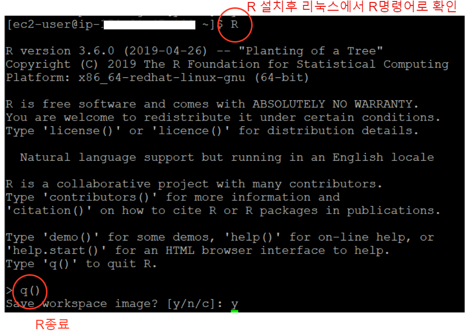
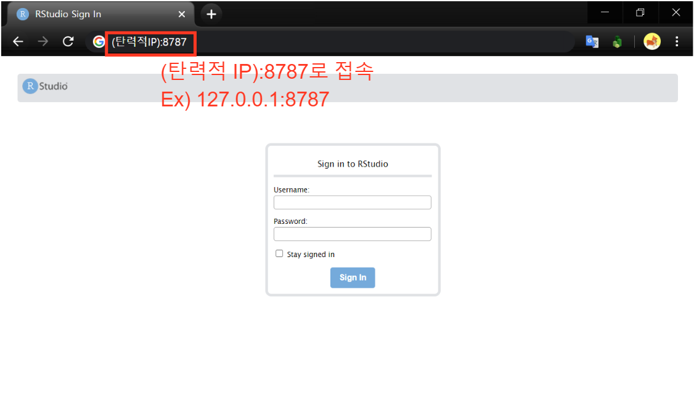
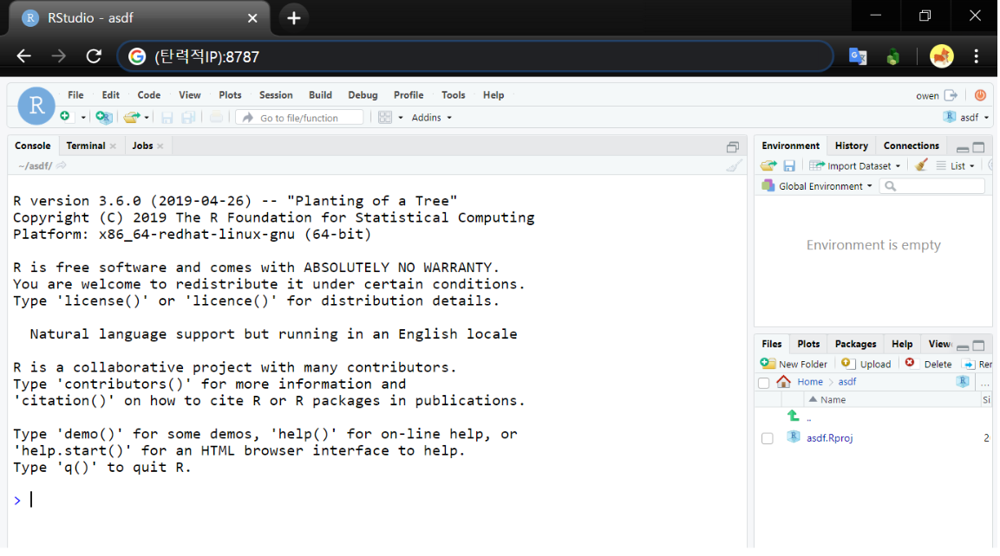

<center>
{#id .class width='80%'}
</center>

<br>

AWS에 EC2구축과 세팅까지 완료 했으니 이제, Rstudio server를 설치 해보자. Rstudio server를 설치 하게 되면, 그때서부터는 R환경을 어디서든 사용할 수 있게 된다. EC2에 Rstudio server를 설치 하기 위해선 조건이 있는데, 8787포트를 열어 두는 것. 이는 지난번 EC2구축 할때 열어 두었으니 다시한번 상기만 해두고 넘어가도록 하자. Rstudio server설치하기까지의 전반적인 과정은 다음과 같다. 

- EC2 기본 업데이트 
- R 설치
- Rstudio server 설치
- 한글 폰트 적용

<br>

# EC2 기본 업데이트 

EC2의 기본 업데이트를 실행하자. 아마존 리눅스2 옵션을 사용했는데, 이는 Redhat/Centos 리눅스로 다음의 코드를 사용해 기본적인 업데이트를 우선 해주도록하자. 쉽게 표현하면 스마트폰에 와이파이 연결시 가끔씩 업데이트를 해주는데, 그런 비슷한 개념이라고 생각하고 넘어가자.

- 다음의 코드를 복사/붙혀넣기 하면 되는데, 리눅스에서는 ctrl + c가 적용되지 않으니 복사 하고 **마우스 우클릭**


```
sudo amazon-linux-extras install epel

sudo yum install -y epel-release
sudo yum update -y
sudo yum install -y R
```

<br>

# R 설치 

이제 R을 설치 하자. 다음의 코드를 복사 하고 설치

```
sudo yum install -y R
```

## R 설치 확인

설치가 완료 되면 확인차 `R` 명령어를 사용하여 잘 설치가 되었는지 확인 해보자. 추가로 R에서 나가려면 `q()` 또는 `quit()` 명령어로 나가면 된다.


<center>
{#id .class width='80%'}
</center>

<br>

# Rstudio server 설치

R까지 설치를 마무리 지었으니 Rstudio server설치를 해보자. Rstudio는 R을 좀더 효율적으로 사용해주는 IDE(Integrated Development Environment)로, R을 사용하는데 있어서 많은 편리함을 제공한다. Rstudio server 설치 하기전에 우선 다음의 링크를 하나 소개 한다. 

- [Rstudio server설치 공식 사이트](https://rstudio.com/products/rstudio/download-server/)

이곳에서 Linux Platform에 맞추어 설치를 해주면 되는데, 아마존 리눅스2는 Red Hat/CentOS계열이라 우리는 Red Hat/CentOS로 들어가자.

<br>

<center>
{#id .class width='80%'}
</center>

<br>

이후 나오는 링크에서 Install for Red Hat / CentOS 6-7에 해당하는 코드를 그대로 복사 하여 설치 해주도록 하자.

- `grep . /etc/*-release`코드를 사용하여 Linux운영체제를 확인 해야 하는데, Amazon Linux라고 나오게 될것이다. Red Hat/CentOS 어느버전으로 설치 해도 상관 없으나, 정확한건 추후 업데이트 하도록 하겠다.

```
wget https://download2.rstudio.org/server/centos6/x86_64/rstudio-server-rhel-1.2.5042-x86_64.rpm
sudo yum install rstudio-server-rhel-1.2.5042-x86_64.rpm
```

<br>

## Rstudio server 설치 확인

성공적으로 Rstudio server를 설치 했으면 확인을 해보자. 웹사이트 주소에 (탄력적 IP):8787을 입력해주어 다음과 같은 화면이 나오게 되면 설치가 완료 된것이다.

- 탄력적 IP확인은 AWS EC2 인스턴스에서 확인을 하면 된다. 참고: [[AWS] EC2 구축 하기](https://unfinishedgod.github.io/docs/aws/create_ec2/create_ec2.html)

<br>

<center>
{#id .class width='80%'}
</center>

<br>

## 계정 생성

Login을 하기 위해 계정을 추가 해주어야 하는데, Loot계정을 먼저 컨트롤 해주자. Loot는 **관리자**개념으로, 비밀번호 세팅을 해주고 새로 계정을 추가 하려 한다. 다음 코드로 비밀번호를 설정해주자. 

```
sudo passwd root
```

root계정 password설정을 해주었으면, root 계정으로 들어가주자. 새로운 계정을 설정 하기 위해서, 다음 코드를 통해 Root로 접근 하도록 하자.

```
su
```

<br>

<center>
{#id .class width='80%'}
</center>

<br>

이제 계정을 생성해주자.

```
useradd {계정}
passwd {비밀번호}
```

계정이 생성 되었으면, 이제 웹에서 접속을 해보자. 

## Rstudio server 접속 확인

<center>
{#id .class width='80%'}
</center>

<br>

# 한글 설정

이제 Rstudio server는 설치 되었으니, 한글설정을 해주자. 한글 설정은 이전에 만들어논 블로그가 있으니 블로그를 소개하도록 하겠다.

- [AWS에서 구축한 Rstudio 한글 깨짐 해결 방안](https://medium.com/@unfinishedgod/aws%EC%97%90%EC%84%9C-%EA%B5%AC%EC%B6%95%ED%95%9C-rstudio-plot-%ED%95%9C%EA%B8%80-%EA%B9%A8%EC%A7%90-%ED%95%B4%EA%B2%B0-%EB%B0%A9%EC%95%88-5ada27828fd4)

<br>

# 총평

이렇게 AWS EC2에 Rstudio server설치까지 마쳤다. 지금와서 보면 정말 별거 아닌 수준이지만, 내가 리눅스 자체가 너무 어렵게 느껴저 1년동안 애써 외면했던걸 생각 해보면, 최대한 진입장벽을 낮추어 자세하게 글을 쓰는게 오히려 어렵게 느껴졌다. 이제 다음글은 AWS S3를 소개 하고 R에서 사용법에 대한 글을 써보면 될것 같다.


