{#id .class width="30%"}

  

데이터 분석을 위한 AWS사용 가이드를 써보려 한다. AWS는 Amazon Web Service의 준말로 **어디어디**에서 표현하기를 Cloud Cloud Cloud 라고들 표현 하는데, 이를 그나마 좀 쉽게 표현을 해보자면 **허공에 풍선달린 컴퓨터를 하나 띄워놓고, 필요할때마다 가져와서 사용하는 개념?** 정도로 생각을 하면 좋을 것 같다. 그동안 최소한의 기능만을 사용해보다가 이번에 좀 더 적극적으로 사용할 계기가 생겨 공부도 할겸 정리도 하는 시간을 가져 보려고 한다. 

 - EC2 구축
 - EC2 Tier 업그레이드 / 용량 업그레이드
 - EC2 한글폰트 적용
 - EC2에 에서 R/Python 설치
 - S3 스토리지 사용
 - RDS 사용 
 
 등등 여러가지를 하나씩 써내려 가면서도 추가로 AWS 생태계에 관심을 가지고 공부를 하면 될것 같다. 이번에는 우선 EC2를 구축하여 하나의 서버를 띄우는 내용을 적어보려 한다.

 

# EC2 란? 

Elastic Compute Cloud의 준말로 가상의 운영체제를 만들어 사용가능하게 해주는 서비스 라고 보면 된다. 이제 부터 이곳에 R/python 을 설치에 분석 환경을 가추어 나갈 생각이다. 설치 과정을 하나씩 알아보자.

 

# Step 1. 인스턴스 생성

 

  

서비스 -> EC2 클릭 

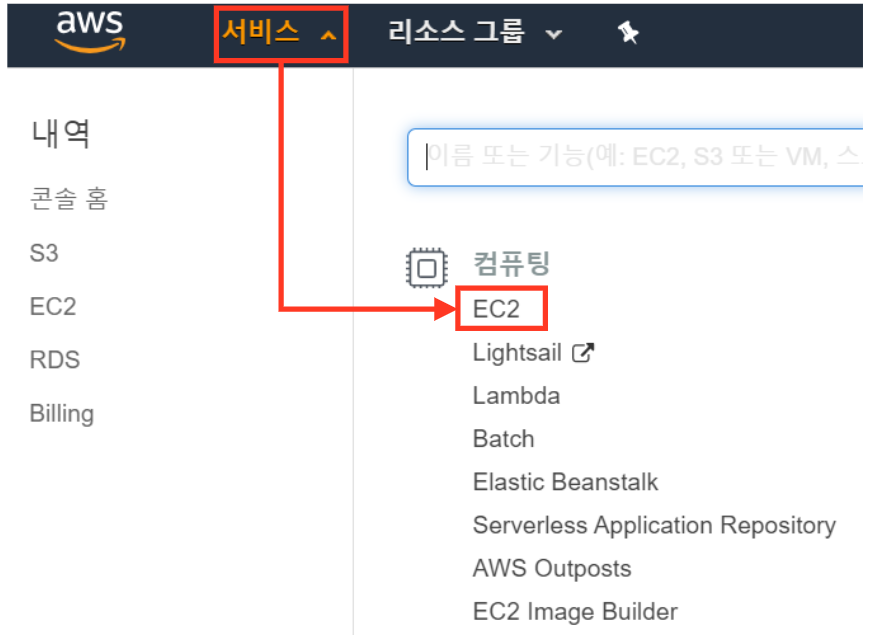{#id .class width="85%"}

  

  

인스턴스 메뉴 -> 인스턴스 시작 클릭

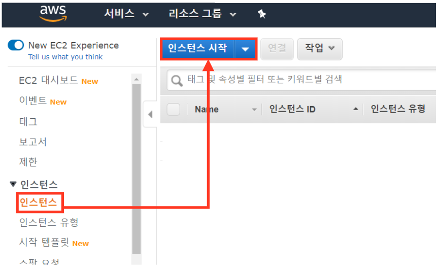{#id .class width="100%"}

  

 

# Step 2. 인스턴스 옵션 설정

인스턴스 옵션을 정해주자. 좀 비유를 해보자면 컴퓨터를 살때 사양을 선택 하는 과정이다.

 

## 1. AMI 선택

우선 AMI를 선택 해주자. 기본적으로 여러 운영체제가 있지만 **Amozon Linux 2**를 선택해서 실행하자.

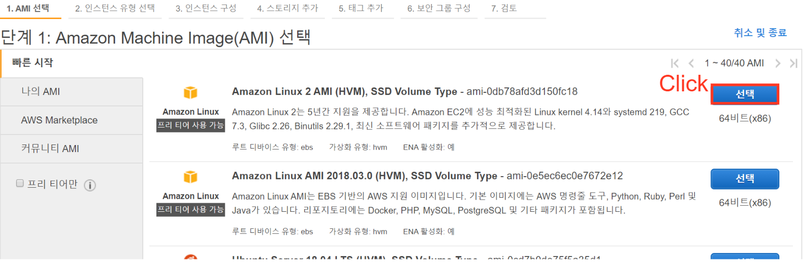{#id .class width='100%'}

 

## 2. 인스턴스 유형 선택

이제 인스턴스 유형을 선택 하자. 아마존은 기본적으로 프리티어(무료)로 서비스를 제공 한다. 그러나 프리티어는 어디까지나 최소한의 서비스라 사양이 매우 좋지 않다. 우선은 프리티어로 선택 하고 다음 블로그에는 인스턴스를 업그레이드 하는 내용을 적어보려 한다.

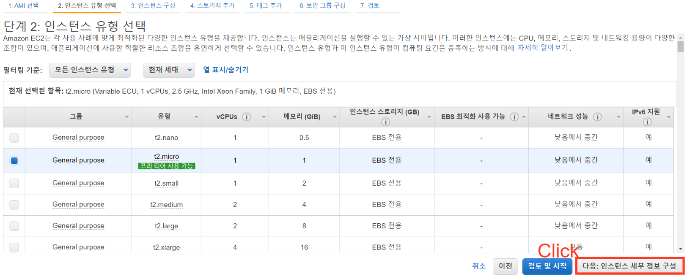{#id .class width='100%'}

 

## 3. 인스턴스 구성

퍼블링 IP 자동 할당에 Select Box 옵션을 활성화 로 변경 해준다. 

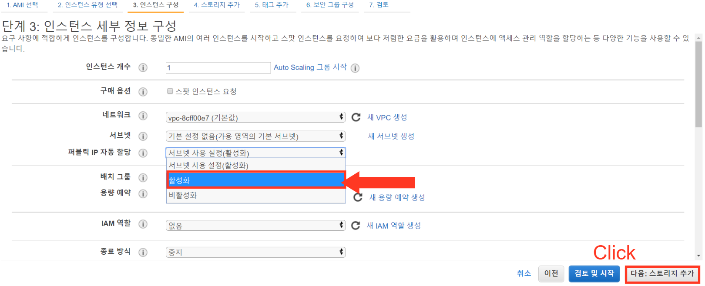{#id .class width='100%'}

 

## 4. 스토리지 추가

내 운영체제의 기본적인 용량이 8GB로 되어 있다. 아마존은 무료로 최대 30GB까지 지원 가능하며 일단은 기본 8GB로 선택을 해주도록 하자. 이 역시 다음 블로그에 한꺼번에 용량 설정 하는 방법을 포스팅 하려고 한다.

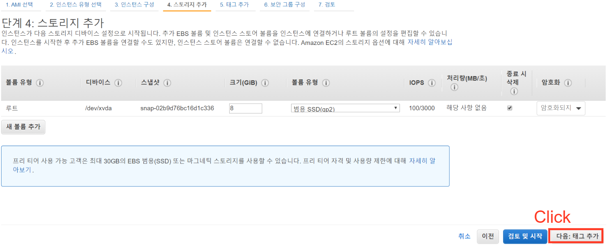{#id .class width='100%'}

 

## 5. 태그 추가

특별한 내용이 없으니 다음 버튼

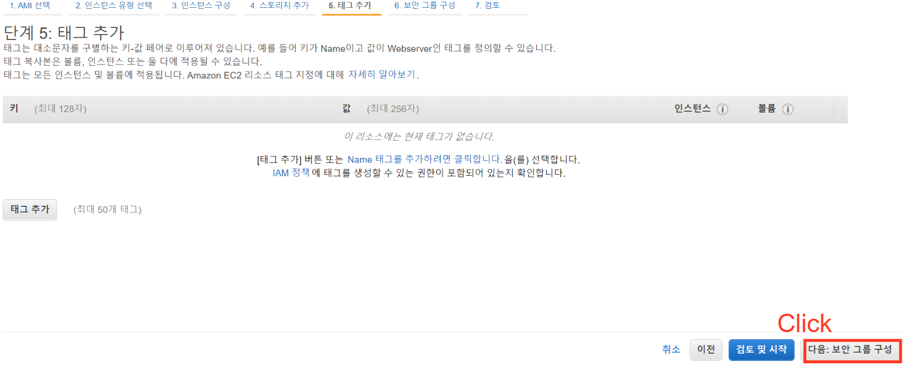{#id .class width='100%'}

 

## 6. 보안 그룹 구성

이곳에서 포트 범위를 설정 해주자. 기본적으로 여기에 R studio server / Jupyter notebook를 설치 해줄것이므로 다음의 포트를 열어 준다. 그리고 위치 무관 옵션을 선택 해주자. 

- R studio server: 8787
- Jupyter notebook: 8888

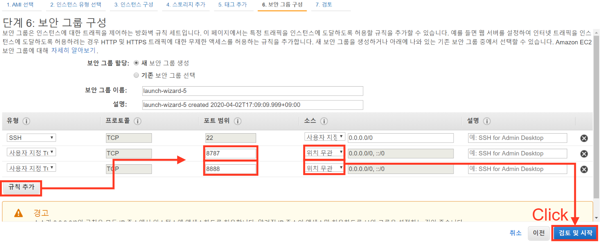{#id .class width='100%'}

 

## 7. 검토

이제 시작하기 버튼을 누르면 팝업창이 노출되면서 키 페어를 생성하도록 유도 한다. 이는 후에 putty에 사용할 ppk를 생성하기 위한 과정이며 적당한 네이밍으로 키페어를 다운 받고 인스턴스 시작을 클릭 해주자.

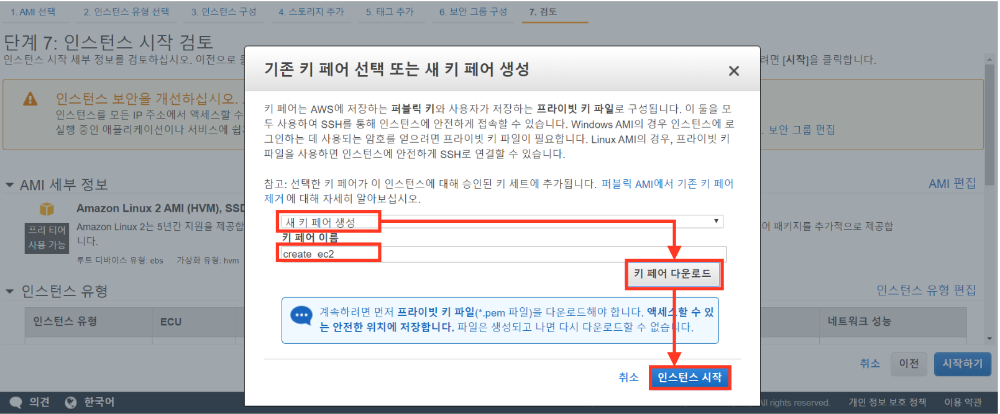{#id .class width='100%'}

 

## 인스턴스 생성

우선 다음과 같이 인스턴스가 생성됨을 확인 할 수 있다. 이제 다음으로 넘어가자. 

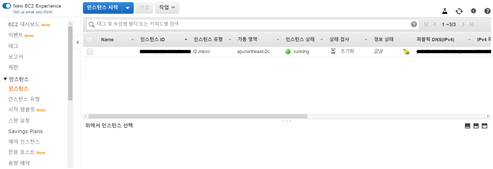{#id .class width='100%'}

  

# Step 3. 탄력적 IP 생성

서버(인스턴스)가 생성되었고, 이를 실행하는데 그전에 추가로 해야할 것이 있다. **탄력적 IP** 라는 것을 설정 해주어야 하는데, 이 인스턴스에서 설정된 **퍼블릭 DNS**는 서버를 키고 끌때마다 새로운 것으로 갱신되기에, 이를 하나의 IP로 통일하기 위함이다. 자세한 이해는 되도록 **넘어가고** 바로 알아보자.

 

## 탄력적 IP 주소 할당

네트워크 및 보안 -> 탄력적 IP에 탄력적 IP 주소 할당 버튼 클릭

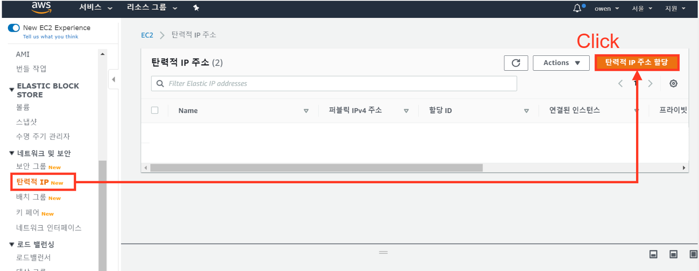{#id .class width='100%'}

 

## 탄력적 IP 주소 확인

생성된 IP 주소를 클릭해주자. 이를 생성한 인스턴스에 연결하는 작업을 진행할 것이다.

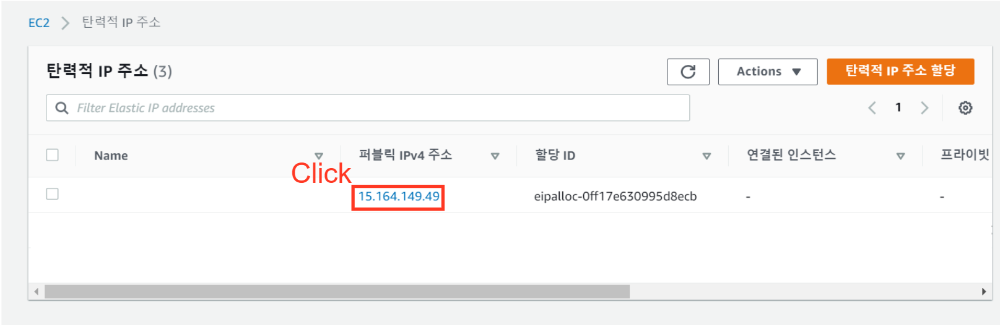{#id .class width='100%'}

릭

 

## 탄력적 IP 정보 확인

탄력적 IP의 정보를 확인해주자. 특별한건 없고 바로 **탄력적 IP 연결**버튼 클릭

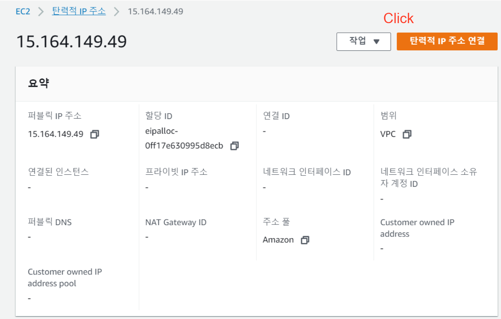{#id .class width='100%'}

 

## 탄력적 IP 주소 연결

이제 생성한 인스턴스에 탄력적 IP를 연결해주자. 인스턴스 Select box에 생성한 인스턴스 네임을 선택하고 연결 버튼 클릭

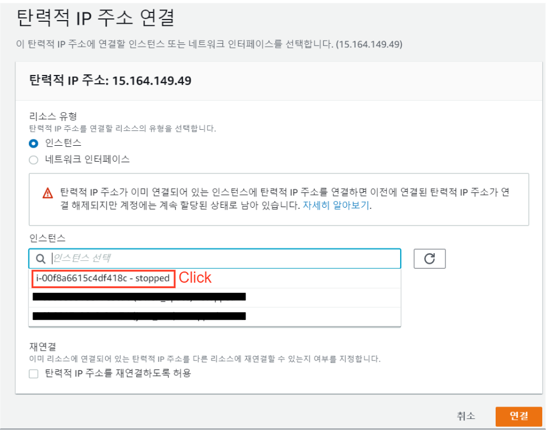{#id .class width='100%'}

 

## 탄력적 IP 주소 확인

{#id .class width='70%'}

  

# Step 4. Putty 접근

이제 인스턴스를 구체화 해서 접근 해보자. 이를 위해 Putty를 설치 하고 여러 세팅을 해주도록 한다.

 

## Download Putty/Puttygen

Putty와 Puttygen을 다운받도록 하자. Puttygen은 키페어를 .ppk로 만들기 위함이고 putty는 만들어진 .ppk를 가지고 서버를 실행하기 위함이다. 다운로드 주소는 다음같다.

- [Download PuTTY: latest release (0.73)](https://www.chiark.greenend.org.uk/~sgtatham/putty/latest.html)

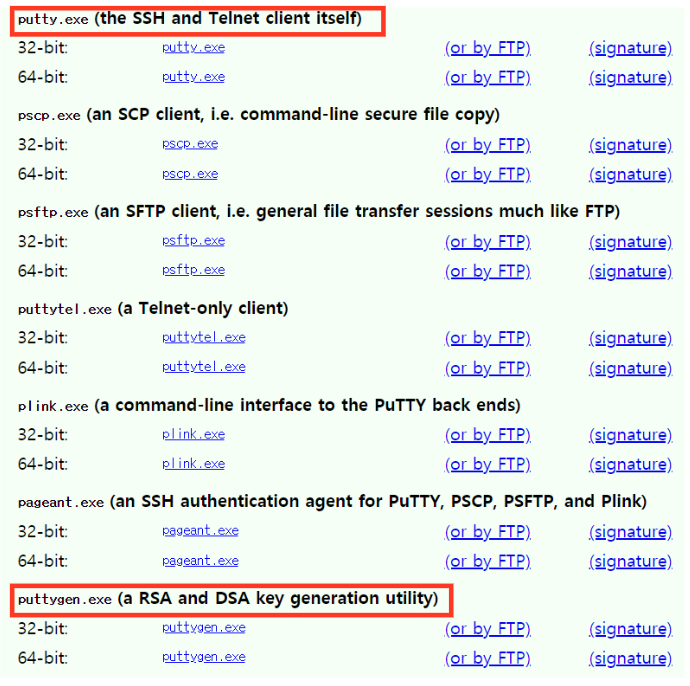{#id .class width='80%'}

 

## Puttygen 1

- Pyttygen을 실행 하고 Load 버튼 클릭
- 다운로드 폴더에 키페어 선택 하고 열기 버튼 (옵션은 **All File**)

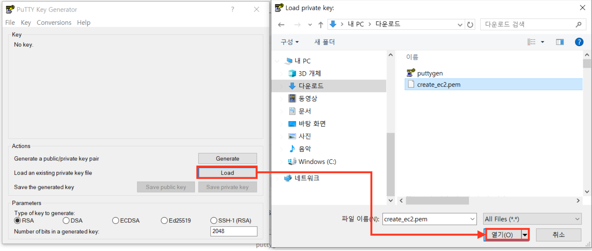{#id .class width='100%'}

 

## Puttygen 2

이제 aws에서 받은 키페어를 가지고 .ppk로 변환 하는 마지막 작업이다. Save private key 버튼을 클릭하고 나오는 확인 창에 예 버튼을 해서 마무리를 해주자.

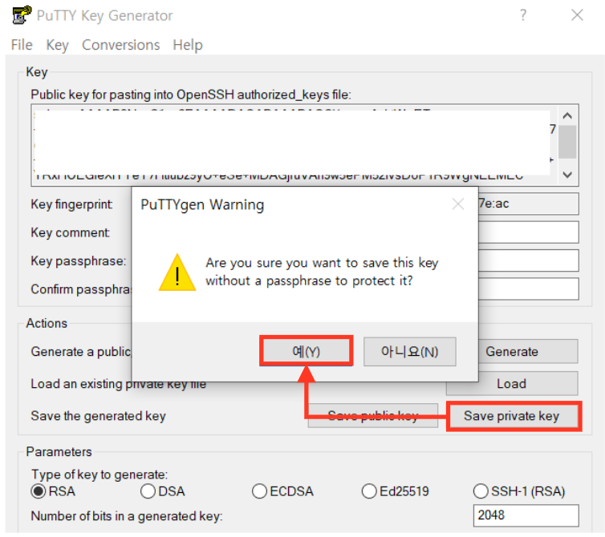{#id .class width='80%'}

 

## Putty 세팅

이제 Putty에 가서 세팅을 마무리 하자. putty를 실행하고 다음의 절차를 따라주자. 

- 왼쪽 카테고리에 SSH - Auth 클릭
- Browse 버튼 클릭
- Puttygen에서 생성한 .ppk 클릭 

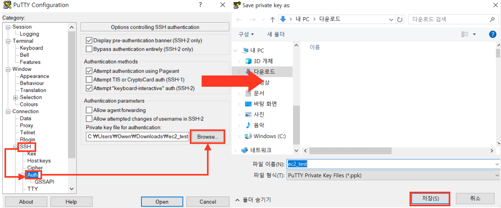{#id .class width='100%'}

 

## Save / Open 

이제 다음의 절차를 밟은 후에 putty를 실행 해주자. 

- Host name: ec2-user@(탄력적 IP)
- Saved Sessions: 저장할 이름 

이렇게 설정한후 Save를 해주어야 다음에 Putty에서 실행 할때 저장된 이름으로 쉽게 서버를 실행할 수 있다.

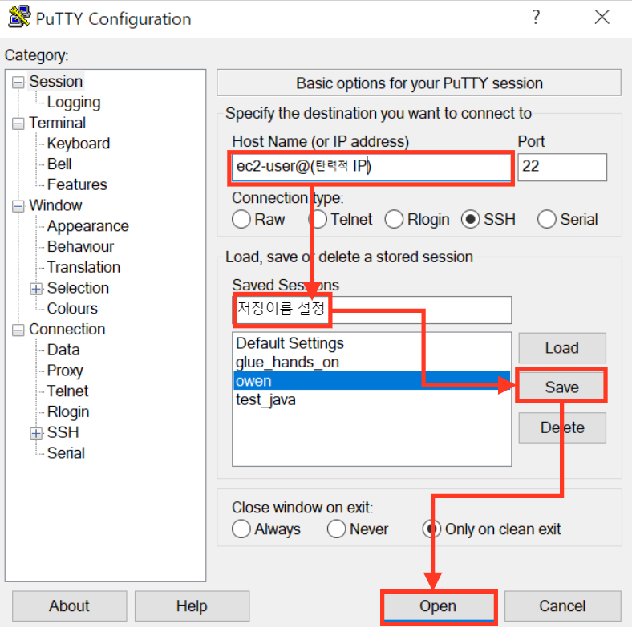{#id .class width='80%'}

  

# 결과

Putty에서 성공적으로 서버를 실행하면 다음과 같은 화면이 나오게 된다.

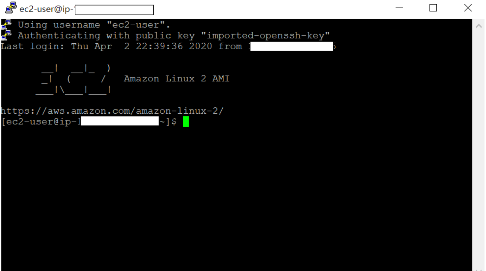{#id .class width='80%'}

  

# 서버 시작/중지

AWS EC2는 서버를 켜두면 그 만큼 금액이 지불되는 방식이다. 때문에 필요에 따라 서버를 꺼야 하는데, 인스턴스 우클릭후 다음의 시작/중지 버튼으로 시작과 중지를 꼭 해주도록 하자. 

  
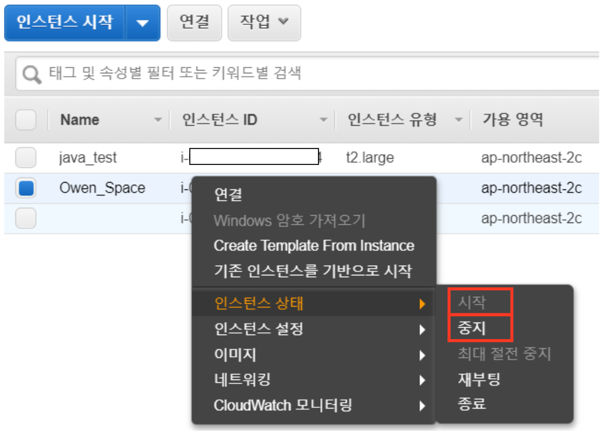{#id .class width='80%'}

---

# 총평

그동안 aws ec2에서 rstudio server 구축 하는 블로그를 쓰겠다고 다짐만 한지 18개월이 지났다. 하려면 5분이면 충분히 할수 있는데 반해, 블로그를 끄기 위해서는 스크린샷을 23개나 찍어서 하나하나 설명 해야해서 나도 모르게 미뤄뒀다. 사실 그만큼 처음 하는사람에게는 진입장벽이 커서, 시도조차 모하는 사람이 있을텐데 잘 따라해서 성공적으로 aws생태계에 들어왔으면 하는 바램이다.

 