 

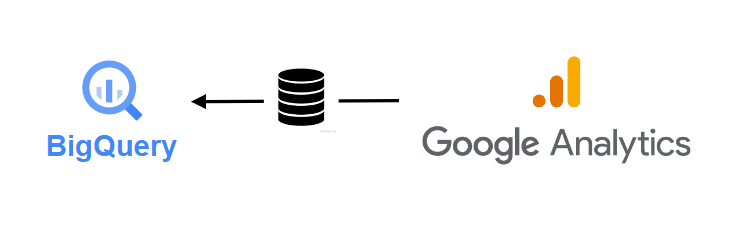{width=80%}

이번에는 Google Analytics 의 데이터를 BigQuery로 Export 하는 과정에 대해 다루려고 한다. 빅쿼리를 공부 하고, 예제를 적용해보는 데 있어서 GA만한게 없다. 물론 조만간 빅쿼리에 어울리는 예시용 데이터를 다루는 블로깅을 하나 할 예정이다. 그러면 이제 Google Analytics의 데이터를 BigQuery에 Export 해보자. 관련 공식문서는 다음을 참고 한다. 

 - [GA-BigQuery Export 공식 문서](https://support.google.com/analytics/topic/9359001?hl=ko&ref_topic=9306488&sjid=2189651526438278805-AP)

# GA에서의 설정

### Step 1.

우선 Googel Analytics의 메인 화면으로 넘어가보자. 왼쪽 하단의 설정 버튼을 클릭한다.

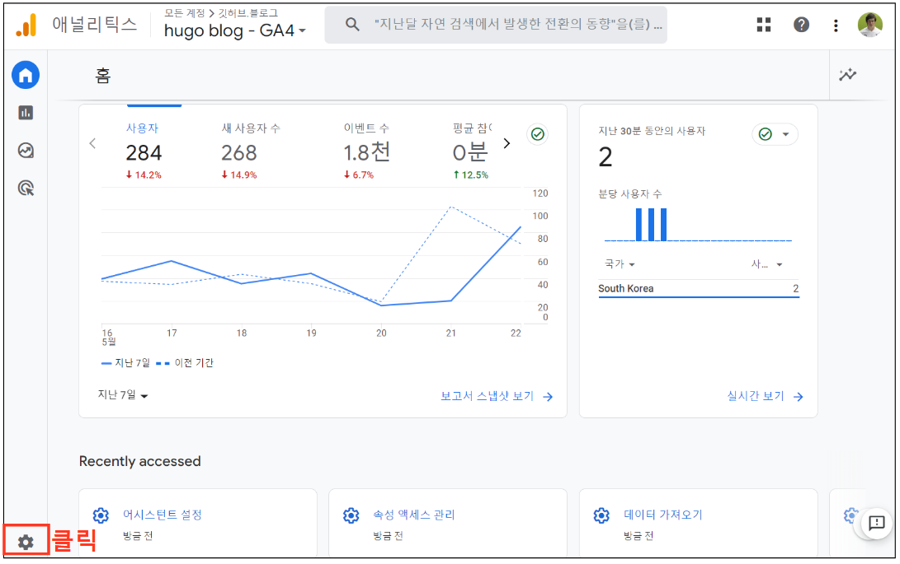{width=80%}

### Step 2. 

설정버튼을 클릭하면 계정/속성 탭이 보이는데, 속성탭에서 아래로 스크롤을 하게 되면 BigQuery 링크 라는 버튼이 보인다. 이 BigQuery 버튼을 클릭해주자

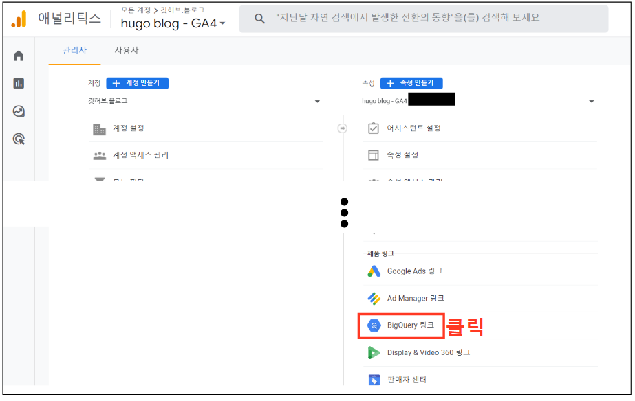{width=80%}

### Step 3.

현재 BigQuery의 와 연결이 되지 않은 모습이다. 우측의 연결 버튼을 클릭해주자.

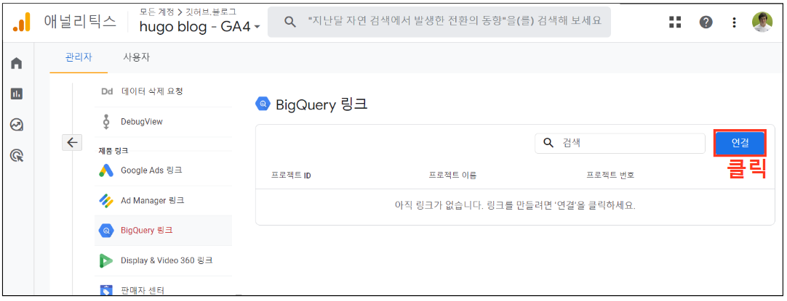{width=80%}

### Step 4.

이제부터 하나씩 단계를 밟아가면 된다. BigQuery 프로젝트 선택하기 버튼을 클릭해주자.

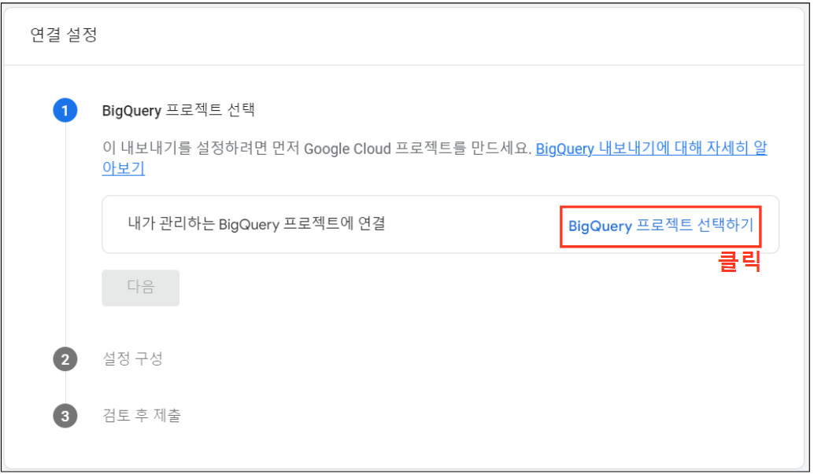{width=80%}

### Step 5.

현재 Google에서 연동된 빅쿼리의 프로젝트 리스트틀이 보인다. 여기서 bigquery-study를 체크 하고 확인 버튼을 클릭해주자.

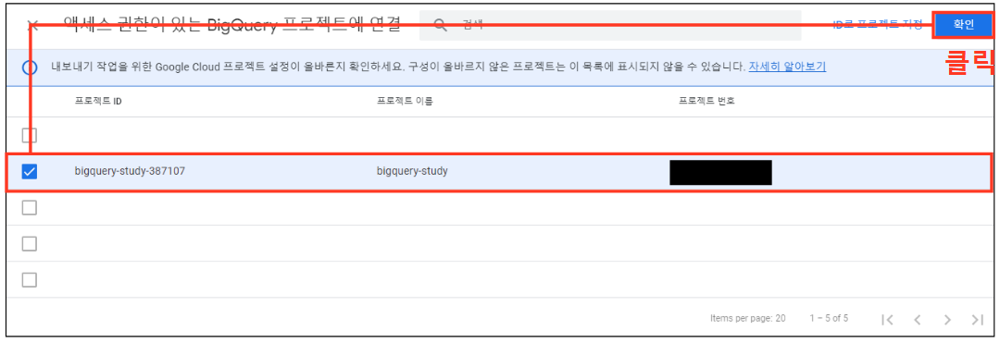{width=80%}

### Step 6.

리전은 서울(asia-northeast3)로 선택하고, 다음버튼 클릭.

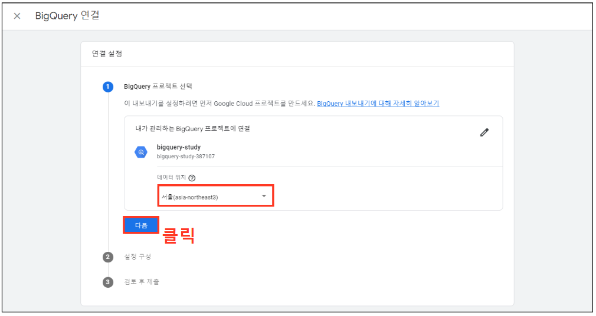{width=80%}

### Step 7.

빈도 옵션이다. 매일/스트리밍에 대한 차이가 있다. 다음을 확인하고 보내기 버튼을 클릭하자 

- 매일
    - 'events_YYYYMMDD' 라는 테이블로 데이터가 생성된다.
- 스트리밍
    - 'events_intraday_YYYYMMDD' 라는 테이블로 데이터가 생성된다.
    - 스트리밍 내보내기를 사용하면 BigQuery 이용료에서 데이터 1GB당 $0.05의 비용이 추가로 발생한다.
    - 비용은 다음을 참고 하자. [BigQuery- 스트리밍 비용](https://support.google.com/analytics/answer/9358801?hl=ko&ref_topic=9359001)
    

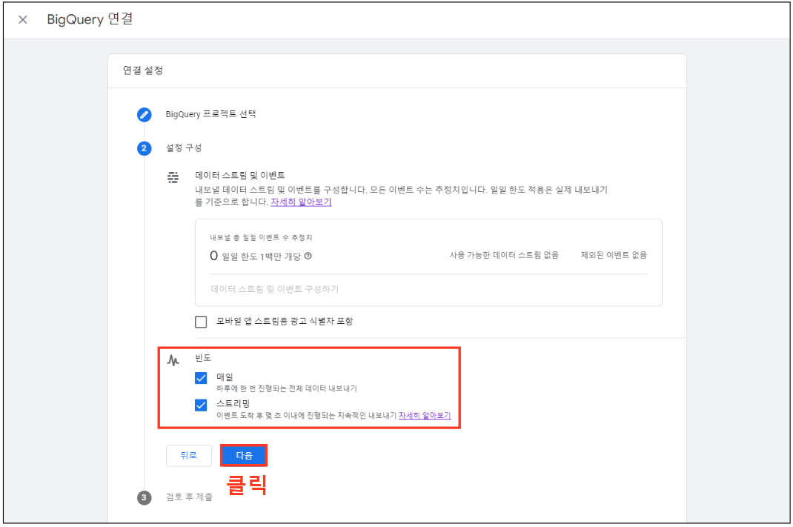{width=80%}

    
### Step 8.

최종적으로 확인이 끝났으면 보내기 버튼을 클릭.

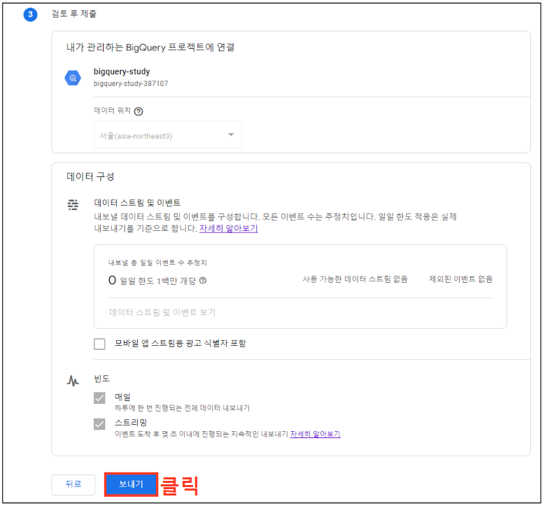{width=50%}

### Step 9.

성공적으로 연결이 되었다면 다음과 같은 화면을 확인할 수 있다. 이 데이터가 BigQuery로 넘어가기는 약 24시간까지도 걸린다. 

{width=50%}

# BigQuery에서 확인

이제 BigQuery로 넘어가서 테이블이 생성 되었는지 확인해보자.

### Step 1.

bigquery-study 프로젝트에 확인을 해보니 `events_*`, `events_intraday_*` 라는 테이블이 생성된 것을 확인할 수 있다.

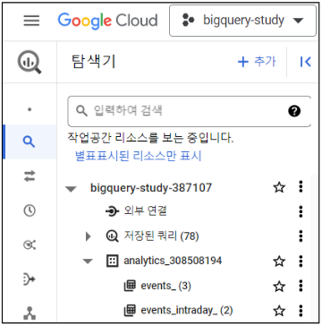{width=50%}

### Step 2.

`events_*` 테이블을 확인해보니 필드명이 상당히 많다. 필드명은 다음을 참고 해보자.

 - [BigQuery Export 스키마](https://support.google.com/analytics/answer/7029846?hl=ko&ref_topic=9359001#zippy=%2Citems%2Cecommerce%2Cevent)

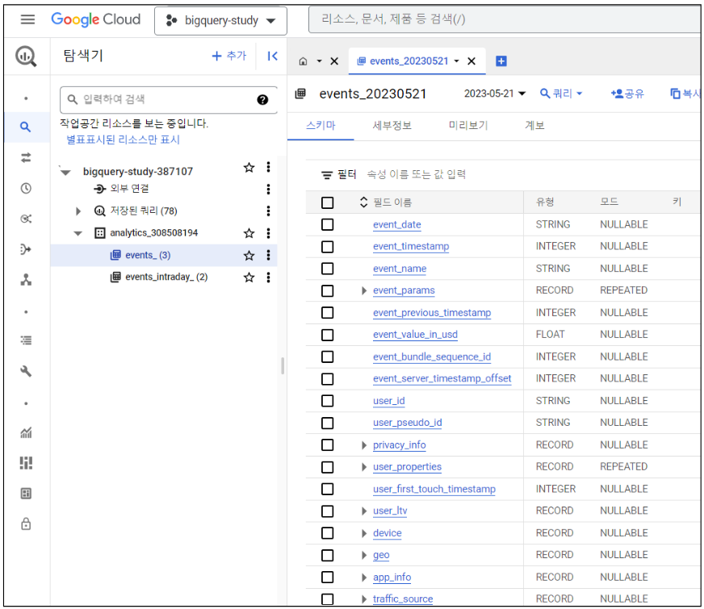{width=80%}

# 총평

이렇게 GA의 데이터를 빅쿼리로 가져오는 블로그를 포스팅 해보았다. 빅쿼리를 공부 하면서 어떤 좋은 예제가 있을까 생각하다가 GA가 떠올랐고 이번에 이 과정에 대해 설명하면서 이번 블로깅을 마무리 한다.
