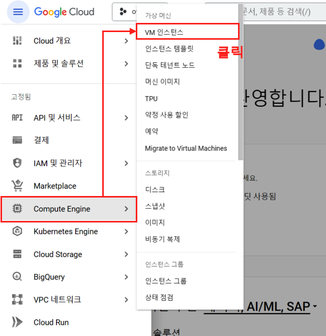
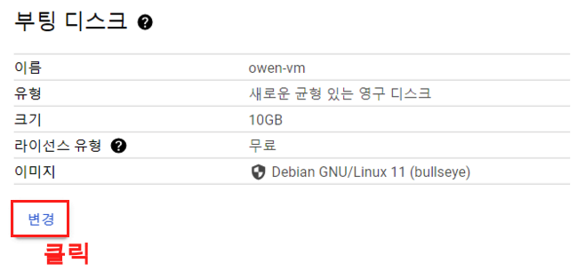
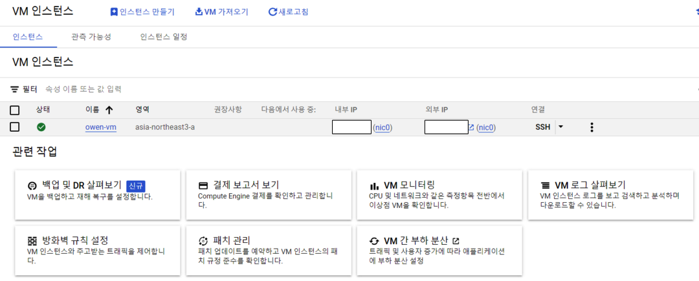
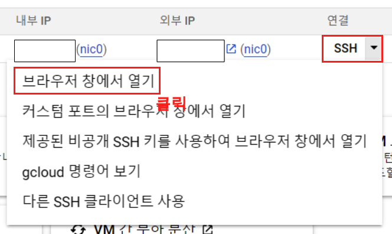
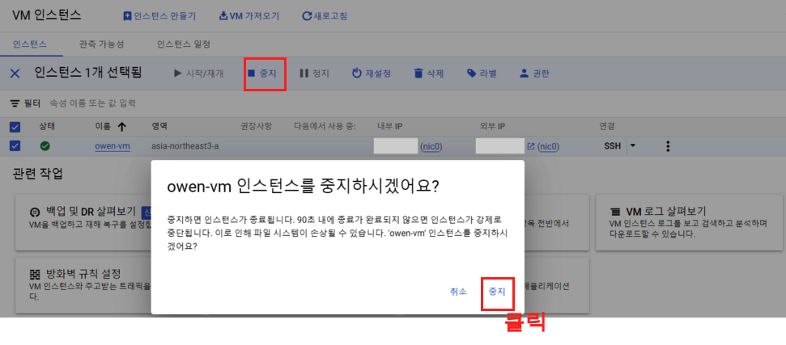

{width=50%}

이번에는 GCP에서 제공하는 서비스에 대해 블로깅을 해보려 한다. 그동안 AWS에서 제공하는 서비스들을 주로 사용 했었는데, 이번에 빅쿼리를 공부 하면서 GCP환경 전반적인 공부와 이를 기록으로 남겨 보려 한다. 추가로, Google 계정은 대략 10개까지 생성이 가능한데, 각 계정 하나당 Google Cloud에 새로 사용할 경우 3개월동안 300$의 크레딧을 무료로 제공한다. 그럼 하나씩 알아보도록 하자. 따라서, 서버를 주로 사용하고 싶은 경우에는 때에 따라 구글 계정을 새로 만들어 가면서 사용도 가능하다. 
 이번에 하게될 블로그 내용은 Google Cloud의 Compute Engine이며 이는 AWS의 EC2와 동일한 서비스를 제공한다. Compute Engine에 대한 자세한 내용은 다음을 참고하자.
  - [Google Cloud 컴퓨팅 제품](https://cloud.google.com/products/compute?utm_source=google&utm_medium=cpc&utm_campaign=japac-KR-all-en-dr-BKWS-all-hv-trial-EXA-dr-1605216&utm_content=text-ad-none-none-DEV_c-CRE_631312286762-ADGP_Hybrid%20%7C%20BKWS%20-%20EXA%20%7C%20Txt%20~%20Compute_Compute%20Engine_google%20cloud%20compute%20engine_main-KWID_43700073965220280-kwd-52054423126&userloc_1009871-network_g&utm_term=KW_google%20cloud%20compute&gclid=CjwKCAjwvpCkBhB4EiwAujULMg10Qt_qHGXLN1P-0CTtnhweIvtjwAU5k6rKodWLy1uUtRGckAguNBoCOhAQAvD_BwE&gclsrc=aw.ds&hl=ko)

## 1. Google Cloud 

우선 다음의 Google cloud console 링크를 들어가보자.

- https://console.cloud.google.com/

## 2. 프로젝트
 
### 2-1. 프로젝트 추가

우선 첫 시작은 프로젝트를 만들어주면서 시작한다. 상단에 'My First Project' 셀렉트 박스를 클릭하면 프로젝트 선택창이 나오는데, 이때 우측 상단의 '새 프로젝트' 버튼을 클릭해주면 된다.

{width=100%}

### 2-2. 프로젝트 이름

그러면 프로젝트 이름을 설정 하게 되는데, 프로젝트 이름을 설정 하고 만들기 버튼을 클릭해주자.

{width=60%}

## 3. Compute Engine 구축

이제 Compute Engine을 구축 해보자. 

### Step 1. 

왼쪽 메뉴 버튼을 클릭하면 여러 메뉴가 나오는데, 여기서 Compute Engine > VM 인스턴스 버튼을 클릭해주자.

{width=60%}

### Step 2. 

처음에 사용하게 될 경우 다음과 같이 Compute Engine API 화면이 나오게 되는데, 사용 버튼을 클릭해주고 넘어가자. 

{width=60%}

### Tip 

GCP의 경우 우측 상단에 종모양 아이콘을 클릭하게 되면 우리가 그동안 사용했던 모든 로그들이 나오게 되는데 이를 참고하면 매우 편리하다.

{width=60%}

### Step 3. 

VM 인스턴스를 클릭하게 되면 인스턴스 대시보드가 나오게 된다. 상단에 '인스턴스 만들기' 버튼을 클릭 해주면 된다.

{width=60%}

### Step 4. 

'인스턴스 만들기' 버튼을 클릭하면 인스턴스를 구성하는 여러가지의 옵션들이 나온다. 이제부터 이 옵션을 설정 해주면 된다. 인스턴스의 이름과 리전이다. 리전의 경우에는 aisa-northeast3 (서울) 옵션을 클릭해주자.

{width=60%}

### Step 5. 

인스턴스의 옵션을 선택해준다. 기본적인 옵션 부터 GPU가 장착된 서버까지 구축을 할 수 있다. 우리는 기본적인 서버를 구축할 예정이지 E2 시리즈를 선택해주자. 그리고 나서 머신 머신 유형을 클릭해주자.

{width=60%}

### Step 6.

머신의 유형에 대한 세부 옵션이다. 이곳에서 표준에 e2-standard-2 옵션을 선택해주자. 

{width=60%}

### Step 7. 

그리고 내려가면 부팅 디스크에 대한 옵션이 나오게 된다. 변경 버튼을 클릭해주어 변경 해주자.

{width=60%}

### Step 8. 

서버의 운영체제와 용량에 대한 내용이다. 우리는 여기서 운영체제를 'Ubuntu 22.04 LTS'로 해주고 용량은 30GB로 해주었다.

{width=60%}

### Step 9. 

이렇게 옵션을 설정 해주었으면, 마지막으로 방확벽에 HTTP, HTTPS 옵션을 모두 허용 해주자. 그리고 우측의 가격 책정 요 약을 보면 앞으로 한달간 들어가는 비용이 나오게 되는데, 이중에서 서버 비용은 한달간 24시간동안 내내 사용했을 경우에 저정도 요금이고 실제로는 필요할 때만 서버를 키고 끄게 되기 때문에 저정도 까지의 비용은 나오지 않는다.

{width=60%}

### Step 10. 

성공적으로 VM을 구축하게 되면 VM 인스턴스 대시보드에 서버가 추가되는것을 확인할 수 있다. 이번에는 GCP 내에서 SSH를 통해 VM에 연결 해보자.

{width=60%}

## 4. VM 연결

연결아래에 SSH 버튼을 클릭하면 여러 옵션이 나오게 된다. 여기서 '브라우저 창에서 열기' 버튼을 클릭해주면 된다.

{width=60%}

## VM 연결 화면

최종적으로 성공하게 되면 위와 같이 서버에 접근이 가능하다.

{width=60%}

## 인스턴스 중지

우리가 선택했던 e2-standard-2 인스턴스는 시간당 약 100원정도의 비용이 발생한다. 물론 300$의 무료 크레딧이 있지만 서버를 사용하지 않을때는 중지 지켜주는 것이 좋다. 서버를 클릭하고 상단의 중지 버튼을 클릭하면 서버가 중지되며 요금은 발생하지 않는다.

{width=60%}
# 총평

이제부터 당분간 GCP 관련한 블로그를 많이 작성할 예정이다. 이번에는 Compute 구측을 작성 했으며 다음에는 방화벽 및, ppk를 사용하여 Mobaxterm 에 연결하는 내용을 작성해보려 한다.
