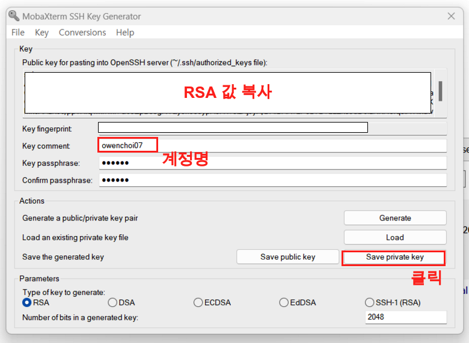
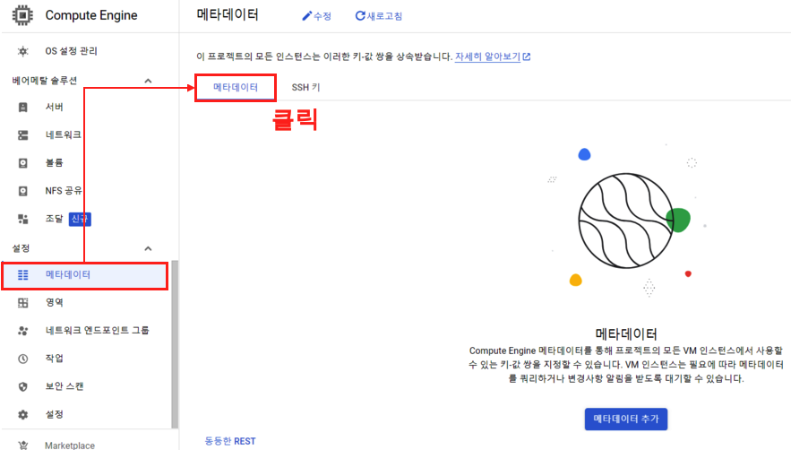
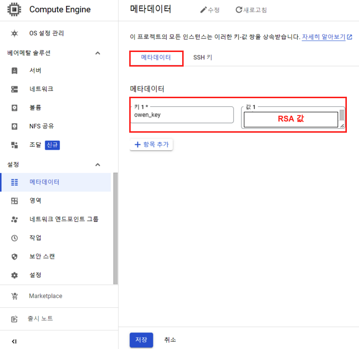
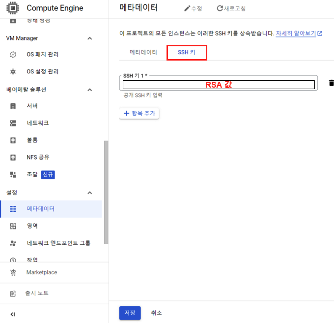
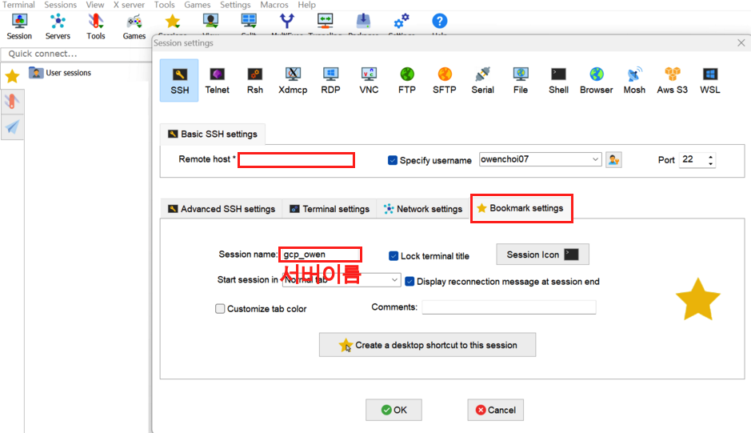

{width=80%}

지난 블로그에서는 GCP에서 Compute Engine을 구축을 다뤘었다. 상단의 이미지를 보면 최종적으로 Jupyter 설치 하는 부분은 다음 블로그에 남겨둘 예정이며, 이번에는 구축한 서버에 방화벽으로 8888포트를 열어두고 MobaXterm에 연결하는 내용을 다루려고 한다. 지난번 블로그는 다음을 참고 한다.

- [GCP Compute Engine 구축](https://unfinishedgod.netlify.app/2023/06/10/gcp-gcp/)

이번에는 총 3개의 소 주제가 있다. 하나씩 알아보자.

- 고정 IP 생성
- 주피터 포트(8888) 개방
- ppk 생성 및 MobaXterm 연동

# 1. 고정 IP 생성

우선 고정 IP를 만들어 줄 것이다. AWS에서는 탄력적 IP로 사용되는 이 서비스는 서버를 크고 킬때 매번 달라지는 IP를 고정 시켜주는 역할을 한다. 하나씩 알아보자. 고정 IP를 사용하기 위해서는 **우선 서버가 작동 하여야 하니 우선 서버를 켜주도록 하자.**

### 1-1. 

고정IP는 '방화벽 규칙 설정' 파트에서 진행을 한다. '방화벽 규칙 설정' 버튼을 클릭해주자.

{width=100%}

### 1-2.

'방화벽 규칙 설정' 버튼을 클릭하게 되면 VPC네트워크 페이지로 넘어가게 된다. 여기서 우리는 다음의 순서로 진행을 해주면 된다.

- 'IP 주소' 메뉴를 클릭
- 하고 외부 IP쪽 최 우측에 메뉴 버튼 클릭
- '고정 IP주소로 승급' 버튼 클릭

{width=100%}

이렇게 고정 IP로 설정을 해주면 해당 외부 IP는 임시에서 고정으로 바뀌게 된다. 

{width=80%}

# 2. 주피터 포트(8888) 개방

이번에는 주피터 포트(8888)을 개방 해보자. 

### 2-1. 

이번에는 '방화벽' 메뉴를 클릭해주고 넘어가서, '방화벽 규칙만들기' 버튼을 클릭해주면 된다.

{width=80%}

### 2-2. 

이제 방화벽 규칙의 옵션을 설정 해주자. 이름과, 설명을 적어주고 아래로 내려간다.

{width=80%}

### 2-3. 

추가 설정이다. 다음의 옵션들을 함께 설정 해주고 만들기 버튼을 클릭해주면 완료.

- 대상: 네트워크의 모든 인스턴스
- 소스 IPv4 범위: 0.0.0.0/0
  - AWS에서는 '위치 무관' 의 옵션이다. 어디든 해당 port로 접속이 가능한데, 우리는 개인 서버의 용도로만 사용하기 때문에 이렇게 사용하지만, 실제로는 각 접속자의 특정 IP를 적어주는것이 보안상 좋다.
- 지정된 프로토콜 및 포트: TCP 8888

{width=80%}

## Tips

GCP에는 추가로 제공되는 기능이 있는데, 아래에 '동등한 명령줄' 버튼이 있다. 를 클릭하면 우리가 방금 했었던 모든 행위에 대한 내용을 gcloud 명령줄로 보여준다. 이는 cloud shell에서 제공하는 기능이다. 

{width=80%}

# 3. ppk 생성 및 MobaXterm 연동

이번에는 MobaXterm에 연동을 해보자. MobaXterm에 연동을 하기 위해서는 우선 rsa키를 생성하고 gcp에 등록하고 ppk를 생성해야 한다. 하나씩 따라해보자. 

## 3-1. ppk 생성

우선 ppk를 생성해보자. ppk는 MovaXterm을 통해 생성한다. 물론 puttygen을 통해서도 생성 가능하다. mobaxterm의 공식링크는 다음 링크에서 참고 하며, 이곳에서 다운을 받으면 된다.

- [MobaXterm](https://mobaxterm.mobatek.net/)

### Step 1.

MobaXterm을 설치 하고 실행하고 나면 상단의 Tools > MobaKeyGen (SSH key generator) 버튼을 클릭해주자.

{width=60%}

### Step 2.

MobaXterm SSH KEy Generater 화면이다. 

이곳에서 'Generate' 버튼을 클릭해주자. 

{width=80%}

### Step 3.

generate 키가 생성되고 있는 화면이다. 빈 공간에 마우스를 움직이면 generate key가 생성 된다.

{width=80%}

### Step 4. 

키가 생성되면 상단에 RSA값이 나오게 된다. 이는 따로 복사 해주어 저장해두도록 하자. 그리고 다음의 절차를 하나씩 따라가자.

- Key comment: 계정명을 입력한다.
- Key passphrase: 서버에 접속할 비밀번호 입력 (Optional)
- Confirm passphrase: 비밀번호 확인

이렇게 입력했으면 'Save private key' 버튼을 클릭하여 ppk파일을 저장한다.

{width=80%}

## 3-2. Compute Engine 메타데이터 생성

ppk를 생성 했으니, 이제 이 ppk에 해당하는 RSA값을 GCP Compute Engine에 등록 해주자.

### Step 1.

이제 Compute Engine에서 메타 데이터 메뉴 > 메타데이터탭 > '메타데이터 추가'버튼을 클릭한다. 

{width=80%}

### Step 2. 

메타데이터를 추가 하자. 

- 키: 키 이름을 만들어 준다.
- 값: 복사 했던, RSA값을 넣어 준다. 

{width=80%}

### Step 3.  

이제 SSH 키 탭 으로 가서 SSH에 또 다시 RSA값을 복사 해주고 저장 버튼을 클릭해주면 등록은 완료.

{width=80%}

## MobaXterm 연결

이제 Compute Engine와 MobaXterm과 연결 해보도록 하자.

### Step 1. 

MobaXterm에서 Session > SSH 아이콘을 클릭 > Advanced SSH setting탭을 클릭하면 다음과 같은 화면을 볼 수 있다. 다음의 절차를 통해 입력 해주면 된다.

- Remote host: Compute Engine의 고정 IP
  - 처음에 고정 IP를 설정 해주었던 이유가, 매번 바뀌게 되면 MobaXterm에서 접속할때 매번 바꿔줘야 하는 번거로움이 있기 때문에 미리 고정 IP를 잡아 주었다.
- Specify username: 계정명을 입력 해준다.
- Use private key: 생성한 ppk 파일 경로를 입력 해준다.

{width=80%}

### Step 2. 

Bookmark setting탭에서는 서버 이름을 편리하게 적어준다. 적지 않으면 서버의 ip가 나오게되어 알아보기 힘들 수 있다. 그리고 나서 OK 버튼으로 마무리를 해주도록 하자.

{width=80%}

### Step 3. 

최종적으로 GCP의 Compute Engine와 MobaXterm과 연동을 마무리한 모습

{width=80%}

# 총평
GCP의 Compute Engine을 구축하고, 방화벽 및 MobaXterm연동 하는 과정을 마무리 하게 되었다. 이제 다음에는 Jupyter 설치 하는 과정을 간략하게 남기려고 한다.