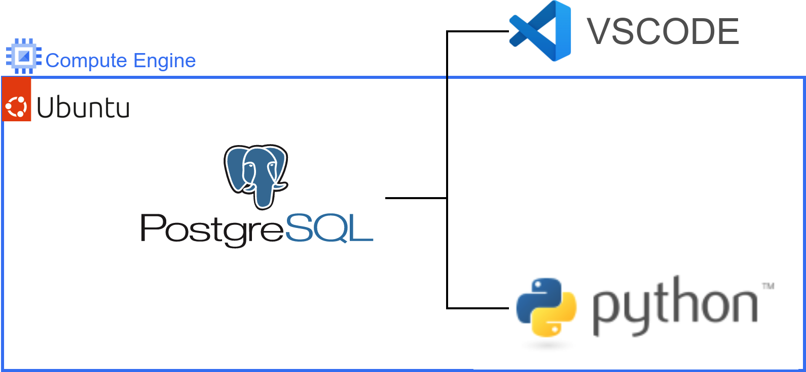
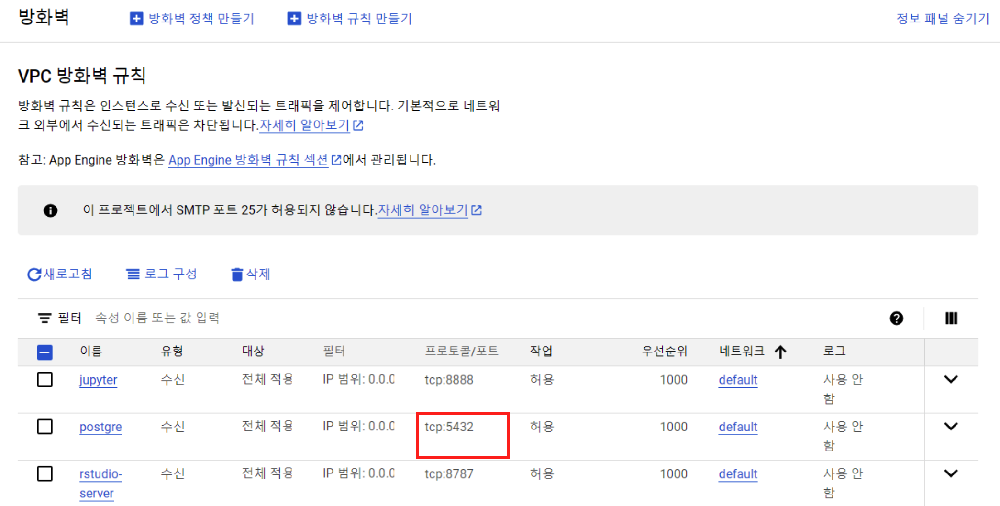
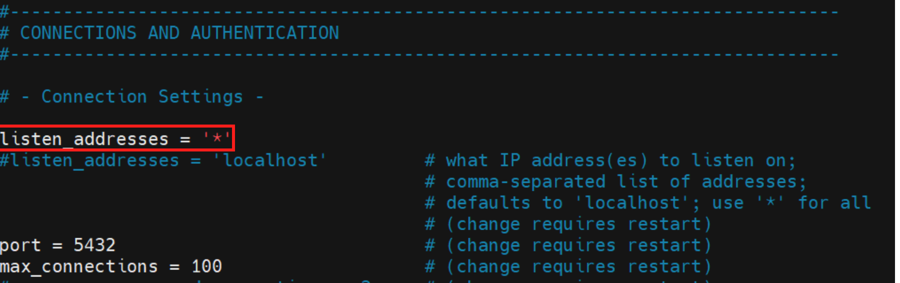
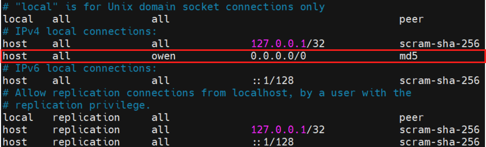
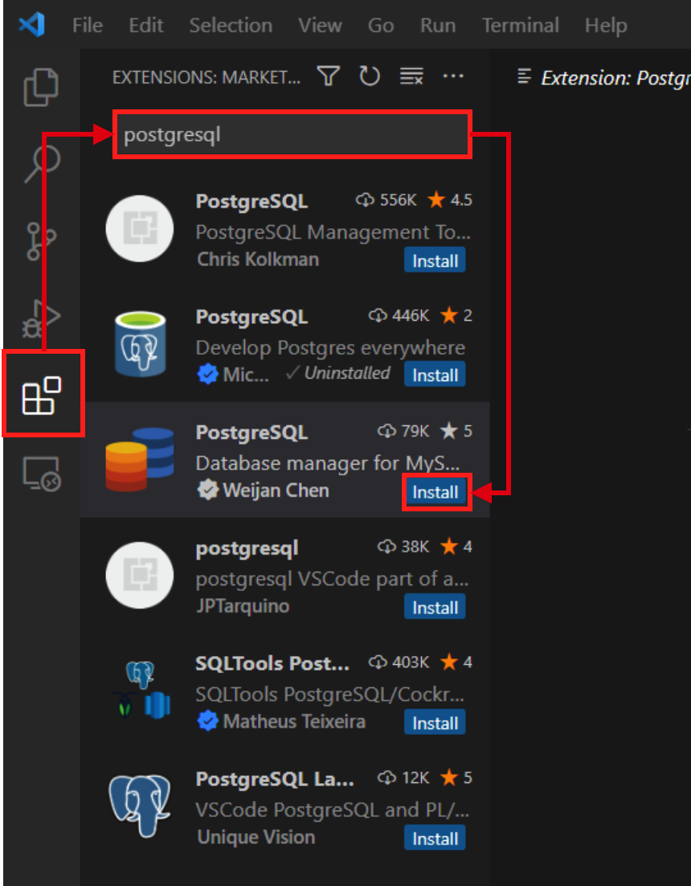
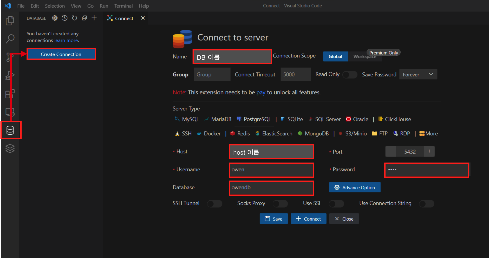
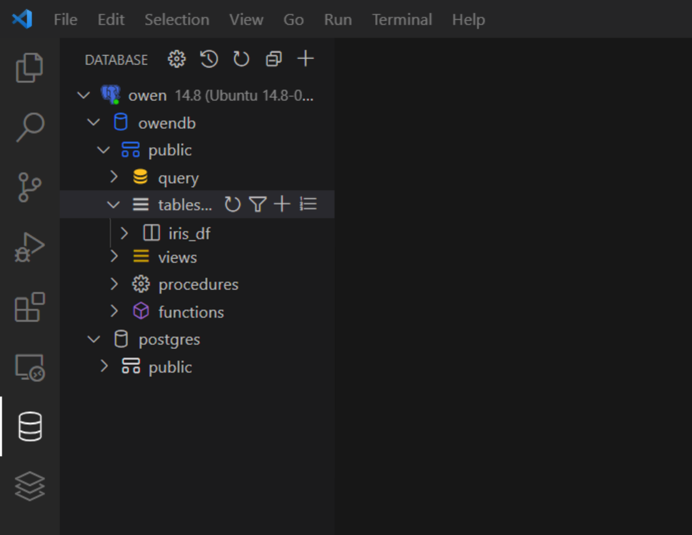

 
<center>
{width=80%}
</center>


Ubuntu에 Postgresql 을 설치 하고 VScode 및 Python과 연동을 해보자. ubuntu는 GCP의 Compute Engine에서 선택했으며, 물론 GCP SQL 및 BigQuery를 사용하는게 더 편하다. 바로 시작 해보자.

# 0. GCP 세팅

우선 GCP Compute Engine의 방화벽에서 postgresql 포트를 열어주자. postgresql의 포트 5432를 열어주면 된다. 자세한 사항은 다음의 블로그를 참고 하면 된다.

- [Compute Engine 방화벽](https://unfinishedgod.netlify.app/2023/06/11/gcp-compute-engine-mobaxterm/)

<center>
{width=80%}
</center>


# 1. Postgresql 설치

이제 우분투에 Postgresql를 설치 해보자. 그전에 패키지 목록들을 업데이트 및 최신버전으로 업그레이드 해주자.

```
$ sudo apt update
$ sudp apt upgrade
```

이제 postgresql을 설치 해보자. postgresql 의 특정 버전 설치에 대한 고려는 일단 제쳐두고 빠르게 설치 하고 넘어가자. 

```
$ sudo apt install postgresql postgresql-contrib
```

성공적으로 설치를 완료 했으면, postgresql 을 실행 하고 상태를 확인해보자.

```
$ sudo service postgresql start
$ sudo service postgresql status
```
```
● postgresql.service - PostgreSQL RDBMS
     Loaded: loaded (/lib/systemd/system/postgresql.service; enabled; vendor preset: enabled)
     Active: active (exited) since Wed 2023-06-14 04:46:59 UTC; 26s ago
    Process: 3793 ExecStart=/bin/true (code=exited, status=0/SUCCESS)
   Main PID: 3793 (code=exited, status=0/SUCCESS)
        CPU: 2ms
```

설치가 완료 되었으면 postgresql에 접속을 진행 한다.

```
$ sudo -i -u postgres
$ psql
```
```
psql (14.8 (Ubuntu 14.8-0ubuntu0.22.04.1))
Type "help" for help.
```

접속을 하게 되었으면 postgres의 계정으로 넘어가게 된다. 이제 owen이라는 superuser를 생성 해보자. 

```
postgres=# create user owen password '1234' superuser;
```
```
CREATE ROLE
```

계정이 잘 생성되었는지 확인하기위해 `\du` 명령어를 사용해보자.

```
postgres=# \du
```
```
                                   List of roles
 Role name |                         Attributes                         | Member of 
-----------+------------------------------------------------------------+-----------
 owen      | Superuser                                                  | {}
 postgres  | Superuser, Create role, Create DB, Replication, Bypass RLS | {}
```

이제 Database를 생성 해보자. 

```
postgres=# create database owendb owner owen;
```
```
CREATE DATABASE
```

Database를 생성 했으면 \l 명령어를 통해 DB를 확인한다.

```
postgres=# \l
```
```
                              List of databases
   Name    |  Owner   | Encoding | Collate |  Ctype  |   Access privileges   
-----------+----------+----------+---------+---------+-----------------------
 owendb    | owen     | UTF8     | C.UTF-8 | C.UTF-8 | 
 postgres  | postgres | UTF8     | C.UTF-8 | C.UTF-8 | 
 template0 | postgres | UTF8     | C.UTF-8 | C.UTF-8 | =c/postgres          +
           |          |          |         |         | postgres=CTc/postgres
 template1 | postgres | UTF8     | C.UTF-8 | C.UTF-8 | =c/postgres          +
           |          |          |         |         | postgres=CTc/postgres
```


확인이 끝났으면 이제 postgresql의 설정 파일을 수정 해주자. 우선 루트 계정으로 변경한다.

```
$ su
```

그리고 나서 /etc/postgresql 경로로 이동해주자. 

```
# cd /etc/postgresql
```

경로로 이동하고 나서 `ll` 커맨드를 입력하면 버전에 따른 디렉토리가 보이게 된다. 우리가 설치했던 버전은 14버전이므로 14디렉토리가 생성 되었다.

```
# ll
```
```
total 12
drwxr-xr-x   3 postgres postgres 4096 Jun 14 04:46 ./
drwxr-xr-x 105 root     root     4096 Jun 14 04:46 ../
drwxr-xr-x   3 postgres postgres 4096 Jun 14 04:46 14/
```

이제 14/main디렉토리로 이동 해주자.

```
# cd 14/main
```

우선 postgresql.conf의 설정파일을 수정하여 IP address를 변경 해주도록 하자.

```
# vi postgresql.conf 
```
<center>
{width=80%}
</center>

이번에는 postgresql 계정 추가 옵션이다. pg_hba.conf 파을 수정 한다. pg_hba.conf 파일은 PG에 접속하는 클라이언트에 대한 인증 설정을 설명하는 파일이다.

```
# vi pg_hba.conf 
```
<center>
{width=80%}
</center>

이렇게 설정파일을 모두 수정 했으면 재시작을 하여 적용 시켜 주도록 하자.

```
# sudo service postgresql restart
```

# 2. Python 연동

이렇게 Ubuntu에 postgresql설치를 완료 하였다. 이번에는 파이썬과 연동 하는 방법을 알아보자. 우선 우리에게 필요한 패키지는 pandas, psycopg2, sqlalchemy 이므로 다음을 불러와보자.

```
import pandas as pd
import psycopg2 as pg2
from sqlalchemy import create_engine
```

sqlalchemy라이브러리의 create_engine함수를 사용한다. sqlalchemy의 공식문서는 다음을 참고 한다.

- SQLAlchemy 공식문서: [SQLAlchemy](https://docs.sqlalchemy.org/en/20/core/engines.html)
  
여기에 우리가 필요한 정보를 입력하여 postgresql과 파이썬을 연결 시켜 준다. 접속하기위해서는 다음의 룰을 따른다.

- create_engine('postgresql+psycopg2://{**계정명**}:{**비밀번호**}@{**호스트명**}:{**port**}/{**데이터베이스이름**}')
 
우리는 f-string를 사용해 각각의 정보를 입력해주자.

```
username = 'owen'
password = '1234'
host = '*****'
database = 'owendb'

engine = create_engine(f'postgresql+psycopg2://{username}:{password}@{host}:5432/{database}')
```

engine연결을 했으니 이제 테스트를 해보자. 우선 iris.csv를 불러와서 iris_df로 지정해주자. iris 파일을 postgresql의 owendb에 통째로 테이블을 입력 해줄 예정이다.

```
iris_df = pd.read_csv('iris.csv')
```

iris를 불러 왔으면 이제 이를 업로드 해보자. pandas에서 제공하는 to_sql() 메서드를 사용한다. 여기서 우리는 다음과 같은 옵션을 사용하려고 한다.

- to_sql({업로드할 테이블 이름}, con = {}, if_exists = 'append', index = False) 
  - {업로드할 테이블 이름}
  - con: postgresql과 연결할 connect이다 직전에 우리는 engine으로 지정해주었으니 그걸로 사용하면 된다. 
  - if_exists: 'append' 옵션을 주어 이어 붙히기로 한다.
  - index: 인덱스 표시이다. to_csv()에서도 자주 사용했던 것처럼 False로 지정 해주었다.

자세한 내용에 대한 공식문서는 다음을 참고 한다. 

- pandas .to_sql 공식문서:  [pandas_to_sql](https://pandas.pydata.org/docs/reference/api/pandas.DataFrame.to_sql.html) 

최종적으로 우리가 사용하는 코드는 다음과 같다. 이렇게 하게 되면 iris의 데이터가 owendb의 iris_df라는 테이블로 적재 되게 된다.

```
iris_df.to_sql('iris_df', con=engine, if_exists='append', index=False)
```

잘 업로드 되었는지 확인하기 위해 쿼리를 날려보자. pandas에서도 read_sql() 메서드를 제공한다. read_sql() 함수는 다음과 같이 쿼리와 함께 사용한다. 간단해서 공식문서만 남기도록 한다.

- pandas 공식문서: [pandas_read_sql](https://pandas.pydata.org/docs/reference/api/pandas.read_sql.html) 

```
pd.read_sql('SELECT * FROM iris_df', engine)
```
|Sepal.Length| Sepal.Width | Petal.Length | Petal.Width | Species  |
|--------------|-------------|--------------|-------------|----------|
| 5.1          | 3.5         | 1.4          | 0.2         | setosa   |
| 4.9          | 3.0         | 1.4          | 0.2         | setosa   |
| 4.7          | 3.2         | 1.3          | 0.2         | setosa   |
| 4.6          | 3.1         | 1.5          | 0.2         | setosa   |
| 5.0          | 3.6         | 1.4          | 0.2         | setosa   |

이렇게 파이썬으로 데이터를 적재 및 쿼리를 날려서 확인하면서 파이썬과의 연동이 마무리 되었다. 이제 마지막으로 vscode와 연동하고 쿼리를 확인해보고 마무리 해보자.

# 3. VSCode 연동


우선 VSCode의 Extension을 설치하면서 시작한다. 왼쪽 의 Extension 버튼을 클릭하고 postgresql 이라고 검색을 해서 postgresql extension 을 설치 해주자.

<center>
{width=60%}
</center>

설치가 되었으면, 왼쪽에 Database 버튼이 추가 된다. Database > Create Connection 순서대로 입력하게 되면 postgresql의 Connect to server 에 대한 입력 사항이 나오게 된다. 여기서 그림과 같이 하나씩 입력 해주면 된다.

<center>
{width=100%}
</center>

성공적으로 입력하고 Save 버튼을 클릭하면 왼쪽에 드디어 postgresql 연결이 완료 된것을 확인할 수 있다.

<center>
{width=60%}
</center>

연결이 되었는지 확인해보면 파이썬에서 적재 했던 iris_df 테이블을 쿼리 날려보고 마무리 지어 보자.

<center>
{width=100%}
</center>


# 총평

이번에는 postgresql을 설치 하고 파이썬 과 vscode에 연결을 해보았다. 사실 빅쿼리를 사용하든 다른 클라우드의 데이터베이스 서비스를 사용하게 되면 이런 설치 하는 과정이 필요 없지만 그래도 python 과 vscode연동은 겸사겸사 필요해서 같이 남긴다.

---

# Reference

- yrotsti님의 블로그
  - [Postgresql 설치](https://yrotsti.tistory.com/77) 
  - [Postgresql vscode 연동](https://yrotsti.tistory.com/80) 

- backendcode님의 블로그: [우분투에 PostgreSQL 설치 및 접속 핵심 정리](https://backendcode.tistory.com/265) 
- pandas 공식문서:  [pandas_to_sql](https://pandas.pydata.org/docs/reference/api/pandas.DataFrame.to_sql.html) 
- pandas 공식문서: [pandas_read_sql](https://pandas.pydata.org/docs/reference/api/pandas.read_sql.html) 
- SQLAlchemy 공식문서: [SQLAlchemy](https://docs.sqlalchemy.org/en/20/core/engines.html)