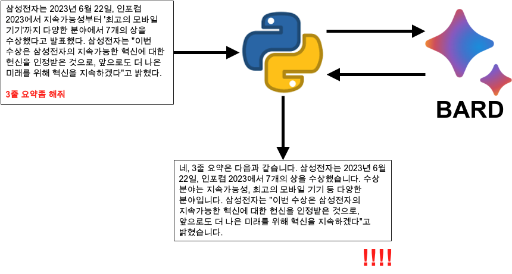
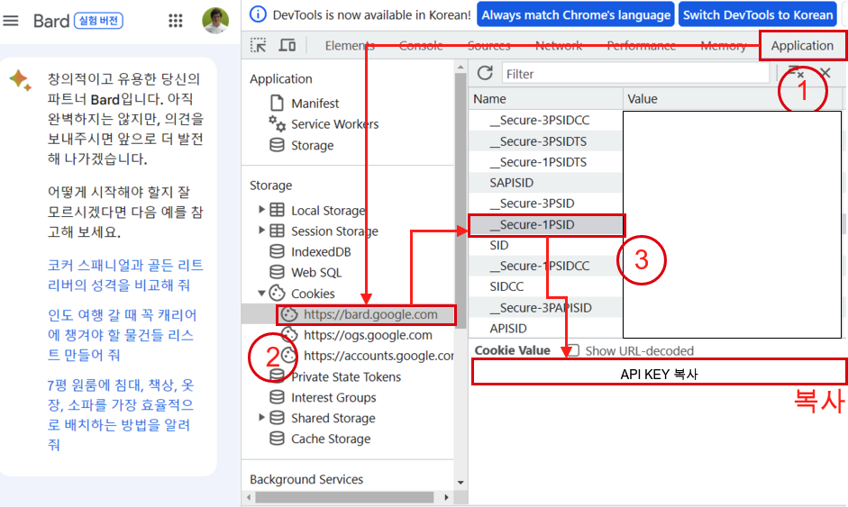
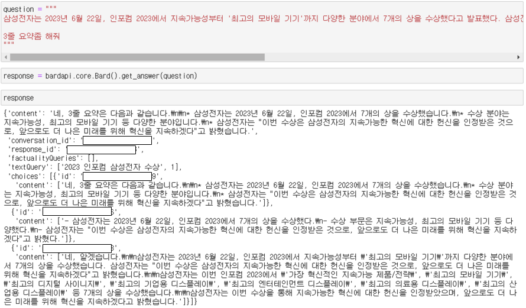

<center>{width=100%}</center>

바야흐로 생성형 AI의 시대이다. Openai의 Chatgpt가 세상을 떠들썩 한지도 얼마 안가서 Google도 Bard를 출시 했다. 현재 Chatgpt와 Bard를 같이 사용하고 있는데, 이번에 BARD와 파이썬을 연동하는게 관심이 생겨 알아 보게 되었다. 아직 BARD의 정식 API가 나온것이 아니라서, 추후에 정식 API가 나오게 되면 그때 업데이트를 하려고 한다.

# API KEY 확보

우선 python에 사용할 BARD의 API를 확보 하자. 그리고 다음과 같이 하나씩 따라 하면 된다.

1. BARD 접속
 - https://bard.google.com/
2. 개발자 모드 진입
  - (크롬 기준) F12 또는 Ctrl + Shift + i
3. 상단에 Application 탭 클릭
4. 왼쪽 메뉴에 Cookies > https://bard.google.com 클릭
5. secure-1PASID 클릭
6. 하단에 API키 복사 

<center>{width=80%}</center>

이렇게 apikey를 확보 했으면 이제  bard를 설치 해주자.

```
$ pip3 install bardapi
```

# Python BARD 연동

apikey도 확보 했고, bard api도 설치 했으면 이제 준비는 끝났다. 파이썬에서 하나씩 확인해보자. 우선 다음의 모듈을 불러온다.

```
import pandas as pd
import bardapi
import os
```

앞서 준비한 bard의 API키를 넣어 준다.

```
os.environ['_BARD_API_KEY'] = 'API_KEY'
```

질문을 테스트 해본다. 

```
question = """
삼성전자는 2023년 6월 22일, 인포컴 2023에서 지속가능성부터 '최고의 모바일 기기'까지 다양한 분야에서 7개의 상을 수상했다고 발표했다. 삼성전자는 "이번 수상은 삼성전자의 지속가능한 혁신에 대한 헌신을 인정받은 것으로, 앞으로도 더 나은 미래를 위해 혁신을 지속하겠다"고 밝혔다.

3줄 요약좀 해줘
"""
```

그리고 다음의 `bardapi.core.Bard().get_answer()` 함수를 사용해 테스트 하면 BARD의 결과물이 나오게 된다. 

```
response = bardapi.core.Bard().get_answer(question)
response
```

<center>{width=80%}</center>

이를 잘 정리 하려면 다음과 같이 데이터프레임으로 감싸도 된다.

```
df = pd.DataFrame(response['choices'])
df
```

# 총평

openai, google에서 아주 멋진걸 만들어 놨다. 이제는 이걸 어떻게 잘 써먹어야 하는 시대가 벌써 눈앞에 왔는데, 파이썬을 사용해서 앞으로 어떻게 사용할지는 조만간 한번 만들어 봐야 겠다.


---

# Reference

- [dsdanielpark bard api](https://github.com/dsdanielpark/Bard-API)
- yeko90님의 블로그: [Google Bard 사용법](https://yeko90.tistory.com/entry/%EB%B0%94%EB%93%9C-api-%EC%82%AC%EC%9A%A9%EB%B2%95)
