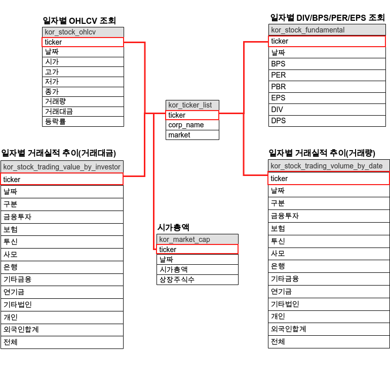

<center>
{width=80%}
</center>

이번에는 Pykrx 와 FinanceDataReader를 사용한 금융 데이터 수집을 해보려 한다. GCP를 하면서 ETL에 좋은 예제가 무엇이 있을까 생각하던 도중 금융 데이터를 사용하는 것이 생각이 났다. Pykrx나 FinanceDataReader는 종종 찾아서 쓰던 라이브러리 였으나, 이번에 정리도 하면서 블로그를 남기려고 한다. 둘중 하나만 사용해볼까 했는데 국내, 국외 주식 및 여러 세부정보들이 각각 다르게 제공을 하기 때문에 두개를 써야 하는 상황이 생겼다. 우번 이번에는 Pykrx부터 사용해보도록 하자. 
 
# Github

깃헙은 다음과 같다. 앞으로 이곳에 하나씩 파일을 업로드 하면서 문서를 생성할 예정
 
- [GCP, 파이썬을 사용한 금융 데이터 ETL 및 대시보드 구축](https://github.com/Unfinishedgod/finance_mlops)

# Pykrx

 - 공식문서: [Pykrx](https://github.com/sharebook-kr/pykrx)

### 사용할 데이터

- 사용 예정 데이터
  - 국내종목시세
  - 종목별 DIV/BPS/PER/EPS 조회
  - 일자별 시가총액
  - 일자별 거래실적 추이(거래대금)
  - 일자별 거래실적 추이(거래량)


# 파이썬을 사용한 데이터 수집 가이드

## 세팅

### pykrx 설치

우선 설치를 해주자. 

```
$ pip install pykrx  # pykrx 설치
```

### 라이브러리 호출

```
import pandas as pd
from pykrx import stock
from pykrx import bond
from time import sleep

from datetime import datetime
import os
import time
```

### 날짜 호출

현재 날짜를 호출하자. 시작 날짜는 start_date로 20180101로 지정해주어 2018년 부터 수집을 해주도록 한다.

```
now = datetime.now()
today_date1 = now.strftime('%Y%m%d')
start_date = '20180101'
```

## Pykrx 를 사용한 데이터 수집

### 1. KRX 종목 리스트

우선 종목 리스트를 얻어 오자. KRX에서 제공하는 마켓은 총 3개로 KOSPI, KOSDAQ, KONEX별로 주가 정보를 얻어올 예정이다. pykrx에서 제공하는 함수를 사용하여 마켓별 ticker와 그에 따른 회사 이름을 얻어 오자. 종목코드라고 불리는 ticker 또는 symbol는 주식 시장에서 회사를 표현하는 약자이다. 삼성전자는 005930, 애플은 AAPL으로 각각의 종목코드를 불러오는 작업이 우선적으로 되어야 한다.

#### stock.get_market_ticker_list()

마켓별 ticker를 불러오는 함수이다. 옵션에는 'KOSPI', 'KOSDAQ', 'KONEX'와 전체를 불러올 수 있는 'ALL' 이 있지만 해당 티커의 마켓을 구분하기 위해 반복문을 사용하여 주었다.

#### stock.get_market_ticker_name()

ticker를 구했으면 그에 따른 회사를 호출해주는 함수가 위의 함수 이다. 이렇게 ticker, 회사이름, 마켓을 구하여서 앞으로 수집할 마스터 데이터로 사용할 예정이다. 

```
market_list = ['KOSPI', 'KOSDAQ', 'KONEX']

kor_ticker_list_df = pd.DataFrame()
for market_nm in market_list:
    ticker_list = stock.get_market_ticker_list(today_date1, market=market_nm)
    for tickers in ticker_list:
        corp_name = stock.get_market_ticker_name(tickers)
        df = pd.DataFrame({'ticker':tickers,
                           'corp_name':corp_name,
                           'marke': market_nm
                          }, index = [0])
        kor_ticker_list_df = pd.concat([kor_ticker_list_df,df])
kor_ticker_list_df = kor_ticker_list_df.reset_index(drop = True)
kor_ticker_list_df.head()
```

| ticker |   corp_name | marke |
|-------:|------------:|------:|
| 095570 |  AJ네트웍스 | KOSPI |
| 006840 |    AK홀딩스 | KOSPI |
| 027410 |         BGF | KOSPI |
| 282330 |   BGF리테일 | KOSPI |
| 138930 | BNK금융지주 | KOSPI |

최종적으로 생성된 kor_ticker_list_df는 data_crawler 경로에 넣어서 저장해주고, 앞으로 사용할 ticker리스트를 위해 kor_ticker_list를 따로 만들어 주도록 하자.

```
kor_ticker_list = kor_ticker_list_df['ticker']

kor_ticker_list_df.to_csv(f'data_crawler/kor_ticker_list.csv', index=False, mode='w')
```


### 2. 종목별 주가 정보

이번에는 종목별 시가총액을 구해보자. 앞서 ticker 마스터 데이터를 생성 했으니 우리는 이 ticker로 데이터를 수집해주면 된다. 시가총액을 수집하는 함수는 stock.get_market_ohlcv()이다. 앞서서 구했던 시작날짜, 현재날짜와 kor_ticker_list의 반복문을 사용하여 이를 적재 해주도록 한다. 추가로 stock.get_market_ohlcv()로 구한 데이터에는 ticker 종목이 나오지 않는다. 따라서 수집후에 ticker 컬럼을 따로 넣어 주도록 한다. 이렇게 적재한 데이터는 kor_stock_ohlcv.csv로 저장해주도록 한다.

## 잠깐!!

### ticker컬럼은 넣어 주었으나, 회사명은 넣어 주지 않는이유? 

ticker는 넣어 주었는데, 회사명은 왜 안넣지? 하는 의문이 생길 수 있다. 회사명을 넣어 주면 가독성 측면에서 더 좋을수 있기 때문이다. 여기에 두가지 이유가 있는데 다음과 같다.

- 1. ticker는 변하지 않는 값. 회사명은 변할 수 있는 값.
  - 회사명의 경우에는 데이터를 수집하는 출처에 따라 변할수 있다. 가령 SK이노베이션의 경우에도 에스케이이노베이션이라고 표기하는곳도 있기 때문에 이에 따른 혼선이 있을 수 있기 때문에 이곳에는 넣어 주지 않는다.
- 2. 데이터 적재시 데이터 성능에 따른 이유
  - 고유값인 ticker를 사용하고 나머지는 우리가 수집한 마스터 테이블을 통해 join을 사용하면 된다. 굳이 넣어서 데이터베이스 성능을 저하시킬 필요는 없다.

```
for ticker_nm in kor_ticker_list:
    file_name = 'kor_stock_ohlcv'
    
    try:
        df_raw = stock.get_market_ohlcv(start_date, today_date1, ticker_nm)
        df_raw = df_raw.reset_index()
        df_raw['ticker'] = ticker_nm
        
        
        if not os.path.exists(f'data_crawler/{file_name}.csv'):
            df_raw.to_csv(f'data_crawler/{file_name}.csv', index=False, mode='w')
        else:
            df_raw.to_csv(f'data_crawler/{file_name}.csv', index=False, mode='a', header=False)
        
        print(f'{ticker_nm} success')
    except:
        print(f'{ticker_nm} fail')    
```

간단하게 확인해보면 다음과 같은 테이블이 생성 된다.

```
df_raw.head(3)
```

|       날짜 |  시가 |  고가 |  저가 |  종가 |   거래량 |      거래대금 | 등락률 |
|-----------:|------:|------:|------:|------:|---------:|--------------:|-------:|
| 2023-06-01 | 70900 | 71600 | 70600 | 70900 | 14669296 | 1041791411900 |  -0.70 |
| 2023-06-02 | 71700 | 72200 | 71600 | 72200 | 12161798 |  874631186600 |   1.83 |
| 2023-06-05 | 72700 | 72700 | 71400 | 71700 | 12686829 |  911317330400 |  -0.69 |

### 3. 종목별 시가총액

이번에는 종목별 시가총액을 불러와보자. 종목별 주가정보와 사용 형태는 똑같다. stock.get_market_cap()를 사용하고 이를 kor_market_cap.csv로 저장해주면 된다. 

- 특별한 점이 있다면 종목별 시가총액과 동일한 컬럼이 존재 한다. 종가, 거래량, 거래대금인데 이는 수집 대상에서 제거 한다. 앞으로 우리는 이 데이터를 여러 방법(cron, airflow, google cloud function)을 사용하여 데이터베이스에 적재 할 예정이다. 적재할 때 중복되는 컬럼은 사용할 필요가 없기 때문에 사용하지 않는다.

```
for ticker_nm in kor_ticker_list:
    file_name = 'kor_market_cap'
    
    try:
        df_raw = stock.get_market_cap(start_date, today_date1, ticker_nm)
        df_raw = df_raw.reset_index()
        df_raw['ticker'] = ticker_nm
        df_raw = df_raw.drop(['종가','거래량', '거래대금'], axis = 1)

        
        
        if not os.path.exists(f'data_crawler/{file_name}.csv'):
            df_raw.to_csv(f'data_crawler/{file_name}.csv', index=False, mode='w')
        else:
            df_raw.to_csv(f'data_crawler/{file_name}.csv', index=False, mode='a', header=False)
        
        print(f'{ticker_nm} success')
    except:
        print(f'{ticker_nm} fail')    
```

간단하게 확인해보면 다음과 같은 테이블이 생성 된다.

```
df_raw.head(3)
```

| 날짜 | 시가총액 | 상장주식수 | ticker |
|-----------:|------------:|--------:|-------:|
| 2023-06-28 | 16744344550 | 7125253 | 112190 |
| 2023-06-29 | 16245576840 | 7125253 | 112190 |
| 2023-06-30 | 15853687925 | 7125253 | 112190 |


### 4. DIV/BPS/PER/EPS 수집

이번에는 DIV/BPS/PER/EPS 데이터를 수집 해보자. 역시 방법은 똑같다. kor_stock_fundamental.csv로 저장해준다.

```
for ticker_nm in kor_ticker_list:
    file_name = 'kor_stock_fundamental'
    
    try:
        df_raw = stock.get_market_fundamental(start_date, today_date1, ticker_nm)
        df_raw = df_raw.reset_index()
        df_raw['ticker'] = ticker_nm
        
        
        if not os.path.exists(f'data_crawler/{file_name}.csv'):
            df_raw.to_csv(f'data_crawler/{file_name}.csv', index=False, mode='w')
        else:
            df_raw.to_csv(f'data_crawler/{file_name}.csv', index=False, mode='a', header=False)
        
        print(f'{ticker_nm} success')
    except:
        print(f'{ticker_nm} fail')    
```

간단하게 확인해보면 다음과 같은 테이블이 생성 된다.

```
df_raw.head(3)
```

|       날짜 |   BPS |   PER |  PBR |  EPS |  DIV |  DPS | ticker |
|-----------:|------:|------:|-----:|-----:|-----:|-----:|-------:|
| 2021-01-04 | 37528 | 26.22 | 2.21 | 3166 | 1.71 | 1416 | 005930 |
| 2021-01-05 | 37528 | 26.50 | 2.24 | 3166 | 1.69 | 1416 | 005930 |
| 2021-01-06 | 37528 | 25.96 | 2.19 | 3166 | 1.72 | 1416 | 005930 |


### 5. 일자별 거래실적 추이 (거래대금)

이번에는 거래대금에 따른 일자별 거래실적 추이 데이터를 불러와보자. 일자별 거래대금 종류에는 순매수, 매수, 매도로 나뉘어 지는데 여기서 순매수는 매수 + 매도를 해서 나온 값이다. stock.get_market_trading_value_by_date() 함수를 사용하며 순매수, 매수, 매도에 따른 옵션이 추가로 생성되어서 이에 따라서 반복문을 하나 더 추가 했다. 그리고 이는 kor_stock_trading_value_by_investor.csv로 저장해준다.

```
buy_sell_type_list = ['순매수', '매수', '매도']
for buy_sell_type in buy_sell_type_list:
    for ticker_nm in kor_ticker_list:
        file_name = 'kor_stock_trading_value_by_investor'
        try:
            df_raw = stock.get_market_trading_value_by_date(start_date, today_date1, 
                                                                             ticker_nm, 
                                                                             detail=True,
                                                                             on = buy_sell_type)
            df_raw = df_raw.reset_index()
            df_raw['ticker'] = ticker_nm
            df_raw['type'] = buy_sell_type
            
            
            if not os.path.exists(f'data_crawler/{file_name}.csv'):
                df_raw.to_csv(f'data_crawler/{file_name}.csv', index=False, mode='w')
            else:
                df_raw.to_csv(f'data_crawler/{file_name}.csv', index=False, mode='a', header=False)
        
            print(f'{ticker_nm} success')
        except:
            print(f'{ticker_nm} fail')    
    time.sleep(300)

```


간단하게 확인해보면 다음과 같은 테이블이 생성 된다.

```
df_raw.head(2)
```


|       날짜 |      금융투자 |         보험 |         투신 |         사모 |        은행 |    기타금융 |        연기금 |     기타법인 |          개인 |        외국인 | 기타외국인 | 전체 | ticker |
|-----------:|--------------:|-------------:|-------------:|-------------:|------------:|------------:|--------------:|-------------:|--------------:|--------------:|-----------:|-----:|-------:|
| 2021-01-15 | -231743879900 | -18526513400 | -34856086600 |  -3861653300 |   820943000 | -1966002200 | -150636016900 |  25442287800 |  661609085600 | -247945445800 | 1663281700 |    0 | 005930 |
| 2021-01-18 |  119952214400 | -18847969100 |  -8465682900 |    204574100 |   260697100 |   -97711000 |  -50682587600 |  22682344800 |   14829121700 |  -79142869800 | -692131700 |    0 | 005930 |
 

### 6. 일자별 거래실적 추이 (거래량)

이번에는 거래량에 따른 일자별 거래실적 추이 데이터를 불러와보자. 거래 대금에 따른 일자별 거래 실적과 동일한 방법대로 수집을 하면 된다. kor_stock_trading_volume_by_date.csv로 저장해 준다.

```
buy_sell_type_list = ['순매수', '매수', '매도']
for buy_sell_type in buy_sell_type_list:
    for ticker_nm in kor_ticker_list:
        file_name = 'kor_stock_trading_volume_by_date'
        try:
            df_raw = stock.get_market_trading_volume_by_date(start_date, today_date1, 
                                                                             ticker_nm, 
                                                                             detail=True,
                                                                             on = buy_sell_type)
            df_raw = df_raw.reset_index()
            df_raw['ticker'] = ticker_nm
            df_raw['type'] = buy_sell_type
            
            
            if not os.path.exists(f'data_crawler/{file_name}.csv'):
                df_raw.to_csv(f'data_crawler/{file_name}.csv', index=False, mode='w')
            else:
                df_raw.to_csv(f'data_crawler/{file_name}.csv', index=False, mode='a', header=False)
        
            print(f'{ticker_nm} success')
        except:
            print(f'{ticker_nm} fail')    
    time.sleep(300)
```


간단하게 확인해보면 다음과 같은 테이블이 생성 된다.

```
df_raw.head(2)
```


|       날짜 |     금융투자 |        보험 |        투신 |        사모 |       은행 |   기타금융 |       연기금 |    기타법인 |          개인 |       외국인 | 기타외국인 |          전체 | ticker |
|-----------:|-------------:|------------:|------------:|------------:|-----------:|-----------:|-------------:|------------:|--------------:|-------------:|-----------:|--------------:|-------:|
| 2021-01-15 | 396407523300 |  5621379600 | 39679316200 |  6114919200 |  970033200 |    9977900 | 615677884600 | 44968044700 | 1587035281300 | 275272367764 | 3475209900 | 2975231937664 | 005930 |
| 2021-01-18 | 479526783100 |  5767862900 | 21591484900 |  8651867500 | 1233003800 |  287903700 | 878488362600 | 44815328300 | 1898251748900 | 373035291300 | 4126355600 | 3715775992600 | 005930 |


# 총평 

이렇게 pykrx를 사용한 데이터 수집을 한번 알아 보았고 정리 해보았다. GCP를 공부하면서 금융 도메인으로 잡았고 이를 사용하는 방법에 대해 이번에 길게 적어보고 있다. 지금은 이렇게 간단하게 수집이 되었지만 앞으로 cron, airflow, cloud function를 사용하게 되면 조금 더 복잡하게 될 예정이다.