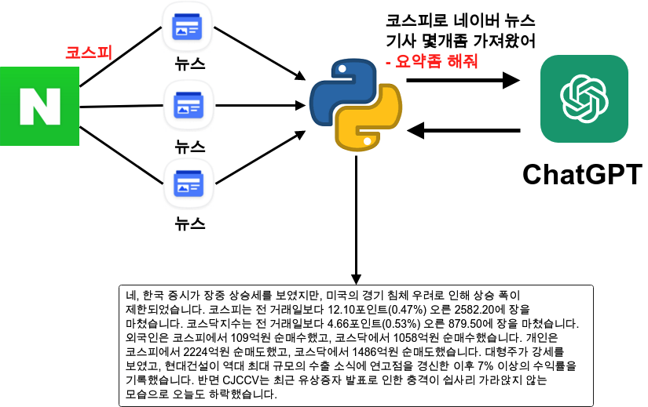
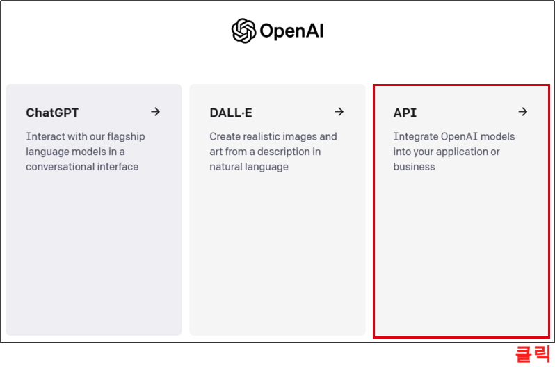
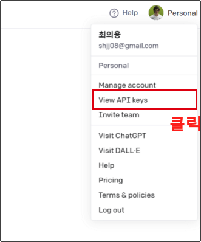
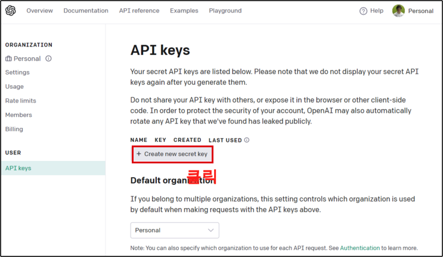
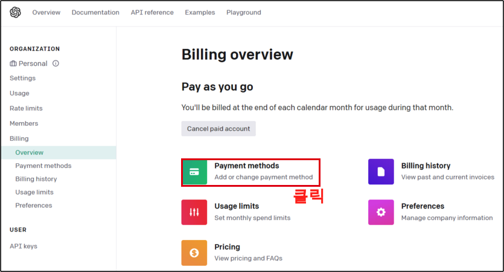
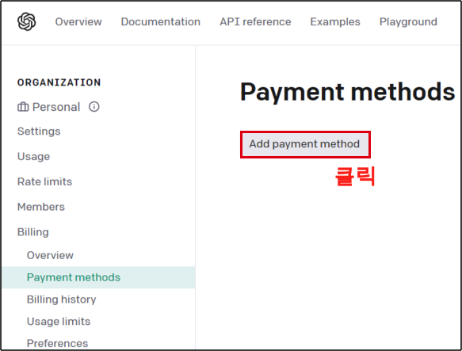

<center>
{width=80%}
</center>
 
지난번에 google Bard API를 사용한 블로그를 포스팅한 적이 있다. 그러나 잘 작동하던 BARD API가 작동이 안되기 때문에 이번에 급하게 chatgpt 관련 글을 쓰게 된다. GCP 관련해서 주가 데이터와 같이 사이드 프로젝트를 하는데 있어서 이번 chatgpt도 매우 큰 역할을 하기 때문이다. 그럼 이제 하나씩 알아보자. 


## 1. API키 확보

우선 OPENAI의 API를 얻어야 한다. 다음의 공식 링크를 접속 하자.

- https://openai.com/

### step 1.

회원가입 후 우측 상단의 로그인 클릭

<center>
{width=50%}
</center>

### Step 2. 

그러면 다음과 같은 화면이 나오게 되는데 여기서 API를 클릭해준다. 

<center>
{width=60%}
</center>

### Step 3.

클릭하고 넘어간 후에 우측 상단에 아이콘을 클릭하게 되면 메뉴를 볼 수 있다. 여기서 'View API keys'를 클릭해준다.

<center>
{width=40%}
</center>

### Step 4. 

API Keys 화면이 보인다. 여기서 'Create new secret key' 버튼을 클릭하여 api키를 받게 된다. 잘 저장해주면 된다. 

<center>
{width=60%}
</center>

### Step 5.

API는 받았지만 이를 그대로 사용할 수가 없다. Payment methods를 등록해야 한다. openai는 api를 부분 무료 로 제공하고 있으며 한도를 초과 할 경우 그에 따른 비용이 부과 되게 된다. 'Payment methods' 클릭 해주자.

<center>
{width=60%}
</center>

### Step 6. 

이제 'Add payment method' 버튼을 클릭하여 마무리. 이렇게 API 키까지는 확보를 완료 했다. 이제 이 키를 가지고 python에서 사용해보자.

<center>
{width=60%}
</center>


## 2. Python, ChatGPT 연동

이제 본격적으로 python과 chatgpt를 연동 해보도록 하자. 우선 다음의 커맨드를 입력하여 설치 해주면 된다.

```bash
$ pip3 install openai
```

### 라이브러리

라이브러리는 다음과 같다.

```python
import requests
from bs4 import BeautifulSoup as bs
import pandas as pd
import os
```

### API 키 등록

그리고 나서 API KEY 를 csv로 저장 해주도록 하자. 이는 git에서 apikey를 노출시키지 않기 위함이며, csv 파일은 .gitignore에서 설정하여 git에는 보이지 않게 하기 위함이다. 물론 github에서 apikey를 노출하지 않기 위한 여러 방법이 있는데, 이는 다음에 서술하도록 한다.

```python
chatgpt_apikey = 'CHAT GPT API KEY'
df = pd.DataFrame({
    'api_key':chatgpt_apikey}, index = [0])
df.to_csv('chatgpt_apikey.csv', index = False)
```

앞으로 chatgpt apikey는 이렇게 사용하면 된다. chatgpt_apikey.csv를 chatgpt_apikey_df로 불러와서 chatgpt_apikey 지정 해주었다.

```python
chatgpt_apikey_df = pd.read_csv('chatgpt_apikey.csv')
chatgpt_apikey = chatgpt_apikey_df['api_key'][0]
```

### 모델 리스트

그럼 이제 openai에서 제공하는 모델 리스트를 불러와보자. 이렇게 불러오고 모델 리스트를 보기 편하게 데이터 프레임으로 변경해서 보면 여러 모델이 나오게 된다. 각 모델에 대한 자세한 정보는 openai의 다음 링크를 참고하면 된다. 

 - [openai model list](https://platform.openai.com/docs/models/model-endpoint-compatibility)

```python
openai.api_key = chatgpt_apikey
model_list = openai.Model.list()


model_list_df = pd.DataFrame(model_list['data'])
model_list_df
```

이중에서 모델은 'gpt-3.5-turbo-16k'로 해주고 테스트를 해보자.

```python
model_name = "gpt-3.5-turbo-16k" 

prompt = "삼성전자에 대해 설명 해줘" # 모델에 입력할 프롬프트
# API 호출
completion = openai.ChatCompletion.create(
      model=model_name, 
      messages=[{"role": "user",
                 "content": question}]
        
)
# 결과 출력
completion.choices[0]['message']['content']
```
```
삼성전자는 대한민국의 대표적인 전자 제조 기업으로, 1969년에 창립된 이후 전자 제품, 통신 장비, 반도체 등 다양한 분야에서 국내외 시장을 선도하고 있습니다.
...
\n\n이처럼 삼성전자는 꾸준한 기술 혁신과 고객 경험에 대한 집중을 바탕으로 전 세계에서 많은 사랑을 받고 있는 기업입니다.
```

## 3. 네이버 뉴스 함수 생성

이제 함수 테스트도 마무리 했으니 이를 네이버 뉴스와 연동하여 마무리를 해주자. 네이버 뉴스를 사용한 함수는 이미 이전에 만들어 놓았으니 이곳에 BARD 대신 ChatGPT만 바꿔 껴주면 된다. 자세한 사항은 다음을 참고 하면 된다.

- [네이버 뉴스 크롤링 및 BARD 요약](https://unfinishedgod.netlify.app/2023/06/26/python-naver-news-bard/)

위 링크를 참고 하여 다음의 함수를 생성 했다.

```python
def get_news_summary(key_word):
    
    # 1. 검색 url을 통해 뉴스의 리스트를 읽어 오는 코드
    url = f'https://search.naver.com/search.naver?where=news&sm=tab_jum&query={key_word}'

    headers = {"User-Agent": "Mozilla/5.0 (Windows NT 6.3; WOW64) AppleWebKit/537.36 (KHTML, like Gecko) Chrome/44.0.2403.157 Safari/537.36"}
    res = requests.get(url, headers= headers)
    soup = bs(res.text, 'html.parser')
    news_list = soup.find_all('div', attrs={'class':'info_group'})
    
    # 각각 뉴스의 리스트에서 링크를 타고 들어간 후 각각의 뉴스 내용을 합치는 코드
    news_url_list = [] # 네이버 뉴스 url 리스트
    new_article_list= [] # 네이버 뉴스 기사 통합 리스트
    for i in range(3): # 최대 5개 정도만 추출
        news_article = news_list[i].find_all("a", attrs={"class":"info"})
        if len(news_article) > 1:
            news_nm_url = news_article[1].get('href')
            news_url_list.append(news_nm_url)
            res = requests.get(news_nm_url, headers=headers)
            soup = bs(res.text, 'lxml')
            news_article_nm = soup.find_all('div', attrs = {'class': 'newsct_article _article_body'})
            news_article_text = news_article_nm[0].get_text()
            new_article_list.append(news_article_text)
            
    total_article = '_'.join(new_article_list)
    total_article = total_article.replace("\n","")
    
    
#     # 뉴스기사와 함께 요약문 
    input_text_2 = ' \n 전망이 어떨지 요약 좀 해줘'
    
    question = f'{total_article} {input_text_2}'
    
    # Chat gpt
    completion = openai.ChatCompletion.create(
      model="gpt-3.5-turbo-16k", 
      messages=[{"role": "user", 
                 "content": question}]
)
    return completion.choices[0]['message']['content']

```

이제 '삼성전자' 키워드를 같이 던져 주면 이 함수는 다음과 같은 작동을 하게 된다.

 - 삼성전자 가 들어간 네이버 뉴스 검색
 - 상위 3개 정도 뉴스 취합(원래 5~10개까지 였으나 Chatgpt는 글자수 제한이 있어서 3개로 수정)
 - ChatGPT를 사용하여 취합된 뉴스에 대한 요약

결과를 보면 다음과 같다.

```
get_news_summary('삼성전자')
```
```
삼성전자는 업계에서 가장 낮은 소비전력을 가진 차량용 인포테인먼트 UFS 3.1 메모리 솔루션 양산을 시작했다. 이 제품은 전기차의 배터리 전력 운영을 향상시키고, 전기차와 자율주행차에 최적화된 솔루션으로 기대된다. 삼성전자는 128GB, 256GB 제품뿐 아니라 더 큰 용량의 제품도 출시할 예정이다. 또한, 삼성전자는 이번 제품을 바탕으로 차량용 반도체 시장 공략을 가속화할 계획이다. 차량용 반도체 시장은 전기차와 자율주행차의 생산 증가로 인해 계속해서 성장할 것으로 예상되고 있다. 이에 따라 삼성전자의 UFS 제품도 차량마다 적용되는 용량이 증가될 것으로 예측된다. 또한, 삼성전자의 포터블 빔프로젝터 '더 프리스타일'의 캠핑 시즌 판매량도 상반기에 크게 증가했다. 이 제품은 가벼우면서도 휴대하기 편하며 다양한 기능을 제공하기 때문에 인기를 끌고 있다. 삼성전자는 다양한 산업과의 협업을 통해 새로운 제품을 출시하고 있다. 이러한 성과로 삼성전자의 시가총액도 상반기에 크게 증가했다.
```

## 총평 

이렇게 ChatGPT API를 사용하여 실시간 네이버 뉴스를 요약하는 코드를 마무리 했다. 원래는 GCP의 대부분의 서비스를 사용할 예정이었어서, BARD 를 사용하고, Text to Speech 기능도 같이 사용하려고 했는데 이는 조금 더 두고 봐야 겠다.
