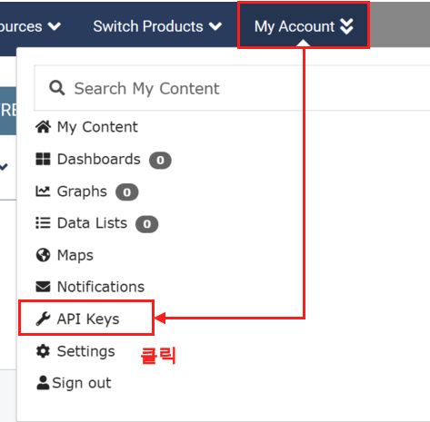
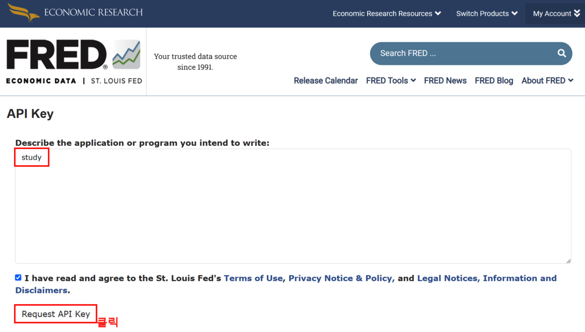

<center>
{width=80%}
</center>

최근에 PublicDataReader 라이브러리를 알게 되었다. 그리고 FRED에서 API를 통해 데이터를 제공 하며, 이를 쉽게 가져올 수 있다는것도 알게 되었다. 지난번에 S&P 500 데이터를 수집했었는데, 너무도 빈약했어서 어떻게 하나 고민하던 차에 좋은 주제라고 생각하고 들여다 본다. PublicDataReader에서는 FRED 뿐만 아니라 다른 데이터도 쉽게 수집할 수 있도록 도와 주지만 이번에는 FRED에서 제공하는 데이터를 수집하는 것이 목적이기에 FRED 관련 내용만 담는다. PublicDataReader 공식 Github은 다음을 참고 한다. 

 - [PublicDataReader 공식 Github](https://github.com/WooilJeong/PublicDataReader)
 - [PublicDataReader - FRED 관련 블로그](https://wooiljeong.github.io/python/pdr-fred/)


# FRED 란?

우선 FRED에 대해 알아보자. **F**ederal **R**eserve **E**conomic **D**ata의 약자로 세인트 루이스 연방 준비 은행에서 제공하는 경제 데이터 이다. 이곳에서 다양한 경제 지표 데이터를 제공한다. 그럼 이제 FRED 데이터를 사용하기 위해 API를 얻어 보자.

## FRED API 신청

우선 FRED 공식 링크를 들어가보자.

- [FRED 공식 사이트](https://fred.stlouisfed.org/)

### Step 1. 

링크를 타고 들어가게 되면 우측 상단에 'My Account' 버튼을 확인할 수 있는데 이를 클릭한다. 그러면 메뉴가 나오는데 여기서 'API Key' 버튼을 클릭한다.

<center>
{width=50%}
</center>


### Step 2.

그러면 API key 신청하는 페이지로 넘어 가게 된다. 여기서 'Request API Key' 버튼을 클릭한다. 

<center>
{width=50%}
</center>

### Step 3.

목적을 묻는데 여기선 간단히 'study' 라고 적어 두었다. 또 여기서 'Request API Key' 버튼을 클릭한다. 

<center>
{width=50%}
</center>

### Step 4.

최종적으로 API가 생성이 되는것을 확인할 수 있다. 이는 잘 저장해두자. 곧 파이썬에서 csv로 변환 하고 git에서는 노출되지 않게 변경할 예정이다.

<center>
{width=80%}
</center>

## Python을 사용한 데이터 수집

이제 데이터를 수집해보자. 그전에 FRED에서 데이터를 수집하기 위한 구조를 조금 알아야 한다. FRED에는 Series 라는 개념이 있다. 아주 쉽게 설명하자면 상위 카테고리 정도로 생각을 해두면 된다. 그래서 우리는 Series를 알아야 원하는 데이터에 접근이 더욱 용이하다. 다음 링크는 FRED의 Series 리스트 이다. 참고로, Series 조차도 2,759개가 넘기 때문에 FRED 데이터를 사용하기 위해서는 경제에 대한 도메인 지식이 상당히 많이 필요하다. 우리는 여기서 필요한 데이터만 찾아서 사용하도록 한다.

- [FRED - Series](https://fred.stlouisfed.org/tags/series?t=all+items)
  
우선 다음의 커맨드를 통해 설치부터 진행 해주자.
  
```bash
pip3 install PublicDataReader
```

설치가 되었으면 이제 라이브러리를 불러와보자.

```python
from PublicDataReader import Fred
import pandas as pd
```

라이브러리를 불러왔으면 이제 우리가 얻었던 API키를 따로 저장해주자. 그리고 생성된 fred_apikey.csv는 gitignore에서 git에 올라가지 않도록 설정 해주자.

```python
fred_apikey = 'FRED API KEY'
df = pd.DataFrame({
    'api_key':fred_apikey}, index = [0])
df.to_csv('fred_apikey.csv', index = False)
```

이제 FRED API키를 사용하여 인스턴스를 생성해주자.

```python
df = pd.read_csv('fred_apikey.csv')

fred_apikey = df['fred'][0]

# 인스턴스 생성
fred_api = Fred(fred_apikey)
```


### Series 검색

<center>
{width=80%}
</center>

먼저 Series를 검색 해보자. 다시한번 FRED의 Series를 소개 한다. 이곳에서 적절한 Series를 검색해주면 된다.

 - [FRED - Series](https://fred.stlouisfed.org/tags/series?t=all+items)

여기서는 Series를 persons로 검색을 해보았다. 그리고 다음과 같이 파이썬 코드를 통해 확인해보자. 생각보다 columns이 길어서, 여기서는 `result.head(3).T` 를 통해 행과 열을 바꾸어 보기 좋게 변경 하였다. 

이렇게 Series를 통해 확인하면 각각의 id를 확인할 수 있다. 이제 이 id 값을 가지고 데이터를 수집하면 된다. 물론 id값을 알고 있으면 바로 수집해도 된다.

```python
search_text = "Persons"
result = fred_api.get_data(api_name="series_search", search_text=search_text)
result.head(3).T
```
|                        id |                                               PCE |                                              PCEC |                             PCECA |
|--------------------------:|--------------------------------------------------:|--------------------------------------------------:|----------------------------------:|
|            realtime_start |                                        2023-07-26 |                                        2023-07-26 |                        2023-07-26 |
|              realtime_end |                                        2023-07-26 |                                        2023-07-26 |                        2023-07-26 |
|                     title |                 Personal Consumption Expenditures |                 Personal Consumption Expenditures | Personal Consumption Expenditures |
|         observation_start |                                        1959-01-01 |                                        1947-01-01 |                        1929-01-01 |
|           observation_end |                                        2023-05-01 |                                        2023-01-01 |                        2022-01-01 |
|                 frequency |                                           Monthly |                                         Quarterly |                            Annual |
|           frequency_short |                                                 M |                                                 Q |                                 A |
|                     units |                               Billions of Dollars |                               Billions of Dollars |               Billions of Dollars |
|               units_short |                                         Bil. of $ |                                         Bil. of $ |                         Bil. of $ |
|       seasonal_adjustment |                   Seasonally Adjusted Annual Rate |                   Seasonally Adjusted Annual Rate |           Not Seasonally Adjusted |
| seasonal_adjustment_short |                                              SAAR |                                              SAAR |                               NSA |
|              last_updated |                            2023-06-30 07:43:05-05 |                            2023-06-29 07:55:06-05 |            2023-03-30 07:53:03-05 |
|                popularity |                                                82 |                                                53 |                                33 |
|          group_popularity |                                                83 |                                                83 |                                83 |
|                     notes | BEA Account Code: DPCERC\nA Guide to the Natio... | BEA Account Code: DPCERC\n\nA Guide to the Nat... |      BEA Account Code: DPCERC\n\n |


### 데이터 수집

이제 Series ID를 통해 데이터를 수집 해보자. 간단히 SP500 지수를 한번 알아보도록 하려 한다.

```python
# 시리즈 ID 값
series_id = "SP500"

# 시리즈 데이터 조회
df = fred_api.get_data(api_name="series_observations", series_id=series_id)
df.tail()
```
|                |realtime_start|realtime_end|    date    |  value  |
|---------------:|-------------:|-----------:|-----------:|---------|
|           2603 |   2023-07-26 | 2023-07-26 | 2023-07-19 | 4565.72 |
|           2604 |   2023-07-26 | 2023-07-26 | 2023-07-20 | 4534.87 |
|           2605 |   2023-07-26 | 2023-07-26 | 2023-07-21 | 4536.34 |
|           2606 |   2023-07-26 | 2023-07-26 | 2023-07-24 | 4554.64 |
|           2607 |   2023-07-26 | 2023-07-26 | 2023-07-25 | 4567.46 |


그러면 이제 [FRED 데이터 조회하기](https://wooiljeong.github.io/python/pdr-fred/) 를 참고 삼아 데이터를 수집해보자. 우리가 수집할 총 데이터 리스트는 다음과 같다. 이제 위의 파이썬 코드에 series_id만 다음과 같이 지정해주고 수집을 해주면 된다.

- SP500 지수
  - series_id: SP500
- 미국 소비자 물가 지수 CPI(Consumer Price Index)
  - series_id: CPIAUCNS
- 미국 개인 소비 지출 PCE(Personal Consumption Expenditures)
  - series_id: PCEPI
- 미국 생산자 물가 지수 PPI(Producer Price Index)
  - series_id: PPIFID
- 미국 연준 기준금리
  - series_id: DFEDTARU
- 케이스-쉴러 미국 주택 가격 지수 Case-Shiller U.S. Home Price Index
  - series_id: CSUSHPISA
- 미국 경제 성장률(직전 분기 대비 GDP 성장률(연율))
 - series_id: A191RL1Q225SBEA


# 총평

Airflow를 사용하여 데이터 파이프라인을 만들고 있는 와중 유독 S&P500 데이터가 빈약해 보이는 느낌을 받았다. 그래서 찾던 도중 PublicDataReader 라이브러리의 FRED였다. 이제야 S&P500 뿐만 아니라 조금 풍부하게 데이터를 수집하게 되었으니 이또한 Airflow 데이터 수집 파이프라인에 넣어야 겠다. 
