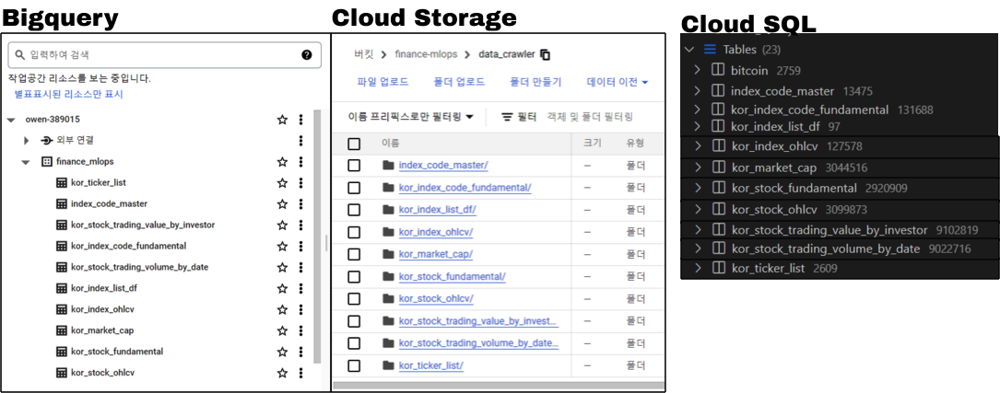

<center>
{width=80%}
</center>

이번에는 그동안 배웠던 것들을 응용 해보려고 한다. 그동안 GCP환경을 공부 하면서 Bigquery, Storage, SQL에 대해 배웠으니 우리는 이제 DB와 Storage라는 저장소의 개념에 대해 알게 되었다. 그리고 나서 Cron, Airflow, Google Cloud Function 중에 Cron과 Airflow를 배웠으며 이번에는 Airflow를 사용한 데이터 수집 파이프라인을 구축 하려고 한다. 그중에서도 또 오늘 진행할 내용은 국내 주식에 대한 내용을 자동화 할 예정이다. 앞으로 당분간 복잡해질 예정인데 그동안의 전반적인 개요를 정리해보자면 다음과 같다.

# 전반적인 개요

<div class="container">
  <div class="col-sm">
  {width=33%}
  <h2>Step 1</h2>
  - [1-1. GCP Compute Engine 구축](https://unfinishedgod.netlify.app/2023/06/10/gcp-gcp/) <br>
  - [1-2. Compute Engine 방화벽 및 MobaXterm 연결](https://unfinishedgod.netlify.app/2023/06/11/gcp-compute-engine-mobaxterm/) <br>
  </div>
  <div class="col-sm">
  {width=33%}
  <h2>Step 4</h2>
  - [4-1. Airflow 1. 설치](https://unfinishedgod.netlify.app/2023/07/18/airflow-airflow-1/) <br>
  - [4-2. Airflow 2. 기본 세팅(예제 제거, PostgreSQL 연결)](https://unfinishedgod.netlify.app/2023/07/20/airflow-airflow-2-dag/) <br>
  - [4-3. Airflow 3. Timezone 설정 및 DAG 테스트](https://unfinishedgod.netlify.app/2023/07/22/airflow-airflow-3-timezone-dag/) <br>
  
  </div>
  <div class="col-sm">
  {width=33%}
  <h2>Step 6</h2>
  
  파이썬을 사용한 대시보드 구축
  
  </div>
</div>

<center>
{width=100%}
</center>

<div class="container">
  <div class="col-sm">
  <h2>Step 2</h2>
  - [2-1. Pykrk를 사용한 금융데이터 수집 PART 1](https://unfinishedgod.netlify.app/2023/07/03/python-pykrk-part-1/) <br>
  - [2-2. Pykrk를 사용한 금융데이터 수집 PART 2](https://unfinishedgod.netlify.app/2023/07/09/python-pykrk-part-2/) <br>
  - [2-3. FinanceDataReader을 사용한 금융 데이터 수집 (S&P500, 비트코인)](https://unfinishedgod.netlify.app/2023/07/11/python-financedatareader-s-p500/) <br>
  - [2-4. PublicDataReader 라이브러리를 사용한 FRED 데이터 수집](https://unfinishedgod.netlify.app/2023/07/26/python-publicdatareader-fred/) <br>
  - [2-5. Chatgpt API 사용 및 네이버 뉴스 요약 응용](https://unfinishedgod.netlify.app/2023/07/14/python-chatgpt-api/) <br>
  {width=33%}
  </div>
  
  <div class="col-sm">
  <h2>Step 3</h2>
  - [3-1. ubuntu에 postgresql 설치 및 vscode 연결](https://unfinishedgod.netlify.app/2023/06/13/postgresql-ubuntu-postgresql/) <br>
  - [3-2. Cloud SQL DB 구축](https://unfinishedgod.netlify.app/2023/06/15/gcp-cloud-sql-db/) <br>
  - [3-3. BigQuery, Storage - Python 연동](https://unfinishedgod.netlify.app/2023/06/20/gcp-bigquery-storage-python/) <br>
  - [3-4 Cloud Storage를 통한 빅쿼리 테이블 생성](https://unfinishedgod.netlify.app/2023/05/20/cloud-storage/) <br>
  {width=33%}
  </div>
  <div class="col-sm">
  <h2>Step 5</h2>
  
  파이썬을 사용한 데이터 시각화
  
  {width=33%} 
  </div>
  </div>
</div>

## 1. Airflow pipeline 구축

그럼 이제부터 본격적으로 파이프라인을 구축 해보자. 참고해야할 사항이 있다면 위의 가이드에서 'Step 4' 부분을 참고 하면 된다. 우선 파이썬 파일을 하나 생성해주자. python_file이라는 폴더에 pykrx_cralwer.py 라는 파일을 생성 해주었다.

### 1-1. 라이브러리 호출

```python
#!/usr/bin/env python
# coding: utf-8

import pandas as pd
import pandas_gbq
from pykrx import stock
from pykrx import bond
import FinanceDataReader as fdr
from datetime import timedelta

from time import sleep

import psycopg2 as pg2
from sqlalchemy import create_engine

from datetime import datetime
import os
import time

import glob
from google.cloud import bigquery
from google.oauth2 import service_account
from google.cloud import storage
```

### 1-2. 기본 세팅(Bigquery, Cloud Storage, Cloud SQL)

이제 기본 세팅을 해주자. 파이썬에서 각각 Bigquery, Cloud Storage, Cloud SQL에 접근 하기 위한 장치 이다.

```python
# 경로 변경
os.chdir('/home/owenchoi07/finance_mlops')

# 서비스 계정 키 JSON 파일 경로
key_path = glob.glob("key_value/*.json")[0]

# Credentials 객체 생성
credentials = service_account.Credentials.from_service_account_file(key_path)

# 빅쿼리 정보
project_id = 'owen-389015'
dataset_id = 'finance_mlops'

# GCP 클라이언트 객체 생성
storage_client = storage.Client(credentials = credentials, 
                         project = credentials.project_id)
bucket_name = 'finance-mlops'    # 서비스 계정 생성한 bucket 이름 입력

# Postgresql 연결
db_connect_info = pd.read_csv('key_value/db_connect_info.csv')
username = db_connect_info['username'][0]
password = db_connect_info['password'][0]
host = db_connect_info['host'][0]
database = db_connect_info['database'][0]
engine = create_engine(f'postgresql+psycopg2://{username}:{password}@{host}:5432/{database}')
```

### 1-3. 업로드 함수 생성

그리고 나서 이번에는 업로드 함수를 만들어 주자. 다음의 코드는 각각 Bigquery, Cloud Storage, Cloud SQL에 우리가 수집한 데이터를 업로드 하기위한 함수이다. 이는 지난 블로그를 참고 하고 응용한 것이며 앞으로 일별로 수집한 객체는 다음의 함수로 한꺼번에 업로드 될 예정이다.

```python
def upload_df(data, file_name, project_id, dataset_id, time_line):
    if not os.path.exists(f'data_crawler/{file_name}'):
        os.makedirs(f'data_crawler/{file_name}')

    try:
        if not os.path.exists(f'data_crawler/{file_name}/{file_name}_{today_date1}.csv'):
            data.to_csv(f'data_crawler/{file_name}/{file_name}_{today_date1}.csv', index=False, mode='w')
        else:
            data.to_csv(f'data_crawler/{file_name}/{file_name}_{today_date1}.csv', index=False, mode='a', header=False)
        print(f'{file_name}_로컬CSV저장_success_{time_line}')    
    except:
        print(f'{file_name}_로컬CSV저장_fail_{time_line}')
    
    
    # Google Storage 적재
    source_file_name = f'data_crawler/{file_name}/{file_name}_{today_date1}.csv'    # GCP에 업로드할 파일 절대경로
    destination_blob_name = f'data_crawler/{file_name}/{file_name}_{today_date1}.csv'    # 업로드할 파일을 GCP에 저장할 때의 이름
    bucket = storage_client.bucket(bucket_name)
    blob = bucket.blob(destination_blob_name)
    blob.upload_from_filename(source_file_name)      
    
    try:
        # 빅쿼리 데이터 적재
        data.to_gbq(destination_table=f'{project_id}.{dataset_id}.{file_name}',
          project_id=project_id,
          if_exists='append',
          credentials=credentials)
        print(f'{file_name}_빅쿼리저장_success_{time_line}')    
    except:
        print(f'{file_name}_빅쿼리저장_fail_{time_line}')  
    
    
    try:
        # Postgresql 적재
        data.to_sql(f'{file_name}',if_exists='append', con=engine,  index=False)
        print(f'{file_name}_Postgresql저장_success_{time_line}')    
    except:
        print(f'{file_name}_Postgresql저장_fail_{time_line}')
```

### 1-4. 날짜 옵션

이번에는 날짜에 대한 세팅을 해주도록 하자. datetime.now()를 사용하여 오늘 날짜를 가져와야지 자동으로 데이터를 수집이 가능하다.

```python
now = datetime.now()

today_date1 = now.strftime('%Y%m%d')
today_date2 = now.strftime('%Y-%m-%d')
today_date_time_csv = now.strftime("%Y%m%d_%H%M")
```

## 2. 주가 데이터 수집

그럼 이제부터 그동안 수집했던 데이터 수집 코드를 만들어 보자. 

### 2-1. 티커 리스트

우선 국내 주식의 티커 리스트를 불러와서 저장 해주자. 한켠으로는 매일 수집을 하지 않아도 되는 양이지만, 상장 및 상폐 되는 데이터를 맞춰주기 위해서는 계속 수집을 해두어서 ticker를 최신화 해주자.

```python
## 티커 리스트
market_list = ['KOSPI', 'KOSDAQ']

kor_ticker_list_df = pd.DataFrame()
for market_nm in market_list:
    ticker_list = stock.get_market_ticker_list(today_date1, market=market_nm)
    for tickers in ticker_list:
        corp_name = stock.get_market_ticker_name(tickers)
        df = pd.DataFrame({'ticker':tickers,
                           'corp_name':corp_name,
                           'market': market_nm
                          }, index = [0])
        kor_ticker_list_df = pd.concat([kor_ticker_list_df,df])
kor_ticker_list_df = kor_ticker_list_df.reset_index(drop = True)

file_name = 'kor_ticker_list'
upload_df(kor_ticker_list_df, file_name, project_id, dataset_id, time_line)

kor_ticker_list = kor_ticker_list_df['ticker']
```

### 2-2. 주가정보

주가 정보를 수집 해주자. pykrx의 stock.get_market_ohlcv()함수를 사용 했다. 그리고 나서 today_date1를 통해 오늘 날짜의 데이터를 불러오고, 날짜 컬럼이 없기 때문에 today_date2로 날짜 컬럼을 추가 해주었다. 그리고 마지막으로 아까 만들어 두었던 upload_df()함수를 통해 Bigquery, Cloud Storage, Cloud SQL에 일괄적으로 업로드 해준다. 여기서 하나 알아두면 좋은것이 컬럼 명을 **영어**로 해둔것은 Bigquery에 적재할때 에러를 방지 하기 위함이다.

```python
# 주가 정보 
print('주가정보 시작')
df_raw = stock.get_market_ohlcv(today_date1,  market="ALL")
df_raw = df_raw.reset_index()
df_raw['날짜'] = today_date2
df_raw = df_raw[['날짜', '시가', '고가', '저가', '종가', '거래량', '거래대금', '등락률', '티커']]
df_raw.columns = ['date', 'open', 'high', 'low', 'close', 'volume', 'trading_value', 'price_change_percentage', 'ticker']

file_name = 'kor_stock_ohlcv_1'

now1 = datetime.now()
time_line = now1.strftime("%Y%m%d_%H:%M:%S")  

upload_df(df_raw, file_name, project_id, dataset_id, time_line)
print(f'주가정보 완료_{time_line}')
```

### 2-3. 시가총액

```python
print(f'시가총액 시작')
df_raw = stock.get_market_cap(today_date1,  market="ALL")
df_raw = df_raw.reset_index()
df_raw['날짜'] = today_date2
df_raw = df_raw[['날짜', '시가총액', '상장주식수', '티커']]
df_raw.columns = ['date', 'market_cap', 'outstanding_shares', 'ticker']


file_name = 'kor_market_cap_1'

now1 = datetime.now()
time_line = now1.strftime("%Y%m%d_%H:%M:%S")  

upload_df(df_raw, file_name, project_id, dataset_id, time_line)
print(f'시가총액 완료_{time_line}')
```

### 2-4. DIV/BPS/PER/EPS

다음은 DIV/BPS/PER/EPS이다. pykrx의 stock.get_market_fundamental()함수를 사용 했다. 방법은 위와 동일하다.

```python
# DIV/BPS/PER/EPS 조회
print(f'DIV/BPS/PER/EPS 시작')

df_raw = stock.get_market_fundamental(today_date1, market='ALL')
df_raw = df_raw.reset_index()
df_raw['날짜'] = today_date2
df_raw = df_raw[['날짜', 'BPS', 'PER','PBR', 'EPS', 'DIV', 'DPS', '티커']]
df_raw.columns = ['date', 'bps', 'per', 'pbr', 'eps', 'div', 'dps', 'ticker']  

file_name = 'kor_stock_fundamental_1'

now1 = datetime.now()
time_line = now1.strftime("%Y%m%d_%H:%M:%S")  

upload_df(df_raw, file_name, project_id, dataset_id, time_line)

print(f'DIV/BPS/PER/EPS 완료_{time_line}')
```

### 2-5. 일자별 거래실적 추이 (거래대금)

이번에는 일자별 거래실적 추이 (거래대금) 데이터를 수집해주자. 위의 다른 함수와 달리 stock.get_market_trading_value_by_date()는 시작날짜와 끝날짜가 동시에 있어야 하고, ticker를 불러와야 하기 때문에 이는 반복문을 사용해준다.

```python
# 일자별 거래실적 추이 (거래대금)
print(f'일자별 거래실적 추이 (거래대금) 시작')
file_name = 'kor_stock_trading_value_by_investor_1'
buy_sell_type_list = ['순매수', '매수', '매도']
df_raw_total = pd.DataFrame()
for buy_sell_type in buy_sell_type_list:
    for ticker_nm in kor_ticker_list:
        now1 = datetime.now()
        time_line = now1.strftime("%Y%m%d_%H:%M:%S")
        
        try:
            df_raw = stock.get_market_trading_value_by_date(today_date1, today_date1, 
                                                                             ticker_nm, 
                                                                             detail=True,
                                                                             on = buy_sell_type)
            df_raw = df_raw.reset_index()
            df_raw['ticker'] = ticker_nm
            df_raw['type'] = buy_sell_type
            df_raw.columns = [
                'date', 
                'financial_investment', 'insurance', 'investment', 'private_equity', 'bank','other_finance', 'pension_fund', # 기관합계 
                'other_corporation', # 기타 법인
                'individual',# 개인
                'foreigner', 'other_foreigner', # 외국인 합계
                'total', 
                'ticker', 'type'
            ]
            df_raw_total = pd.concat([df_raw_total,df_raw])
            print(f'{file_name}_{buy_sell_type}_{ticker_nm}_데이터수집_success_{time_line}')  
        except:
            print(f'{file_name}_{buy_sell_type}_{ticker_nm}_데이터수집_fail_{time_line}') 


now1 = datetime.now()
time_line = now1.strftime("%Y%m%d_%H:%M:%S")  

upload_df(df_raw_total, file_name, project_id, dataset_id, time_line)

print(f'일자별 거래실적 추이 (거래대금) 시작')
```

### 2-6. 일자별 거래실적 추이 (거래량)

일자별 거래실적 추이의 거래 대금과 동일하다.

```python
# 일자별 거래실적 추이 (거래량)
print(f'일자별 거래실적 추이 (거래량) 시작')
file_name = 'kor_stock_trading_volume_by_date_1'
buy_sell_type_list = ['순매수', '매수', '매도']
df_raw_total = pd.DataFrame()
for buy_sell_type in buy_sell_type_list:
    for ticker_nm in kor_ticker_list:
        now1 = datetime.now()
        time_line = now1.strftime("%Y%m%d_%H:%M:%S")
        
        try:
            df_raw = stock.get_market_trading_volume_by_date(today_date1, today_date1, 
                                                                             ticker_nm, 
                                                                             detail=True,
                                                                             on = buy_sell_type)
            df_raw = df_raw.reset_index()
            df_raw['ticker'] = ticker_nm
            df_raw['type'] = buy_sell_type
            df_raw.columns = [
                'date', 
                'financial_investment', 'insurance', 'investment', 'private_equity', 'bank','other_finance', 'pension_fund', # 기관합계 
                'other_corporation', # 기타 법인
                'individual',# 개인
                'foreigner', 'other_foreigner', # 외국인 합계
                'total', 
                'ticker', 'type'
            ]
            df_raw_total = pd.concat([df_raw_total,df_raw])
            print(f'{file_name}_{buy_sell_type}_{ticker_nm}_데이터수집_success_{time_line}')  
        except:
            print(f'{file_name}_{buy_sell_type}_{ticker_nm}_데이터수집_fail_{time_line}') 


now1 = datetime.now()
time_line = now1.strftime("%Y%m%d_%H:%M:%S")  

upload_df(df_raw_total, file_name, project_id, dataset_id, time_line)

print(f'일자별 거래실적 추이 (거래량) 완료_{time_line}')
```

### 2-7. 인덱스 정보

이제 주가 정보는 충분히 수집했으니 인덱스 정보를 수집 해주자. 

```python
# 인덱스 정보
print(f'인덱스 정보 시작')
kor_index_list_df = pd.DataFrame()
market_list = ['KOSPI', 'KOSDAQ'] 
 
for market_nm in market_list:
    kor_index_list = stock.get_index_ticker_list(market=market_nm)
    for index_codes in kor_index_list:

    
        index_name = stock.get_index_ticker_name(index_codes)
        df = pd.DataFrame({'index_code':index_codes,
                           'index_code_nm':index_name,
                           'market': market_nm
                          }, index = [0])
        kor_index_list_df = pd.concat([kor_index_list_df,df])
        
kor_index_list_df = kor_index_list_df.reset_index(drop = True)

file_name = 'kor_index_list_df_1'

now1 = datetime.now()
time_line = now1.strftime("%Y%m%d_%H:%M:%S")  

upload_df(kor_index_list_df, file_name, project_id, dataset_id, time_line)

print(f'인덱스 정보 시작')

kor_index_code_list  = kor_index_list_df['index_code']
```

### 2-8. 인덱스 OHLCV 조회

이번에는 인덱스 OHLCV를 수집한다.

```python
# 인덱스 OHLCV 조회
print(f'인덱스 OHLCV 시작')

file_name = 'kor_index_ohlcv_1'
df_raw_total = pd.DataFrame()

for index_code in kor_index_code_list:
    now1 = datetime.now()
    time_line = now1.strftime("%Y%m%d_%H:%M:%S")  
    try:
        df_raw = stock.get_index_ohlcv(today_date1, today_date1, index_code)
        df_raw = df_raw.reset_index()
        df_raw['index_code'] = index_code
        df_raw.columns = ['date', 'open', 'high', 'low', 'close', 'volume', 'trading_value', 'market_cap', 'index_code']
        df_raw_total = pd.concat([df_raw_total,df_raw])
        
        print(f'{file_name}_{index_code}_데이터수집_success_{time_line}')    
    except:
        print(f'{file_name}_{index_code}_데이터수집_fail')
        
now1 = datetime.now()
time_line = now1.strftime("%Y%m%d_%H:%M:%S")  

upload_df(df_raw_total, file_name, project_id, dataset_id, time_line)

print(f'인덱스 OHLCV 완료_{time_line}')
```

### 2-9. 인덱스 등락률 


```python
# 인덱스 등락률
print(f'인덱스 등락률 시작')
file_name = 'kor_index_code_fundamental_1'
df_raw_total = pd.DataFrame()

for index_code in kor_index_code_list:
    now1 = datetime.now()
    time_line = now1.strftime("%Y%m%d_%H:%M:%S")
    try:
        df_raw = stock.get_index_fundamental(today_date1, today_date1, index_code)
        df_raw = df_raw.reset_index()
        df_raw['index_code'] = index_code
        df_raw.columns = ['date', 'close', 'price_change_percentage', 'per', 'porward_per', 'pbr', 'dividend_yield', 'index_code']
        df_raw_total = pd.concat([df_raw_total,df_raw])
        print(f'{file_name}_{index_code}_데이터수집_success_{time_line}')    
    except:
        print(f'{file_name}_{index_code}_데이터수집_fail')


now1 = datetime.now()
time_line = now1.strftime("%Y%m%d_%H:%M:%S")  

upload_df(df_raw_total, file_name, project_id, dataset_id, time_line)

print(f'인덱스 등락률 완료_{time_line}')
```

### 2-10. 인덱스 구성 종목

이번에는 인덱스 구성 종목 데이터이다.

```python
# 인덱스 구성 종목
print(f'인덱스 구성 종목 시작')

index_code_info = pd.DataFrame()
for index_code in kor_index_code_list:
    pdf = stock.get_index_portfolio_deposit_file(str(index_code))
    df = pd.DataFrame({'ticker':pdf,
                       'index_code': str(index_code)})
    index_code_info = pd.concat([index_code_info, df])
index_code_info = index_code_info.reset_index(drop = True)


index_code_info_2  = pd.merge(index_code_info, kor_index_list_df,
        how = 'left',
        on = 'index_code')
        

# kor_ticker_list_df = pd.read_csv(f'data_crawler/kor_ticker_list.csv')

index_code_master  = pd.merge(index_code_info_2, kor_ticker_list_df[['ticker','corp_name']],
        how = 'left',
        on = 'ticker')
        
file_name = 'index_code_master_1'


now1 = datetime.now()
time_line = now1.strftime("%Y%m%d_%H:%M:%S")  

upload_df(index_code_master, file_name, project_id, dataset_id, time_line)

print(f'인덱스 구성 종목 완료_{time_line}')
```

## 최종 코드

최종 코드는 다음의 git 링크를 참고 하자.

- [finance_mlops/python_file/pykrx_crawler.py](https://github.com/Unfinishedgod/finance_mlops/blob/main/python_file/pykrx_crawler.py)

## 3. Airflow DAG 

이렇게 python_file 경로에 pykrx_crawler.py를 잘 생성 했으면 이제 Airflow DAG를 추가 하자. 그리고 이를 평일 18시 1분에 시작하도록 설정 해주었다. 추가로 t1이라는 DAG는 앞으로 t2, t3으로 파이프라인이 추가될 예정이다.

```python
from datetime import datetime, timedelta
from airflow import DAG
from airflow.operators.bash_operator import BashOperator
from datetime import timedelta
from airflow import DAG
from airflow.operators.bash import BashOperator
from airflow.utils.dates import days_ago

import pendulum
## 로컬 타임존 생성
local_tz = pendulum.timezone("Asia/Seoul")

python_dir = '/home/owenchoi07/anaconda3/bin/python3'
file_dir = '/home/owenchoi07/finance_mlops'

default_args = {
	'owner': 'airflow',
	'start_date': datetime(2023, 7, 11, tzinfo=local_tz),
	'retries': 0,
	'catchup': False
}

with DAG(
	'kor_stock',
	default_args=default_args,
	description='kor stock crawler',
	schedule_interval = '01 18 * * MON-FRI',
	tags=['kor stock'],
) as dag:


    t1 = BashOperator(
        task_id='kor_stock_crawler',
        bash_command = f'{python_dir} {file_dir}/python_file/pykrx_crawler.py'
    )

    t1
```

### 최종 결과

이렇게 해두면 최종 결과는 다음과 같이 데이터가 수집이 되게 된다.

<center>
{width=100%}
</center>


# 총평

이렇게 pykrx를 사용한 데이터 수집부터 Airflow 의 데이터 수집 파이프라인의 가장 첫 단계를 마무리 했다. 코드가 길어지는건 선호하지는 않지만, 이번에는 한꺼번에 내용을 담아야 하기에 어쩔수 없이 길게 작성 되었다.

