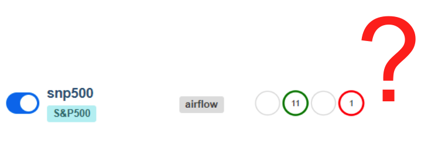
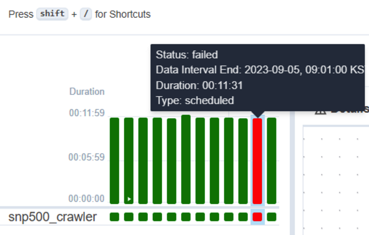
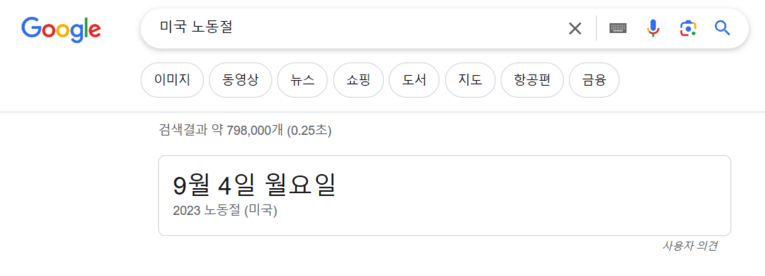

{width=60%}

Airflow로 데이터 수집 파이프라인을 만들고, 데이터는 성공적으로 수집이 되고 있었다. 그런데 웬걸. 어느날 갑자기 Airflow를 열어 보니 미국 S&P 500 수집에 빨간불이 켜진것 아닌가. 에러가 났다는 건데 날짜를 보니 9월 5일(한국 시간)의 데이터가 수집이 안되었다. 

{width=60%}

## 이유가 무엇일까?

그래서 찾아보니 미국에서 9월에 첫 번째 월요일은 노동절이라고 하더라. 한국으로 치면 근로자의 날. 그래서 S&P500 데이터 수집이 가능하지 않았던 것이었다.

{width=50%}

그래서 이번에는 에러를 대응 하는 방법에 대해 한번 알아 보려고 한다. 물론 파이프라인이 에러 없이 계속 성공적으로 작동하면 더할나위 없이 좋겠지만, 현실에서는 무수히 예측 불가능한 에러를 맞닥뜨리게 된다. 

그렇다고 이를 확인하기 위해 매일 아침마다 Airflow에 접속 해서 데이터가 성공적으로 수집되었는지 확인하는 **시간적 손해**도 보아서는 안되다. 

**그렇다면 어떻게 Airflow의 에러를 빠르게 확인할 수 있을까?**

이에 대한 대응 방법중 Email 전송에 대해 한번 알아보자.

## Airflow Email 보내기

SMTP(Simple Mail Transfer Protocol)

