

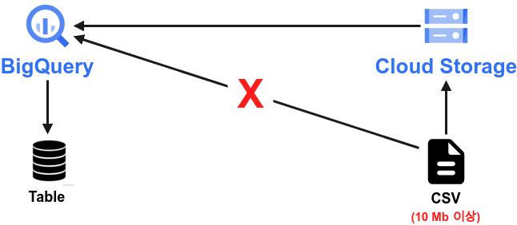{width=80%}

최근부터 Bigquery를 공부 하기 시작했다. '구글 빅쿼리 완벽 가이드' 라는 책을 필사 하면서 공부중인데, 빅쿼리에서 테이블 생성시 직접 업로드 하여 생성하는데 10MB 제한이 있어 Cloud storage에 업로드 하여 테이블을 생성하라는 내용이 부족하여 이번에 추가 해보려 한다. 방법은 간단하다 Cloud Storage에서 버킷을 생성하고 데이터를 
업로드 하여, Bigquery에서 Cloud Storage를 통해 테이블만 생성하면 된다. 그림을 통해 하나씩 알아보도록 하자. 우선, 프로젝트를 통일 실켜주자. GCP에서는 프로젝트 별로 세팅이 가능한데, 이번 Bigquery와 Cloud Storage는 모두 프로젝트를 bigquery-study 로 통일 시켜 주었다.

# Cloud Storage Bucket 생성 

다음의 Google Cloud화면에서 Cloud storage 버튼을 클릭해서 넘어가도록 하자. 

- https://console.cloud.google.com/

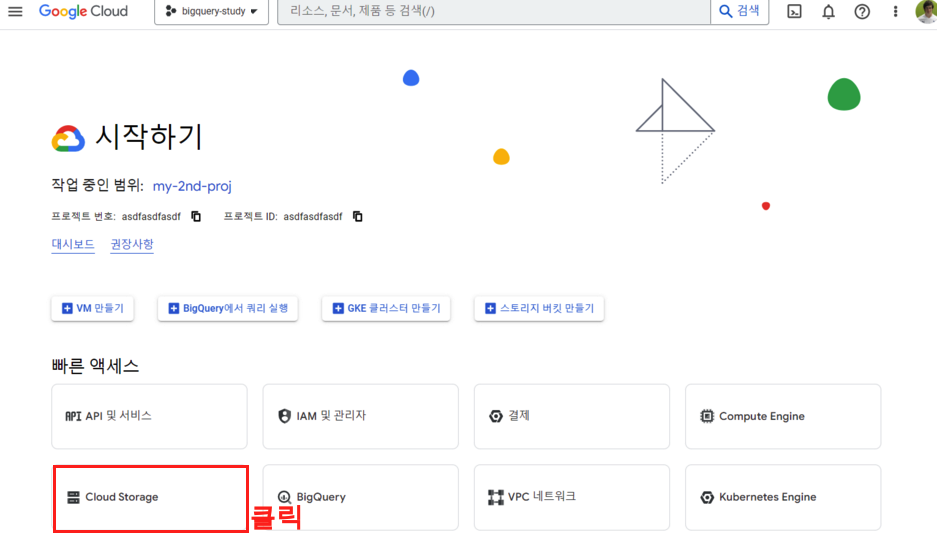{width=80%}

### Step 1. 버킷 생성

이제 Cloud Storage에서 Bucket을 생성해주자. 상단의 만들기 버튼을 클릭 해주자.

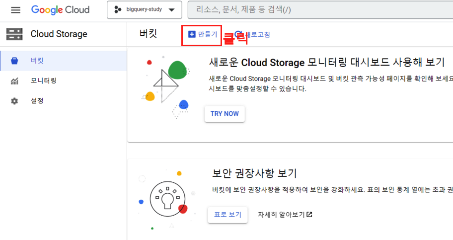{width=80%}

### Step 2. 

버킷의 이름을 지어주고 저장 위치를 선택 해주자. 버킷이름은 Cloud_storage_bucket 이라고 지어 주었다.

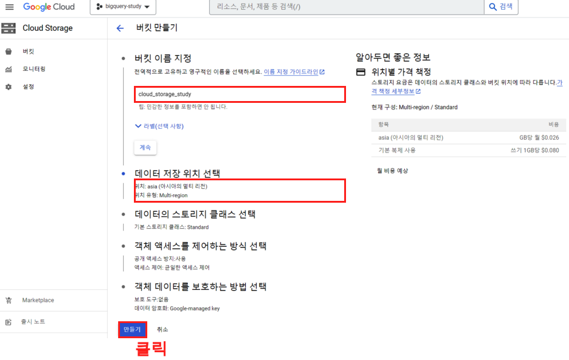{width=80%}

### Step 3. 

다음의 옵션을 확인해주자. '이 버킷에 공개 액세스 방지 적용'옵션을 적용했고, 확인 버튼을 클릭해주었다.

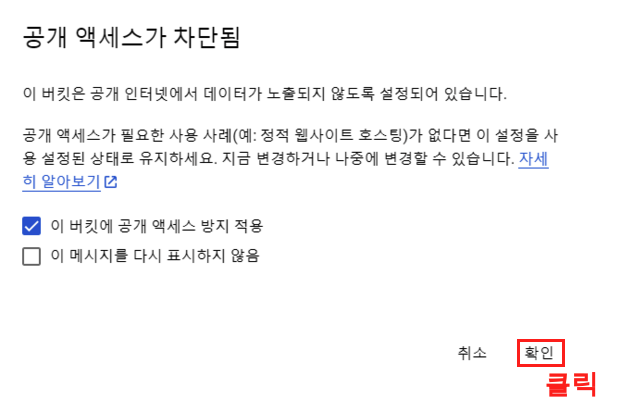{width=60%}

### Step 4. 

cloud_storage_study라는 버킷이 생성된 모습이다. 이제 파일 업로드 버튼을 클릭하여 iris.csv 파일을 업로드 해주려고 한다.

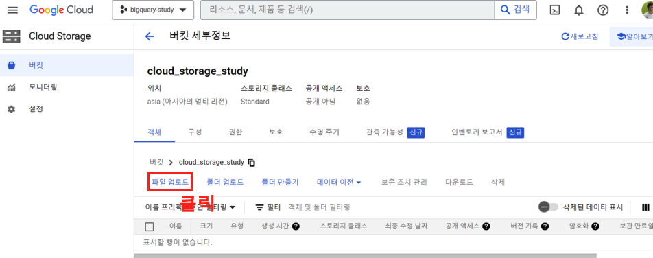{width=80%}

### Step 5. 

이렇게 iris.csv 가 cloud_storage_study에 잘 업로드 되었다. 이제 빅쿼리로 넘어가 보자.

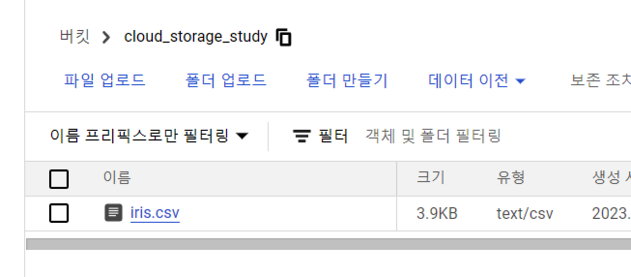{width=80%}

# BigQuery를 통한 테이블 생성

BigQuery로 넘어가서 테이블을 생성해보자. Google Cloud에서 BigQuery로 넘어 가도 되고 다음의 링크를 클릭해도 된다. 프로젝트명은 항상 통일 시켜야 한므로, Cloud Storage와 같은지 다시 한번 확인해보자. 

- https://console.cloud.google.com/bigquery

### Step 1. 

빅쿼리에 들어가게 되면 나의 프로젝트명과 함께 프로젝트명 우측에 옵션 버튼이 존재한다. 옵션 버튼을 클릭하여 데이터 세트 만들기 버튼을 클릭해주자.

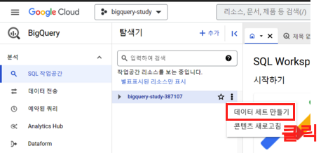{width=80%}

### Step 2. 

우선 데이터 세트를 만들어 보자. 빅쿼리의 기본적인 구조는 다음과 같다. 

- (프로젝트 ID).(데이터 세트).(테이블)

우리의 프로젝트 ID는 bigquery-study이고, 데이터 세트는 study로 생성 해주었다. 지역은 ara-northeast3(서울) 로 설정 해주어 데이터세트 만들기 버튼을 클릭해주자.

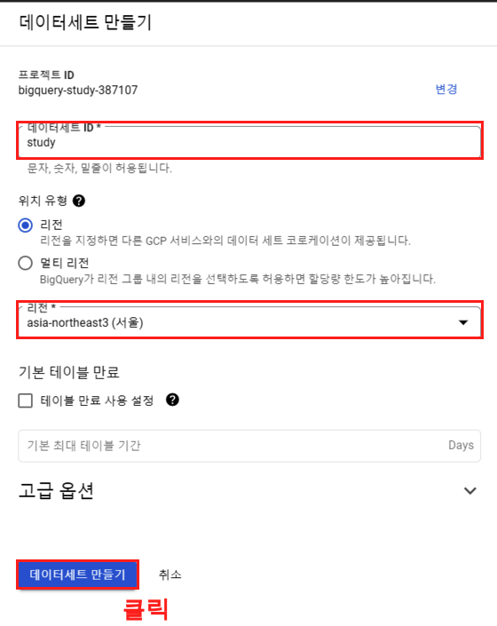{width=80%}

### Step 3. 

성공적으로 데이터 세트가 생성 되면 다음과 같이 데이터 세트 정보를 확인할 수 있다. 이제 우측 상단에 테이블 만들기 버튼을 클릭해주도록 하자.

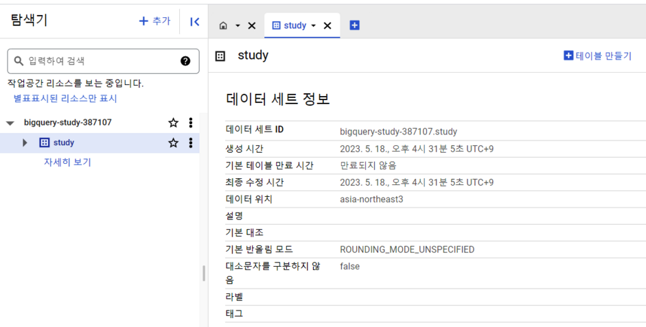{width=80%}

### Step 4. 

이제 테이블을 생성 해주자. 다음의 옵션을 하나 하나 보면서 따라가 주면 된다.

1. 테이블을 만들 소스: 여러가지가 있다. 이중에서 우리는 Google Cloud Storage 를 선택 해준다. 
2. GCS(Google cloud Storage)에서 찾을 버킥을 선택한다. 찾아보기 버튼을 클릭하여 버켓과 파일을 선택해준다.
3. 프로젝트를 선택해준다. 꼭 빅쿼리와, Cloud Storage는 통일 시켜주어야 한다.
4. 테이블 이름이다. iris_sample 라는 테이블로 생성 해준다.
5. 스키마는 자동으로 선택 해준다. GCS에서 자동으로 생성해준다. 
  - 물론 한계는 있다.

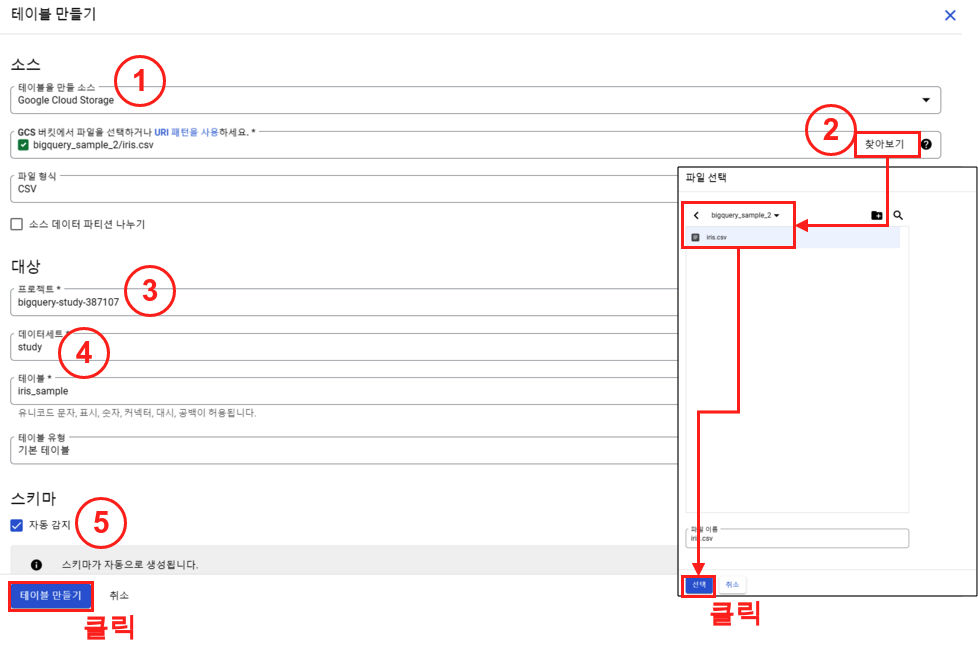{width=100%}

# BigQuery 테이블 확인

### Step 1.

성공적으로 테이블이 생성되었으면 다음과 같이 확인이 가능하다.

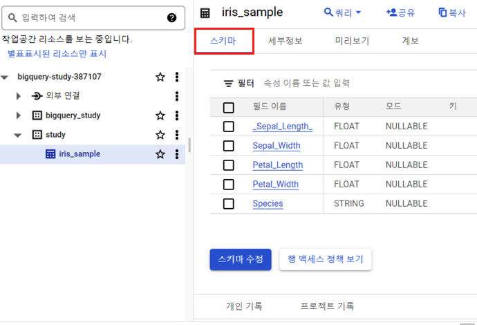{width=80%}

### Step 2. 

세부정보는 다음과 같다.

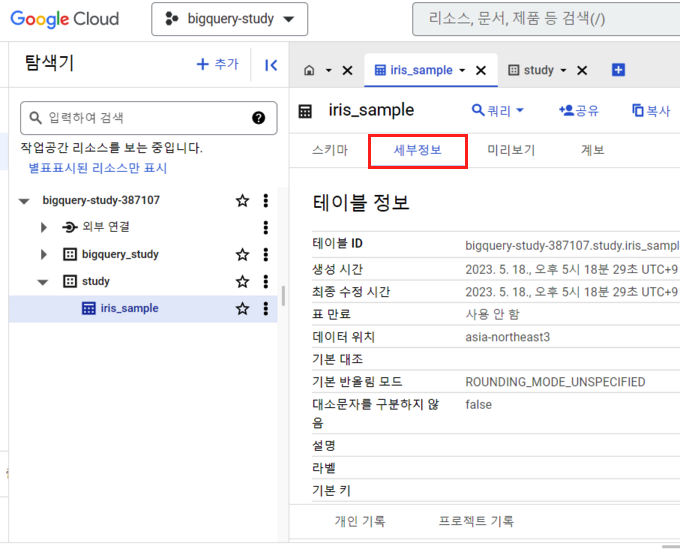{width=80%}

### Step 3. 

마지막으로 쿼리를 통해 확인해보자. 빅쿼리에서 쿼리를 실행 할때는 (프로젝트 ID).(데이터 세트).(테이블) 순서로 선택 해주어야 한다.

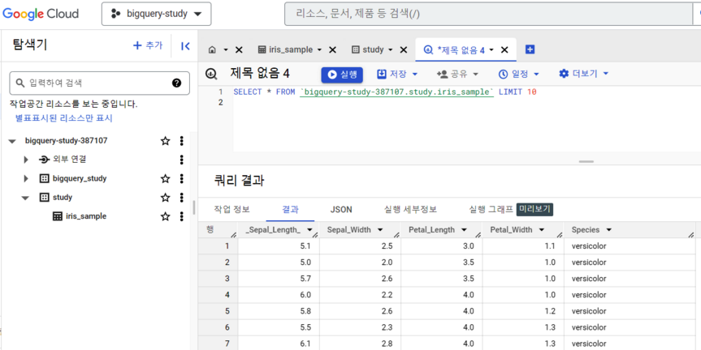{width=80%}

# 총평

BigQuery 에서 테이블을 생성 하는 방법은 여러가지가 있다. 파이썬 스크립트를 통해 생성할 수도 있고, AWS S3에서 가져와서도 생성이 가능하다. 또한 직접 csv로 도 테이블이 생성이 가능하다. 이번 포스팅은 직접 csv를 통해 테이블을 생성시 10MB 제한이 있기에 이에 대한 해결 방안중 GCS를 통해 우회 하여 테이블 생성하는 방법에 대해 공부하고자 만들었다.

# Reference
- [Google Cloud 공식문서: 빅쿼리](https://cloud.google.com/bigquery/docs/batch-loading-data?hl=ko#limitations-local-files)
- [구글 빅쿼리 완벽 가이드](https://www.aladin.co.kr/shop/wproduct.aspx?ItemId=256496408)
- [노범환: BigQuery A-Z: 1. 대시보드에서 사용하기](https://robomoan.medium.com/bigquery-a-z-1-%EB%8C%80%EC%8B%9C%EB%B3%B4%EB%93%9C%EC%97%90%EC%84%9C-%EC%82%AC%EC%9A%A9%ED%95%98%EA%B8%B0-a0f22736fdba)

