<center>
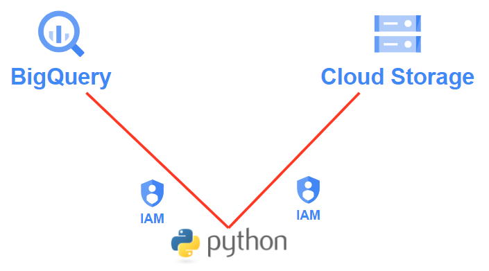{width=80%}
</center>

이번에는 BigQuery와 Cloud Storage에 Python을 연동 해보려고 한다. 그동안 BigQuery관련한 블로그와 그리고 Storage를 통해서 BigQuery 테이블을 생성 하는 글을 적었었다. 이번에는 Python와 각각 연동을 하는 과정에 대한 글을 남겨보려 한다. 그렇게 되어 후에는 Google cloud Function을 사용하여 이 3가지를 적절히 사용하기 위함이다. 오늘의 블로그 과정중에서 BigQuery와 Cloud Storage 관련한 내용이 있으니 다음을 참고 하면 된다.

- [BigQuery와 Storage](https://unfinishedgod.netlify.app/2023/05/20/cloud-storage/)

그럼 하나씩 알아보자. 

# 1. IAM 계정 및 권한 생성

우선 BigQuery와 Storage를 Python에 연결하기 위해서는 연결을 위한 키가 필요하다. IAM(Identity and Access Management)라고 하는데, GCP의 여러 서비스에 접근 하기 위한 일종의 권한을 부여 하는 개념이다. 이 권한을 부여 받아 BigQuery, Storage말고도 GCP의 다른 서비스를 사용할 수 있다. 자세한건 다음의 공식 문서를 확인해보자. 

- [IAM 개요](https://cloud.google.com/iam/docs/overview?hl=ko)

## 1-1. IAM 계정 생성

### Step 1. 

왼쪽 메뉴의 IAM 및 관리자 버튼을 클릭해주자.

<center>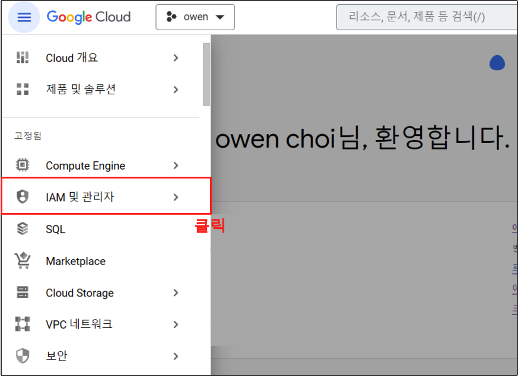{width=80%}</center>

### Step 2.

IAM 및 관리자 페이지로 넘어 가게 되는데 여기서 '서비스 계정' > '서비스 계정 만들기' 버튼을 클릭해 주자. IAM 권한을 위한 서비스 계정을 만들기 위함이다.

<center>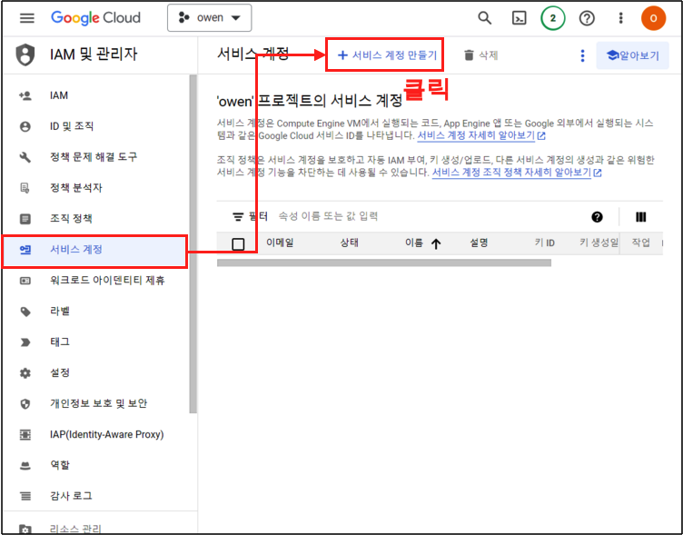{width=80%}</center>

### Step 3.

서비스 계정의 이름과, 서비스 계정 설명을 입력해주고 '만들고 계속하기' 버튼 클릭

<center>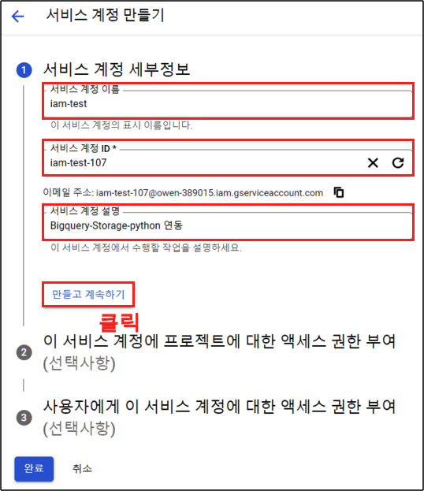{width=50%}</center>

## 1-2. 역할 부여

이번에는 역할을 부여 해주도록 하자. 

### Step 1.

역할 부분을 클릭해주자.

<center>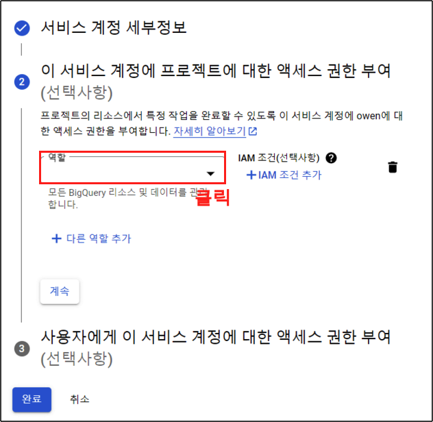{width=50%}</center>

### Step 2.

우선 BigQuery의 권한을 부여 한다. BigQuery > BigQuery 관리자 버튼을 클릭해주자. 여기서 BigQuery에서도 여러가지의 권한이 존재 한다. 뷰어, 소유자, 편집자, 관리자 등등. 각각의 권한에 대한 설명은 다음의 공식문서를 참고 하면 된다.

- [BigQuery 사전 정의된 IAM 역할](https://cloud.google.com/bigquery/docs/access-control?hl=ko#bigquery)

<center>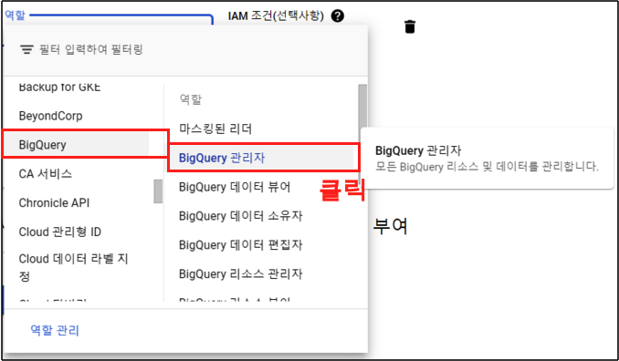{width=80%}</center>

### Step 3. 

이제 Storage의 역할을 추가 해주자. '다른 역할 추가' 버튼 클릭

<center>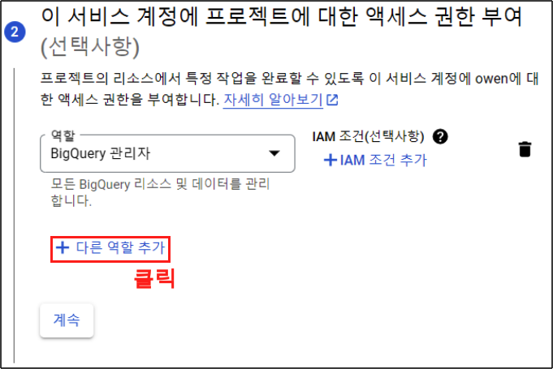{width=80%}</center>

### Step 4. 

Cloud Storage의 역할이다. 여기서는 cloud Storage > 저장소 관리자 버튼을 클릭한다. 역시 각각의 자세한 권한은 다음의 공식문서를 참고 한다.

<center>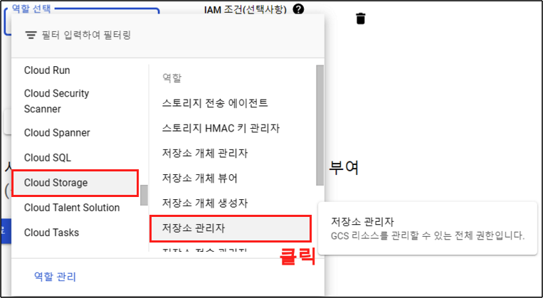{width=80%}</center>

- [Cloud Storage에 대한 IAM 역할](https://cloud.google.com/storage/docs/access-control/iam-roles?hl=ko)

### Step 5. 

역할을 부여 했으니 완료 버튼을 클릭하여 넘어가주자.

<center>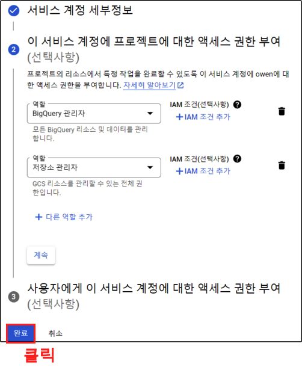{width=50%}</center>

### Step 6.

역할을 생성 했으면 이제 키를 생성해보자. 생성된 역할 이메일을 클릭한다.

<center>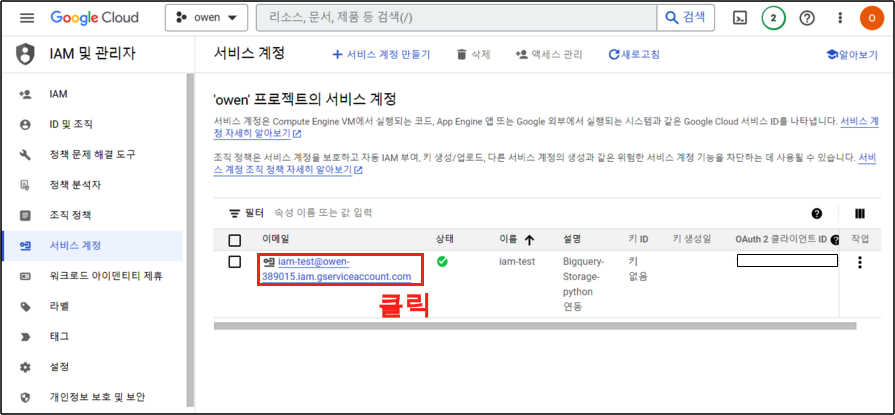{width=100%}</center>

## 1-3. 키 생성

### Step 1.

키를 생성해보자. 키 탭 > 키 추가 > 새 키 만들기 버튼을 차례대로 클릭해주자.

<center>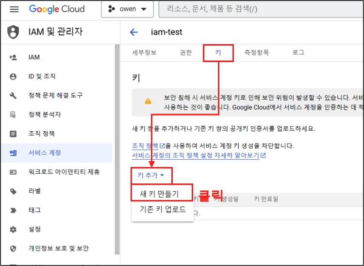{width=80%}</center>

### Step 2. 

비공개 키 만들기 화면이 나오게 된다. JSON 파일을 받아서 저장할 예정이니 만들기 버튼을 클릭하고 넘어가자.

<center>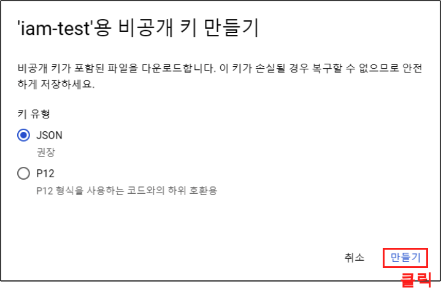{width=50%}</center>

### Step 3.

비공개 키가 다운로드 된다. 이는 절대 노출시키면 안되니 잘 저장 해주어야 한다. 이렇게 GCP에서 BigQuery와 Storage에 대한 권한에 대한 부분을 마무리 했다. 이제는 파이썬으로 넘어가서 이를 테스트 해보자.

<center>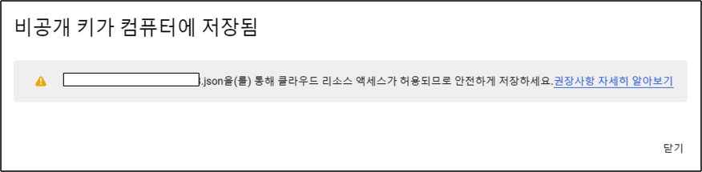{width=80%}</center>

# 2. 파이썬 연동

파이썬 파트로 넘어가보자. 

## 2-1. 파이썬 준비

### Step 1. 

주피터를 실행하고, 다음과 같이 준비 하자. 그리고 iam-test.ipynb 라는 주피터 파일을 실행 해보자.

- 주피터파일 : 파이썬 테스트용
- iris.csv   : Storage에 업로드/다운로드용
- 비공개 키  : BigQuery, Storage권한 연결용

<center>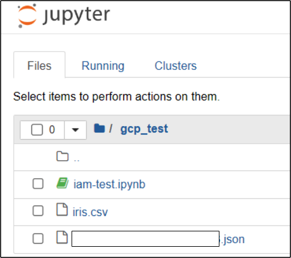{width=50%}</center>

### Step 2.

우선 python 패키지가 필요하다. 다음의 커맨드를 통해 Bigquery, Storage에 연동할 수 있는 패키지를 설치해주자.

```
$ pip3 install google-cloud-bigquery
$ pip3 install google-cloud-storage
```

## 2-2 파이썬

### 라이브러리

이제 파이썬을 통해 Bigquery와 Storage에 각각 연동 해보자. 우선 다음의 모듈을 불러오는 것으로 시작한다.
 
```
import glob
from google.cloud import bigquery
from google.oauth2 import service_account
from google.cloud import storage
```

### GCP - 파이썬 기본 세팅

json파일을 지정된 우리의 경로에 넣어 주었으면 glob 함수를 사용해서 key_path에 지정 해준다. 물론, json파일 자체를 넣어 줘도 되지만 이는 보안을 위해 가려준 것이다. 그리고 나서 이 key_path 객체를 통해 `service_account.Credentials.from_service_account_file()` 함수를 사용하여 credentials 객체를 생성해준다.

```
# 서비스 계정 키 JSON 파일 경로
key_path = glob.glob("*.json")[0]

# Credentials 객체 생성
credentials = service_account.Credentials.from_service_account_file(key_path)
```

### BigQuery 연동

이제 본격적으로 BigQuery에 연동을 해주자.  bigquery.Client()에 위의 정보를 넣어 주고 BigQuery에 연동할 준비를 해준다.

```
# BigQuery 클라이언트 객체 생성
client = bigquery.Client(credentials = credentials, 
                         project = credentials.project_id)
```

이제 쿼리를 날려 BigQuery의 테이블을 불러오자. 쿼리는 BigQuery에 저장되었던 iris 테이블을 불러 오도록 해주었다. BigQuery 테이블 생성이 되어 있지 않다면, 다음을 참고 하여 테이블을 생성해주자.

- [BigQuery와 Storage](https://unfinishedgod.netlify.app/2023/05/20/cloud-storage/)

```
# 데이터 조회 쿼리
sql = f"""
SELECT * 
FROM
  `프로젝트이름.데이터셋이름.테이블명`
"""

# 데이터 조회 쿼리 실행 결과
query_job = client.query(sql)
```

쿼리를 불러 왔으면 이제 파이썬에서 볼수 있도록 데이터프레임으로 변환 시켜 주자. iris 테이블이 나오면 성공이다.

```
# 데이터프레임 변환
df = query_job.to_dataframe()
df.head()
```
<center>
| Sepal_Length | Sepal_Width | Petal_Length | Petal_Width |    Species |
|---------------:|------------:|-------------:|------------:|-----------:|
|            5.1 |         2.5 |          3.0 |         1.1 | versicolor |
|            5.0 |         2.0 |          3.5 |         1.0 | versicolor |
|            5.7 |         2.6 |          3.5 |         1.0 | versicolor |
|            6.0 |         2.2 |          4.0 |         1.0 | versicolor |
|            5.8 |         2.6 |          4.0 |         1.2 | versicolor |
</center>

### Cloud Storage 연동

#### 업로드

이번에는 Cloud Storage 연동을 해보자. 우선 업로드 부터 해보자.

```
# storage 클라이언트 객체 생성
storage_client = storage.Client(credentials = credentials, 
                         project = credentials.project_id)
```

이제 Storage의 Bucket와 업로드할 파일명, 업로드 했을때 저장될 파일 이름을 넣어 준다.

```
bucket_name = 'owen-bucket-test'  #  Bucket 이름  
source_file_name = 'iris.csv'    # 업로드할 파일 이름
destination_blob_name = 'iris_upload.csv'    # Bucket에 저장될 파일 이름
```

이제 다음의 코드를 넣어 준다. 다음의 코드는 Bucket을 연결 하고, Bucket에 upload_from_filename() 메서드를 사용하여 업로드 하는 코드이다.

```
bucket = storage_client.bucket(bucket_name) # Bucket에 접속
blob = bucket.blob(destination_blob_name)   # 저장될 파일 이름 설정
blob.upload_from_filename(source_file_name) # 업로드할 파일 업로드
```

성공적으로 업로드 되었으면 Bucket에서 확인 해보자. 우리는 iris.csv 파일을 iris_upload.csv 로 업로드 했으니 iris_upload.csv가 올라가면 성공이다.

<center>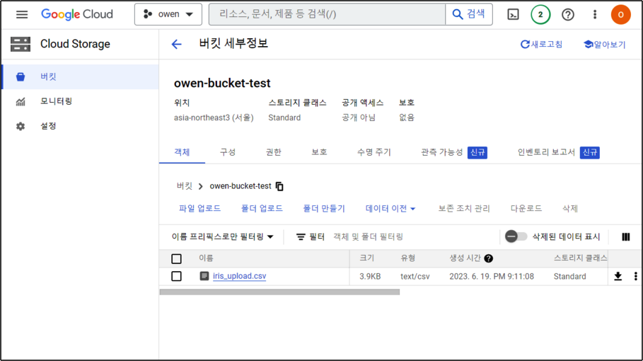{width=100%}</center>

#### 다운로드

이번에는 다운로드를 해보자. 업로드 했던것과 매우 비슷하다. Bucket명, Bucket에 저장되어 있는 파일이름, 다운받고 저장할 이름을 각각 넣어 주자.

```
bucket_name = 'owen-bucket-test'  #  Bucket 이름  
source_blob_name = 'iris_upload.csv'    # Bucket에 저장되어 있는 파일 이름
destination_file_name = 'iris_download.csv'    # 파일을 저장할 경로 
```

이제 다운을 받아보자. 

```
bucket = storage_client.bucket(bucket_name) # Bucket 접속
blob = bucket.blob(source_blob_name) # 저장되어 있는 파일 연결
blob.download_to_filename(destination_file_name) # 파일 다운로드
```
 
잘 다운이 받아졌으면 우리의 경로에서 iris_download.csv파일이 있는지 확인해보자.

<center>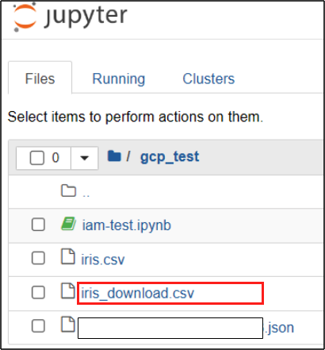{width=50%}</center>

# 총평

이번에는 BigQuery와, Storage와 파이썬으로 연동을 진행 했다. 이는 앞으로 GCP상에서 데이터 수집 및 정제와 모델링을 하고 이를 자동화 하여 하나의 서비스를 만들어 보는 프로젝트를 진행 하고 있는데 이에 대한 기반을 블로그로 다지는 과정이다. 


---

# Reference
- [cloud storage 파이썬 연동](https://soundprovider.tistory.com/entry/GCP-Python%EC%97%90%EC%84%9C-GCP-Cloud-Storage-%EC%97%B0%EB%8F%99%ED%95%98%EA%B8%B0)
- [BigQuery 파이썬 연동](https://wooiljeong.github.io/python/python-bigquery/)