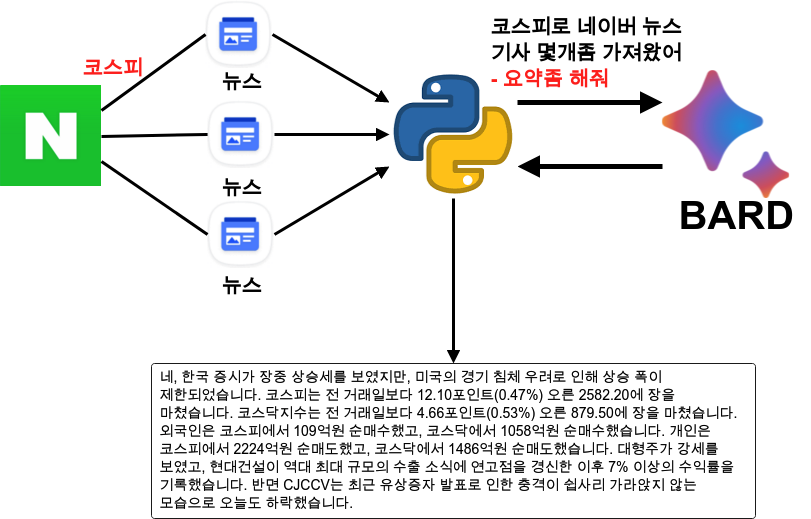

<center>{width=100%}</center>

지난번에 파이썬과 Google BARD API를 사용하는 방법에 대해 알아 보았다. 이번에는 이를 한번 응용 해보려고 한다. 어떻게 사용을 하면 좋을지 고민 하던 차에 네이버에서 실시간 검색한 뉴스 몇개를 가져와서 BARD에게 요약을 부탁하는 내용이 좋겠다 싶어서 가져 오게 되었다. 현재 GCP에서 여러 작업을 하고 있는 도중에 이러한 작업은 앞으로 금융 데이터 수집 및 해당 주가의 그날의 뉴스 정보를 요약 하는 내용으로 보고서 형태로 만들 예정이다. 파이썬으로 네이버 크롤링 하는 부분은 너무나도 많고, 간단하게나마 설명하기도 복잡하기 때문에 크롤링에 대한 설명은 남기지 않는다. 파이썬을 사용한 크롤링은 충분히 많이 있기때문에 참고 하면 된다. 이 블로그는 BARD API 사용하는 블로그와 이어져 있기 때문에 다음의 블로그를 참고 하고 오는것이 필수이다.

- [Google BARD API 사용](https://unfinishedgod.netlify.app/2023/06/23/python-google-bard-api/)


그럼 파이썬 코드를 작성 해주자. 다음의 모듈을 불러준다.

```
import requests
from bs4 import BeautifulSoup as bs
import pandas as pd
import bardapi
import os
```

이제 Google bard api 키를 입력 해준다.

```
os.environ['_BARD_API_KEY'] = 'apikey'
```

## 함수 생성

그러면 함수를 만들어 보자. 이 함수의 기능은 다음과 같다.

1. 검색어를 통한 네이버 뉴스 리스트 생성
2. 생성된 네이버 뉴스의 기사 통합
3. 통합된 뉴스 기사를 BARD를 통한 요약

```
def get_news_bard(key_word):
    
    # 1. 검색 url을 통해 뉴스의 리스트를 읽어 오는 코드
    url = f'https://search.naver.com/search.naver?where=news&sm=tab_jum&query={key_word}'

    headers = {"User-Agent": "Mozilla/5.0 (Windows NT 6.3; WOW64) AppleWebKit/537.36 (KHTML, like Gecko) Chrome/44.0.2403.157 Safari/537.36"}
    res = requests.get(url, headers= headers)
    soup = bs(res.text, 'html.parser')
    news_list = soup.find_all('div', attrs={'class':'info_group'})
    
    # 각각 뉴스의 리스트에서 링크를 타고 들어간 후 각각의 뉴스 내용을 합치는 코드
    news_url_list = [] # 네이버 뉴스 url 리스트
    new_article_list= [] # 네이버 뉴스 기사 통합 리스트
    for i in range(5): # 최대 5개 정도만 추출
        news_article = news_list[i].find_all("a", attrs={"class":"info"})
        if len(news_article) > 1:
            news_nm_url = news_article[1].get('href')
            news_url_list.append(news_nm_url)
            res = requests.get(news_nm_url, headers=headers)
            soup = bs(res.text, 'lxml')
            news_article_nm = soup.find_all('div', attrs = {'class': 'newsct_article _article_body'})
            news_article_text = news_article_nm[0].get_text()
            new_article_list.append(news_article_text)
            
    # BARD에 들어갈 최종 뉴스기사
    total_article = '_'.join(new_article_list)    
    
    # 뉴스기사와 함께 요약문 
    input_text_2 = ' 요약 좀 해줘'
    
    question = f'{total_article} {input_text_2}'
    response = bardapi.core.Bard().get_answer(question)
    
    return response['content']
```

이렇게 함수를 하용하게되면 다음과 같은 결과를 얻을 수 있다. 2023년 6월 26일 저녁 11시 45분쯤 사용한 함수이다. 


```
key_word = '코스피'
get_news_bard(key_word)
```

```
네, 한국 증시가 장중 상승세를 보였지만, 미국의 경기 침체 우려로 인해 상승 폭이 제한되었습니다. 코스피는 전 거래일보다 12.10포인트(0.47%) 오른 2582.20에 장을 마쳤습니다. 코스닥지수는 전 거래일보다 4.66포인트(0.53%) 오른 879.50에 장을 마쳤습니다. 외국인은 코스피에서 109억원 순매수했고, 코스닥에서 1058억원 순매수했습니다. 개인은 코스피에서 2224억원 순매도했고, 코스닥에서 1486억원 순매도했습니다. 대형주가 강세를 보였고, 현대건설이 역대 최대 규모의 수출 소식에 연고점을 경신한 이후 7% 이상의 수익률을 기록했습니다. 반면 CJCCV는 최근 유상증자 발표로 인한 충격이 쉽사리 가라앉지 않는 모습으로 오늘도 하락했습니다.
```

# 총평

지난번 Python을 사용한 BARD API연동 글을 사용하면서 앞으로 어떻게 사용해야 할까? 에 대한 글을 남겼었다. 그 이후로 생각을 해본 결과 BARD를 통해 현재 뉴스의 정보를 요약하는 과정을 남겨보았다. GCP도 공부하고 있고, 금융 데이터 파이프라인을 만들고 있으니 앞으로 이제 이는 응용해서 아침 7,8시에 주식 시장 응용을 해볼수 있기 때문에 사용해보려 한다.


