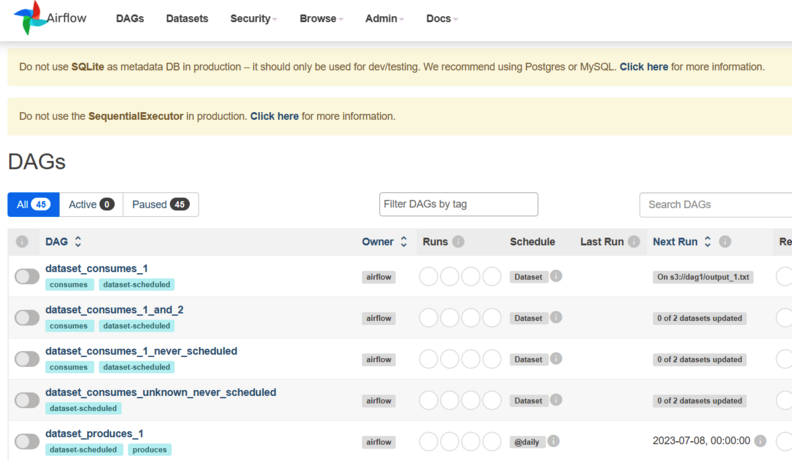

<center>
{width=80%}
</center>

이번에는 Airflow 에 대해 한번 알아보려고 한다. GCP를 통해 데이터 수집 및 ETL 파이프라인을 만들고 있는데, Cron 과 Airflow도 같이 해두면 좋겠다는 생각이 들었다. 그래서 이번에는 GCP의 Compute Engine에서 Airflow 설치 부터 하나씩 진행을 해보려 한다. **현재 이렇게 가능한 이유는, GCP의 3개월 무료 크레딧 덕분이다.** 추가로 GCP에서도 Airflow를 서비스 하는데 이는 Google Cloud Composer이다. Coogle Cloud Composer도 역시 추후에 작성 하려고 한다. 그러면 이제 Airflow에 대해 간단히 알아보자.

## Airflow란?

Airflow는 데이터 파이프라인 관리를 위한 강력한 도구로, 작업 흐름을 조직화하고 스케쥴링할 수 있는 오픈소스 플랫폼이다. Airflow를 사용하면 데이터 작업 흐름을 시각적으로 관리할 수 있으며, 작업 간의 종속성과 실행 시간을 정의하여 효율적으로 실행할 수 있다. 또한, 다양한 플러그인을 통해 Airflow의 기능을 확장할 수 있으며, 모니터링 및 경고 기능을 통해 작업 상태를 실시간으로 파악할 수 있다.

쉽게 말하자면 Cron기능을 탑재한 유저입장에서 매우 편리한 여러가지 서비스(모니터링, 경고 기능 등등)를 제공하는 오픈 소스 작업 관리 도구 이다. 이 외에도 Airflow에 대한 자세한 내용을 알고 싶으면 맨 하단 Refence에 있는 블로그를 참고 하면 설명이 자세하게 되어 있다. 이번 블로그는 Airflow 설치에만 초점을 맞추었다.

그러면 이제 Airflow설치를 진행 해보자. GCP Compute Engine의 의 운영체제는 Ubuntu로 가정한다. 

### 8080 Port 개방 

Airflow를 사용하기 위해서는 기본적으로 8080 포트를 열어야 한다. 마침 지난번에 GCP에서 8888포트를 개방 하는 글을 적었는데, 이를 응용해서 다음을 참고하면 된다.

- [GCP 포트 개방 하는 방법](https://unfinishedgod.netlify.app/2023/06/11/gcp-compute-engine-mobaxterm/#%EC%A3%BC%ED%94%BC%ED%84%B0-%ED%8F%AC%ED%8A%B88888-%EA%B0%9C%EB%B0%A9)

### 가상 환경 설정 (선택 사항)

가상 환경은 권장 사항이지만, 이미 가상 환경을 사용하고 있다면 이 단계를 건너뛸 수 있다. 가상 환경을 사용하는 것은 프로젝트 별로 의존성을 분리하여 충돌을 방지하고, 관리를 용이하게 할 수 있는 장점이 있다. **우리는 건너 뛰도록 하자.**

## Airflow 설치

이제 본격적으로 Airflow를 설치 해보자. Airflow 설치는 공식 사이트의 Quick Start를 참고 했다. ([Airflow-Quick Start](https://airflow.apache.org/docs/apache-airflow/stable/start.html))

### 1. Airflow home 설정 (옵션)

Airlfow의 홈 디렉터리를 설정 해주는 과정이다. 다음의 커맨드를 입력하고 Airflow를 설치시 airflow라는 폴더가 생기게 된다.

```bash
export AIRFLOW_HOME=~/airflow
```

### 2. Airflow 설치

Airflow를 설치 하는 과정이다. 각각의 커맨드를 하나씩 복사해서 커맨드 입력을 해주면 된다. 2023-07-19 기준으로 공식사이트의 Quick Start에서 사용된 버전은 2.6.3이다. 이 값과, 현재의 파이썬 버전을 같이 넣어서 버전에 맞게 친절하게 가이드가 주어졌다.

```bash
AIRFLOW_VERSION=2.6.3

# Extract the version of Python you have installed. If you're currently using Python 3.11 you may want to set this manually as noted above, Python 3.11 is not yet supported.
PYTHON_VERSION="$(python --version | cut -d " " -f 2 | cut -d "." -f 1-2)"

CONSTRAINT_URL="https://raw.githubusercontent.com/apache/airflow/constraints-${AIRFLOW_VERSION}/constraints-${PYTHON_VERSION}.txt"
# For example this would install 2.6.3 with python 3.7: https://raw.githubusercontent.com/apache/airflow/constraints-2.6.3/constraints-3.7.txt

pip3 install "apache-airflow==${AIRFLOW_VERSION}" --constraint "${CONSTRAINT_URL}"
```

### 3. DB init

설치가 완료 되었으면 이제 DB를 초기화 해주는 작업을 진행해보자. 기본적으로 SQLite가 지원되지만 이는 나중에 Postgresql 또는 MySQL로 변경을 추천한다. 실제로 설치 하고 화면에 다음과 같은 문구를 볼 수 있다. 이를 변경하는 작업은 다음에 진행하도록 한다.

<center>
```
Do not use SQLite as metadata DB in production – it should only be used for dev/testing. We recommend using Postgres or MySQL. Click here for more information.
```
</center>

### 4. User 등록

이제 User를 등록 해준다. 왠만하면 그대로 복사하지말고 하나씩 본인의 정보를 입력해주자.

```
airflow users create \
    --username admin \
    --firstname Peter \
    --lastname Parker \
    --role Admin \
    --email spiderman@superhero.org
```

### 5. 실행

설치도 했고 DB도 초기화 시켰고, user도 등록 했으니 이제 실행을 해보자. 공식사이트에서 나온것과 다르게 이번에는 nohup , & 를 같이 사용하여 백그라운드에서 실행하도록 했다. (**이는 GCP의 3개월간의 무료 크레딧 덕분이다. 이제부터 본격적으로 서버를 24시간 가동할 예정이다. 물론, 추후에 Cloud Function을 소개 하면서 최종적으로는 Serverless로 넘어갈 예정이다.**) 

다음의 커맨드를 통해 Airflow를 실행 시킨다. Airflow의 웹서버를 담당한다. 

```bash
nohup airflow webserver --port 8080 &
```

그리고 다음의 커맨드를 통해 DAG를 스케쥴링한다.

```bash
nohup airflow scheduler &
```

### 6. 성공 화면

이렇게 하게 되면 이제 GCP Compute Engine의 ip 와 8080포트를 같이 입력해주어 접속 하면 airflow 화면이 나오게 된다. 물론 local 환경에서는 127.0.0.1:8080으로 접속 해도 된다.

- (GCP Compute Engine):8080
- localhost:8080
- 127.0.0.1:8080

<center>
{width=80%}
</center>

# 총평
 
원래 Airflow 설치와 기본 세팅 까지 한꺼번에 적으려 했었다. 생각보다 Airflow설명 하는 과정과 절차가 조금 있어서 다음에 Airflow 세팅에 대한 내용을 적고 빠르게 DAG 하는 글을 적어야 겠다. 

---

# Reference 
 - [Airflow-Quick Start](https://airflow.apache.org/docs/apache-airflow/stable/start.html)
 - [Apache Airflow - Workflow 관리 도구(1)](https://zzsza.github.io/data/2018/01/04/airflow-1/)
 - [https://magpienote.tistory.com/192](https://magpienote.tistory.com/192)