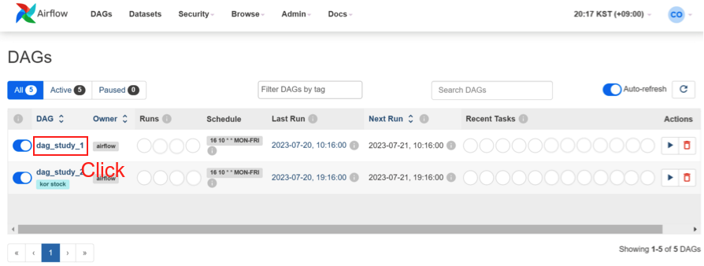
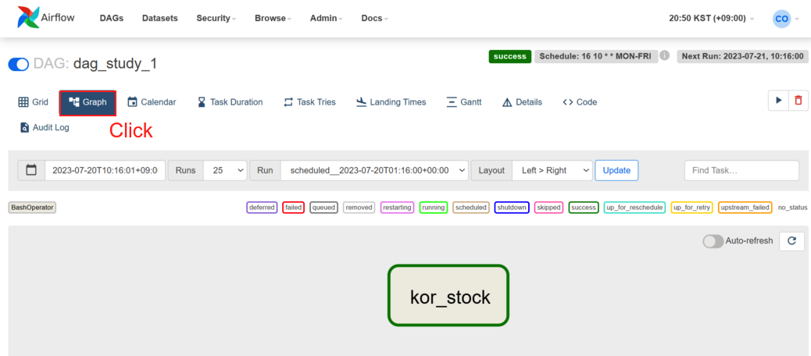
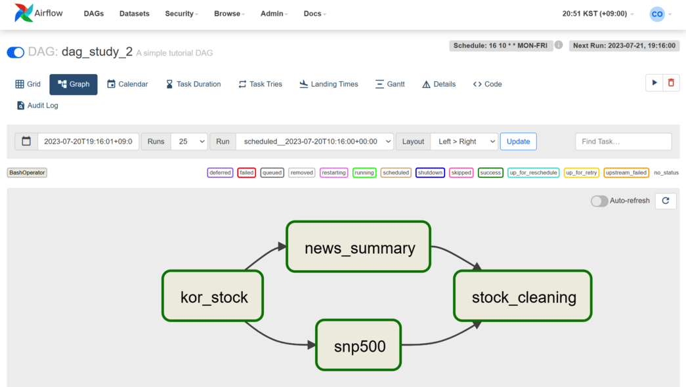

<center>
{width=80%}
</center>

그동안 Airflow 블로그를 하면서 설치 및 Postgresql 연결 하는 과정을 적었다. 이제 드디어 DAG 설정과 Timezone를 설정 해보도록 하자. 우선 Timezone부터 하나씩 설정 해보자.

## Timezone 설정 1 

`airflow/` 에서 `airflow.cfg` 파일을 열어 보자. 이곳에서 timezone 옵션을 UTC에서 'Asia/Seoul'로 변경 해주면 된다. 총 2개가 있는데 첫번째는 대략 25번 Line에 있다.

```bash
# Default timezone in case supplied date times are naive
# can be utc (default), system, or any IANA timezone string (e.g. Europe/Amsterdam)
# default_timezone = utc
default_timezone = Asia/Seoul
```

또 하나는 638번 Line에 있다.

```bash
# Default timezone to display all dates in the UI, can be UTC, system, or
# any IANA timezone string (e.g. Europe/Amsterdam). If left empty the
# default value of core/default_timezone will be used
# Example: default_ui_timezone = America/New_York
# default_ui_timezone = UTC
default_ui_timezone = Asia/Seoul
```

이렇게 Timezone 의 첫번째 설정을 마무리 했다. 그리고 추가로 DAG에서 timezone 옵션을 추가 해보자.

## DAG

DAG(Directed Acyclic Graph)는 Airflow에서 워크플로우를 정의하는 방법중 하나이다. 우리는 DAG 파일을 생성 하고 이를 통해 Cron 작업을 하는것이라고 생각하면 된다. 빠르게 알아보자. 추가로 DAG에 대한 내용은 생각보다 깊다. 자세한 내용은 다음의 블로그들을 참고 한다.

 - [Airlfow 공식문서 - DAG](https://airflow.apache.org/docs/apache-airflow/stable/core-concepts/dags.html)
 - [Airflow 기본 개념 - DAG와 Operator](https://leeyh0216.github.io/posts/airflow_concept_dag_operator/)
 - [DAG에 대해 알아보고 만들어보기 #1](https://velog.io/@hyunwoozz/airflow-DAG%EB%9E%80-%EB%AC%B4%EC%97%87%EC%9D%B8%EA%B0%80)
 
 
### DAG TEST 1


우선 `airflow` 폴더에 `dags` 폴더를 생성한다. 그리고 그곳에 `dag_study_1.py` 라고 넣어 주도록 하자. `dag_study_1.py`는 우리가 실행해야할 다른 스크립트들의 일종에 cron 역할을 하게 된다.

하단에 task_id kor_stock이며 여기서 우리가 눈여겨 볼 코드는 다음과 같다. 

 - `local_tz = pendulum.timezone("Asia/Seoul")`
  - pendulum 라이브러리를 통해 실행 시간을 Asia/Seoul 로 변경 한다.
 - `schedule_interval = '16 10 * * MON-FRI'`
  - 월~금 오전 10시 16분에 실행하게 한다. 


```python
from datetime import datetime, timedelta
from airflow import DAG
from airflow.operators.bash_operator import BashOperator
from datetime import timedelta
from airflow import DAG
from airflow.operators.bash import BashOperator
from airflow.utils.dates import days_ago
import pendulum
## 로컬 타임존 생성
local_tz = pendulum.timezone("Asia/Seoul")

default_args = {
	'owner': 'airflow',
	'start_date': datetime(2023, 7, 11, tzinfo=local_tz),
	'retries': 0,
	'catchup': False
}

dag = DAG(
    'dag_study_1',
    default_args=default_args,
    # schedule_interval=timedelta(hours=1)  # 1시간마다 실행되도록 설정
    schedule_interval = '16 10 * * MON-FRI'
)


execute_script = BashOperator(
    task_id='kor_stock',
    bash_command = '{실행할 커맨드} {실행할 파일}',
    dag=dag
)

# DAG의 태스크 의존성을 설정합니다.
execute_script
```


### DAG TEST 2

위의 DAG TEST 1은 하나의 실행이었다면 이번에는, 여러개의 실행을 도와주는 DAG를 만들어 보도록 하자. 우선 `airflow` 폴더에 `dags` 폴더를 생성한다. 그리고 그곳에 `dag_study_2.py` 라고 넣어 주도록 하자. `dag_study_2.py`는 우리가 실행해야할 다른 스크립트들의 일종에 cron 역할을 하게 된다.

여기서 task를 총 4개 (t1, t2, t3, t4)를 만들었느데, 각각 다음을 실행하게 세팅 해두었다.

 - t1: task_id='kor_stock'
 - t2: task_id='news_summary'
 - t3: task_id='snp500'
 - t4: task_id='stock_cleaning'
 
그리고 나서 맨 마지막에 `t1 >> [t2, t3] >> t4` 를 해두었는데, 이는 다음을 의미한다.

 - step 1. t1이 실행 되고 종료 된다.
 - step 2. t2,t3이 동시에 병렬적으로 실행 되고 종료 된다.
  - 병렬적으로 실행이 가능한 이유는 지난 블로그에서 LocalExecutor를 설정 해둔 덕분이다. 
 - step 3. t4가 실행되고 종료 된다. 


```python
from datetime import datetime, timedelta
from airflow import DAG
from airflow.operators.bash_operator import BashOperator
from datetime import timedelta
from airflow import DAG
from airflow.operators.bash import BashOperator
from airflow.utils.dates import days_ago


## 로컬 타임존 생성
local_tz = pendulum.timezone("Asia/Seoul")

default_args = {
	'owner': 'airflow',
	'start_date': datetime(2023, 7, 11, tzinfo=local_tz),
	'retries': 0,
	'catchup': False
}


with DAG(
	'dag_study_2',
	default_args=default_args,
	description='A simple tutorial DAG',
	schedule_interval = '16 10 * * MON-FRI',
	start_date=days_ago(2),
	# 'start_date': datetime(2023, 7, 11),
	tags=['kor stock'],
) as dag:

    t1 = BashOperator(
        task_id='kor_stock',
        bash_command = '{실행할 커맨드} {실행할 파일}'
    )

    t2 = BashOperator(
        task_id='news_summary',
        depends_on_past=False,
        bash_command = '{실행할 커맨드} {실행할 파일}',
        retries=3,
    )
    
    t3 = BashOperator(
        task_id='snp500',
        depends_on_past=False,
        bash_command = '{실행할 커맨드} {실행할 파일}',
        retries=3,
    )

    t4 = BashOperator(
        task_id='stock_cleaning',
        depends_on_past=False,
        bash_command = '{실행할 커맨드} {실행할 파일}',
        retries=3,
    )
    
    t1 >> [t2, t3] >> t4

```

## Airflow 에서 확인

이제 Airflow에서 확인을 해보자. 우선 Airflow 메인화면에 접속 한다. 그럼 다음과 같이 두개의 DAG가 추가 된 것을 확인할 수 있다. 그러면 이제 Task 하나만 클릭해보자.

<center>
{width=80%}
</center>

### DAG TEST 1의 화면

클릭을 하고 나면 이제 해당 DAG로 넘어가게 되는데 여기서 Graph 넘어 가게 된다. 다음은 DAG TEST 1의 그래프 이다.

<center>
{width=80%}
</center>

### DAG TEST 2의 화면

같은 방법으로 DAG TEST 2의 화면을 보면 우리의 DAG가 어떻게 구성 되어 있는지 확인할 수 있다. t2, t3이 성공적으로 병렬 처리 되어 있는 것을 확인할 수 있다.

<center>
{width=80%}
</center>

## 총평

이러헥 Airflow 시리즈 3까지 도달하게 되었다. 앞으로는 이를 가지고 응용할 예정이며 더 깊이 내용을 공유할 일이 있으면 나중에 추가로 블로그를 작성하도록 하려고 한다. 이제 그동안 테스트로 수집했던 주식 데이터를 이곳 Airflow 하나씩 추가 하고 전처리 코드를 추가 하는 내용을 담으면 될것 같다.