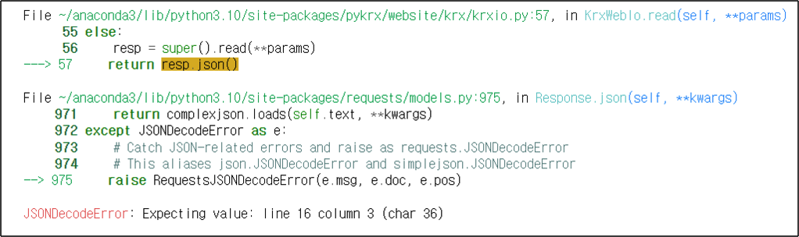
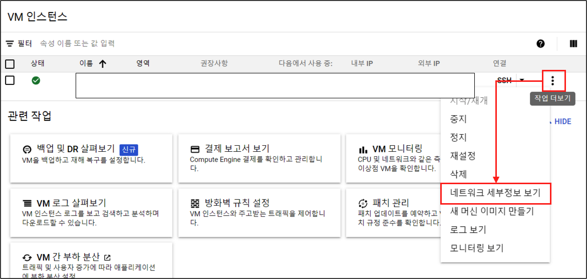
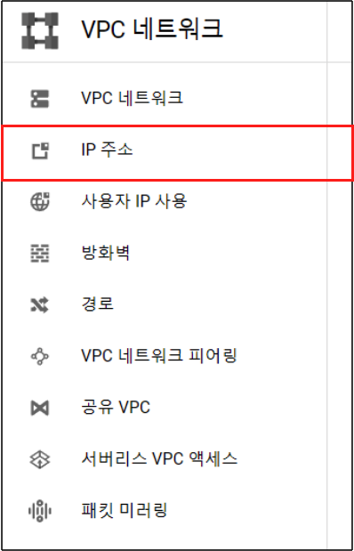
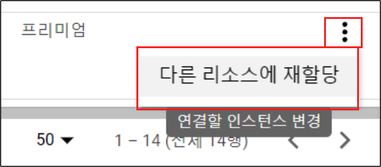
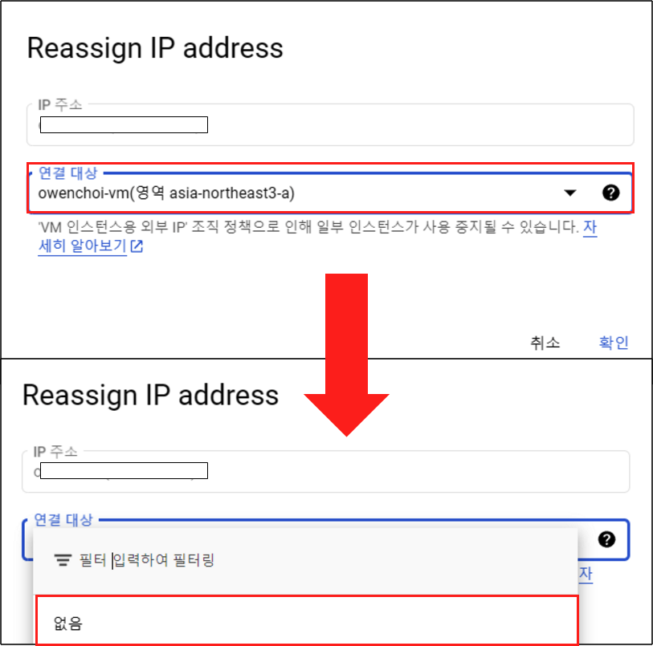

{width=80%}

최근에 pykrx 관련 블로그를 쓰고 데이터를 수집하다가 오늘 갑자기 다음과 같은 에러를 마주 하게 되었다.

{width=80%}

원인을 찾아보니 KRX에서 내 GCP Compute Engine의 IP를 차단 했기 때문이었다. 앞으로 주가 데이터의 데이터 수집 파이프라인 관련 글을 쓸 예정이다 보니 이 부분에 대해서는 더더욱 조심해야만 했다. 이를 해결하기 위해서는 KRX측에 문의 하거나 또는 40일 가량 후에 자동적으로 IP 차단이 해제 된다고 한다. 그러나 나 뿐만 아니라 대부분의 인내심이 부족한 사람에게는 그러한 여유가 없을 수 있다. 이번에는 그에 따른 다른 해결 방법을 가져오게 되었다.

**결코 무분별한 KRX 접근을 하라는 이야기가 아닙니다.**

# GCP 고정 IP 변경

지난번에 GCP 서버를 구축하면서 변경 되는 IP를 고정 시키는 글을 작성 했었다. 이번에는 고정 IP를 해제 하고 새로 갱신하여 다시 고정 하는 과정에 대한 내용을 담아 보려고 한다.

### Step 1. 

우선 서버를 **가동** 한 후에 서버의 우측 메뉴 버튼에 '네트워크 세부정보 보기' 버튼을 클릭한다.

{width=80%}

### Step 2. 

그리고 나서 VPC 네트워크 대시보드가 보이면 왼쪽의 IP 주소 버튼을 클릭하여 넘어가자.

{width=50%}

### Step 3. 

그러면 우리의 IP 리스트들이 보이게 된다. 여기서 해당 고정 IP의 메뉴버튼을 클릭하고 '다른 리소스에 재할당' 버튼을 클릭한다.

{width=40%}

### Step 4.

그러면 Reassign IP address 창이 나오게 되는데 여기서 '연결 대상' 부분에서 없음을 해주면 **고정 IP**가 해제 된다.

{width=60%}

### Step 5. 

이후에 서버를 다시 껐다가 키면 임의의 외부 IP가 재생성 되는데 이때 다시 고정 IP로 승급 시켜 주면 끝. 고정 IP 생성은 지난 블로그를 참고 한다.

- [GCP - 고정 IP 생성](https://unfinishedgod.netlify.app/2023/06/11/gcp-compute-engine-mobaxterm/#%EA%B3%A0%EC%A0%95-ip-%EC%83%9D%EC%84%B1)

---

다시 한번 말하지만 Pykrx의 라이브러리에서도 무분별한 데이터 호출을 하지 말라고 적어 두었다. 이번에 IP가 막히면서 아주아주 조심히 데이터를 수집해야 함을 다시 한번 깨닫는다.

감사합니다. KRX. 아주 조심히 다룰게요.

{width=80%}

