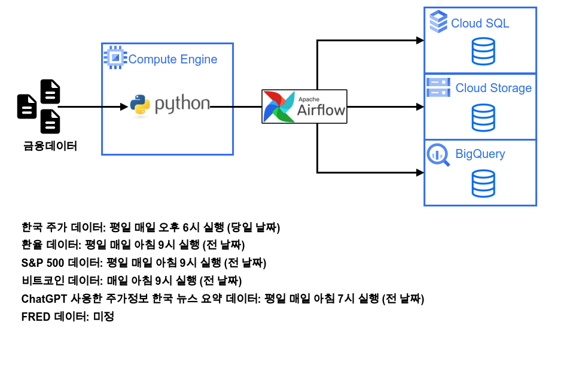
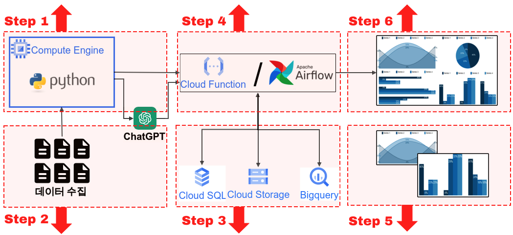

<center>
{width=80%}
</center>

지난번에 이어 이번에는 S&P 500 데이터 파이프라인을 구성 해보자. 앞으로 이러한 반복 작업이 진행 될 예정이다. 우리가 수집하려는 데이터에 따라 수집되는 시기와 전처리하는 방식디 다 다르기 때문에 이렇게 쪼개서 작업을 진행할 예정.


# 전반적인 개요
 
GCP와 파이썬을 사용한 주식 데이터 파이프라인에 대한 전반적인 개요는 다음과 같다.

<div class="container">
  <div class="col-sm">
  {width=33%}
  <h2>Step 1</h2>
  - [1-1. GCP Compute Engine 구축](https://unfinishedgod.netlify.app/2023/06/10/gcp-gcp/) <br>
  - [1-2. Compute Engine 방화벽 및 MobaXterm 연결](https://unfinishedgod.netlify.app/2023/06/11/gcp-compute-engine-mobaxterm/) <br>
  </div>
  <div class="col-sm">
  {width=33%}
  <h2>Step 4</h2>
  - [4-1. Airflow 1. 설치](https://unfinishedgod.netlify.app/2023/07/18/airflow-airflow-1/) <br>
  - [4-2. Airflow 2. 기본 세팅(예제 제거, PostgreSQL 연결)](https://unfinishedgod.netlify.app/2023/07/20/airflow-airflow-2-dag/) <br>
  - [4-3. Airflow 3. Timezone 설정 및 DAG 테스트](https://unfinishedgod.netlify.app/2023/07/22/airflow-airflow-3-timezone-dag/) <br>
  - [4-4. 주가 데이터 수집 파이프라인 1 (국내주식편)](https://unfinishedgod.netlify.app/2023/07/29/airflow-1/)
  - [4-5. 주가 데이터 수집 파이프라인 2 (S&P 500 편)](https://unfinishedgod.netlify.app/2023/08/04/airflow-2-s-p500/)
  </div>
  <div class="col-sm">
  {width=33%}
  <h2>Step 6</h2>
  
  파이썬을 사용한 대시보드 구축
  
  </div>
</div>

<center>
{width=100%}
</center>

<div class="container">
  <div class="col-sm">
  <h2>Step 2</h2>
  - [2-1. Pykrk를 사용한 금융데이터 수집 PART 1](https://unfinishedgod.netlify.app/2023/07/03/python-pykrk-part-1/) <br>
  - [2-2. Pykrk를 사용한 금융데이터 수집 PART 2](https://unfinishedgod.netlify.app/2023/07/09/python-pykrk-part-2/) <br>
  - [2-3. FinanceDataReader을 사용한 금융 데이터 수집 (S&P500, 비트코인)](https://unfinishedgod.netlify.app/2023/07/11/python-financedatareader-s-p500/) <br>
  - [2-4. PublicDataReader 라이브러리를 사용한 FRED 데이터 수집](https://unfinishedgod.netlify.app/2023/07/26/python-publicdatareader-fred/) <br>
  - [2-5. Chatgpt API 사용 및 네이버 뉴스 요약 응용](https://unfinishedgod.netlify.app/2023/07/14/python-chatgpt-api/) <br>
  {width=33%}
  </div>
  
  <div class="col-sm">
  <h2>Step 3</h2>
  - [3-1. ubuntu에 postgresql 설치 및 vscode 연결](https://unfinishedgod.netlify.app/2023/06/13/postgresql-ubuntu-postgresql/) <br>
  - [3-2. Cloud SQL DB 구축](https://unfinishedgod.netlify.app/2023/06/15/gcp-cloud-sql-db/) <br>
  - [3-3. BigQuery, Storage - Python 연동](https://unfinishedgod.netlify.app/2023/06/20/gcp-bigquery-storage-python/) <br>
  - [3-4 Cloud Storage를 통한 빅쿼리 테이블 생성](https://unfinishedgod.netlify.app/2023/05/20/cloud-storage/) <br>
  {width=33%}
  </div>
  <div class="col-sm">
  <h2>Step 5</h2>
  
  파이썬을 사용한 데이터 시각화
  
  {width=33%} 
  </div>
  </div>
</div>

## 1. Airflow pipeline 구축

그럼 이제부터 본격적으로 파이프라인을 구축 해보자. 참고해야할 사항이 있다면 위의 가이드에서 'Step 4' 부분을 참고 하면 된다. 우선 파이썬 파일을 하나 생성해주자. python_file이라는 폴더에 snp500_cralwer.py 라는 파일을 생성 해주었다.

### 1-1. 라이브러리 호출

```python
#!/usr/bin/env python
# coding: utf-8

import pandas as pd
import pandas_gbq
from pykrx import stock
from pykrx import bond
import FinanceDataReader as fdr
from datetime import timedelta

from time import sleep

import psycopg2 as pg2
from sqlalchemy import create_engine

from datetime import datetime
import os
import time

import glob
from google.cloud import bigquery
from google.oauth2 import service_account
from google.cloud import storage
```

### 1-2. 기본 세팅(Bigquery, Cloud Storage, Cloud SQL)

이제 기본 세팅을 해주자. 파이썬에서 각각 Bigquery, Cloud Storage, Cloud SQL에 접근 하기 위한 장치 이다.

```python
# 경로 변경
os.chdir('/home/owenchoi07/finance_mlops')

# 서비스 계정 키 JSON 파일 경로
key_path = glob.glob("key_value/*.json")[0]

# Credentials 객체 생성
credentials = service_account.Credentials.from_service_account_file(key_path)

# 빅쿼리 정보
project_id = 'owen-389015'
dataset_id = 'finance_mlops'

# GCP 클라이언트 객체 생성
storage_client = storage.Client(credentials = credentials, 
                         project = credentials.project_id)
bucket_name = 'finance-mlops'    # 서비스 계정 생성한 bucket 이름 입력

# Postgresql 연결
db_connect_info = pd.read_csv('key_value/db_connect_info.csv')
username = db_connect_info['username'][0]
password = db_connect_info['password'][0]
host = db_connect_info['host'][0]
database = db_connect_info['database'][0]
engine = create_engine(f'postgresql+psycopg2://{username}:{password}@{host}:5432/{database}')
```

### 1-3. 업로드 함수 생성

그리고 나서 이번에는 업로드 함수를 만들어 주자. 다음의 코드는 각각 Bigquery, Cloud Storage, Cloud SQL에 우리가 수집한 데이터를 업로드 하기위한 함수이다. 이는 지난 블로그를 참고 하고 응용한 것이며 앞으로 일별로 수집한 객체는 다음의 함수로 한꺼번에 업로드 될 예정이다.

```python
def upload_df(data, file_name, project_id, dataset_id, time_line):
    if not os.path.exists(f'data_crawler/{file_name}'):
        os.makedirs(f'data_crawler/{file_name}')

    try:
        if not os.path.exists(f'data_crawler/{file_name}/{file_name}_{today_date1}.csv'):
            data.to_csv(f'data_crawler/{file_name}/{file_name}_{today_date1}.csv', index=False, mode='w')
        else:
            data.to_csv(f'data_crawler/{file_name}/{file_name}_{today_date1}.csv', index=False, mode='a', header=False)
        print(f'{file_name}_로컬CSV저장_success_{time_line}')    
    except:
        print(f'{file_name}_로컬CSV저장_fail_{time_line}')
    
    
    # Google Storage 적재
    source_file_name = f'data_crawler/{file_name}/{file_name}_{today_date1}.csv'    # GCP에 업로드할 파일 절대경로
    destination_blob_name = f'data_crawler/{file_name}/{file_name}_{today_date1}.csv'    # 업로드할 파일을 GCP에 저장할 때의 이름
    bucket = storage_client.bucket(bucket_name)
    blob = bucket.blob(destination_blob_name)
    blob.upload_from_filename(source_file_name)      
    
    try:
        # 빅쿼리 데이터 적재
        data.to_gbq(destination_table=f'{project_id}.{dataset_id}.{file_name}',
          project_id=project_id,
          if_exists='append',
          credentials=credentials)
        print(f'{file_name}_빅쿼리저장_success_{time_line}')    
    except:
        print(f'{file_name}_빅쿼리저장_fail_{time_line}')  
    
    
    try:
        # Postgresql 적재
        data.to_sql(f'{file_name}',if_exists='append', con=engine,  index=False)
        print(f'{file_name}_Postgresql저장_success_{time_line}')    
    except:
        print(f'{file_name}_Postgresql저장_fail_{time_line}')
```

### 1-4. 날짜 옵션

이번에는 날짜에 대한 세팅을 해주도록 하자. datetime.now()를 사용하여 오늘 날짜를 가져와야지 자동으로 데이터를 수집이 가능하다. 특이한점이 있다면 `now = now + timedelta(days=-1)` 코드가 들어가는데 한국 시간 기준으로 아침 9시는 미국에서 전날이다. 그래서 현재 날짜를 기준으로 하나 빼준다. 또한 start_date2를 today_date2와 동일하게 해주었다. 이는 `fdr.DataReader()` 함수의 경우 시작날짜와 종료날짜가 모두 있어야 하기 때문이다.


```python
# ### 날짜 설정
now = datetime.datetime.now()
now = now + timedelta(days=-1)

today_date1 = now.strftime('%Y%m%d')
today_date2 = now.strftime('%Y-%m-%d')
start_date2 = today_date2
today_date_time_csv = now.strftime("%Y%m%d_%H%M")
```

## 2. 주가 데이터 수집

그럼 이제부터 그동안 수집했던 데이터 수집 코드를 만들어 보자. 

### 2-1. 티커 리스트

우선 국내 주식의 티커 리스트를 불러와서 저장 해주자. 한켠으로는 매일 수집을 하지 않아도 되는 양이지만, 상장 및 상폐 되는 데이터를 맞춰주기 위해서는 계속 수집을 해두어서 ticker를 최신화 해주자.

```python
# ### S&P 500 종목 리스트 

# S&P 500 symbol list
snp500 = fdr.StockListing('S&P500')
snp500.columns = ['ticker', 'corp_name', 'sector', 'industry']

now1 = datetime.now()
time_line = now1.strftime("%Y%m%d_%H:%M:%S")  
file_name = 'snp500_ticker_list'
upload_df(snp500, file_name, project_id, dataset_id, time_line, today_date1)
sp500_ticker_list = snp500['ticker']
```

### 2-2. 주가정보

주가 정보를 수집 해주자. fdr의 fdr.DataReader()함수를 사용 했다. 

```python
file_name = 'snp500_daily'
df_raw_total = pd.DataFrame()
for ticker_nm in sp500_ticker_list:
    try:
        now1 = datetime.now()
        
        time_line = now1.strftime("%Y%m%d_%H:%M:%S")
        time.sleep(1)
        # Apple(AAPL), 2017-01-01 ~ Now
        df_raw = fdr.DataReader(ticker_nm, start_date2,today_date2)
        df_raw['ticker'] = ticker_nm
        df_raw = df_raw.reset_index()
        df_raw.columns = ['date', 'open','high','low','close','adj_close','volume','ticker']

        df_raw_total = pd.concat([df_raw_total,df_raw])
        
        print(f'{ticker_nm} success_{time_line}')   
    except:
        print(f'{ticker_nm} fail_{time_line}')
        
df_raw_total['date'] = pd.to_datetime(df_raw_total['date'])
now1 = datetime.now()
time_line = now1.strftime("%Y%m%d_%H:%M:%S")
upload_df(df_raw_total, file_name, project_id, dataset_id, time_line, today_date1)        
```


## 최종 코드

최종 코드는 다음의 git 링크를 참고 하자.

- [finance_mlops/python_file/snp500_crawler.py](https://github.com/Unfinishedgod/finance_mlops/blob/main/python_file/snp500_crawler.py)

## 3. Airflow DAG 

이렇게 python_file 경로에 snp500_crawler.py를 잘 생성 했으면 이제 Airflow DAG를 추가 하자. 그리고 이를 평일 09시 1분에 시작하도록 설정 해주었다. 그리고 요일 옵션에는 'TUE-SAT'를 해주어 한국시간을 화요일~토요일로 지정 해준다. 추가로 t1이라는 DAG는 앞으로 t2, t3으로 파이프라인이 추가될 예정이다.

```python
from datetime import datetime, timedelta
from airflow import DAG
from airflow.operators.bash_operator import BashOperator
from datetime import timedelta
from airflow import DAG
from airflow.operators.bash import BashOperator
from airflow.utils.dates import days_ago

import pendulum
## 로컬 타임존 생성
local_tz = pendulum.timezone("Asia/Seoul")

python_dir = '/home/owenchoi07/anaconda3/bin/python3'
file_dir = '/home/owenchoi07/finance_mlops'

default_args = {
	'owner': 'airflow',
	'start_date': datetime(2023, 7, 11, tzinfo=local_tz),
	'retries': 0,
	'catchup': False
}

with DAG(
	'kor_stock',
	default_args=default_args,
	description='S&P500 crawler',
	schedule_interval = '01 09 * * TUE-SAT',
	tags=['S&P500'],
) as dag:


    t1 = BashOperator(
        task_id='snp500_crawler',
        bash_command = f'{python_dir} {file_dir}/python_file/snp500_crawler.py'
    )

    t1
```


# 총평

이번엔 S&P500 데이터 수집 파이프라인을 만들어 보았다. 당분간 이렇게 잘 쪼개서 비슷한 종류에 내용이 올라갈 예정이다.

