<center>
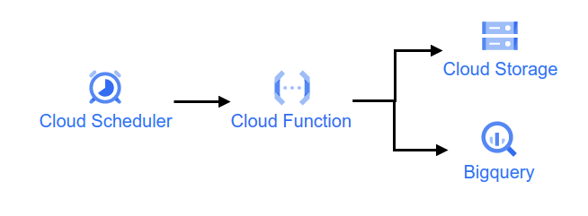{width=100%}
</center>

이번에는 GCP의 Cloud Function과 Cloud Scheduler에 대해 한번 알아보자. 그동안 Airflow를 사용하여 주식 데이터를 수집하고 있었지만, 계속 해서 Compute Engine을 24시간 켜놔야 하는 단점이 있다. 그렇다고 서버를 위한 컴퓨터를 살 수도 없고, 이러한 대안으로 Cloud Function를 사용 해보려고 한다. Cloud Function은 Serverless를 지향 하는 GCP의 서비스이며, AWS에서는 이를 Lambda로 서비스 하고 있다. 그럼 간단한게 구글이 소개 하는 Cloud Function의 장점에 대해 알아보자. 

## Cloud Function 이란?

Cloud Function은 퍼블릭 클라우드에서 제공하는 서버리스 컴퓨팅 서비스입니다. 서버리스 컴퓨팅이란 서버의 관리 및 유지보수를 클라우드 서비스 제공업체에 위임하고, 개발자는 코드 작성에만 집중할 수 있는 방식을 말합니다.

클라우드 함수의 장점은 다음과 같습니다.

- 비용 절감: 클라우드 함수는 사용량에 따라 요금이 부과되므로, 사용하지 않을 때는 비용을 절감할 수 있습니다.
- 확장성: 클라우드 함수는 필요에 따라 자동으로 확장되므로, 트래픽이 증가하더라도 안정적으로 서비스를 제공할 수 있습니다.
- 개발 생산성 향상: 클라우드 함수는 서버의 관리 및 유지보수를 신경 쓰지 않고 코드 작성에만 집중할 수 있으므로, 개발 생산성을 향상시킬 수 있습니다.

클라우드 함수는 다음과 같은 다양한 용도로 활용될 수 있습니다. 또한, 가격은 다음의 링크를 참고 하시면 되겠습니다.

- [Cloud Function 가격 책정](https://cloud.google.com/functions/pricing?hl=ko)

특히 이 부분에서 서버리스라는 단어가 이번 글의 핵심이다. 그럼 오늘 Cloud Function과 Cloud Scheduler에 대해 알아보자. 전반적인 절차는 다음 그림과 같다.


<center>
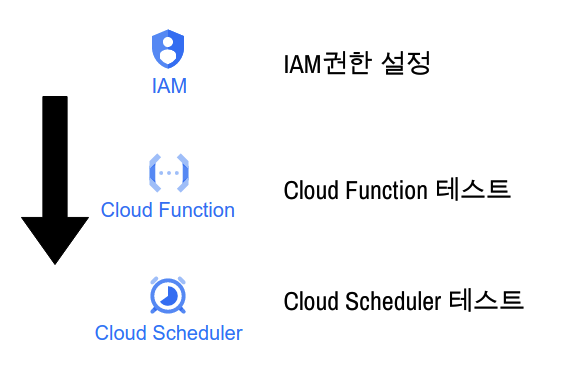{width=100%}
</center>

## IAM

그럼 이제, IAM 권한을 설정 해주자. GCP에서 여러 서비스를 사용하기 위해서는 각 서비스에 대한 권한이 필요 하다. 이를 서비스 해주는 기능이 IAM이고 IAM에 대한 계정은 지난번의 블로그를 참고 해주자.

- [BigQuery, Storage - Python 연동](https://unfinishedgod.netlify.app/2023/06/20/gcp-bigquery-storage-python/)

그럼 이제 이번에 필요한 권한에 대해 알아 보자. 우리는 Cloud Function과 Scheduler를 사용하여 데이터를 Storage와 Bigquery에 적재할 것이므로 이에 대한 권한이 필요하다. 필요한 권한은 다음과 같다.

- 소유자
- 저장소 관리자
- 클라우드 기능 서비스 에이전트
- BigQuery 관리자
- Cloud 스케줄러 관리자
- Cloud 스케줄러 서비스 에이전트
- Cloud 스케줄러 작업 실행자
- Cloud Functions 호출자
- Cloud Run 서비스 에이전트
- Cloud Run 호출자

## Cloud Function

그럼 이제 Cloud Function에 대해 알아보자. 우선 간단한 함수를 만들고 테스트를 진행 해보자.

### Cloud Funciton Test

우선 GCP의 메뉴에서 Cloud Function에서 함수만들기 버튼을 클릭하면서 시작한다.

<center>
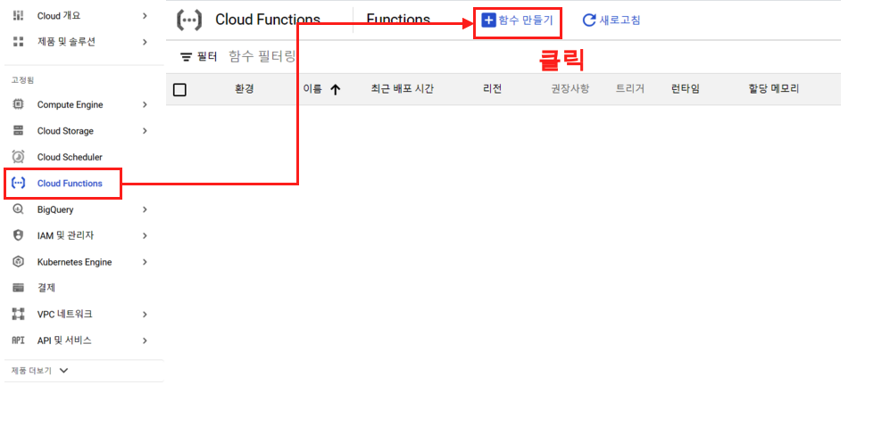{width=100%}
</center>


이제 Cloud Function을 위한 함수를 하나식 세팅 해주면 된다. 환경은 2세대로 해주고, 함수이름 설정과, 리전은 서울로 해주고 아래로 내려 가자.

<center>
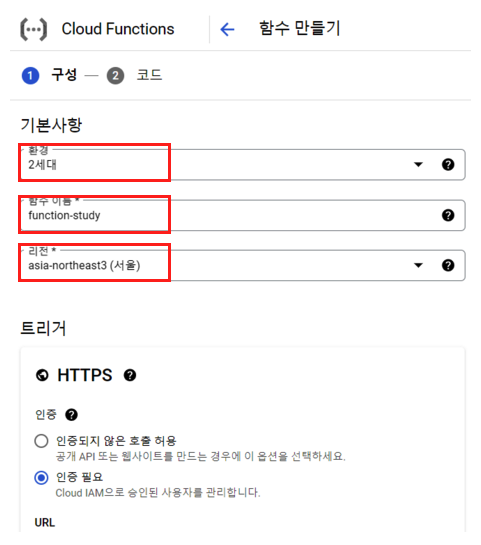{width=100%}
</center>

아래로 내려가서 '런타임 서비스 계정' 부분을 확인해보자. 기본적으로 Compute Engine default service account 가 되어 있는데 여기서 우리가 만들었던 IAM 계정을 넣어 준다.

<center>
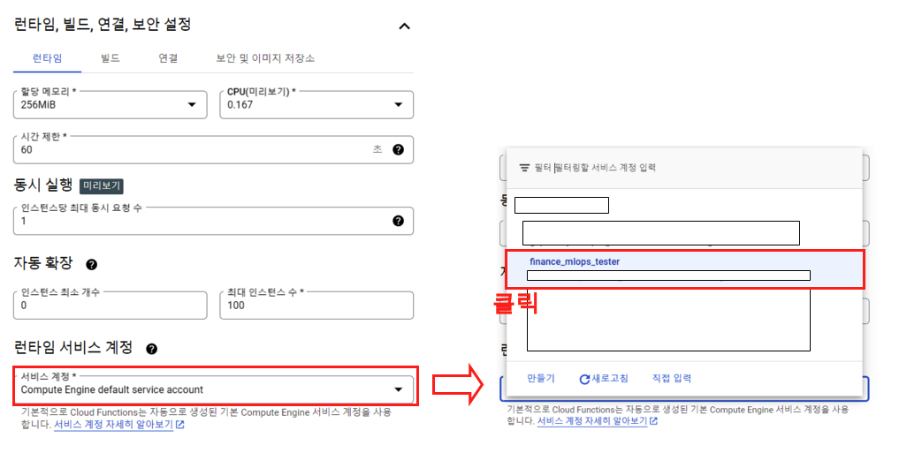{width=100%}
</center>

계정을 넣어 주었으면 다음 버튼 클릭.

<center>
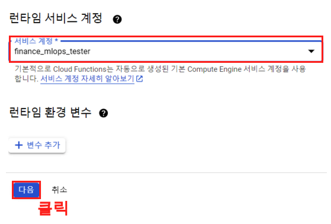{width=100%}
</center>

그러면 다음과 같은 화면을 볼 수 있다. 이제 이곳에서 Cloud Function을 위한 세팅을 완료하면 끝이다. 

<center>
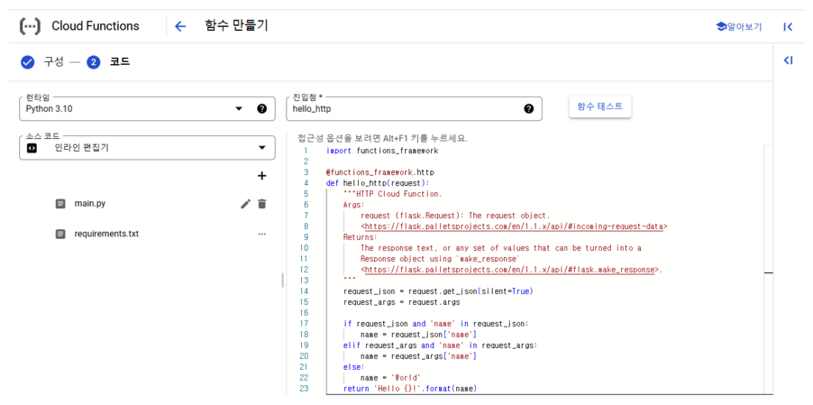{width=100%}
</center>

여기서 Cloud Function에 구성 되어 있는 '런타임'과 '소스 코드'를 보면 다음과 같다. 파이썬의 여러버전(최신버전까지)과 여러가지 언어까지 제공을 하며, '소스 코드'에서는 ZIP 업로드 / Cloud Storage의 ZIP / 인라인 편집기로 나뉘어 진다. 우리는 여기서 '인라인 편집기'를 사용하는데 Docker에 익숙하다면 따로 ZIP 업로드나 Cloud Storage ZIP을 사용하는것도 매우 좋은 방법이다.

<center>
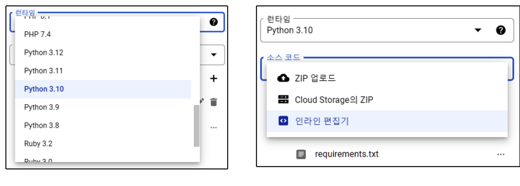{width=100%}
</center>

이제 하단에 '배포' 버튼을 클릭하면 된다. 그렇게 되면 다음과 같이 'function-study'라는 이름의 함수를 확인할 수 있다.

<center>
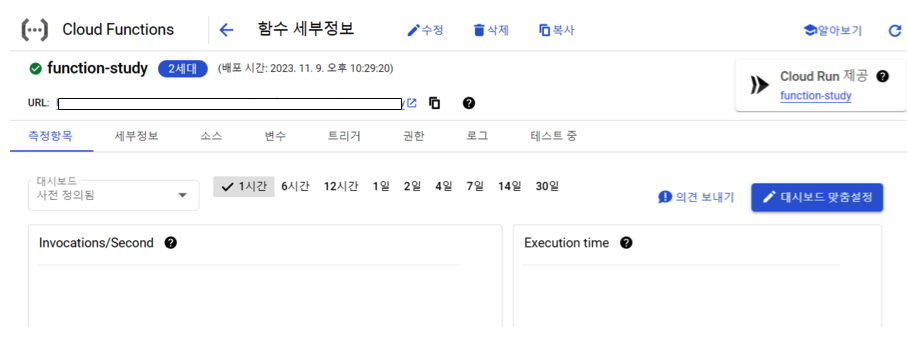{width=100%}
</center>

여기서 우리가 조금 눈여겨 볼수 있는것들은 우선 '소스'탭을 클릭할 경우 우리가 배포했던 소스들을 볼수 있으며 수정이 가능하다.

<center>
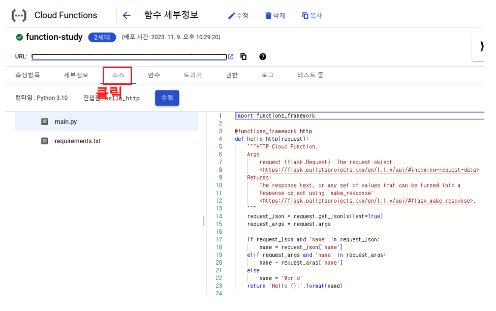{width=100%}
</center>

그리고 트리거를 눈여겨 봐야한다. 이는 Cloud Scheduler에 사용해야 한다.

<center>
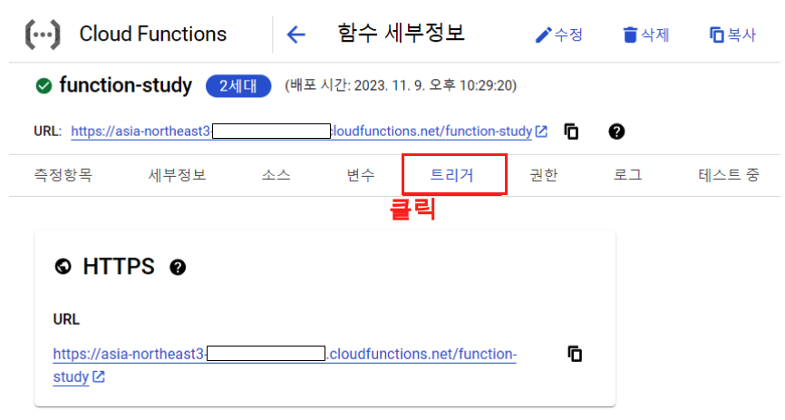{width=100%}
</center>


### Cloud Function 을 사용한 환율정보 수집

이렇게 테스트를 마무리 했으면 본격적으로 환율 정보 수집 함수를 만들어 보자. 우선 대시보드에서 다시한번 함수 만들기를 진행 한다. 

<center>
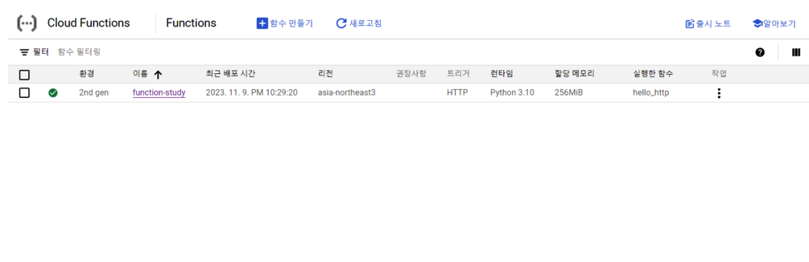{width=100%}
</center>

일단 코드 부분 까지는 Test에서 진행한 것과 동일하다. 

<center>
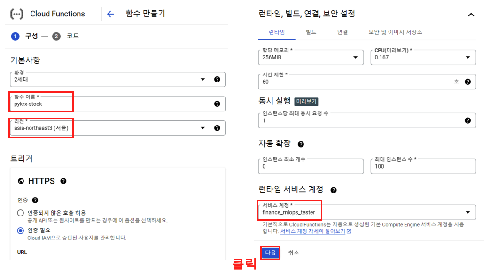{width=100%}
</center>

#### Step 1. 


그리고 나서 코드 화면이 나오면 런타임은 파이썬 3.10으로 맞춰주고, 소스코드는 인라인 편집기로 맞춰주자.
이제 Storage와 Bigquery에 접속 하기 위한 Json파일을 만들어 주자. 그리고 나서 IAM에 만들어 놓은 JSON 파일에 대한 정보를 그대로 넣어 주면 된다. 이 json 파일에 대한 정보 역시 다음의 링크를 참고 하면 된다.

- [BigQuery, Storage - Python 연동](https://unfinishedgod.netlify.app/2023/06/20/gcp-bigquery-storage-python/)


<center>
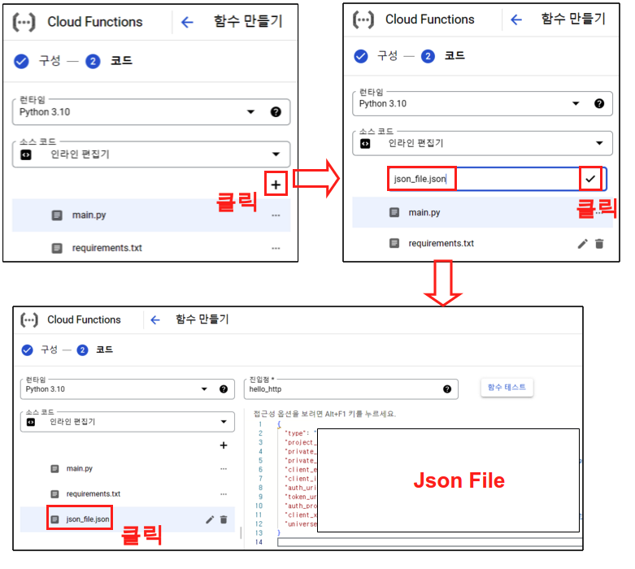{width=100%}
</center>


#### Step 2.


이번에는 requirements.txt에 우리가 필요한 패키지를 넣어 주자. 이 requeirements.txt 파일은 Cloud Function에서 함수가 실행될때 이미지 형식으로 만들어지는데, 이때 한꺼번에 설치가 진행 된다. 

```
functions-framework==3.*
pandas
finance-datareader
psycopg2
sqlalchemy
pykrx

bs4
pandas-gbq
google-cloud-bigquery
google-cloud-storage
```


<center>
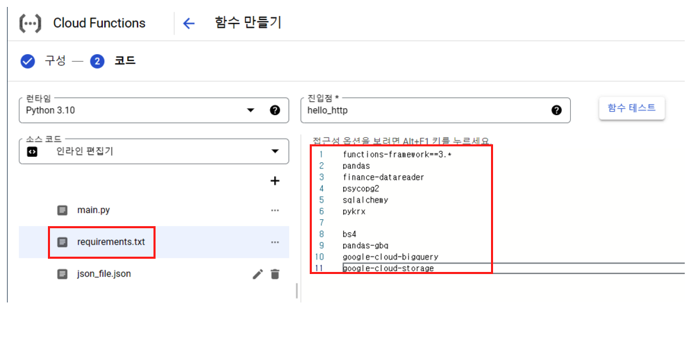{width=100%}
</center>


#### Step 3.


이제 마지막으로 코드 부분을 작성해주자. 코드 부분에는 다음과 같은 코드를 넣어 주면 된다. 이 코드는 지난번 Airflow 블로그에서 주가 데이터 수집 파이프라인1 (국내주식편)의 코드를 가져온것.

- [주가 데이터 수집 파이프라인 1 (국내주식편)](https://unfinishedgod.netlify.app/2023/07/29/airflow-1/)


<center>
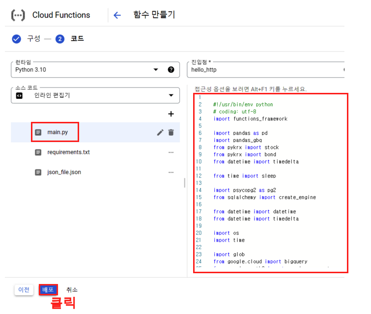{width=100%}
</center>


#### 주의사항

여기서 주의사항이 하나 있다. Cloud Function을 알고 나서 이리저리 블로깅을 하면서 자신감이 차 있는 상태에서 Google Storage에 업로드 할때 원인 모를 에러가 계속 발생하게 된다. 왜 그런지 에러를 검색해봐도 알수 없는 상태가 몇개월 가량 지속 되었었는데, 여기서 핵심은 /tmp 라는 임시파일 경로이다. Google Storage에 업로드 하기 위해서는 파이썬 객체가 아니라 csv라는 파일이 필요 한데 여기에서 /tmp 에 파일을 저장해주지 않으면 에러가 발생한다. 물론 파이썬에서 tempfile라이브러리를 사용 해도 된다. 그러니 Cloud Function에서 파일을 저장할 경우가 생긴다면 무조건 /tmp 파일에 임시로 저장해주어야 에러가 발생하지 않는다.

```python
#!/usr/bin/env python
# coding: utf-8
import functions_framework

import pandas as pd
import pandas_gbq
from pykrx import stock
from pykrx import bond
from datetime import timedelta

from time import sleep

import psycopg2 as pg2
from sqlalchemy import create_engine

from datetime import datetime
from datetime import timedelta

import os
import time

import glob
from google.cloud import bigquery
from google.oauth2 import service_account
from google.cloud import storage


# 서비스 계정 키 JSON 파일 경로
key_path = glob.glob("./*.json")[0]

# Credentials 객체 생성
credentials = service_account.Credentials.from_service_account_file(key_path)

# 빅쿼리 정보
project_id = '프로젝트 이름'
dataset_id = '빅쿼리 데이터셋 이름'

# GCP 클라이언트 객체 생성
storage_client = storage.Client(credentials = credentials,
                         project = credentials.project_id)
bucket_name = '구글 스토리지 버킷 이름'    # 서비스 계정 생성한 bucket 이름 입력


def upload_df(data, file_name, project_id, dataset_id, time_line, today_date1):
    if not os.path.exists(f'/tmp/{file_name}'):
        os.makedirs(f'/tmp/{file_name}')

    try:
        if not os.path.exists(f'/tmp/{file_name}/{file_name}_{today_date1}.csv'):
            data.to_csv(f'/tmp/{file_name}/{file_name}_{today_date1}.csv', index=False, mode='w')
        else:
            data.to_csv(f'/tmp/{file_name}/{file_name}_{today_date1}.csv', index=False, mode='a', header=False)
        print(f'{file_name}_로컬CSV저장_success_{time_line}')
    except:
        print(f'{file_name}_로컬CSV저장_fail_{time_line}')


    # Google Storage 적재
    source_file_name = f'/tmp/{file_name}/{file_name}_{today_date1}.csv'    # GCP에 업로드할 파일 절대경로
    destination_blob_name = f'data_crawler/{file_name}/{file_name}_{today_date1}.csv'    # 업로드할 파일을 GCP에 저장할 때의 이름
    bucket = storage_client.bucket(bucket_name)
    blob = bucket.blob(destination_blob_name)
    blob.upload_from_filename(source_file_name)

    try:
        # 빅쿼리 데이터 적재
        data.to_gbq(destination_table=f'{project_id}.{dataset_id}.{file_name}',
          project_id=project_id,
          if_exists='append',
          credentials=credentials)
        print(f'{file_name}_빅쿼리저장_success_{time_line}')
    except:
        print(f'{file_name}_빅쿼리저장_fail_{time_line}')


### 날짜 설정
now = datetime.now()

today_date1 = now.strftime('%Y%m%d')
today_date2 = now.strftime('%Y-%m-%d')
start_date2 = today_date2
today_date_time_csv = now.strftime("%Y%m%d_%H%M")


file_name = 'usd_krw'
ticker_nm = 'usd_krw'
try:
    now1 = datetime.now()

    time_line = now1.strftime("%Y%m%d_%H:%M:%S")
    df_raw = fdr.DataReader('USD/KRW', start_date2,today_date2)
    df_raw['ticker'] = ticker_nm
    df_raw = df_raw.reset_index()
    df_raw.columns = ['date', 'open','high','low','close','adj_close','volume','ticker']

    print(f'{ticker_nm} success_{time_line}')
except:
    print(f'{ticker_nm} fail_{time_line}')

df_raw['date'] = pd.to_datetime(df_raw['date'])
now1 = datetime.now()

time_line = now1.strftime("%Y%m%d_%H:%M:%S")
upload_df(df_raw, file_name, project_id, dataset_id, time_line, today_date1)


@functions_framework.http
def hello_http(request):
    """HTTP Cloud Function.
    Args:
        request (flask.Request): The request object.
        <https://flask.palletsprojects.com/en/1.1.x/api/#incoming-request-data>
    Returns:
        The response text, or any set of values that can be turned into a
        Response object using `make_response`
        <https://flask.palletsprojects.com/en/1.1.x/api/#flask.make_response>.
    """
    request_json = request.get_json(silent=True)
    request_args = request.args

    if request_json and 'name' in request_json:
        name = request_json['name']
    elif request_args and 'name' in request_args:
        name = request_args['name']
    else:
        name = 'World'
    return 'Hello {}!'.format(name)
```

여기까지 마무리 했으면 마지막으로 배포 버튼을 클릭하면 된다. 그리고 나서 시간이 지나고 대시보드를 보면 다음과 같이 성공 화면을 확인할 수 있다.

<center>
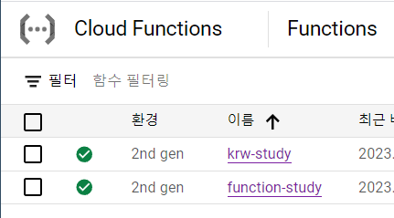{width=100%}
</center>

#### Storage, Bigquery 확인

이제 Storage, Bigquery에서 확인하면 다음과 같이 데이터가 잘 들어온 것을 확인할 수 있다.

<center>
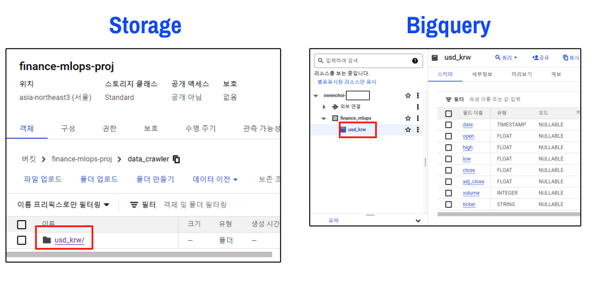{width=100%}
</center>

## 총평

이렇게 'Cloud Function & Cloud Scheduler를 사용한 주가 데이터 수집'에서 Cloud Function 부분을 마무리 했다. 원래 Clound Scheduler와 같이 한 호흡으로 봐야 전반적인 흐름을 알 수 있지만 분량 때문에 나누고 다음에는 Scheduler 를 알아보자.
