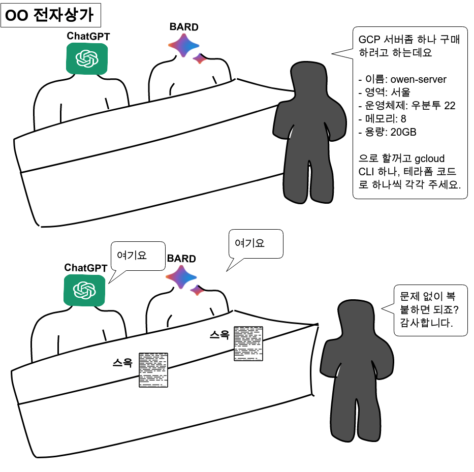

<center>
{width=100%}
</center>

이번에는 gcloud cli와 IaC에 대해 알아보자.  우선 gcloud CLI (Command Line Interface)에 대해 알아 보자. gcloud cli는 Google Cloud 플랫폼을 관리 하고 제어하기 위한 명령줄 도구 이다. 이 CLI를 사용하면 커맨드라인에서 우리가 사용하는 gcp의 기능들을 사용할 수 있다. GCP에서 서버 생성을 예로 들어 보자. 

## GCP에서의 서버 생성

기본적으로 GCP에서 마우스를 통해 클릭하면서 서버를 생성하게 된다. 그러나 gcloud cli를 사용하게 되면 이러한 과정들을 커맨드로 입력이 가능하다는 뜻이다.

<center>
{width=80%}
</center>

그동안 AWS와 GCP를 사용하면서 CLI에는 크게 흥미를 느끼지 못했기 때문에 aws cli나 gcloud cli에 대해 주로 다루지는 않았다. 물론 관심도 당연히 없었다. 그러던 도중 chatGPT와 BARD가 크게 유행을 하게 되고 나는 잠깐이나마 이렇게 생각했다.

<center>
<p  style="color: #4285f4;"> ChatGPT, BARD가 아무리 대단해도 cloud쪽을 대체 하려면 아직 멀었지뭐. </p>
</center>

<center>
<p style="font-size:200%"> <b>그럴리가. 세상엔 몇년을 앞서간 천재들이 너무도 많고, 내가 모르는 것일뿐.</b></p>
</center>

최근에 테라폼에 대해 알게 되고, 다시금 CLI에 대해 눈치 채고나서야, 그동안 아무것도 몰랐었고 이제야 조금 눈치 채서 다행이라는 생각. 


## IaC와 테라폼

gcloud cli는 서버에서 사용하는 커맨드 명령어 이다. 그리고 코드형 인프라를 담고 있는 IaC(Infrastructure as Code)에 대해 알아보자. 코드형 인프라의 뜻을 담고 있는 IaC는 우리가 위에서 봤었더 gcloud cli를 코드로 표현이 가능하게 도와 준다. 코드로 인프라를 관리한다는 것은 '자유롭게 변경'하고, '반복적인 작업'이 가능하다는 뜻. 즉, 내가 그동안 블로그에 스크린샷을 열심히 찍어가며 기록했던 행위들이 코드로 명확하게 정의되어 남는 다는 뜻이다. 그리고 IaC중 하나가 테라폼이다. 여기서 다시 한번 GCP에서 서버 생성하는 과정에 대한 장면을 보자. gcp에서는 gcloud cli 뿐만 아니라 테라폼 코드도 동시에 공유 되기 때문에 다음과 같은 코드 확인이 가능하다.

<center>
{width=80%}
</center>

이렇게 CLI와 테라폼에 대해 알게 되었으니, 조만간 테라폼 관련 블로그를 조금씩 올려볼 예정이다. 우선 이번에는 gcloud cli설치로 마무리를 진행 하자.

## gcloud CLI 설치

이번에는 cloud compute engine에서 gcloud cli를 설치 해보자. 이번에는 ubuntu 22.04를 사용했으며, 운영체제 별로 다르기 때문에 자세한 사항은 다음의 공식 문서를 참고 한다. 

- [gcloud CLI 설치](https://cloud.google.com/sdk/docs/install?hl=ko)


### 요구사항 충족

apt-transport-https가 있고 curl이 설치되어 있어야 한다.

```bash 
sudo apt-get update
sudo apt-get install apt-transport-https ca-certificates gnupg curl sudo
```

### 설치

1. 우선 Google Cloud의 공개 키를 가져온다.

```bash
$ curl https://packages.cloud.google.com/apt/doc/apt-key.gpg | sudo gpg --dearmor -o /usr/share/keyrings/cloud.google.gpg
```

2. 패키지 소스로 gcloud CLI 배포 URL을 추가 한다.

```bash
$ echo "deb [signed-by=/usr/share/keyrings/cloud.google.gpg] https://packages.cloud.google.com/apt cloud-sdk main" | sudo tee -a /etc/apt/sources.list.d/google-cloud-sdk.list
```

3. gcloud CLI를 업데이트하고 설치 한다.

```bash
$ sudo apt-get update && sudo apt-get install google-cloud-cli
```

4. 시작하기 위해 gcloud init를 실행 한다.

```bash
$ gcloud init
```

5. 성공적으로 설치가 되었으면 다음의 커맨드로 확인 해보자. 

```bash
$ gcloud version
```
```
Google Cloud SDK 457.0.0
alpha 2023.12.08
beta 2023.12.08
bq 2.0.100
bundled-python3-unix 3.11.6
core 2023.12.08
gcloud-crc32c 1.0.0
gsutil 5.27
```

6. 추가로 계정 등록 및 componets 확인은 다음의 명령어를 사용하면 된다.

```bash
gcloud auth login --cred-file={IAM 생성시 받은 json 파일}.json # 계정등록
gcloud auth list # 계정 확인
gcloud components list # components 확인
```

## 총평

이렇게 오늘은 gcloud cli와 IaC중 하나인 테라폼을 간단하게 소개해 보았다. 그동안 마우스로만 클라우드를 사용하다 보니 CLI에 대해 잊고 있었는데, 테라폼을 공부 하다보니 다시금 cli를 기억하게 되었다. 동시에 앞으로 chatgpt나 bard에서도 cloud를 컨트롤할 수 있다는걸 알게 되었다. 이제 이 gcloud cli를 알게 되었으니 다음에는 cloud run을 사용하기위해 이미지를 업로드 하는방법을 올려보려고 한다. 또한, 조만간 테라폼관련해서도 하나씩 정리해서 올려봐야 겠다.


