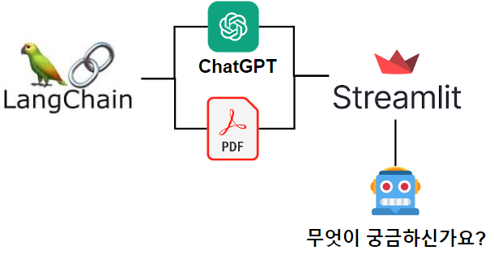
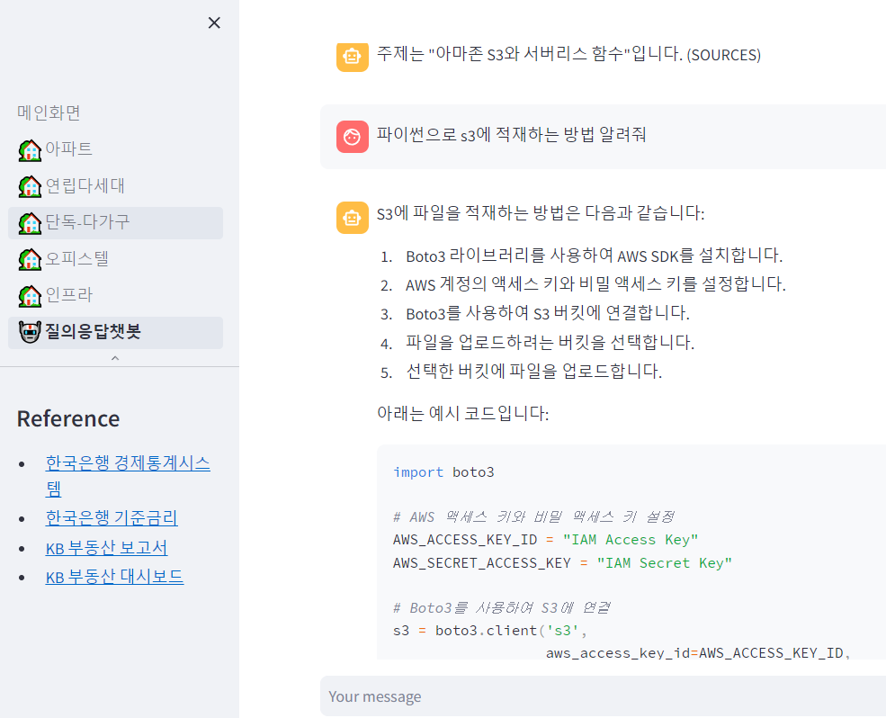

<center>
{width=80%}
</center>

이번에는 langchain을 사용하여 나만의 챗봇을 만들고, streamlit에 배포 해보자. 최근에 책을 집필하고, 책 내용 대한 질문을 종종 받았었다. 이때 문득 생각이 났다.

<center>
이때 챗봇이 있으면 도움이 되겠는데? <br>
langchain을 이참에 접목 시켜셔 streamlit 대시보드에 넣어 보자.
</center>

그래서 다음과 같이 나만의 챗봇을 만들어 보았다. 주제는 이번에 썼던 책. '데이터 분석으로 배우는 파이썬 문제 해결 '

- [데이터 분석으로 배우는 파이썬 문제 해결 챗봇](https://apartment-board.streamlit.app/%EC%A7%88%EC%9D%98%EC%9D%91%EB%8B%B5%EC%B1%97%EB%B4%87)

<center>
{width=80%}
</center>


그럼 하나씩 만들어보자. 우선 만들면서 참고를 해야할 링크는 다음과 같다. 

- [도입 시급! 회사내규 챗봇 직접 만들어보기 | 김태영](https://aifactory.space/task/2446/overview)
- [인공지능팩토리 유튜브-회사내규 챗봇 직접 만들어 보기](https://www.youtube.com/watch?v=2yv4PxE1Ks0)
- [Streamlit-Chat elements](https://docs.streamlit.io/library/api-reference/chat)

## Langchain을 사용한 나만의 챗봇 만들기

### 라이브러리 설치

우선 이번에 필요한 다음 라이브러리를 설치 해주자.

- pypdf
  - 파이썬으로 pdf를 읽어 오기 위함이다. 그러나, pdf에서도 읽을수 없는 이미지형 텍스트는 불가.(테스트 해보려면 마우스로 드래그가 가능하면 된다.)
- chromadb
  - 오픈소스 벡터 데이터 베이스이다. 최근에 부상하고 있는 벡터 DB를 오픈소스로 제공한다. 벡터 DB는 나중에 공부할때 자세하게 다뤄볼 예정.
  - 참고로 현시점(2023-12-17)에서는 파이썬 3.10이 가장 적합하다. 
  - 3.11에서는 설치가 안되고, 3.9에서는 streamlit과의 호환이 되지 않는다.
- tiktoken
  - 파이썬에서 사용할 수 있는 자연어 처리 라이브러리. pdf를 읽어오고 토큰화 시켜서 학습하기 위해 사용된다.
- langchain
  - LLM을 기반으로 하는 애플리케이션을 개발하기 위한 프레임워크.
  - 공식문서에서 다양한 기능을 제공하기 때문에 필요하면 이곳에서 여러가지고 참고 하면 된다.
  - 공식문서: [www.langchain.com](https://www.langchain.com/)

```bash
pip install pypdf 
pip install chromadb
pip install tiktoken
pip install langchain
```

### 라이브러리 로드

우선 필요한 라이브러리를 불러 오자. 각 라이브러리에 대한 자세한 설명은 다음의 유튜브를 꼭 참고 하자. 

- [인공지능팩토리 유튜브-회사내규 챗봇 직접 만들어 보기](https://www.youtube.com/watch?v=2yv4PxE1Ks0)

```python
import os

from langchain.chat_models import ChatOpenAI

from langchain.document_loaders import PyPDFLoader
from langchain.embeddings.openai import OpenAIEmbeddings
from langchain.embeddings.cohere import CohereEmbeddings
from langchain.text_splitter import CharacterTextSplitter
from langchain.vectorstores.elastic_vector_search import ElasticVectorSearch
from langchain.vectorstores import Chroma

from langchain.chat_models import ChatOpenAI
from langchain.chains import RetrievalQAWithSourcesChain
```

#### OpenAI API Key 등록

이제 OpenAI의 API키를 넣어 주자.

```python
os.environ["OPENAI_API_KEY"] = 'OpenAI API 키'
```

#### PDF 로드

그리고 나서 우리가 필요한 pdf를 읽어 온다. pypdf의 PyPDFLoader()를 사용하여 읽어 온다.

```python
loader = PyPDFLoader('샘플.pdf')
documents = loader.load()
```

#### 문서를 텍스트로 분할 해주자.

```python
text_splitter = CharacterTextSplitter(chunk_size=1000, chunk_overlap=0)
texts = text_splitter.split_documents(documents)
```

우리가 pdf에서 읽어온 텍스트를 컴퓨터가 쉽게 이해하고 처리 하기 위해 적절한 숫자로 변환하는 과정이다. 그리고 나서 이를 벡터베이스로 변환 하여 저장 해주자.

```python
embeddings = OpenAIEmbeddings()
vector_store = Chroma.from_documents(texts, embeddings)
retriever = vector_store.as_retriever(search_kwargs={"k": 2})
```

### 프롬프트 개선

프롬프트를 개선 하는 과정이다. 이를 하지 않으면 영어로 답변을 하게 되는데, system_template에 프롬프트를 개선하는 내용을 추가 해서 더 매끄럽게 한글로 결과를 나오게 해준다. 이 역시 자세한 사항은 유튜브를 참고 한다.

- [인공지능팩토리 유튜브-회사내규 챗봇 직접 만들어 보기](https://www.youtube.com/watch?v=2yv4PxE1Ks0)

```python
from langchain.prompts.chat import (
    ChatPromptTemplate,
    SystemMessagePromptTemplate,
    HumanMessagePromptTemplate,
)

system_template="""
Use the following pieces of context to answer the users question shortly.
Given the following summaries of a long document and a question, create a final answer with references ("SOURCES"), use "SOURCES" in capital letters regardless of the number of sources.
If you don't know the answer, just say that "I don't know", don't try to make up an answer.
----------------
{summaries}

You MUST answer in Korean and in Markdown format:"""

messages = [
    SystemMessagePromptTemplate.from_template(system_template),
    HumanMessagePromptTemplate.from_template("{question}")
]

prompt = ChatPromptTemplate.from_messages(messages)
```

#### ChatGPT 모델을 사용하여 학습

ChatGPT의 gpt-3.5-turbo를 사용하여 pdf를 학습 해준다. 그리고 나서 마지막으로 chain()함수를 만들어 준다.

```python
chain_type_kwargs = {"prompt": prompt}

llm = ChatOpenAI(model_name="gpt-3.5-turbo", temperature=0)  # Modify model_name if you have access to GPT-4

chain = RetrievalQAWithSourcesChain.from_chain_type(
    llm=llm,
    chain_type="stuff",
    retriever = retriever,
    return_source_documents=True,
    chain_type_kwargs=chain_type_kwargs
)
```

#### 결과 확인

이렇게 책을 학습 시켜보고 결과를 확인해보자.

```python
query = "주제가 뭐야?"
result = chain(query)
result['answer']
```

```
주제는 파이썬과 AWS를 사용한 데이터 처리 입니다.
```

## Streamlit 연동

이번에는 이를 Streamlit에 연동 해보자. 지난번에 AWS와 파이썬 책을 만들면서 Streamlit 대시보드를 같이 생성 했는데, 거기에 새로운 페이지를 추가 하고 거기에 챗봇을 넣을 예정이다. streamlit에서도 chatbot을 위한 기능을 추가 해주었다. Streamlit의 챗봇 기능은 다음의 공식문서를 참고 하자.

- [Streamlit-Chat elements](https://docs.streamlit.io/library/api-reference/chat)

### Streamlit 코드

streamlit에 들어가는 코드는 위의 코드와 매우 흡사 하다. 따라서, 특이사항과 챗봇 코드만 설명 하고 전체 코드로 마무리 하려고 한다. 

#### 특이사항

Streamlit을 github에 연동 할때 chromadb 설치가 잘 되지 않는 경우가 있다. 그럴때 배포하는 파이썬을 3.10으로 해주고 다음의 라이브러리를 설치 해주면 된다.

```python
import pysqlite3
import sys
sys.modules['sqlite3'] = sys.modules.pop('pysqlite3')
import streamlit as st
import sqlite3
```

#### streamlit chatbot

다음은 Stremalit 전용 챗봇 코드 이다.

```python
if "messages" not in st.session_state:
    st.session_state["messages"] = [{"role": "assistant", "content": "질문을 적어 주세요 무엇을 도와 드릴까요?"}]

for msg in st.session_state.messages:
    st.chat_message(msg["role"]).write(msg["content"])

if prompt := st.chat_input():
    st.session_state.messages.append({"role": "user", "content": prompt})
    st.chat_message("user").write(prompt)
    msg =  generate_response(prompt)
    st.session_state.messages.append({"role": "assistant", "content": msg})
    st.chat_message("assistant").write(msg)    
```

#### 전체 코드 

이제 Streamlit 에 들어갈 전체 코드로 마무리

```python
import pysqlite3
import sys
sys.modules['sqlite3'] = sys.modules.pop('pysqlite3')
import streamlit as st
import sqlite3


from langchain.llms import OpenAI

from langchain.chat_models import ChatOpenAI
from langchain.document_loaders import PyPDFLoader
from langchain.embeddings.openai import OpenAIEmbeddings
from langchain.embeddings.cohere import CohereEmbeddings
from langchain.text_splitter import CharacterTextSplitter
from langchain.vectorstores.elastic_vector_search import ElasticVectorSearch
from langchain.vectorstores import Chroma

import os

from langchain.chat_models import ChatOpenAI
from langchain.chains import RetrievalQAWithSourcesChain


st.set_page_config(
    page_title="질의응답챗봇",
    page_icon="🤖",
    layout="wide",
    initial_sidebar_state="expanded"
)


os.environ["OPENAI_API_KEY"] = 'OPENAI apikey' # 환경변수에 OPENAI_API_KEY를 설정합니다.

loader = PyPDFLoader('학습에 필요한 pdf 파일.pdf')
documents = loader.load()

text_splitter = CharacterTextSplitter(chunk_size=1000, chunk_overlap=0)
texts = text_splitter.split_documents(documents)
embeddings = OpenAIEmbeddings()
vector_store = Chroma.from_documents(texts, embeddings)
retriever = vector_store.as_retriever(search_kwargs={"k": 2})
from langchain.prompts.chat import (
    ChatPromptTemplate,
    SystemMessagePromptTemplate,
    HumanMessagePromptTemplate,
)

system_template="""Use the following pieces of context to answer the users question shortly.
Given the following summaries of a long document and a question, create a final answer with references ("SOURCES"), use "SOURCES" in capital letters regardless of the number of sources.
If you don't know the answer, just say that "I don't know", don't try to make up an answer.
----------------
{summaries}

You MUST answer in Korean and in Markdown format:"""

messages = [
    SystemMessagePromptTemplate.from_template(system_template),
    HumanMessagePromptTemplate.from_template("{question}")
]

prompt = ChatPromptTemplate.from_messages(messages)


chain_type_kwargs = {"prompt": prompt}

llm = ChatOpenAI(model_name="gpt-3.5-turbo", temperature=0)  # Modify model_name if you have access to GPT-4

chain = RetrievalQAWithSourcesChain.from_chain_type(
    llm=llm,
    chain_type="stuff",
    retriever = retriever,
    return_source_documents=True,
    chain_type_kwargs=chain_type_kwargs
)


st.subheader('질문을 적어 주세요')


def generate_response(input_text):
  result = chain(input_text)
  return result['answer']

if "messages" not in st.session_state:
    st.session_state["messages"] = [{"role": "assistant", "content": "질문을 적어 주세요 무엇을 도와 드릴까요?"}]

for msg in st.session_state.messages:
    st.chat_message(msg["role"]).write(msg["content"])

if prompt := st.chat_input():
    st.session_state.messages.append({"role": "user", "content": prompt})
    st.chat_message("user").write(prompt)
    msg =  generate_response(prompt)
    st.session_state.messages.append({"role": "assistant", "content": msg})
    st.chat_message("assistant").write(msg)    


```


## 총평

이렇게 langchain을 사용하여 pdf를 학습한 나만의 챗봇을 만들어 보았다. 그리고 Streamlit에 내가 작성한 책의 pdf파일을 학습시켜 챗봇을 넣어 봤다. 랭체인과 벡터 DB가 요새 자주 보이는데, 다음에는 그것도 건드려봐야 겠다.

---

## Reference

- [도입 시급! 회사내규 챗봇 직접 만들어보기 | 김태영](https://aifactory.space/task/2446/overview)
- [인공지능팩토리 유튜브-회사내규 챗봇 직접 만들어 보기](https://www.youtube.com/watch?v=2yv4PxE1Ks0)
- [ChatGPT AI에 소설을 학습시킨 다음 질문하기](https://anpigon.tistory.com/389)
- [Streamlit LLM Gallery](https://streamlit.io/gallery?category=llms)