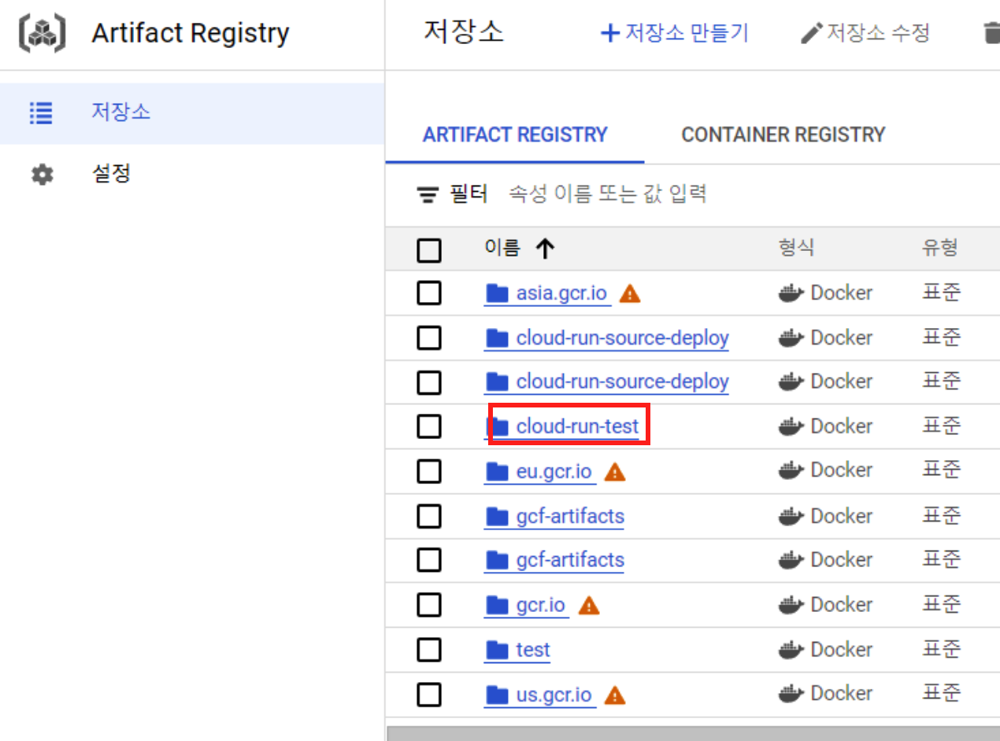
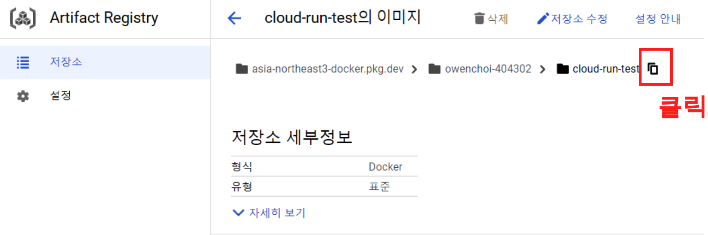
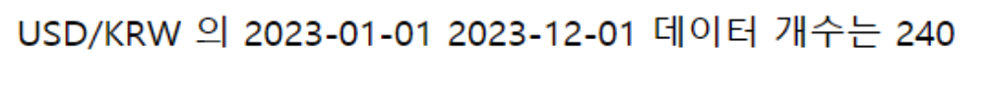

이번에는 GCP의 Cloud Run에 대해 알아 보자. Cloud Run은 GCP에서 제공하는 Serverless 컴퓨팅 서비스이다. Serverless 개념은 개발자가 인프라를 관리할 필요 없이 코드만 작성하고 배포할 수 있도록 하는 서비스인데, 이게 Cloud Fucntion와 매우 비슷하다. Cloud Funciton과 Cloud Run의 차이에 대해 한번 알아 보자.

# Cloud run은 Cloud Function 차이

- Cloud Run
  - 컨테이너 이미지를 기반으로 작동 
  - 개발자는 Dockerfile을 사용하여 컨테이너 이미지를 빌드하고 Cloud Run에 배포 한다.
  - 이미지에는 애플리케이션 코드뿐만 아니라 모든 필요한 라이브러리와 종속성이 포함되어 있어야 합니다.
  - 그렇기 때문에 Cloud Function과 비교 했을때 훨씬 더 유연하다. 
- Cloud Functions
  - 코드 자체를 직접 업로드하여 작동한다.
  - 지원되는 런타임 환경이 따로 있다.(예: Python, Node.js, Java, Go, PHP, Ruby 등)
  - 때문에 유연성은 Cloud Run에 비해서 제한 적이다.
  
이번 블로그에서는 Python으로 이미지를 만들고 Cloud Run을 최소한의 배포 만을 다루려고 한다. Cloud Run에 대해 자세한 내용은 다음의 블로그가 잘 나와 있으니 다음의 블로그를 참고 한다. 

- [Serverless 서비스인 Cloud Run 알아보기 1부 — Cloud Run 개요](https://medium.com/google-cloud-apac/gcp-serverless-%EC%84%9C%EB%B9%84%EC%8A%A4%EC%9D%B8-cloud-run-%EC%95%8C%EC%95%84%EB%B3%B4%EA%B8%B0-1%EB%B6%80-cloud-run-%EA%B0%9C%EC%9A%94-f2e8561ae179)

# Cloud run

그럼 이제 Cloud Run에 대해 하나씩 알아 보자. 우선 Cloud run으로 들어가서 '서비스 만들기' 버튼을 클릭한다.


<center>
{width=60%}
</center>

여기서 두가지 방법이 있다. 

- 기존 컨테이너 이미지에서 버전 1개 배포
  - GCP에서 제공하는 Artifact Registry에 컨테이너 이미지를 저장 해두고 여기서 가져다 쓰는 개념이다. 
  - Artifact Registry의 경우에는 Docker Hub라고 이해 하면 된다.
- 소스 저장소에서 지속적으로 새 버전 배포
  - 말 그대로 소스 저장소에 지속적으로새 버전을 배포 하는 개념이다. 
  - CI/CD 개념과 유사 하며 Github에 커밋을 하고 푸시 하면 자동으로 Cloud Run이 배포 된다.
  - Github / Bitbucket / Cloud Souerce Repositories 

## 기존 컨테이너 이미지에서 버전 1개 배포

우선 첫번째 '기존 컨테이너 이미지에서 버전 1개 배포' 부터 알아 보자. 컨테이너 이미지 URL 부분의 선택 버튼을 클릭 해주자.

<center>
{width=60%}
</center>

그러면 다음과 같이 ArtiFact Registry들이 보이게 된다. 이곳에 새로 저장소를 만들고 컨테이너 이미지를 업로드 해주어야 한다. 그러면 이제 다시 Artifact Registry로 넘어가 보자. 

<center>
{width=60%}
</center>

Artifact Registry로 넘어갔으면, 이곳에서 '저장소 만들기' 버튼을 클릭 해주자.

<center>
{width=60%}
</center>

저장소 이름과, 형식, 리전들을 다음과 같이 설정 해주고 '만들기' 버튼 클릭

<center>
{width=80%}
</center>

그러면 이제 cloud-run-test 라는 저장소가 생성된 것을 확인할 수가 있다.

<center>
{width=60%}
</center>

### Python Docker Image

이제 Artifact Registry 저장소를 만들었으니, Python을 사용하여 Docker이미지를 만들고 Artifact Registry 으로 push를 진행 해보자. Cloud run에 Python 서비스를 배포 하는 자세한 가이드는 구글의 공식 문서를 참고 한다.

- [Cloud Run에 Python 서비스 배포](https://cloud.google.com/run/docs/quickstarts/build-and-deploy/deploy-python-service?hl=ko)

우선 다음의 경로를 만들어 준다. 'finance_mlops/cloud_run_test/cloud_run_git'.  여기서 우리는 DataReader 패키지를 사용해서 '2023-01-01' 부터 '2023-12-01'까지의 데이터 개수를 가져오는 서비스를 만들어 보자. 그리고 나서 이곳에 세개의 파일을 만들어 준다.

- app.py
- requirements.txt
- Dockerfile

#### app.py

우선 app.py 는 다음과 같다.

```python
#!/usr/bin/env python
# coding: utf-8

import functions_framework
import pandas as pd
from datetime import timedelta
import FinanceDataReader as fdr

from time import sleep

import os
import time
from flask import Flask

app = Flask(__name__)

@app.route("/")
def hello_world():
    """Example Hello World route."""
    # name = os.environ.get("NAME", "World")
    
    strat_date = '2023-01-01'
    end_date = '2023-12-01'
    
    usdkrw = fdr.DataReader('USD/KRW', strat_date, end_date) # 달러 원화
    usdkrw = usdkrw.reset_index()
    print(len(usdkrw))
    
    usd_nm = len(usdkrw)
    
    return_msg = f"USD/KRW 의 {strat_date} {end_date} 데이터 개수는 {usd_nm}"

    return return_msg

if __name__ == "__main__":
    app.run(debug=True, host="0.0.0.0", port=int(os.environ.get("PORT", 8080)))
```

#### requirements.txt

이제 requirements.txt에 는 다음과 같이 필요한 라이브러리를 적어 주자.

```
functions-framework==3.*
pandas
finance-datareader
bs4
plotly
Flask==3.0.0
gunicorn==20.1.0
Werkzeug==3.0.1
```


#### Dockerfile 

그리고 마지막으로 Dockerfile을 만들어 준다. 이렇게 컨테이너 만들 준비는 끝

```
FROM python:3.10

EXPOSE 8080

WORKDIR ./

COPY . .

RUN pip3 install -r requirements.txt

CMD ["python3", "app.py"]
```

## Artifact Registry 에 이미지 push

이렇게 Dockerfile 가지 만들었으니 이미지를 만들고 Artifact Registry에 이미지를 올려 보자. gcloud CLI가 설치 되어 있어야 하며, gcloud CLI 설치는 다음을 참고 한다.

- [gcloud CLI 설치 ](https://unfinishedgod.netlify.app/2023/12/13/gcp-gcloud-cli-iac/)

또한 Artifact Registry에 이미지 내보내고 가져오는 공식문서가 존재하니, 자세한 사항은 다음을 참고 하면 된다.

- [이미지 내보내기 및 가져오기](https://cloud.google.com/artifact-registry/docs/docker/pushing-and-pulling?hl=ko)


그럼 한줄씩 알아 보자. 우선 test_image:tag 와 같이 {도커 이미지 이름}:{태그 명} 형식으로 이미지를 만들어 준다.

```
docker build -t {도커 이미지 이름}:{태그 명} .
```

그리고 나서 이제 Artifact Registry에 맞추어서 지정 이미지와 태그를 다시 지정 해주면 된다. 여기서 Artifact Registry 저장소의 경로가 필요 한데 저장소의 경로는 다음 사진을 참고 해서 주소를 복사 해주면 된다.

<center>
{width=60%}
</center>

처음에는 좀 익숙하지 않을 수 있다. 다음과 같이 Artifact registry 경로에 tag를 걸어 주자.

```
docker tag {도커 이미지 이름}:{태그 명} {Artifact Registry 경로}/{도커 이미지 이름}:{태그 명}
```

확인을 위해선 다음의 커맨드를 통해 확인 하면 된다.

```
docker images
```

이제 Artifact Registry 경로에 이미지를 pu하면 된다.

```
docker push  {Artifact Registry 경로}/{도커 이미지 이름}:{태그 명}
```

최종적으로 Artifact Registry에 이미지를 push하기 위한 커맨드는 다음과 같다.

- Artifact Registry 경로 
  - asia-northeast3-docker.pkg.dev/owenchoi-404302/cloud-run-test
- 이미지 이름
  - test_image
- 태그명
  - tag

```
docker build -t test_image:tag .
docker tag test_image:tag  asia-northeast3-docker.pkg.dev/owenchoi-404302/cloud-run-test/test_image:tag
docker images
docker push  asia-northeast3-docker.pkg.dev/owenchoi-404302/cloud-run-test/test_image:tag
```

이렇게 이미지를 push 하면 다음과 같이 Artifact Registry에 성공적으로 이미지가 올라가는것을 확인할 수 있다.

<center>
{width=60%}
</center>

거의 다 왔다. 이제 다시 Cloud run에 가서 서비스 만들기를 진행 하고 다음과 같이 이미지 URL을 클릭하고 우리가 생성하고 Artifact Registry에 push 했던 이미지를 클릭 해주자.

<center>
{width=80%}
</center>

서비스 이름은 test_image로 해주었고, 인증되지 않은 호출의 경우 이번에는 '허용'을 해주어 웹에서 확인을 할 수 있도록 설정 해주었다. (필요하면 인증 필요) 버튼을 클릭하면 된다. 그리고 보안 에서는 iam권한이 잇는 서비스 계정을 넣어 준다.

<center>
{width=80%}
</center>

이렇게 성공적으로 Cloud run을 만들었으면 다음과 같은 화면을 볼 수 있다. cloud run이 잘 작동하는지 확인하기 위해서는 다음의 링크를 클릭해주고 열어 보자.

<center>
{width=60%}
</center>

python에서 작업했코드가 성공적으로 표시 되는 모습을 확인할 수 있다.

<center>
{width=60%}
</center>

## 소스 저장소에서 지속적으로 새 버전 배포

지금까지 Artifact Registry에 이미지를 업로드해서 cloud run을 배포 하는 과정을 알아 보았다. 생각보다 복잡하고 절차가 까다로운데 이번에는 소스 저장소에서 지속적으로 새 버전 배포 하는 방법을 알아 보자. 

Cloud run 에서 서비스 만들기 화면을 먼저 가보자. 그리고 다음의 순서대로 하나씩 클릭 해보자. 

1. '소스 저장소에서 지속적으로 새 버전 배포'라디오 버튼 클릭
2. CLOUD BUILD 설정 클릭
3. 소스저장소 Github (Github 계정이 있어야 한다.)
  3-1. '연결된 저장소 관리' 버튼을 클릭하여 Github계정과 연동 시킨다.
4. Dockerfile이 잇는 저장소를 클릭해준다. 
5. 다음 버튼 클릭

<center>
{width=80%}
</center>

두번째는 빌드를 구성 하는 단계 이다. Git 저장소를 클릭 했으니 이번에는 Dockerfile이 있는 경로를 찾아서 넣어 주자. /cloud_run_test/cloud_run_git/ 경로에 Dockerfile을 두었으니 다음 화면과 같이 경로를 구성 해주면 된다. 이렇게 할경우에 Github에 push할때마다 빌드가 알아서 구성 되기 때문에 편리 하다.

<center>
{width=60%}
</center>

# 총평 

이번에는 cloud run에 대해 알아 보았다. 지금까지 총 Cloud function부터 시작해서 Cloud run, 그리고 Compute Engine을 스케쥴링 하여 컨트롤 하는 방법에 대해 알아보았으며, 이제 이를 응용 해서 주식 데이터 파이프라인을 구축 하면 마무리가 될것 같다. 슬슬 마무리가 다가 오고 있다.
