이번에는 GCE에 쿠버네티스를 설치 해보자. 쿠버네티스를 사용할 필요가 있어서 공부를 해오다가 이번에 정리를 하게 되었으며, 쿠버네티스 설치 부터 이것저것 운영에 대해 추가로 작성할 예정이다. 그리고 추후에는 GKE(Google Kubernetes Engine)와 EKS(Elastic Kubernetes Service)도 하나씩 적어볼 예정이다.

## 쿠버네티스란?

쿠버네티스는 컨테이너화된 애플리케이션을 배포, 관리, 확장하는데 사용되는 컨테이너 오케스트레이션 플랫폼이다. 컨테이너 기술과 함께 사용하여 애플리케이션을 효율적이고 안정적으로 운영할 수 있도록 도와준다. 핵심기능으로는 다음과 같다.

- 컨테이너 배포: 컨테이너 이미지 기반으로 여러 서버에 컨테이너 자동 배포
- 스케일링 자동화: 트래픽 변화에 따라 컨테이너의 수를 자동으로 늘리거나 줄임
- 로드밸런싱: 사용자 트래픽을 여러 컨테이너에 분산하여 처리
- 서비스 관리: 컨테이너의 상태를 모니터링하고, 문제 발생 시 자동 복구
- 네트워킹: 컨테이너 간 네트워킹 설정 및 관리
- 보안: 컨테이너 및 애플리케이션 보안 강화

구성요소는 다음과 같다.

- 클러스터: 마스터 노드와 워커 노드로 구성된 컴퓨터 그룹
- 마스터 노드: 클러스터를 관리하고 제어하는 노드
- 워커 노드: 컨테이너를 실행하는 노드

그러나, 쿠버네티스를 처음 접하게 되면 위 정보에 대해 자세하게 읽고 이해하는것을 추천하지는 않는다. 당장 읽으면 이해도 되지 않을 뿐더러 앞으로 쿠버네티스를 설치 하고 사용 해보면서 쿠버네티스가 갖고 있는 장점과 기능에 대해 하나씩 느껴보고 나서 다시 읽어 보는것을 추천한다. 그럼에도 쿠버네티스에 대해 더 자세하게 알고 싶으면 다음의 공식문서를 참고 하면 된다.

- [쿠버네티스 공식문서-쿠버네티스란?](https://kubernetes.io/ko/docs/concepts/overview/)

## 이번 블로그에서 다룰 내용

그럼 이제 GCE에서 쿠버네티스를 하나씩 설치하는 과정에 대해 알아 보자. 

1. VM 하나 선택하여 쿠버네티스 설치 준비
2. kubeadm, kubelet, kubectl 설치
3. Master Node, Worker Node 추가를 위해 생성한 VM을 이미지로 생성
4. 1개의 Master Node와 3개의 Worker Node 구축
5. 설치된 각각의 노드들을 MobaXterm에서 4분할 화면을 통해 확인
6. 쿠버네티스 클러스터 생성

설치해야할 서버 정보는 다음과 같다. (설치를 위해 최소한의 정보로 설치 했으나, 실제로는 이보다 더 성능이 좋아야 한다.)

- Master Node
  - e2-medium(vCPU 2개, 코어 1개, 메모리 4GB)
- Worker Noder
  - e2-small(vCPU 2개, 코어 1개, 메모리 2GB)

우선 GCE 설치와 MobaXterm에 연결 해야 하는데 이는 지난번에 작성 했으므로 다음의 블로그를 참고 한다. 

- [GCP Compute Engine 구축](https://unfinishedgod.netlify.app/2023/06/10/gcp-gcp/)
  - 위 블로그는 Ubuntu로 진행 했었는데, 여기서 Centos로 바꿔서 구축하면 된다.
- [Compute Engine 방화벽 및 MobaXterm 연결](https://unfinishedgod.netlify.app/2023/06/11/gcp-compute-engine-mobaxterm/)

위 블로그를 통해 Centos의 이미지를 하나 생성 했으면 이제 쿠버네티스를 설치 해보자. VM 이름은 'k8s-default-image'로 설정

## 1. 쿠버네티스 설치 준비

### 1-1. Root 비밀번호 설정 및 Root 계정 접근

VM을 생성 했으면 이제 Root 비밀번호를 설정 해주고 Root 권한으로 넘어가자. **쿠버네티스는 항상 루트 권한으로 진행 한다.** 먼저 루트 계정의 비밀번호를 설정 한다. GCE를 껏다가 새로 키는 경우 항상 Root로 계정을 전환 해야 한다.

```bash
sudo passwd root
```

```
[sudo] password for xxxx:
New password:
Retype new password:
passwd: password updated successfully
```

그리고 나서 루트 권한으로 넘어가자.

```bash
su
```

### 1-2. Centos 기본 패키지 upgrade & update

루트 권한으로 들어 갔으면 이제 다음의 커맨드를 통해 Centos 의 기본 패키지들을 upgrade & update 해준다.

```bash
yum upgrade
yum update
```

### 1-3. SWAP 메모리 해제

쿠버네티스는 메모리를 효율적으로 활용하기 위해 빠른 접근이 가능한 실제 메모리를 선호한다. 스왑 메모리는 디스크에 위치해 느린 속도로 접근되기 때문에 성능 저하를 일으킬 수 있다. 따라서 스왑 메모리를 해제하여 성능을 향상 시키고 안정성을 높힌다. GCE를 껏다가 새로 키는 경우 항상 SWAP 메모리를 해제 해줘야 한다.

```bash
sed -i '/ swap / s/^\(.*\)$/#\1/g' /etc/fstab
swapoff -a
```

### 1-4. Docker 설치

쿠버네티스를 설치 하기 위해 Docker를 설치 해준다. 다음의 커맨드를 하나씩 입력 하여 도커를 설치 해준다.

```bash
yum install -y yum-utils
yum-config-manager --add-repo https://download.docker.com/linux/centos/docker-ce.repo
sudo yum install docker-ce docker-ce-cli containerd.io
sudo systemctl start docker
```

### 1-5. 도커 cgroup 관리

Docker의 설정 파일인 /etc/docker/daemon.json에 새로운 구성을 추가하자. Docker가 컨테이너를 실행할 때 systemd를 사용하여 cgroup을 관리하도록 지정하는 내용이다. 

```bash
 cat <<EOF | sudo tee /etc/docker/daemon.json
 {
  "exec-opts": ["native.cgroupdriver=systemd"],
  "log-driver": "json-file",
  "log-opts": {
    "max-size": "100m"
  },
  "storage-driver": "overlay2"
}
EOF
```

### 1-6.Docker 서비스 부팅 설정 및 재시작

Docker를 관리하기 위해 시스템 서비스인 systemd를 이용하여 docker를 설정 해주자.


```bash
sudo systemctl enable docker
sudo systemctl daemon-reload
sudo systemctl restart docker
```

### 1-7. Container.d에서 CRI 비활성화 해제하기

다음 커맨드를 통해 '/etc/containerd/config.toml' 파일을 열고 편집한다. 이는 Container.d런타임에서 CRI(Container Runtime Interface)를 비활성화 해제 하기 위함이다. 

```
vi /etc/containerd/config.toml
```

이 편집기에서 다음을 찾아서 주석처리 해주면 된다.

```
# disabled_plugins = ["cri"]
```

그리고 나서 이제 다시 containerd를 재시작 해준다.

```
systemctl restart containerd
```

### 1-8. 보안 및 네트워크 설정

쿠버네티스에서 컨테이너간 네트워킹을 구축하는데 필요한 커맨드를 작성해주자.

- modprobe overlay
  - 컨테이너 네트워킹을 위한 필수 기능을 제공한다.
- modprobe br_netfilter
  - 컨테이너 네트워크의 보안을 담당한다.
  - 네트워크 트래픽을 필터링하고 관리 한다

```bash
modprobe overlay
modprobe br_netfilter
```

이제 마지막으로 쿠버네티스 설치를 위해 시스템에 설정 파일을 추가 하자. 이 설정파일은 네트워크 브릿지 관련 기능을 활성화 하기 위한 것으로, IPv6 및 IPv4 트래픽을 iptables로 라우팅하도록 시스템을 구성한다.

```bash
cat <<EOF | sudo tee /etc/sysctl.d/k8s.conf
net.bridge.bridge-nf-call-ip6tables = 1
net.bridge.bridge-nf-call-iptables = 1
EOF
```

지금까지 쿠버네티스를 설치하기 위한 기본준비를 마무리 했다. 이제 본격적으로 설치를 진행 하자.

## 2. kubeadm, kubelet, kubectl 설치

쿠버네티스를 설치하기 위해서는 kubeadm, kubelet, kubectl를 설치해줘야 한다.

- kubeadm: 쿠버네티스 클러스터를 부트스트랩 하고 관리하기 위한 도구이다. kubeadm은 클러스터를 초기화하고 필요한 컴포넌트를 설치하며, Master Node와 Worker Node를 추가 하고 제거하는 등의 작업을 수행한다.
- kubelet: 각 노드에서 실행되는 Kubernetes 에이전트이다. kubelet은 Master Node에서 받은 명령을 수행하여 컨테이너를 관리하고, 노드의 상태를 마스텡 보고한다. 또한 컨테이너의 생명주기를 관리하고 리소스를 담당한다.
- kubectl: Kubernetes 클러스터를 제어하기 위한 커맨드 라인 도구 이다. kubectl을 사용하면 클러스터 상태를 확인하고 파드를 생성하거나 조작하며, 서비스 및 볼륨과 같은 다양한 Kubernetes리소스를 관리할 수 있다. 
  - k9s를 사용하게 되면 kubectl를 사용하지 않아도 운영이 가능한데 이는 다음에 k9s 관련한 내용을 추가 할 예정.

다음을 그대로 복사 해준다.

```
cat <<EOF | sudo tee /etc/yum.repos.d/kubernetes.repo
[kubernetes]
name=Kubernetes
baseurl=https://packages.cloud.google.com/yum/repos/kubernetes-el7-\$basearch
enabled=1
gpgcheck=1
gpgkey=https://packages.cloud.google.com/yum/doc/yum-key.gpg https://packages.cloud.google.com/yum/doc/rpm-package-key.gpg
exclude=kubelet kubeadm kubectl
EOF

# permissive 모드로 SELinux 설정(효과적으로 비활성화)
sudo setenforce 0
sudo sed -i 's/^SELINUX=enforcing$/SELINUX=permissive/' /etc/selinux/config

sudo yum install -y kubelet kubeadm kubectl --disableexcludes=kubernetes

sudo systemctl enable --now kubelet
```

여기까지가 쿠버네티스의 기본 설치에 대한 내용이다. 여기까지 마무리 하고나서 이 VM을 Image로 만들어 주자.

## 3. Master Node, Worker Node 추가를 위해 생성한 VM을 이미지로 생성

지금까지 기본적으로 쿠버네티스의 설치를 마무리 했으니 이 VM을 image로 만들어 주도록 하자. 이렇게 이미지로 만들어 두면 앞으로 Master Node를 추가 하거나, Worker Node를 추가 할경우 지금까지의 번거로운 과정 없이 추가가 가능하다. 하나씩 알아보자.

### 3-1. 

우선 우리가 방금 만들어 둔 'k8s-default-image' VM을 클릭한다.

<center>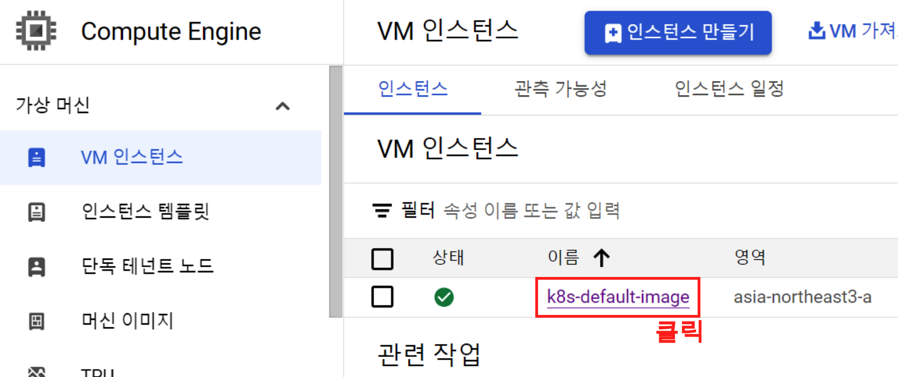{width=60%}</center>

### 3-2. 

그리고 나서 우측 상단의 '머신 이미지 만들기' 버튼을 클릭해주자.

<center>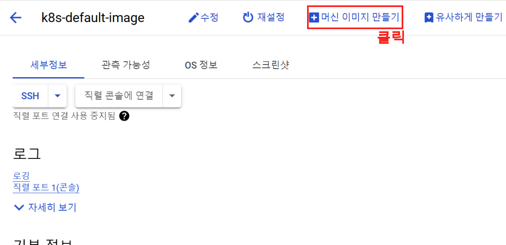{width=60%}</center>


### 3-3. 

머신 이미지를 만들어 준다. 'k8s-setup' 이라고 이름을 지어준다. 이렇게 이미지 생성은 끝. 

<center>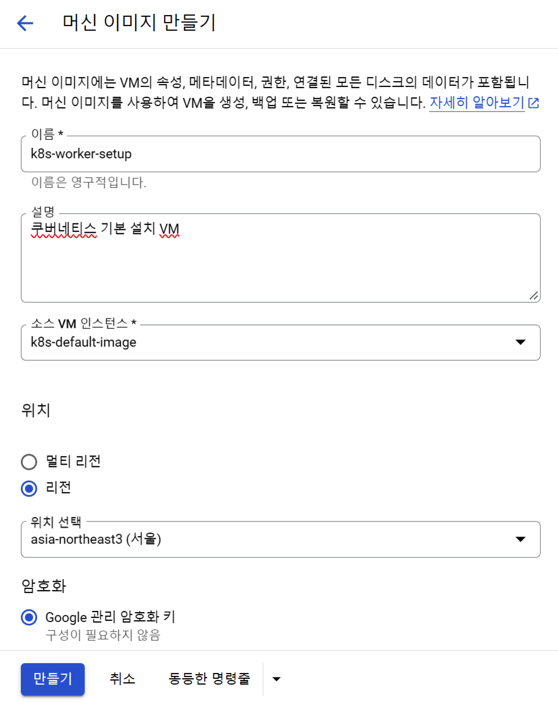{width=60%}</center>

## 4. 1개의 Master Node와 3개의 Worker Node 구축

이제 생성된 이미지를 통해 Master Node와 Worker Node를 위한 VM을 구축 해주자.

### 4-1. 

Compute Engine으로 넘어가서 '인스턴스 만들기' 버튼을 클릭 해준다.

<center>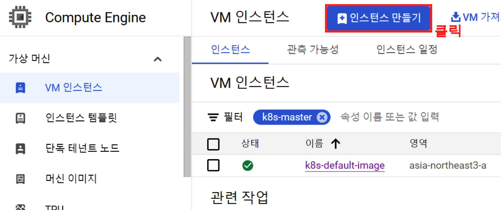{width=60%}</center>

### 4-2. 

왼쪽의 '머신 이미지에서 VM 인스턴스 만들기' 버튼을 클릭해주면 우리가 생성한 이미지가 보이게 된다. 그리고 나서 'CONTINUE' 버튼을 클릭해주자.

<center>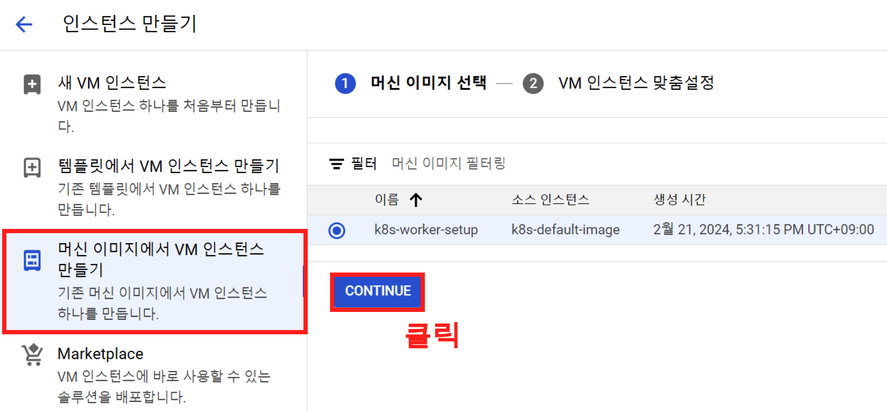{width=60%}</center>


### 4-3. 

쿠버네티스가 설치된 VM이미지를 기준으로 Master Node에 해당하는 VM을 생성한다. 'k8s-mastet-1' 이라는 이름과, e2-medium 으로 해서 맞춰주고 만들기 버튼을 클릭해준다.

<center>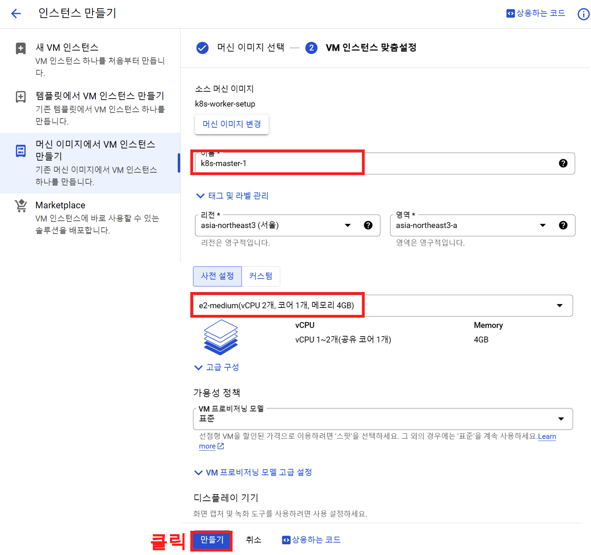{width=80%}</center>
### 4-4. 

이번에는 Worker Node를 만들어 준다. 다음 그림과 같이 e2-small로 설정 해주고 VM이름도 k8s-worker-1,2,3 로 해서 총 3개를 만들어 준다.

<center>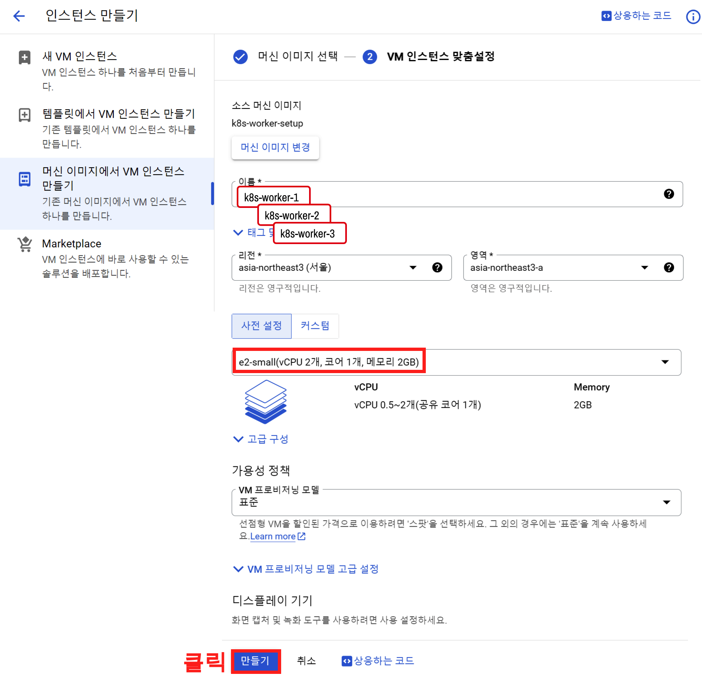{width=80%}</center>


## 5. 설치된 각각의 노드들을 MobaXterm에서 확인

### 5-1. 

설치한 총 4개의 VM을 MovaXterm에 다음과 같이 추가 시켜 주자. 그리고 각각 서버를 클릭해서 열어 준다.

<center>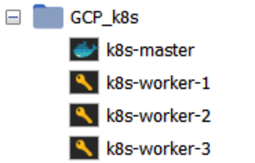{width=40%}</center>

### 5-2. 

4개 서버를 열었으면. 왼쪽 홈 탭을 'Close tab' 버튼을 클릭해서 없애준다.

<center>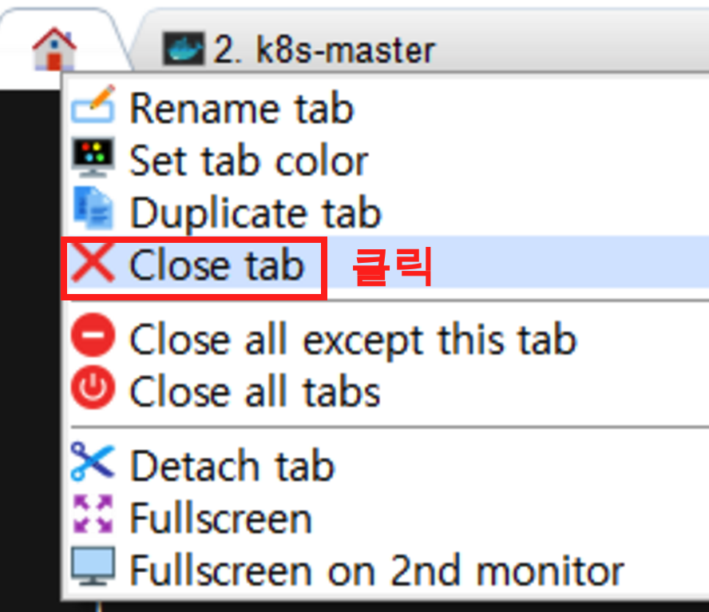{width=40%}</center>

### 5-3. 

그리고 나서 상단 'Split' > '4 terminals mode' 를 클릭 해주자.

<center>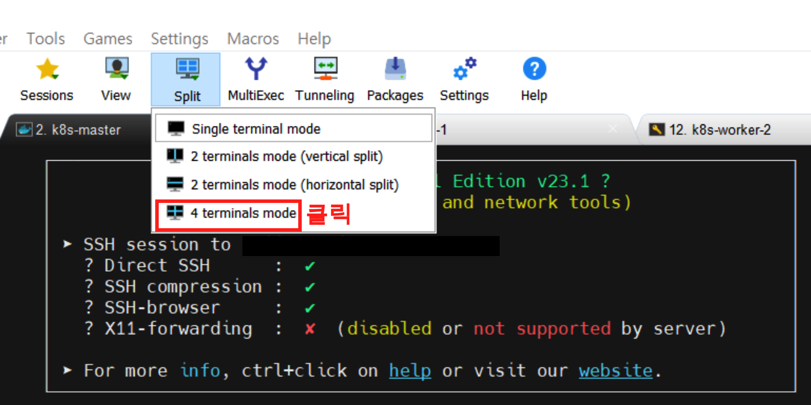{width=60%}</center>

### 5-4. 

그러면 이렇게 총 4개의 화면을 볼 수가 있다. 이렇게 총 4개의 VM을 확인했으니 Master, Worker Node를 만들어 주자.

<center>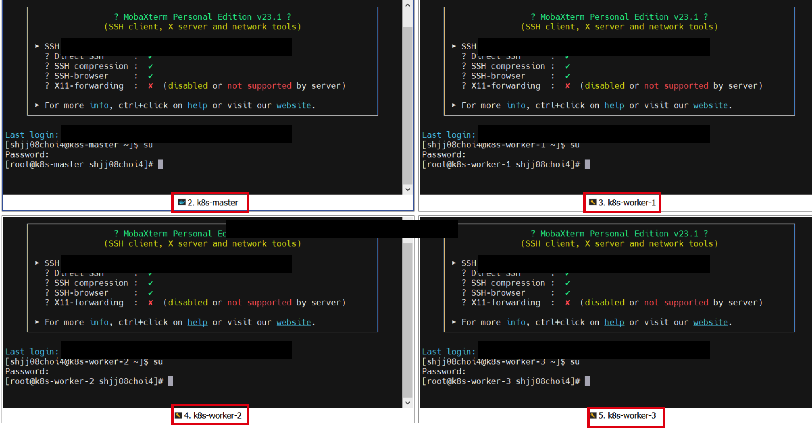{width=80%}</center>


## 6. 쿠버네티스 클러스터 생성

이제 쿠버네티스의 클러스터를 만들어주고 여러 세팅을 해주자. 서버를 시작 했으니 다음의 과정은 **항상 무조건** 신행해주자. 

- root 계정 접근

```bash
su
```

- 스왑메모리 해제

```bash
sed -i '/ swap / s/^\(.*\)$/#\1/g' /etc/fstab
swapoff -a
```


### 6-1. Master Node 세팅

우선 마스터 노드 부터 세팅 해보자. kubeadm init 커맨드를 사용하여 클러스터를 초기화 한다.

```bash
kubeadm init
```

이를 실행하게 되면 다음과 같은 결과를 볼 수 있다.

<center>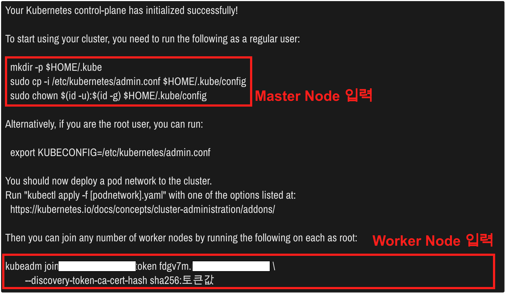{width=80%}</center>

여기서 다음의 커맨드를 그대로 복사 해서 Master Node에 그대로 입력 해준다.

```
mkdir -p $HOME/.kube
sudo cp -i /etc/kubernetes/admin.conf $HOME/.kube/config
sudo chown $(id -u):$(id -g) $HOME/.kube/config
```

이렇게 Master Node의 세팅은 성공적으로 마무리 되었다. 

### 6-2. Worker Node 세팅

이번에는 Worker Node에 세팅을 해주자. 'kubeadm init'커맨드를 통해 나온 결과중 가장 하단의 'kubeadm join ... ' 메시지를 복사해서 Worker Node에 각각 복사해준다.

### 6-3. Master Node Join 확인

자 이제 Master Node에 가서 Werker Node가 잘 Join 되었는지 확인해보자. 다음의 커맨드를 입력 해보자.

```
kubectl get nodes
```

다음은 'kubectl get nodes' 커맨드를 입력했을 때 나오는 결과이다. k8s-worker-1,2,3이 join 되었으나 STATUS가 현재 'NotReady'로 표시 되어 있다. 이를 Ready로 바꿔주는 작업을 진행하자.

```
NAME           STATUS     ROLES           AGE    VERSION
k8s-master     Ready      control-plane   6d8h   v1.28.2
k8s-worker-1   NotReady      <none>       6d8h   v1.28.2
k8s-worker-2   NotReady      <none>       6d8h   v1.28.2
k8s-worker-3   NotReady      <none>       6d8h   v1.28.2
```


### 6-4. Master Node:  Weave 네트워크 플러그인을 사용하여 CNI 구성 적용

거의 다 왔다. 이제 Kubernetes 클러스터에 Weave 네트워크 플러그인을 설치하고, 이를 통해 CNI(Container Network Interface) 를 활용하여 컨테이너 간 네트워크 설정을 구성하자. 이것을 해주어야. 각 컨테이너간의 접속이 가능하다.

```
kubectl apply -f https://github.com/weaveworks/weave/releases/download/v2.8.1/weave-daemonset-k8s.yaml
```

이 작업을 하고 다시 'kubectl get nodes' 커맨드를 입력 하면 다음과 같은 결과를 확인할 수 있다

```
NAME           STATUS     ROLES           AGE    VERSION
k8s-master     Ready      control-plane   6d8h   v1.28.2
k8s-worker-1   Ready      <none>          6d8h   v1.28.2
k8s-worker-2   Ready      <none>          6d8h   v1.28.2
k8s-worker-3   Ready      <none>          6d8h   v1.28.2
```

## 총평

이렇게 GCE에 쿠버네티스 설치와 환경세팅이 끝이 났다. 이후에는 노드를 추가 해보고, 운영을 위한 여러 세팅에 대한 내용, GKE, EKS 등등에 대해 다루면 될듯 하다. 앞으로 쿠버네티스에 대해 많은 글이 올라갈것 같다.

---

## Reference

- [aoc55님의 블로그 : 쿠버네티스 구축](https://aoc55.tistory.com/54)
- [AWS EC2에 kubernetes 설치하기](https://velog.io/@eunbyul/AWS-EC2%EC%97%90-kubernetes-%EC%84%A4%EC%B9%98%ED%95%98%EA%B8%B0)
- [k8s 공식문서](https://kubernetes.io/ko/docs/setup/production-environment/tools/kubeadm/install-kubeadm/)


