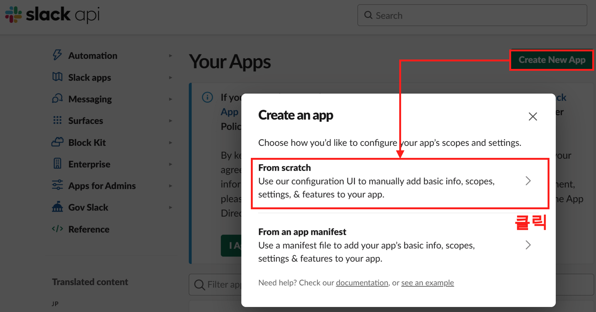
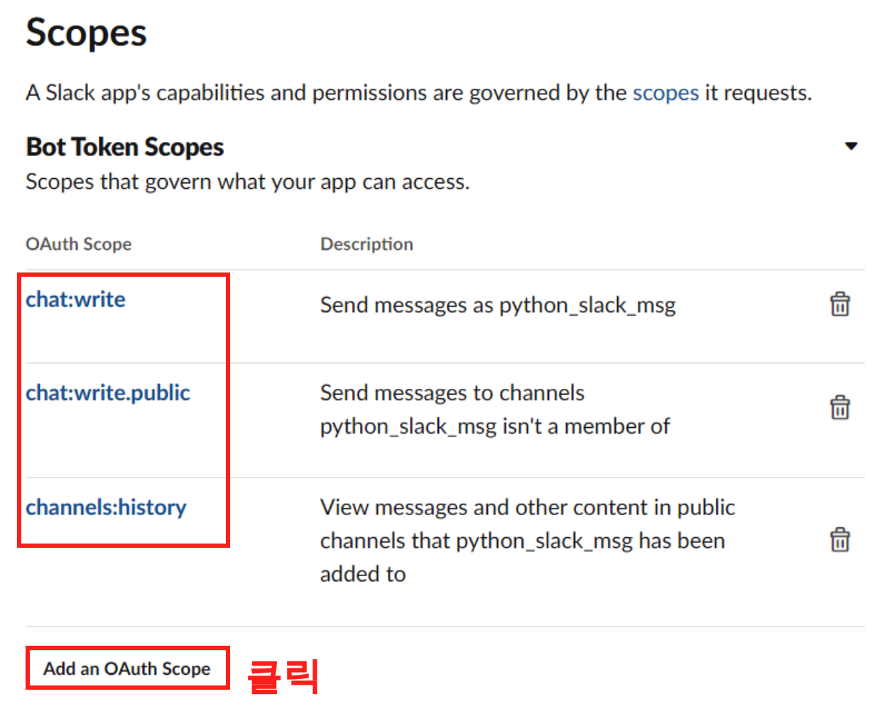
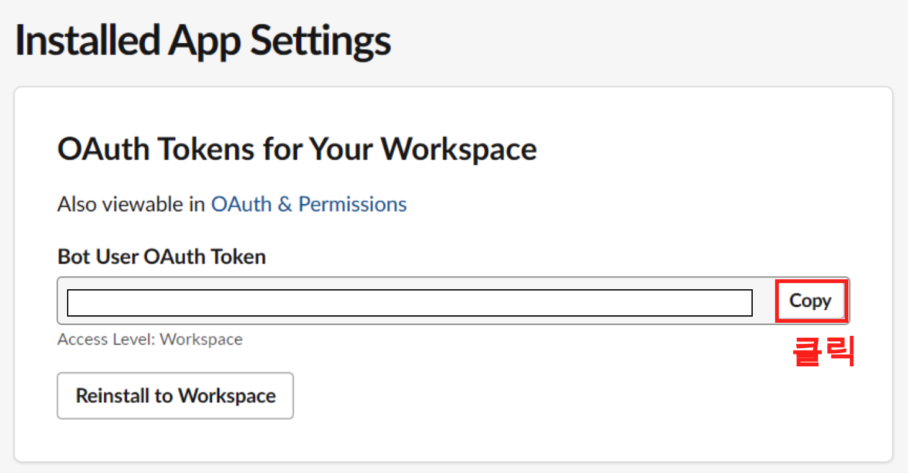
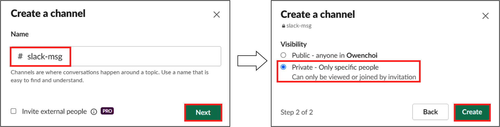
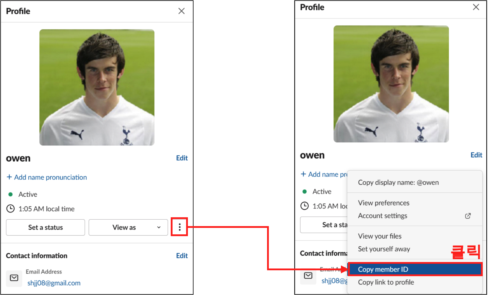

<center>
{width=60%}
</center>


이번에는 파이썬으로 Slack 메시지를 보내 보자. 지난번에 Python으로 Gmail보내는 글을 썼었고, 데이터 수집에 대한 로그로 Gmail로 보냈었다. 그러나 매일 쌓여가는 로그 email이 쌓이다보니 정작 중요한 메일을 확인할 수 없는 상황이 오게 되었다. 그래서 이참에 파이썬으로 Slack 메시지 보내는 글을 적어 보려 한다. 본 블로그는 기본적으로 슬랙계정과 Workspace가 있어야 한다. 그럼 하나씩 알아보자.

## Slack API Key 생성하기

 우선 Slack api에 접근하기 위해 다음의 링크를 접속 해보자. Slack에 메시지의 권한을 갖는 api를 얻기 위함이다.

- https://api.slack.com/apps

### Step 1. 

링크를 타고 들어가면 다음과 같은 화면을 확인할 수 있다. 여기서 'Create New App' 버튼을 클릭하고 'From scratch'를 클릭해준다.

<center>
{width=60%}
</center>

### Step 2. 

그러면 App Name과 Workspace 입력 란이 나오는데, 다음과 같이 입력해주고 'Create App' 버튼을 클릭해주면 된다.

<center>
{width=60%}
</center>

### Step 3. 

이번에는 Slack에 메시지를 위한 권한을 부여해줄 차례다. Permissions버튼을 클릭해주자.

<center>
{width=60%}
</center>

### Step 4.

이제 권한을 부여해줄 차례이다. 스크롤을 해서 아래로 화면을 내리면 Scopes 부분이 나오는데 이곳에서 'Add on OAuth Scope'버튼을 클릭하고 각각의 권한을 부여해주자.

- chat:write
- chat:write.public
- channels:history

<center>
{width=60%}
</center>

### Step 5. 

그리고 다시 스크롤을 올려, 'Install to Workspace' 버튼을 클릭해주자.

<center>
{width=60%}
</center>

### Step 5. 

그러면 이제 다음과 같이 OAuth Token 을 얻을 수 있다. 이 Token은 복사 해서 보관해두자. 

<center>
{width=60%}
</center>

## Slack App 추가

이번에는 메시지를 받을 슬랙 채널을 추가 하고 메시지를 보낼 App을 여기에 추가 해주자. Step 2에서 생성한 App name을 추가할 예정이다.

### Step 1.

Add channels 버튼을 클릭하고 Create a new channel 버튼을 클릭해주자

<center>
{width=60%}
</center>

### Step 2. 

slack-msg 라는 채널을 만들어주고 비공개로 만들어주었다. 

<center>
{width=80%}
</center>

### Step 3.

채널을 만들고 Step 2에서 만들어둔 app을 추가 해주자. python_slack_msg라고 만들었으니 @python_slack_msg을 해주어 채널에 추가 시켜주었다.

<center>
{width=60%}
</center>

### Step 4. 

이번엔 내 계정의 member ID를 얻어 보자. 이는 선택 사항이며, 메시지를 보낼때 멘션을 걸어서 확인하기 위함이다

<center>
{width=60%}
</center>

## Python Slack 메시지 전송

여기까지 우리는 

- Slack app을 생성했고, 
- token 을 얻었고, 
- Slack 채널에 slack app을 추가 해주었고, 
- 내 계정의 Member ID를 만들었다.

이제 이를 사용해서 파이썬에서 슬랙으로 메시지를 보내보자.

### Step 1.

우선 슬랙에 보내기 위한 slack_sdk 를 설치 해주자.

```bash
pip3 install slack_sdk
```

### Step 2.

파이썬 코드는 간단하다. 다음의 코드를 그대로 적어 주면 된다.

```python
import slack_sdk

slack_token = 'Bot User OAuth Token'

client = slack_sdk.WebClient(token=slack_token)

user_id = "멘션할 사용자 ID"
slack_msg = f'<@{user_id}> 파이썬 슬랙 메시지 전송' 

response = client.chat_postMessage(
    channel="slack_msg",
    text=slack_msg
)
```

위 코드를 사용해서 테스트를 하면 다음과 같이 결과를 확인할 수 있다.

<center>
{width=60%}
</center>
