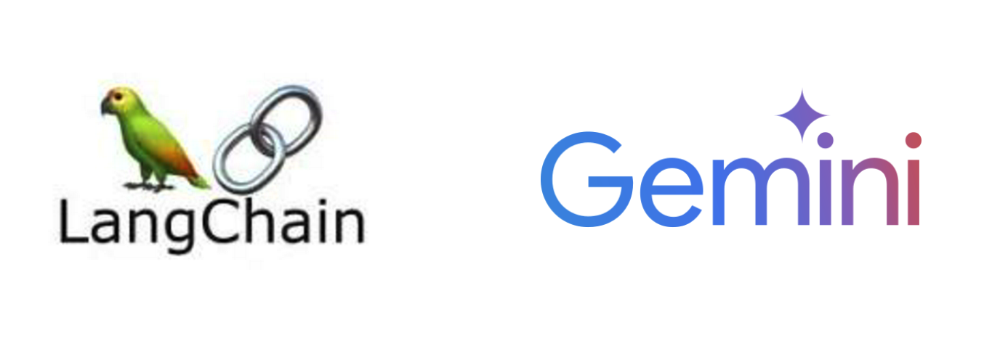

<center>
{width=60%}
</center>

이번에는 Google의 Gemini를 사용해서 Langchain에 PDf 파이프라인을 구축 해보려고한다. 랭체인을 처음 접했을때는 랭체인코리아에서 잘 정리해준 코드를 사용해서 RAG 파이프라인을 구축하고 Streamlit을 사용한 블로그를 작성했었다. 당시에 사용한 임베딩과 LLM 모델은 Openai의 ChatGPT-3.5를 사용했었다. 이는 사용한만큼 api에 대한 비용을 지불 하기때문에 1분에 60회 무료인 Gemini 모델을 사용하여 부분적으로 무료로 사용해보고자 이번 블로그를 작성한다. 그리고 이후에는 다음의 과정을 밟아 가면서 블로그를 작성할 예정이다.

- Streamlit을 대체 할수 있는 Langserve를 사용해보고, Cloud run에 배포 하는 과정
- HuggingFace의 오픈 소스 LLM을 사용해서 RAG 파이프라인 구축
- Vast ai의 GPU 서버를 대여 하고 오픈소스 LLM을 하나 선택하여 파인튜닝 하는 과정

## 최종목표

결국 최종적으로는 오픈소스 LLM을 파인튜닝 하고, 거기에 추가로 RAG 파이프라인을 추가 해서 최종적으로 특정 상황에 최적화된 챗봇을 만들어 보는 것이 목표이다. openai, gemini 등등 각 기업에서 사용하는 API를 사용하는 것에 비해 오픈소스 LLM을 사용하는 것의 장점은 다음과 같다.

- 기업의 API
1. 지속적으로 소모되는 API비용
2. API 의존성이 높아져서 서비스의 안정성이 떨어짐
3. API 통신을 하기 때문에 기업 정보에 대한 보안적으로 불안함

- 오픈소스 LLM을 사용했을 때의 장점
1. GPU 서버 구축에 대한 초기 비용을 제외 하면, 추가 비용 없음
2. 기업 내부 서버를 사용하기 때문에 보안적으로 안전함

## Gemini를 사용한 Langchain 

### 라이브러리 

우선 라이브러리를 불러와주자. openai api키를 사용하는 것에서, gemini api키를 사용하기 때문에 전개는 다음의 블로그와 동일하다.

- [PDF를 학습한 나만의 챗봇 streamlit에 배포 하기](https://unfinishedgod.netlify.app/2023/12/16/langchain-pdf-streamlit/)

```python
import pandas as pd
import glob

import os

from langchain.document_loaders import PyPDFLoader

from langchain.embeddings.cohere import CohereEmbeddings
from langchain_google_genai import GoogleGenerativeAIEmbeddings

from langchain.text_splitter import CharacterTextSplitter
from langchain.vectorstores.elastic_vector_search import ElasticVectorSearch
from langchain.vectorstores import Chroma
from langchain.chains import RetrievalQAWithSourcesChain

from langchain_google_genai import ChatGoogleGenerativeAI

# Build a sample vectorDB
from langchain.document_loaders import WebBaseLoader

from langchain.prompts.chat import (
    ChatPromptTemplate,
    SystemMessagePromptTemplate,
    HumanMessagePromptTemplate,
)
```


### Gemini api key 

 Gemini의 api키가 필요한데, 다음 블로그를 참고하여 api키를 얻어주자.

- [아주 간단한 파이썬에서 Google Gemini 사용하기](https://unfinishedgod.netlify.app/2024/01/09/gcp-google-gemini/)

```python
api_key = 'Gemini api key'
os.environ["GOOGLE_API_KEY"] = api_key 
```

### Pdf Load 및 텍스트 split

그리고 나서 pdf를 불러와주고, 이 문서를 텍스트로 분할 해주자.

```python
loader = PyPDFLoader('./샘플.pdf')
documents = loader.load()

text_splitter = CharacterTextSplitter(chunk_size=1000, chunk_overlap=0)
texts = text_splitter.split_documents(documents)
```

### 임베딩

이제 단어 임베딩을 해줄 차례이다. 여기서 지난번 블로그와 차이가 생기는데, openai의 임베딩 모델이 아닌 gemini의 임베딩 모델을 사용한다.

```python
embeddings = GoogleGenerativeAIEmbeddings(model="models/embedding-001") # gemini의 임베딩 모델
# embeddings = OpenAIEmbeddings() # openai 의 임베딩모델

vector_store = Chroma.from_documents(texts, embeddings)
retriever = vector_store.as_retriever(search_kwargs={"k": 3})
```

### 프롬프트 개선

프롬프트를 개선 하는 과정이다. 지난 블로그와 동일하며 이에 대한 자세한 개선 사항은 추후에 필요하면 나눠서 글을 작성할 예정.

```python

system_template="""
Use the following pieces of context to answer the users question shortly.
Given the following summaries of a long document and a question, create a final answer with references ("SOURCES"), use "SOURCES" in capital letters regardless of the number of sources.
If you don't know the answer, just say that "I don't know", don't try to make up an answer.
----------------
{summaries}

You MUST answer in Korean and in Markdown format:"""

messages = [
    SystemMessagePromptTemplate.from_template(system_template),
    HumanMessagePromptTemplate.from_template("{question}")
]

prompt = ChatPromptTemplate.from_messages(messages)
```

### 모델 학습

임베딩이 끝났고, 프롬프트도 개선이 되었으니, 이를 학습 시켜 주자. openai의모델이 아닌 gemini-pro모델을 사용해준다. ChatGoogleGenerativeAI()함수에 convert_system_message_to_human=True 옵션을 넣어 주어야 한다.

```python
chain_type_kwargs = {"prompt": prompt}

llm = ChatGoogleGenerativeAI(model="gemini-pro", 
                             convert_system_message_to_human=True) # gemini pro 모델
# llm = ChatOpenAI(model_name="gpt-3.5-turbo", temperature=0)  # openai의 gpt-3.5-turbo 모델
                             

chain = RetrievalQAWithSourcesChain.from_chain_type(
    llm=llm,
    chain_type="stuff",
    retriever = retriever,
    return_source_documents=True,
    chain_type_kwargs=chain_type_kwargs
)
```

### 결과 확인

결과를 확인해보자. 실제 학습한 pdf는 채권관련된 법률 pdf를 학습 했기 때문에 다음과 같은 결과를 얻을 수 있다.

```python
query = "주제가 뭐야?"
result = chain(query)
result['answer']
```

```
채권 조사 확정 재판에서 변호사 보수를 소송비용에 포함시킬 수 있는지 여부에 대한 판례
```


## 총평

LLM 의 열기가 뜨겁다. 그동안에는 openai나 gemini에 대한 api를 사용하여 챗봇에 대한 글을 적어왔었다. 맨 앞에서 언급 했듯이, 앞으로는 점점 오픈소스 LLM으로 넘어가면서 파인튜닝 및 RAG를 사용하여 api의 힘을 빌리지 않고 자체 챗봇을 구축하는 과정을 적어봐야 겠다


---

## Reference

- [오픈소스 LLM으로 RAG 시스템 만들기](https://www.youtube.com/watch?v=04jCXo5kzZE&t=674s)

