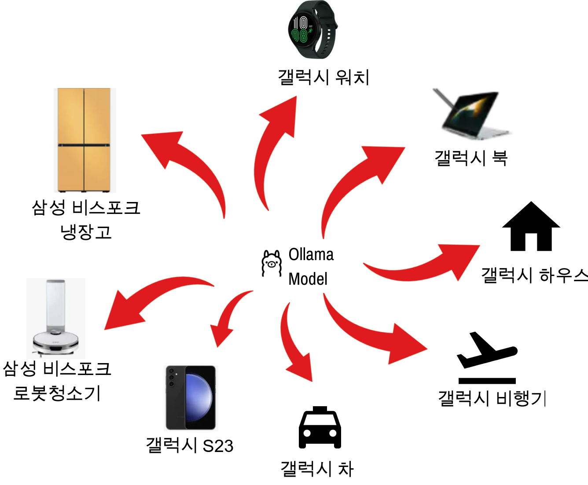
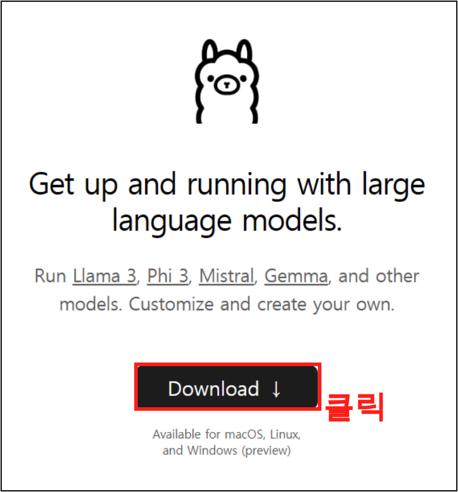
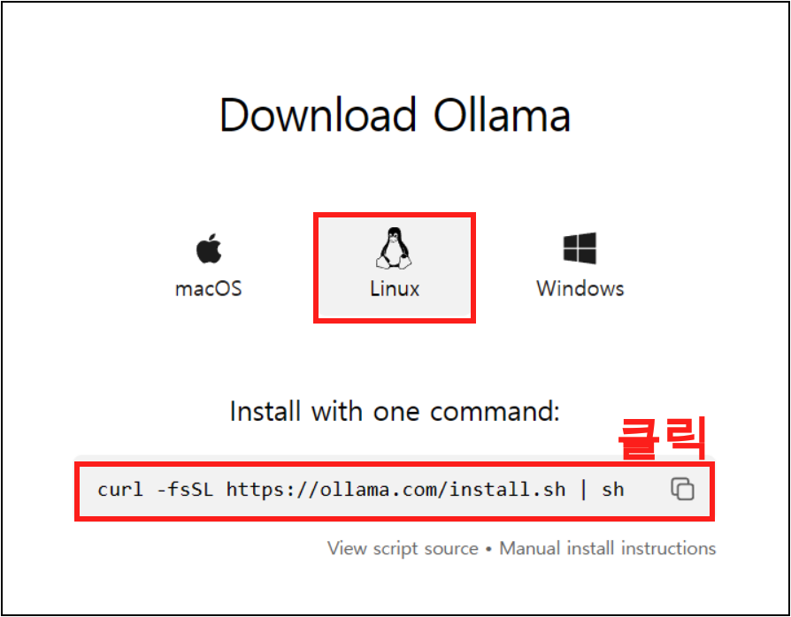
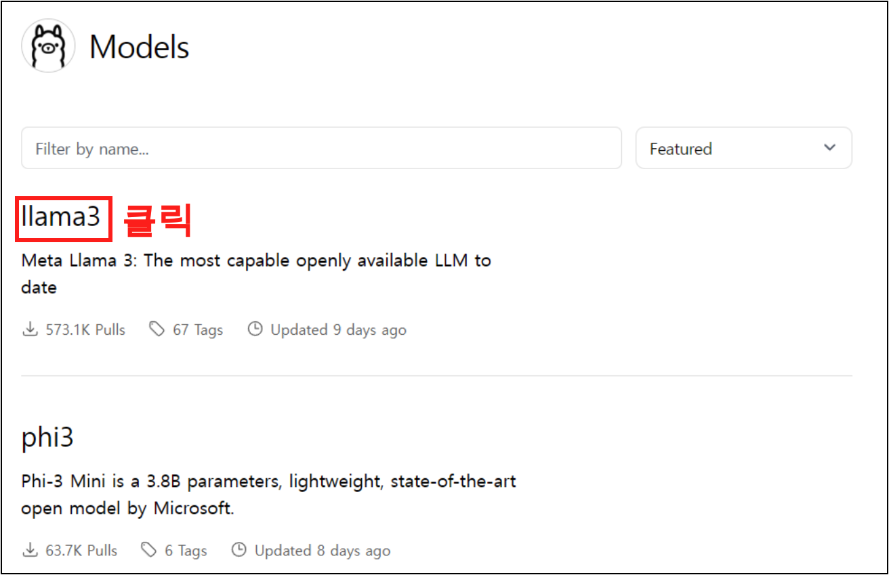
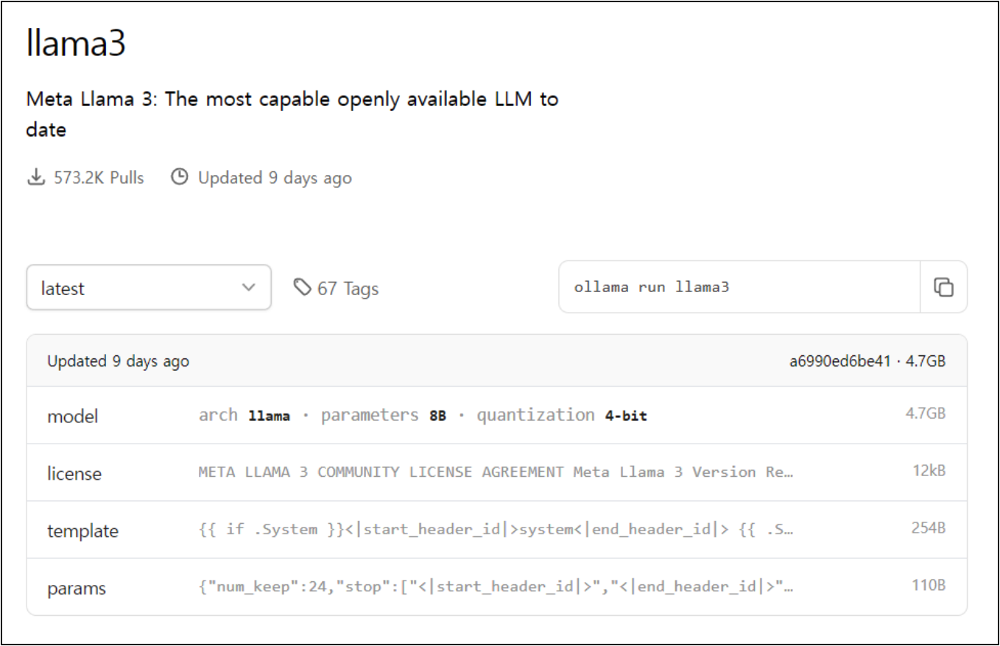
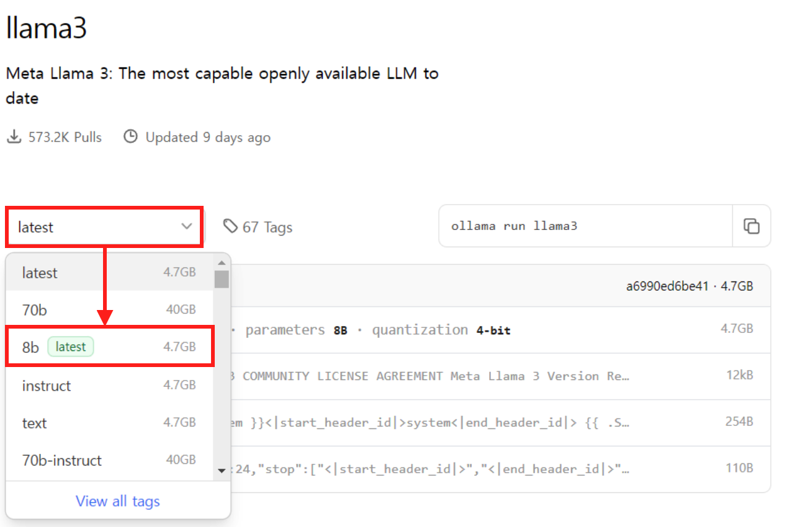
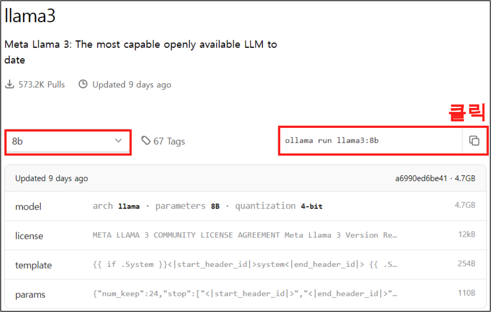

<center>
{width=60%}
</center>

LLM의 열기가 매우 뜨겁다. OpenAI의 GPT, Google의 Gemini 등등 듣기는 들었으나 이를 사용하기 위해서는 API 키를 통해 사용할 수 밖에 없었다. 물론 Huggingface가 다른 해결책이긴 하지만 사용하기는 여간 어려운게 아니다. 그래서 아주 쉽게 로컬 PC에 설치하여 사용이 가능한 Ollama에 대해 알아보려고 한다.

## Ollama 란?

Ollama란, 오픈소스 LLM을 로컬 PC에서 실행할수 있는 플랫폼이다. Ollama를 사용하게 되면 메타의 llama 이나 미스트랄에서 만든 mistral 등등의 오픈소스 LLM 을 개인 컴퓨터에서 사용할 수 있다는 장점이 있다. 또한, 최근에 Meta에서 LLama3가 출시되면서 발빠르게 Ollama도 Llama 3도 지원한다.

### 그래서 어디에 사용할 수 있는데?

<center>
{width=80%}
</center>

이렇게 로컬에서 쉽게 우리가 원하는 LLM 모델을 사용하게 되면 여러 장점이 있다. 그중에 가장 큰 장점이라고 꼽자면, 로컬 PC가 우리가 생각하는 노트북 뿐만 아니라 핸드폰, 워치, 여러 곳에 접목이 가능하기 때문이다. 또한, 파인튜닝된 모델을 gguf로 변환 하고 HuggingFace에 올린후 Ollama로 받는 방법 또한 존재하기 때문에, 모델 자체의 성능 역시 자연스러운 확장이 가능하다. **이를 응용 하여 나중에 시간이 된다면 ollama와 라즈베리파이를 사용한 간단한 프로젝트에 대한 내용을 담아 볼 예정이다.**

## Ollama 설치 

그럼 이제 ollama사용법에 대해 알아 보자. 다음은 ollama의 공식 문서이다.

- [Ollama 공식 링크](https://ollama.com/)

### Step 1.

Download 버튼을 클릭해준다.

<center>
{width=40%}
</center>

### Step 2. 

그리고 나서 환경에 따른 설치를 진행하는데 이번 블로그 에서는 리눅스에 설치 및 실행 하는 방법에 대해 알아보려고 한다. 리눅스 버튼을 클릭해주고, 하단의 복사 버튼을 클릭 해준다.

<center>
{width=60%}
</center>

그리고 나서 복사한 커맨드를 다음과 같이 리눅스에 입력 해주면 끝.

```bash
$ curl -fsSL https://ollama.com/install.sh | sh
```

설치를 하면 다음과 같은 메시즈를 볼 수 있는데 GPU가 없으면 맨 아래 WARNING와 함께 CPU Mode로 실행될 예정이라는 문구를 확인할 수 있다. (GPU보다 많이 느리다.) 일단 이렇게 설치는 끝.

```
>>> Downloading ollama...
######################################################################## 100.0%##O#-#                                                                        
>>> Installing ollama to /usr/local/bin...
>>> Creating ollama user...
>>> Adding ollama user to render group...
>>> Adding ollama user to video group...
>>> Adding current user to ollama group...
>>> Creating ollama systemd service...
>>> Enabling and starting ollama service...
Created symlink /etc/systemd/system/default.target.wants/ollama.service → /etc/systemd/system/ollama.service.
>>> The Ollama API is now available at 127.0.0.1:11434.
>>> Install complete. Run "ollama" from the command line.
WARNING: No NVIDIA/AMD GPU detected. Ollama will run in CPU-only mode.
```

## Ollama 모델 리스트

### Step 1. 

Ollama 설치를 완료 했으니 이제 우리가 원하는 모델을 받아 보자. 우측 상단에 모델을 클릭 해주자.

<center>
{width=40%}
</center>

### Step 2. 

그럼 여러개의 모델이 나오게 되는데 이번에는 Llama 3을 선택 하여 받아 보자. Llama 3을 클릭해준다.

<center>
{width=60%}
</center>

### Step 3.

클릭을 하게 되면 llama 3 모델에 대한 정보들을 확인할 수 있다.

<center>
{width=70%}
</center>

### Step 4.

여기에서 왼쪽 중단에 셀렉트박스를 클릭하게 되면 llama 3에 대한 여러버전의 모델들을 확인할 수 있다. 여기서 우리는 8b를 클릭해준다. 8b는 8 billion 을 뜻하고 80억 개의 파라미터로 학습이 되었다는것을 의미 한다. 여기에서 보이는 70b 성능이 더 좋을수는 있어도 용랴잉 40GB나 되니 사용해보기 전에 PC의 스펙을 확인하는것을 추천 한다.

<center>
{width=70%}
</center>

### Step 5.

8b를 선택 했으면 우측에 커맨드를 복사해서 그대로 설치를 진행해주자.

<center>
{width=70%}
</center>


```bash
$ ollama run llama3:8b
```

위의 커맨드 또는 'ollama pull llama3:8b' 역시 설치가 가능하다. run/pull 차이는 run을 사용하게 되면 설치와 동시에 실행이 된다.

설치를 진행 하면 다음과 같이 설치가 성공적으로 진행되는 것을 확인할 수 있다

```
pulling manifest
pulling 00e1317cbf74... 100% ▕█████████████████████████████████████████████▏ 4.7 GB
pulling 4fa551d4f938... 100% ▕█████████████████████████████████████████████▏  12 KB
pulling 8ab4849b038c... 100% ▕█████████████████████████████████████████████▏  254 B
pulling 577073ffcc6c... 100% ▕█████████████████████████████████████████████▏  110 B
pulling ad1518640c43... 100% ▕█████████████████████████████████████████████▏  483 B
verifying sha256 digest
writing manifest
removing any unused layers
success
```


## llama3:8b 사용

설치 및 실행을 완료 했으니 이제 실행을 해보자. ollama를 실행 하면 '>>> Send a message (/? for help)' 를 볼 수 있는데 이제 여기에다가 원하는 문구를 입력하면 llama3:8b가 답변을 해준다. 

```
>>> Send a message (/? for help)
```

다음과 같은 답변을 얻었으니 성공.

```
>>> hello world
Hello World!

```


## 설치 확인

다음의 커맨드를 통해 현재 설치된 모델 리스트를 확인할 수 있다.

```bash
$ ollama list
```

```
NAME            ID              SIZE    MODIFIED
llama3:8b       a6990ed6be41    4.7 GB  1 days ago
```

## 총평

이번에는 로컬에서도 llm을 실행할 수 있는 ollama에 대해 알아 보았다. 이제 이를 하나씩 응용해서 rest api도 만들어보고 라즈베리파이에도 설치해보면서 응용을 진행해볼 예정.


