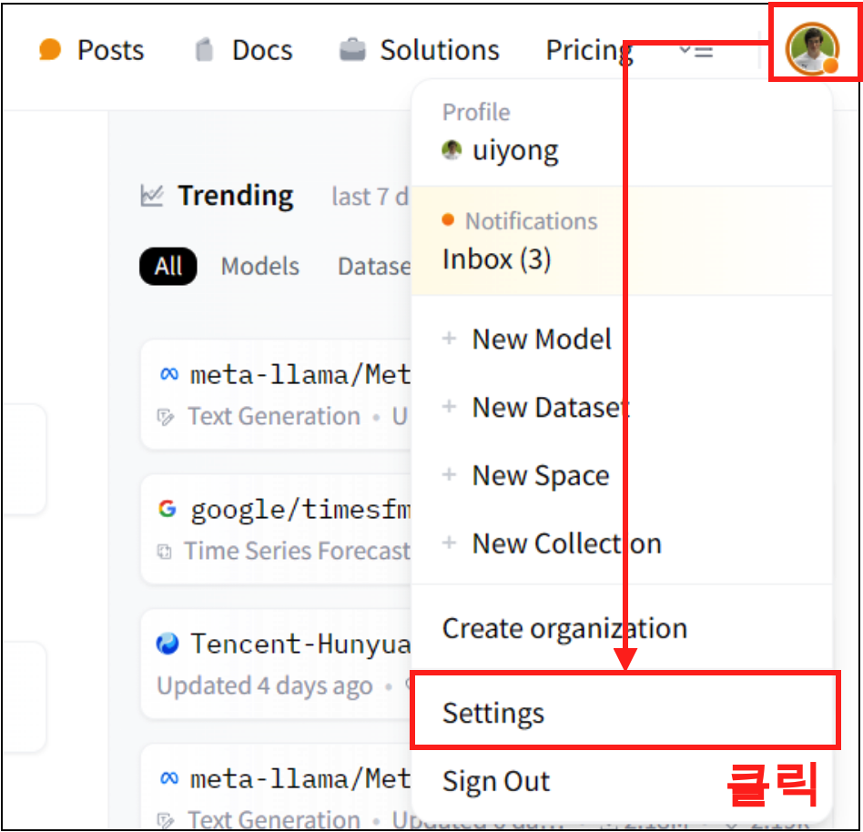

HuggingFace에 대해 알아보자. HuggingFace는 자연어 처리에 사용되는 모델 및 데이터를 공유하는 플랫폼이다. 특히 ChatGPT가 2023년에 유행을 하면서 많은 오픈소스 LLM이 HuggingFace에 올라와 있다. 특히 최근에 공개된 LLama3 같은 경우 많은 사람들이 파인튜닝을 하며 사용을 하고 있는데, 이번에는 HuggingFace에 모델/데이터를 upload하는 방법을 알아보자.

### API key 발급

HuggingFace를 잘 사용하기 위해서는 api key가 필요하다. 다음의 공식 링크를 방문하고 회원가입을 완료 하자.

- [Huggingface 공식 사이트](https://huggingface.co/)

#### Step 1. 

회원가입을 했으면 우측 상단에 Profile 아이콘을 클릭하고 Setting 버튼을 클릭해주자.

{width=60%}

#### Step 2. 

그렇게 Setting 화면으로 넘어가게되면, 왼족의 Access Tokens 버튼을 클릭하고 New token 버튼을 클릭해주자.

{width=60%}

#### Step 3. 

Create a new access token 창이 나오게 된다. 여기 Type에 Read/Write가 나뉘는데 이는 각각 따로 만들어 주면 된다.

{width=70%}

#### API key 발급 

이렇게 API key를 발급받게 되면 다음과 같이 성공적으로 api key가 등록된것을 확인할 수 있다.

{width=60%}

