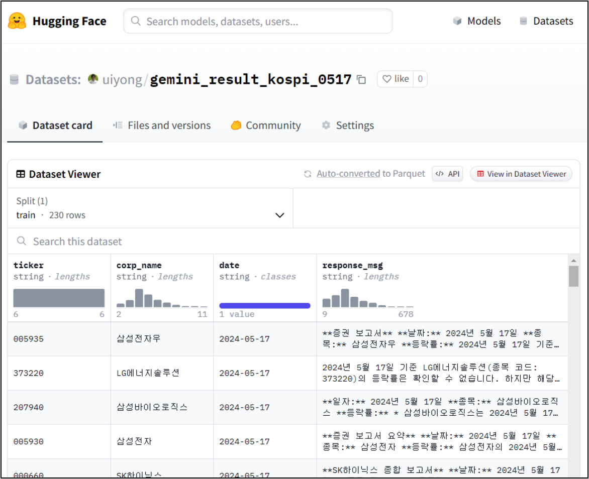
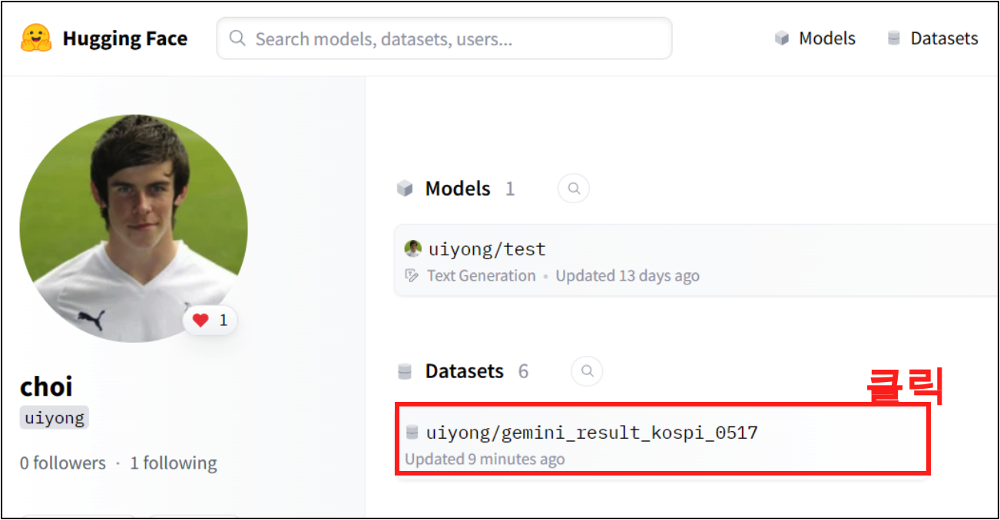
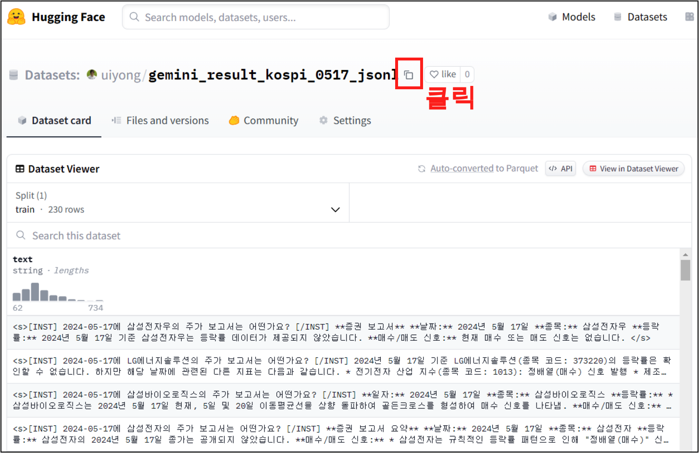

<center>
{width=50%}
</center>


이번에는 Huggingface에 데이터셋을 업로드 해보자. Huggingface에 업로드하기 위해서는 api 키가 우선적으로 있어야 하므로 다음의 링크를 통해 발급받으면 된다.

- [Huggingface에 API키 발급](https://unfinishedgod.netlify.app/2024/05/19/huggingface-api/)

## Dataset Upload

그럼 이제 데이터를 업로드 해보자. Huggingface에 데이터 업로드 하는 방법은 여러가지 있으나, 이번에는 파이썬에서 진행을 해보려고 한다.

### 필요한 라이브러리

우선 기본적으로 pandas를 불러오자. 여러 가지 방법중에 가장 많이 쓰이는 데이터라서 pandas를 선택 하자. 물론 jsonl이 필요할 때가 있긴 한데, 이는 다음에 필요할때 블로그할 예정. 그리고 datasets의 load_datset, Dataset을 불러주자.

```python
import pandas as pd
from datasets import load_dataset
from datasets import Dataset
```

그리고 huggingface_hub를 통해 로그인을 해주자. 여기서 huggingface의 api key를 입력 해주면 된다. 우선 업로드를 위해 write api key를 입력 해주자.

```python
import huggingface_hub
huggingface_hub.login()
```

<center>
{width=60%}
</center>


또는 다음과 같이 바로 api키를 입력해줘도 된다

```python
import huggingface_hub
huggingface_hub.login('huggingface apikey')
```

### Dataset 변환

이제 본격적으로 데이터를 업로드 해보자. 우선 `gemini_result_kospi_0517.csv` 라는 csv 파일을 하나 만들어 두었다. 이 파일은 5월 17일 주가에 대한 지표를 분석 하고 이를 gemini api를 통해 만들어둔 지표 들을 정리 해둔 파일이다. 이를 huggingface dataset 에 업로드를 할 예정이다.

```python
df = pd.read_csv("gemini_result_kospi_0517.csv")
df(head)
```

파일의 구성은 다음과 같다. 

```
ticker	corp_name	date	response_msg
0	005935	삼성전자우	2024-05-17	**증권 보고서**\n\n**날짜:** 2024년 5월 17일\n\n**종목:** ...
1	373220	LG에너지솔루션	2024-05-17	2024년 5월 17일 기준 LG에너지솔루션(종목 코드: 373220)의 등락률은 ...
2	207940	삼성바이오로직스	2024-05-17	**일자:** 2024년 5월 17일\n\n**종목:** 삼성바이오로직스\n\n**...
3	005930	삼성전자	2024-05-17	**증권 보고서 요약**\n\n**날짜:** 2024년 5월 17일\n\n**종목:...
4	000660	SK하이닉스	2024-05-17	**SK하이닉스 종합 보고서**\n\n**날짜:** 2024년 5월 17일\n\n*..
```

그리고 이를 `Dataset.from_pandas()` 함수를 통해 huggingface에 적재할 수 있도록 변환 시켜주는 작업을 거쳐 준다.

```python
dataset = Dataset.from_pandas(df)
dataset
```
```
Dataset({
    features: ['ticker', 'corp_name', 'date', 'response_msg'],
    num_rows: 230
})
```

그러면 위와 같이 변환이 된것을 확인할 수 있다. 

물론, 판다스의 데이터프레임을 불러오지 않고 바로 변환 시키려면 `Dataset.from_dict()` 함수를 사용해도 된다.

```python
dataset = Dataset.from_dict("gemini_result_kospi_0517.csv")
```

### huggingface에 업로드

이제 이를 가지고 업로드를 진행 해준다. `dataset.push_to_hub()` 함수를 사용하면 되며 본인의 '계정명/데이터셋 이름' 형태로 작성해주고 업로드 하면 huggingface에 데이터가 성공적으로 업로드 되는것을 확인할 수 있다.

```python
dataset.push_to_hub("uiyong/gemini_result_kospi_0517")
```

이제 huggingface의 계정으로 넘어가면 다음과 같이 dataset이 올라간것을 확인할 수 있다. 그리고 데이터셋을 클릭해보자.

<center>
{width=70%}
</center>


데이터셋을 클릭하면 다음과 같이 데이터가 성공적으로 올라간것을 확인할 수 있다. 

### 파인튜닝용 데이터셋 업로드 

이제 파인튜닝을 위한 데이터셋을 만들어보고 파인튜닝용 데이터셋을 업로드 해주자. 파인튜닝용 데이터셋을 만들기 위해서 질문과 답변에 대해 나눠주고, 다음과 같이 <s>, [INST]로 감싸주고 </s>, [/INST]로 감싸주었다. 추후에 파인튜닝에 대한 데이터와 파인튜닝에 대한 내용은 몇개의 블로그로 나뉘어서 상세하게 작성할 예정이다. 현재는 간단하게 구현을 목적으로 작업을 진행해보자.

```python
df['inputs'] = df['date'] +'에 ' +  df['corp_name'] + '의 주가 보고서는 어떤가요?'
df['total'] = '<s>[INST] ' + df['inputs'] + ' [/INST] ' + df["response_msg"] + ' </s>'
df['total']
```
```
0      <s>[INST] 2024-05-17에 삼성전자우의 주가 보고서는 어떤가요? [/I...
1      <s>[INST] 2024-05-17에 LG에너지솔루션의 주가 보고서는 어떤가요? ...
2      <s>[INST] 2024-05-17에 삼성바이오로직스의 주가 보고서는 어떤가요? ...
3      <s>[INST] 2024-05-17에 삼성전자의 주가 보고서는 어떤가요? [/IN...
4      <s>[INST] 2024-05-17에 SK하이닉스의 주가 보고서는 어떤가요? [/...
```

이제 이 df['total'] 부분을 `Dataset.from_dict()` 함수로 감싸주고 'uiyong/gemini_result_kospi_0517_jsonl'에 업로드 해보자.

```python
fine_tune_data = Dataset.from_dict({"text": df['total']})
fine_tune_data.push_to_hub("uiyong/gemini_result_kospi_0517_jsonl")
```

이제 다운로드를 해보자. 그전에 이 데이터셋의 주소를 클릭하여 복사를 해주자.
 
<center>
{width=70%}
</center>


## Dataset Download

이렇게 성공적으로 데이터를 업로드 했으니 업로드한 데이터셋을 다운로드 해보자. `load_dataset()` 함수를 사용하여 dataset이 있는 계정과 파일명 주소를 같이 입력해주면 된다.

```python
dataset = load_dataset('uiyong/gemini_result_kospi_0517_jsonl')
dataset
```
```
DatasetDict({
    train: Dataset({
        features: ['text'],
        num_rows: 230
    })
})
```

불러오게 되면 위와 같이 딕셔너리 형태로 데이터가 불러와지는것을 알 수 있는데, 이는 다음과 같이 데이터 프레임으로 변환하면 간단하게 확인할 수 있다.

```python
pd.DataFrame(dataset['train'])
```

## 총평

이렇게 huggingface에 데이터를 업로드/다운로드 하는 방법에 대해 알아보았다. 사실 모델 업로드/다운로드도 간단하지만 다음에 파인튜닝을 하면서 진행해보려고 남겨 두었다. 다음에는 오픈소스 모델인 LLama3의 파인튜닝에 대해 알아보고, 이에 대해 업로드 하는 방법에 대해 알아보자.

---

## Reference 

- [Huggingface 공식문서: Upload a dataset to the Hub](https://huggingface.co/docs/datasets/v1.16.0/upload_dataset.html)
- [HK CODE님의 유튜브: 학습데이터 생성](https://www.youtube.com/watch?v=mljLcQ_N9h0)