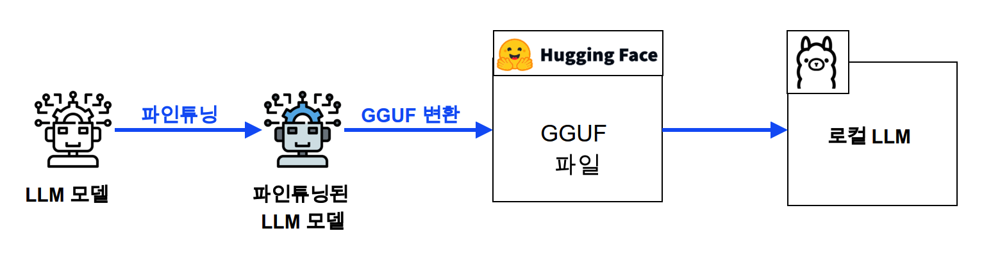
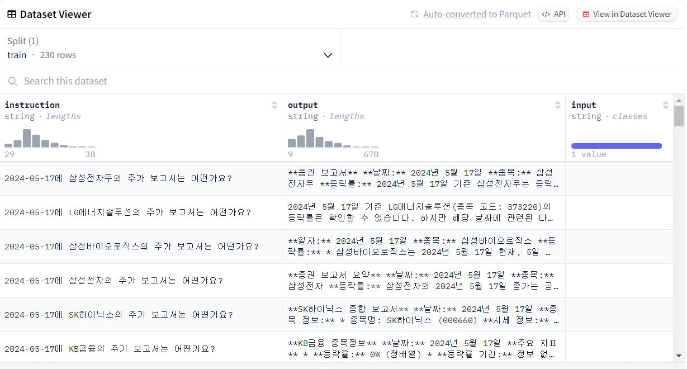
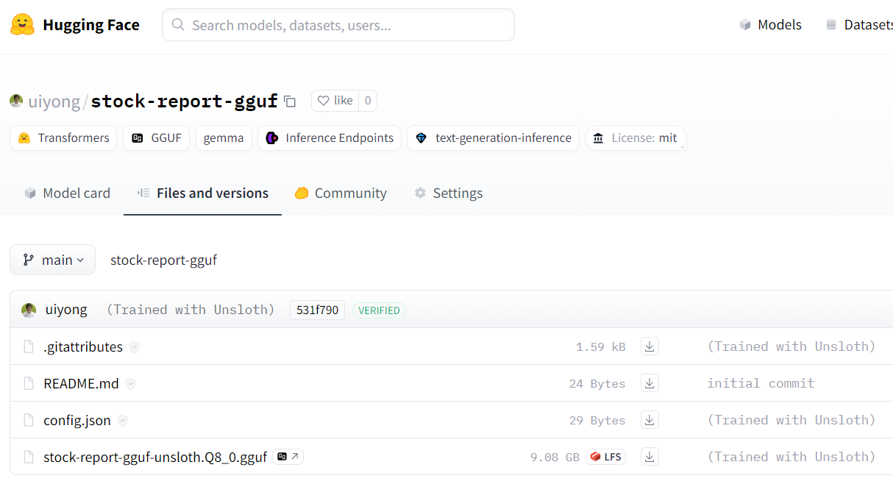
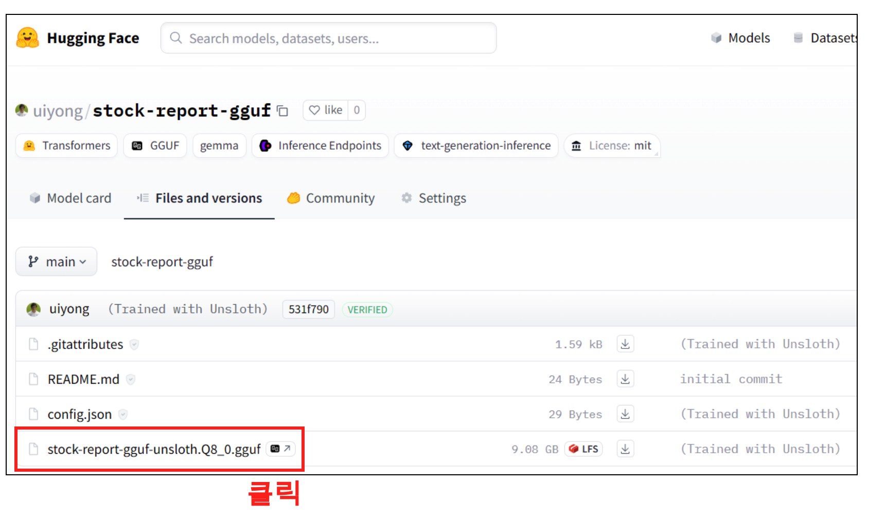

<center>
{width=90%}
</center>


LLM 모델을 파인 튜닝 하고, 이 모델을 gguf로 변환 해보자. 그리고 최종적으로 ollama 에 올려서 테스트를 진행해보려고 한다. 지난번에 LLM 모델을 파인튜닝하고 Huggingface에 업로드 하는 블로그를 작성했었다. 그러나 이 모델을 가지고 ollama에서 사용하기 위해서는 GGUF 파일이 필요하다. 그렇기 때문에 이번에는 파인튜닝하고 이 모델을 GGUF로 변환하여 Huggingface에 적재 하는 글에 대해 작성해보려고 한다.

## GGUF란?

GGUF는 Georgi Gerganov라는 개발자가 만든 딥러닝 모델을 저장하는 단일 파일 포맷이다. gguf 파일을 사용하게 되면 LLM 모델을 ollama에서도 가져와서 사용할 수 있는 장점이 있다. 

## 1. 파인튜닝

우선 파인튜닝을 진행해보자. 이번에 추가로 소개할 라이브러리는 unsloth이며 unsloth를 사용하여 GGUF로 변환할 예정이다. unsloth의 공식문서는 다음과 같다.

- [unsloth의 github 공식문서](https://github.com/unslothai/unsloth)

### 1-1. 라이브러리 설치

우선 다음과 같이 colab에 라이브러리를 설치 해주자. 파인튜닝에 대한 과정은 지난 블로그와 매우 비슷하기 때문에 간략하게 작성하고 넘어가도록 하려고 한다.

```bash
%%capture
!pip install "unsloth[colab-new] @ git+https://github.com/unslothai/unsloth.git"
!pip install --no-deps xformers trl peft accelerate bitsandbytes
```

### 1-2. 라이브러리 로드

이제 필요한 라이브러리를 로드 해주자. 

```python
from unsloth import FastLanguageModel
from datasets import load_dataset
import torch
from trl import SFTTrainer
from transformers import TrainingArguments

import huggingface_hub
huggingface_hub.login('Huggingface 토큰')
```

### 1-3. model, tokenizer 로드

model, tokenizer를 불러 온다. unsloth를 보면 다음과 같이 여러가지의 모델들을 불러올 수 있게 된다. 여기서 우리는 'gemma-7b-bnb-4bit' 를 불러와서 진행 해보려고 한다.

```python
max_seq_length = 2048
dtype = None 
load_in_4bit = True 

# unsloth에서 제공하는 기본 모델들
fourbit_models = [
    "unsloth/mistral-7b-v0.3-bnb-4bit",     
    "unsloth/mistral-7b-instruct-v0.3-bnb-4bit",
    "unsloth/llama-3-8b-bnb-4bit",          
    "unsloth/llama-3-8b-Instruct-bnb-4bit",
    "unsloth/llama-3-70b-bnb-4bit",
    "unsloth/Phi-3-mini-4k-instruct",      
    "unsloth/Phi-3-medium-4k-instruct",
    "unsloth/mistral-7b-bnb-4bit",
    "unsloth/gemma-7b-bnb-4bit",        
    "unsloth/solar-10.7b-bnb-4bit",
] # More models at https://huggingface.co/unsloth

model, tokenizer = FastLanguageModel.from_pretrained(
    model_name = "unsloth/gemma-7b-bnb-4bit",
    max_seq_length = max_seq_length,
    dtype = dtype,
    load_in_4bit = load_in_4bit,
)
```

### 1-4. PEFT 모델 설정

FastLanguageModel 라이브러리를 사용하여 LoRA 기법을 적용해보자. 각각의 옵션에 대한 설명은 다음과 같다.

- r : RoRA의 랭크를 설정한다. LoRA는 저랭크 행렬을 사용하여 모델을 효율적으로 업데이트 가능하다. 값이 작을 수록 메모리 사용량이 줄어들지만, 모델의 표현 능력이 제한될 수 있다.
- target_modules: LoRA를 적용할 모델 내부의 특정 모듈을 지정해준다. 
- lora_alpha: LoRA의 alpha 파라미터. 
- lora_dropout: LoRA의 드롭아웃. 드롭아웃은 모델의 일반화 성능을 향상시키기 위해 사용되는 기술이지만, 여기서는 사용하지 않았다.
- bias: 바이어스 항목의 사용여부.  
- use_gradient_checkpointing: unsloth 옵션을 사용하여, 메모리 효율성을 높힌다. 특히 unsloth 기법은 효율적인 그레디언트 체크포인팅 기법으로, 메모리 사용량을 줄이면서 계산 속도를 향상시킨다.
- random_state: 난수 생성 시드
- use_rslora: False로 지정
- loftq_config: LoFtR(Low-Rank Factorized Tensor Reinforcement) 양자화 설정. None로 하여 양자화 적용하지 않음. 

```python
model = FastLanguageModel.get_peft_model(
    model,
    r = 16, 
    target_modules = ["q_proj", "k_proj", "v_proj", "o_proj",
                      "gate_proj", "up_proj", "down_proj",], 
    lora_alpha = 16,
    lora_dropout = 0, 
    bias = "none",    
    use_gradient_checkpointing = "unsloth",
    random_state = 2024,
    use_rslora = False, 
    loftq_config = None
)
```

### 1-5. 데이터 설정

이제 파인튜닝에 필요한 데이터를 설정 해보자. 우선 다음과 같이 AlpacaPrompt 프롬프트를 사용해준다. 또한 EOS 토큰을 추가하여 모델의 텍스트 생성이 무한히 계속되지 않도록 설정 해주자. 


```python
alpaca_prompt = """Below is an instruction that describes a taskWrite a response that appropriately completes the request in korean language.

### 1-Instruction:
{}

### 1-Input:
{}

### 1-Response:
{}"""

EOS_TOKEN = tokenizer.eos_token # Must add EOS_TOKEN
def formatting_prompts_func(examples):
    instructions = examples["instruction"]
    inputs       = examples["input"]
    outputs      = examples["output"]
    texts = []
    for instruction, input, output in zip(instructions, inputs, outputs):
        # Must add EOS_TOKEN, otherwise your generation will go on forever!
        text = alpaca_prompt.format(instruction, input, output) + EOS_TOKEN
        texts.append(text)
    return { "text" : texts, }
pass

```

### 1-6. 데이터 준비

이제 데이터를 준비 해보자. 데이터는 'instruction', 'output', 'input' 형식으로 지정해주고, 앞서 만든 formatting_prompts_func() 함수를 통해 변환 해주었다. **참고로 이 데이터는 Gemini로 만든 데이터이다.** 이제 조만간 법률데이터로 잘 만들어서 자세하게 파인튜닝 해볼 예정

- [uiyong/gemini_result_kospi_0517_22](https://huggingface.co/datasets/uiyong/gemini_result_kospi_0517_22)

<center>
{width=70%}
</center>

```python
# 주가 증권 보고서 gemini 데이터셋
owen_dataset = "uiyong/gemini_result_kospi_0517_22"

owen_dataset = load_dataset(owen_dataset, split="train")

dataset = owen_dataset.map(formatting_prompts_func, batched = True)

dataset[2]
```
```
{'instruction': '2024-05-17에 삼성바이오로직스의 주가 보고서는 어떤가요?',
 'output': '**일자:** 2024년 5월 17일\n\n**종목:** 삼성바이오로직스\n\n**등락률:**\n\n* 삼성바이오로직스는 2024년 5월 17일 현재, 5일 및 20일 이동평균선을 상향 돌파하여 골든크로스를 형성하여 매수 신호를 나타냄.\n\n**매수/매도 신호:**\n\n* 삼성바이오로직스는 5일 및 20일 이동평균선 골든크로스 신호로 인해 매수 신호가 발생함.\n* 제조업 지수 또한 정렬된 배열 형태를 나타내어 매수 신호가 발생함.',
 'input': '',
 'text': 'Below is an instruction that describes a taskWrite a response that appropriately completes the request in korean language.\n\n### 1-Instruction:\n2024-05-17에 삼성바이오로직스의 주가 보고서는 어떤가요?\n\n### 1-Input:\n\n\n### 1-Response:\n**일자:** 2024년 5월 17일\n\n**종목:** 삼성바이오로직스\n\n**등락률:**\n\n* 삼성바이오로직스는 2024년 5월 17일 현재, 5일 및 20일 이동평균선을 상향 돌파하여 골든크로스를 형성하여 매수 신호를 나타냄.\n\n**매수/매도 신호:**\n\n* 삼성바이오로직스는 5일 및 20일 이동평균선 골든크로스 신호로 인해 매수 신호가 발생함.\n* 제조업 지수 또한 정렬된 배열 형태를 나타내어 매수 신호가 발생함.<eos>'}
```

### 1-7. 학습 모델 설정

- per_device_train_batch_size=4: 각 GPU 또는 CPU에서 사용할 배치 크기를 설정한다. 여기서는 2로 설정을 해주었다. 때문에, 각 디바이스에서 한 번에 2개의 샘플을 처리한다. (기본값은 8이다.)
- gradient_accumulation_steps=4:  여러 배치에서 계산된 그래디언트를 누적하여 실제 가중치 업데이트를 수행할 빈도를 지정한다. 이는 GPU 메모리가 부족할 때 유용하다. (기본값은 1이다.)
- warmup_steps: 
- num_train_epochs=3: 전체 학습 데이터 셋 반복횟수를 설정한다. (기본값은 3이다.)
- max_steps=100: 최대 학습 스텝 수를 지정한다. 참고로, -1로 설정 하면 num_train_epochs동안만 학습을 진행한다.
- logging_steps=20: 20스텝마다 로그를 기록하고 저장한다. (기본값은 500이다.)
- learning_rate=2e-4: 학습률을 설정한다. 학습률은 모델이 가중치를 업데이트 하는 속도를 결정한다. 여기서는 0.0002로 설정 해주었다. (기본값은 5e-5이다.)
- fp16=not torch.cuda.is_bf16_supported(): GPU가 bf16을 지원하지 않는 경우 fp16을 사용한다.
- bf16=torch.cuda.is_bf16_supported(): GPU가 bf16을 지원하는 경우 bf16 을 사용한다.
- optim="adamw_8bit": 사용할 옵티마이저를 지정한다. 8비트 AdamW 옵티마이저를 사용하도록 설정 해준다. (기본값은 adamw_hf이다.)
- weight_decay=0.001: 가중치 감소 계수를 설정 해준다. 이는 모델의 복잡도를 줄여 과적합을 방지하는 정규화 기법이다. (기본값은 0이다.)
- lr_scheduler_type="cosine": 학습률 스케쥴러 유형을 설정한다. 코사인 함수 기반의 학습률 스케쥴러를 사용하여 학습률을 점진적으로 감소 시킨다.
  - 참고로 constant의 경우에는 일정하게 유지되게 설정 된다.
- seed=123: 시드번호
- output_dir="outputs": 학습 결과를 저장할 디렉토리를 지정한다. 여기에 모델 가중치, 로그, 체크포인트 등이 저장된다.

```python
training_params = TrainingArguments(
        per_device_train_batch_size=2,  
        gradient_accumulation_steps=4, 
        warmup_steps=5,
        num_train_epochs=3,  
        max_steps=100, 
        logging_steps=20, 
        learning_rate=2e-4, 
        fp16=not torch.cuda.is_bf16_supported(),
        bf16=torch.cuda.is_bf16_supported(), 
        optim="adamw_8bit", 
        weight_decay=0.01, 
        lr_scheduler_type="cosine", 
        seed=123, 
        output_dir="outputs",  
    )
```


### 1-8. 모델 학습

이제 모델을 학습 시켜보자. trl 라이브러리의 SFTTrainer클래스의 인스턴스인 trainer 객체를 사용하여 모델 학습을 시작하자. trainer.train()는 직전에 정의했던 TrainingArguments와 함께 설정된 모든 매개변수를 사용하여 모델을 학습시킨다.

```python
tokenizer.padding_side = "right"  

trainer = SFTTrainer(
    model=model, 
    tokenizer=tokenizer, 
    train_dataset=dataset,  
    dataset_text_field="text",  
    max_seq_length=max_seq_length,  
    dataset_num_proc=2,  
    packing=False,  
    args=training_params
)
```
```python
trainer_stats = trainer.train()
```
```
==((====))==  Unsloth - 2x faster free finetuning | Num GPUs = 1
   \\   /|    Num examples = 230 | Num Epochs = 4
O^O/ \_/ \    Batch size per device = 2 | Gradient Accumulation steps = 4
\        /    Total batch size = 8 | Total steps = 100
 "-____-"     Number of trainable parameters = 50,003,968
 [100/100 02:42, Epoch 3/4]
Step	Training Loss
20	1.215200
40	0.513700
60	0.430400
80	0.326300
100	0.271400
```


### 1-9. 모델 테스트

이제 모델을 테스트 해보자. 

```python
# alpaca_prompt = Copied from above
FastLanguageModel.for_inference(model) # Enable native 2x faster inference
inputs = tokenizer(
[
    alpaca_prompt.format(
        "하이닉스의 5월 17일 증권 현황은 어떤가요?", # instruction
        "1, 1, 2, 3, 5, 8", # input
        "", # output - leave this blank for generation!
    )
], return_tensors = "pt").to("cuda")

outputs = model.generate(**inputs, max_new_tokens = 1000, use_cache = True)
tokenizer.batch_decode(outputs)
```
```
['<bos>Below is an instruction that describes a taskWrite a response that appropriately completes the request in korean language.\n\n### 1-Instruction:\n하이닉스의 5월 17일 증권 현황은 어떤가요?\n\n### 1-Input:\n1, 1, 2, 3, 5, 8\n\n### 1-Response:\n**증권 보고서**\n\n**일자:** 2022년 5월 17일\n\n**종목:** 하이닉스\n\n**등락률**\n\n2022년 5월 17일 기준 하이닉스의 등락률은 다음과 같습니다.\n\n* **전일 대비:** 하향 회귀\n* **20일 이동평균선 대비:** 하향 회귀\n* **60일 이동평균선 대비:** 하향 회귀\n\n**매수/매도 신호**\n\n* **하향 회귀:** 매도 신호\n* **정배열:** 매수 신호<eos>']
```


### 1-10. huggingface에 GGUF 업로드

이제 이 모델을 HuggingFace에 업로드 해보자. 이제부터는 아주 간단한다. 미리 hugginface에 모델을 만들어주고 업로드하면 끝.

```python
gguf_model_nm = 'stock-report-gguf'

# Quantization 방식 설정
quantization_method = "q8_0"

# Hub 에 업로드
model.push_to_hub_gguf(
    gguf_model_nm,
    tokenizer,
    quantization_method=quantization_method,
    token='huggingface 토큰',
)
```

<center>
{width=80%}
</center>

## 2. Ollama gguf 파일 테스트

이제 이 데이터를 가지고 Ollama에 올려서 테스트를 진행 해보자. 우선 Ollama가 있는 서버를 하나 준비 해두자. 되도록 GPU가 있는 서버가 있어야 하기 때문에, AWS의 'g4dn.xlarge' 인스턴스로 테스트를 진행 해본다. 'g4dn.xlarge'는 참고로 T4 GPU 이며, AWS와 GPU서버는 나중에 정리를 해볼 예정이다. Ollama 설치가 되어 있지 않다면 다음의 링크를 참고 하자. 

- [Ollama에 대해 알아보자](https://unfinishedgod.netlify.app/2024/04/26/llm-ollama-1/)

### 2-1. GGUF 파일 다운로드 

우선 GPU서버가 있는 곳으로 가서 폴더를 하나 만들어 주자. gguf_test로 만들었으며 경로를 gguf_test로 이동 해준다. 

```bash
$ mkdir gguf_test
$ cd gguf_test 
```

그리고 이제 다음과 같이 HuggingFace에더 GGUF 파일을 클릭 해준다. 

<center>
{width=80%}
</center>

그리고 download 파일을 우클릭하여 링크 주소를 복사 해준다.

<center>
.png){width=80%}
</center>

그리고 다음과 같이 wget 커맨드를 사용하여 다운을 진행 해준다.

```bash
$ wget https://huggingface.co/uiyong/stock-report-gguf/resolve/main/stock-report-gguf-unsloth.Q8_0.gguf
```

### 2-2. Modelfile 생성

이제 이 gguf 파일을 ollama에 본격적으로 올릴 예정인데, Modelfile을 만들어 주어야 한다. 다음과 같이 파일을 만들어 주자.

```bash
$ touch Modelfile
```

그리고 이 Modelfile을 설정하기 위해 vi 편집기로 넘어가자.

```bash
$ vi Modelfile
```

그리고 이제 이 Modelfile에 gguf 파일과 챗봇에 필요한 설정을 진행해주면 된다. 

```
FROM stock-report-gguf-unsloth.Q8_0.gguf

TEMPLATE """{{- if .System }}
<s>{{ .System }}</s>
{{- end }}
<s>Human:
{{ .Prompt }}</s>
<s>Assistant:
"""

SYSTEM """A chat between a curious user and an artificial intelligence assistant. The assistant gives helpful, detailed, and polite answers to the user's questions."""

PARAMETER temperature 0
PARAMETER num_predict 3000
PARAMETER num_ctx 4096
PARAMETER stop <s>
PARAMETER stop </s>
```

### 2-3. Ollama에 모델 등록

Modelfile에 스크립트를 작성 했으면 이제 Ollama에 모델을 등록해주자. 커맨드 형식은 다음과 같다. 

- `ollama create (모델명) -f Modelfile`

```python
$ ollama create stock-report-Q8_9 -f Modelfile
```

성공적으로 올라갔으면 `ollama list` 커맨드를 통해 확인이 가능하다.

```bash
$ ollama list
```
```
NAME                            ID              SIZE    MODIFIED
stock-report-Q8_9:latest        59aaf0d0db3e    9.1 GB  7 minutes ago
```

### 2-4. LLM 실행

그동안 파인튜닝 했던 모델을 이제 실행해보자. ollama에서 llm을 실행하기 위한 커맨드 형식은 다음과 같다. 

- `ollama run (모델명):(태그명)`

```bash
$ ollama run stock-report-Q8_9:latest 
```

### 2-5. LLM 테스트 
 
이제 그동안 파인튜닝 했던 것을 드디어 Ollama에서 테스트를 진행 해보자. 

```
>>> 하이닉스의 증권보고서 알려줘
**증 량:**

2024년에 하 이니크스는 **정배열(매수)** 신호를 보였습니다. 해당 기간 동안 매력적인 투자 성과 를
 예상할 수 있습니다.</p></div><br/>
```

상당히 많은 고도화가 필요해 보이지만 그래도 우선 파인튜닝한 모델을 로컬 PC에서 실행이 되었다는 점에 만족하고 마무리 하자.

## 총평

ChatGPT가 나오고 LLama2가 나오고 LLM시장이 활발해 지면서 관심을 갖게 되었다. 처음엔 ChatGPT API기반의 랭체인을 사용한 RAG로 시작했었다. 당시에는 아무것도 모르고 많은 양의 법률 데이터를 RAG로 처리 해보려니 상당히 많은 시행착오를 겪었고 파인튜닝에 대해 알게 되었다. 이후에 오픈소스를 사용한 파인튜닝에 대해 알아보았으며, 결국엔 이 모델을 Ollama에서 작동하는 방법에 대해 알게 되었다. 이제 파인튜닝 고도화와 ollama가 아닌 vllm을 사용하는 과정 등등도 하나씩 블로그 하면더 나아가면 될듯.


---

## Reference 

- [정우일님 블로그 - LLM 모델 저장 형식 GGML, GGUF](https://wooiljeong.github.io/ml/ggml-gguf/)
- [정우일님 블로그 - GGUF 파일로 로컬에서 LLM 실행하기](https://wooiljeong.github.io/ml/gguf-llm/)
- [HK CODE님 유튜브 - llama3_데이터생성_파인튜닝_finetuning_gguf_ollama_rag](https://www.youtube.com/watch?v=RrNX04J4r1Y&t=16s)
- [테디님 유튜브 - 문서 기반 QA 데이터셋으로 파인튜닝🤖 진행 후 로컬에서 모델 추론하기](https://www.youtube.com/watch?v=oZY0D8N6bC8)
- [테디님 깃헙 - 02_Unsloth_llama3_파인튜닝_alpaca](https://github.com/teddylee777/langchain-kr/blob/main/15-FineTuning/02_Unsloth_llama3_파인튜닝_alpaca.ipynb)
- [unslothai-공식 github](https://github.com/unslothai/unsloth)


