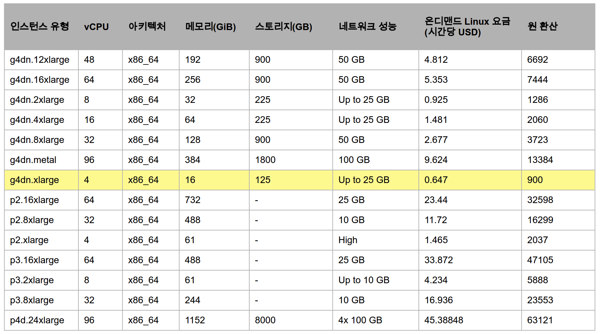

AWS의 GPU 서버를 사용해보자. 최근에 LLM을 사용하면서 파인튜닝은 Google Colab를 사용하고 있다. Colab Plus를 사용하고 있으며 상황에 따라 A100, L4, T4 GPU를 사용하곤 한다. 그리고 Ollama와 HuggingFace 오픈스 모델을 사용하면서 이것저것 테스트를 진행 해보고 있는데, 이때 GPU서버가 필요해서 AWS를 찾게 되었다. 물론 이전에 Vast.ai와 GCP의 GPU서버를 찾아 보기 했었다. 그러나 Vast.ai는 친절하지가 못해서 사용하기 힘들고, GCP 서버는 지역에 따라 GPU를 다르게 사용해야 하지만, 원하는대로 GPU서버 를 할당 받을 수가 없어서 AWS를 선택하게 되었다. 또한, 이번에 AWS GPU 서버에 대한 소개 뿐만 아니라 nvidia, cuda를 아주 쉽게 설치 하는 **꿀팁**이 있어서 그것도 같이 소개 하려고 한다.

## AWS GPU 서버 종류

우선 AWS의 GPU 자원을 보자. AWS의 전체 CPU EC2 에 대한 정보는 다음을 참고 한다.

- [AWS 개발자 가이드: 권장 GPU 인스턴스](https://docs.aws.amazon.com/ko_kr/dlami/latest/devguide/gpu.html)
- [AWS EC2유형-GPU 서버](https://aws.amazon.com/ko/ec2/instance-types/#Accelerated_Computing)

위 링크를 보면 여러 종류의 GPU 서버가 있지만, Google Colab 에서 제공하는 GPU서버와 자주 보이는 GPU 서버를 소개하려고 한다.

- Amazon EC2 P5 - NVIDIA Tesla H100 GPU
- Amazon EC2 P4 - NVIDIA Tesla A100 GPU
- Amazon EC2 P3 - NVIDIA Tesla V100 GPU
- Amazon EC2 G6 - NVIDIA L4 GPU
- Amazon EC2 G4dn - NVIDIA T4 GPU
 
그리고 현재 24년 6월 21일 기준으로 가격은 다음과 같다.

<center>
{width=80%}
</center>

여기서 T4에 해당하는 g4dn.xlarge 서버를 선택하고 설치 해보자. 시간당 900원 이기 때문에 필요할때만 잠깐 쓰고 종료하기에는 매우 저렴한 편이다. 그리고 AWS의 EC2 구축은 다음의 링크를 참고 하자.

- [AWS EC2 구축](https://unfinishedgod.netlify.app/2020/04/05/aws-ec2%EA%B5%AC%EC%B6%95/)

### ollama를 통한 nvidia, cuda 설치

GPU 서버를 구축 햇으니 nvidia, cuda를 설치 해주어야 한다. nvidia, cuda설치는 생각보다 까다로운데, ubuntu버전과 호환되는 버전을 맞춰서 설치 해줘야 하기 때문이다. 그러나 이번에 아무생각없이 ollama를 설치 했더니 알아서 이 nvidia, cuda를 설치 해주기 때문에 매우 간편하게 설치를 할 수 있었다. 다음 커맨드를 통해 ollama를 설치 해보자.

```bash
$ curl -fsSL https://ollama.com/install.sh | sh
```

설치를 하게 되면 기존의 ollama설치와 함께 nvidia, cuda 설치를 동시에 진행해주는것을 확인할 수 있다. 이를 확인하기 위해 다음의 커맨드를 입력 해보자.

```bash
$ nvidia-smi
```

```
Fri Jun 21 15:49:55 2024       
+-----------------------------------------------------------------------------------------+
| NVIDIA-SMI 550.90.07              Driver Version: 550.90.07      CUDA Version: 12.4     |
|-----------------------------------------+------------------------+----------------------+
| GPU  Name                 Persistence-M | Bus-Id          Disp.A | Volatile Uncorr. ECC |
| Fan  Temp   Perf          Pwr:Usage/Cap |           Memory-Usage | GPU-Util  Compute M. |
|                                         |                        |               MIG M. |
|=========================================+========================+======================|
|   0  Tesla T4                       Off |   00000000:00:1E.0 Off |                    0 |
| N/A   23C    P8              9W /   70W |       3MiB /  15360MiB |      0%      Default |
|                                         |                        |                  N/A |
+-----------------------------------------+------------------------+----------------------+
                                                                                         
+-----------------------------------------------------------------------------------------+
| Processes:                                                                              |
|  GPU   GI   CI        PID   Type   Process name                              GPU Memory |
|        ID   ID                                                               Usage      |
|=========================================================================================|
|  No running processes found                                                             |
+-----------------------------------------------------------------------------------------+
```

이렇게 성공적으로 nvidia, cuda까지 설치된것을 확인할 수 있다.

