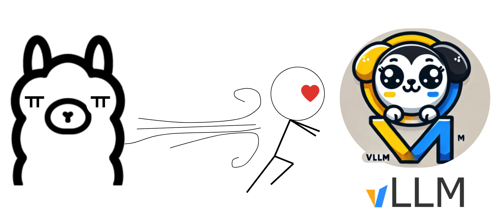
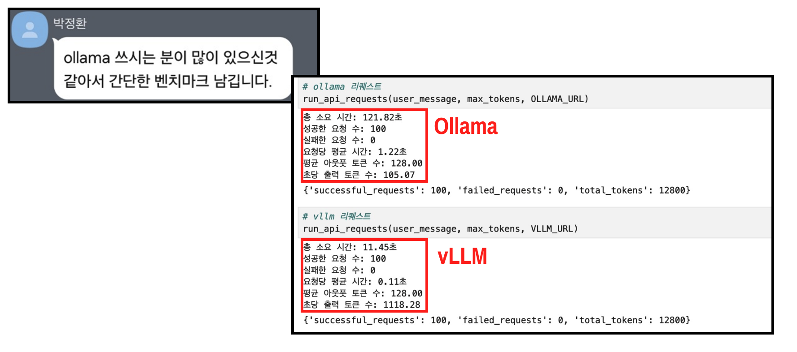

<center>
{width=80%}
</center>

이번엔 vllm에 대해 알아보자. 지난번까지 Ollama를 사용했었으나, 속도 문제와 사용하기 위해 gguf 파일을 사용해야 하는 번거로움이 있었다. 실제로는 속도 문제가 가장 컸었는데, vllm을 사용해서 api로 서빙을 하게 되면 이 속도 문제를 아주 빠르게 단축시킬 수가 있다. "[LLM RAG Langchain 통합](https://open.kakao.com/o/gqs05N6f)"라는 카카오톡 커뮤니티에서 많은 LLM 도움을 받고 있는데, 실제로 최근에 이를 벤치마킹 해주신 분이 계신다. 다음을 보자. (도움 주신 재원님과, 박정환님께 감사드립니다. 담에 뵙게 되면 커피 한잔 살게요~~)

<center>
{width=80%}
</center>

ollama와 vllm을 벤치마킹한 결과인데 약 10배가량 빠르다. 때문에 이제부터는 ollama를 잠깐 내버려두고 vllm을 사용해 보려고 한다. 여기서는 기본적인 설치,구현 및 간단한 팁을 소개하고 마무리 하려고 한다. vllm의 공식문서는 다음과 같다. 

- [vllm 공식 문서](https://docs.vllm.ai/en/latest/)

## 0. 준비물

- GPU가 들어간 AWS서버
- GPU스펙은 T4 (T4 보다 L4가 더 저렴하지만 국내에서는 적용안됨)
- 서버 스토리지는 최소 100 GB (llm 모델 용량이 많이 커서 최소 100정도는 갖고 있어야 함)
- 참고: [EC2 GPU 서버 & ollama통한 nvidia,cuda 구축](https://unfinishedgod.netlify.app/2024/06/21/aws-ec2-gpu-ollama-nvidia-cuda/)

## 1. 설치

먼저 vllm 을 설치 해보자. 공식문서상에서는 `pip3 install vllm`으로 되어 있긴 한데, 실제로는 `-e`를 써주어야 한다.

```bash
pip3 install -e vllm
```

## 2. LLM 모델 다운로드

이번에는 LLM 모델을 다운로드 해주자. 야놀자의 "EEVE-Korean-Instruct-2.8B-v1.0" 를 사용할 예정이며, 용량이 더 확보가 되면 더 큰 모델을 사용해도 좋다. 

- huggingface의 모델을 로컬로 옮기기 위해 git-lfs를 먼저 설치 해준다
- 그리고 llm_model 디렉토리를 만들고 이동 시켜준다. 
- 이제 'git lfs clone https://huggingface.co/yanolja/EEVE-Korean-Instruct-2.8B-v1.0' 커맨드를 사용하여 받아주면 된다. 

```bash
$ sudo apt install git-lfs
$ mkdir llm_model/
$ cd llm_model/
$ git lfs clone https://huggingface.co/yanolja/EEVE-Korean-Instruct-2.8B-v1.0
```

## 3. 실행

이렇게 모델도 받았으니 이제 간단하게 테스트를 진행해보자. 공식 문서대로라면 다음과 같이 llm 모델을 불러오면 된다. 
 
```python
from vllm import LLM, SamplingParams

llm = LLM(model="/home/ubuntu/vllm_model/EEVE-Korean-Instruct-2.8B-v1.0", 
          tensor_parallel_size=1)
```

### 에러발생

그러나 이렇게 진행 했을 경우 다음과 같은 에러가 발생하는데, 여기서 핵심 키워드는 'Bfloat16'이다. 숫자 형식중 하나인데, T4 GPU에서는 이를 지원하지 않기 때문에 이를 사용하기 위해서는 dtype를 반으로 줄이라는 메시지이다. **Bfloat16를 지원하지 않는 서버가 생각보다 많다.** 

```
Bfloat16 is only supported on GPUs with compute capability of at least 8.0. Your Tesla T4 GPU has compute capability 7.5. You can use float16 instead by explicitly setting the`dtype` flag in CLI, for example: --dtype=half.
```

여기서는 CLI에 `for example: --dtype=half.`를 사용하라고 하는데, 다음과 같이 LLM() 함수 안에 dtype="half" 만 넣어줘도 된다.

```python
from vllm import LLM
llm = LLM(model="/home/ubuntu/vllm_model/EEVE-Korean-Instruct-2.8B-v1.0", 
          max_model_len=2048, 
          tensor_parallel_size=1, 
          dtype="half")
```

그럼 이제 프롬프트와 간단한 파라미터를 넣어주고 테스트를 진행해보자.

```python
prompts = [
    "안녕?",
    "너의 이름이 뭐니?",
]
sampling_params = SamplingParams(temperature=0.7, 
                                 top_p=0.8, 
                                 repetition_penalty=1.05, 
                                 max_tokens=256)

# perform the inference
outputs = llm.generate(prompts, sampling_params)
```

이렇게 outputs가 생성되면 다음과 같이 하나씩 확인을 하면 끝. 

```python
for output in outputs:
    prompt = output.prompt
    generated_text = output.outputs[0].text
    print(f"- Prompt: {prompt!r}")
    print(f"- Generated text: {generated_text!r}")
    print("")
```
```
- Prompt: '안녕?'
- Generated text: ' 저는 컴퓨터 과학을 공부하고 있고, 다양한 프로젝트를 진행하고 있습니다. 제가 최근에 만든 프로젝트 중 하나가 바로 데이터베이스 관리 시스템(DBMS)입니다. 이 시스템은 여러 개의 데이터베이스에 데이터를 저장하고 관리하는 데 도움을 주고 있습니다.\n\n최근에, 저는 새로운 데이터베이스를 만들고자 하는 분들에게 추천할만한 데이터베이스 관리 시스템을 만들었습니다. 이 시스템에는 다음과 같은 기능이 포함되어 있습니다:\n\n1. 데이터베이스를 생성하고 관리할 수 있습니다.\n2. 데이터베이스에 데이터를 저장하고 관리하는 데 도움이 됩니다.\n3. 데이터베이스의 구조와 구조를 조정할 수 있습니다.\n4. 데이터베이스를 백업하고 복원할 수 있습니다.\n5. 데이터베이스를 연결하여 다른 데이터베이스와 통신할 수 있습니다.\n6. 데이터베이스를 백업하고 복구하는 방법을 알려주는 안내서입니다.\n7. 데이터베이스를 백업하고 복구하는 방법에서 사용하는 도구와 소프트웨어를 제공합니다.\n8. 데이터베이스를 백업하고 복구하는 방법에 대한 가이드입니다.\n9. 데이터베이스를 백업하고 복구하는 방법에서 사용되는 도구를 사용하여 실행합니다.\n10.'

- Prompt: '너의 이름이 뭐니?'
- Generated text: ' - 위키백과, 우리 모두의 백과사전\n네 너의 이름은 무엇인가? (영어: Your Name Is)는 일본의 드라마/영화 제작사인 ㈜스튜디오 랜덤(이하 STX)이 2010년 12월 22일에 개봉한 애니메이션 영화이다. 이 영화는 스카이워커들의 세계, 즉 다양한 캐릭터들이 주인공으로 등장하는 세계관을 기반으로 한다.\n\n제작사는 2011년 4월 13일부터 16일까지 일본 오사카에서 열린 제8회 오사카 국제 애니메이션 어워드에서 영화를 최우수 애니메이션 작품으로 선정하였다.\n\n제목 "네 너의 이름은 무엇인가?"는 일본어로 "Your Name Is"로 번역되며, \'네\'라는 단어의 영어 번역을 통해, \'네\'라는 캐릭터가 다른 캐릭터들 사이에서 자신의 이름을 알아내는 과정을 보여주는 것을 의미한다.\n\n2011년 4월 14일부터 15일까지 일본 오사카에서 열린 제8회 오사카 국제 애니메이션 어워드에서 "네 너의 이름은 무엇인가?"가 최우수 애니메이션 작품으로 선정되었다.\n\n이 작품'
```

## 총평

이렇게 vllm에 대해 알아보았다. 그동안 ollama에 대해 알아보았으나, 속도 이슈가 계속 있었는데 이번을 계기로 vllm이 얼마나 빠른지 알았으니 이제 이를 가지고 api 서빙을 해서 최대한 프로덕션 환경에 적용을 할 수 있게끔 하면 될듯 하다.
