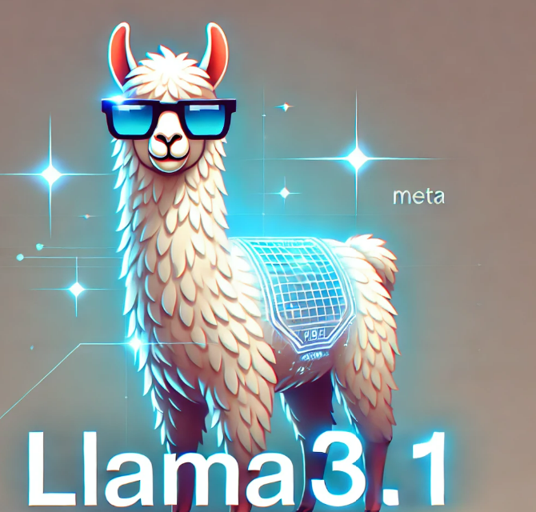
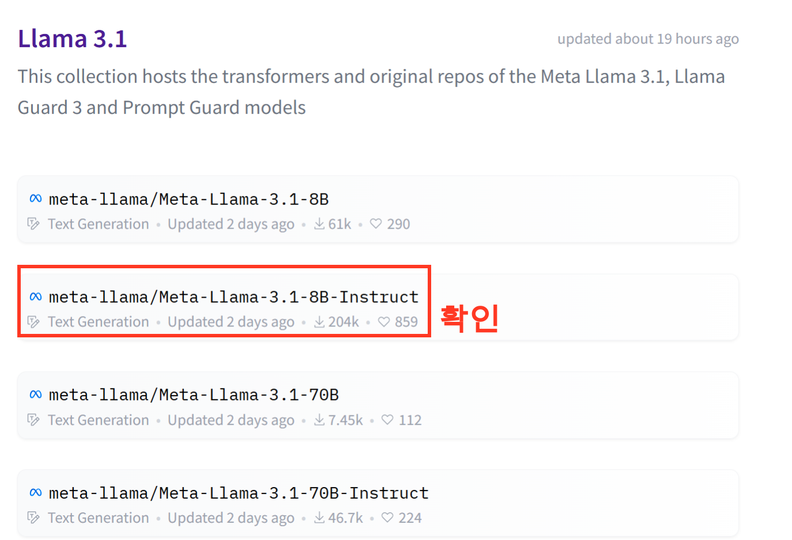
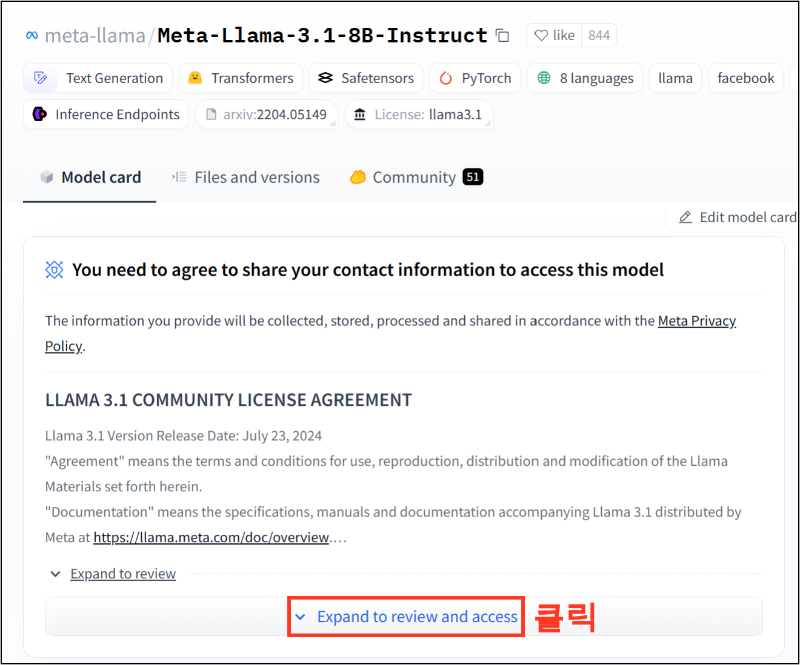
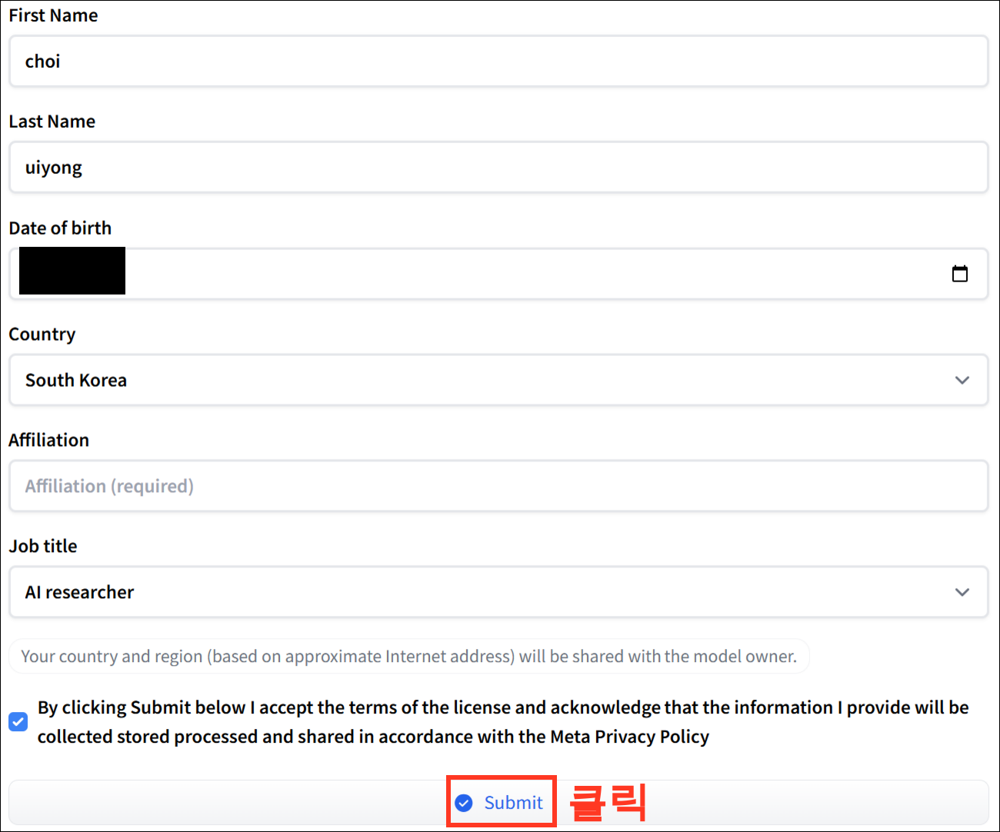
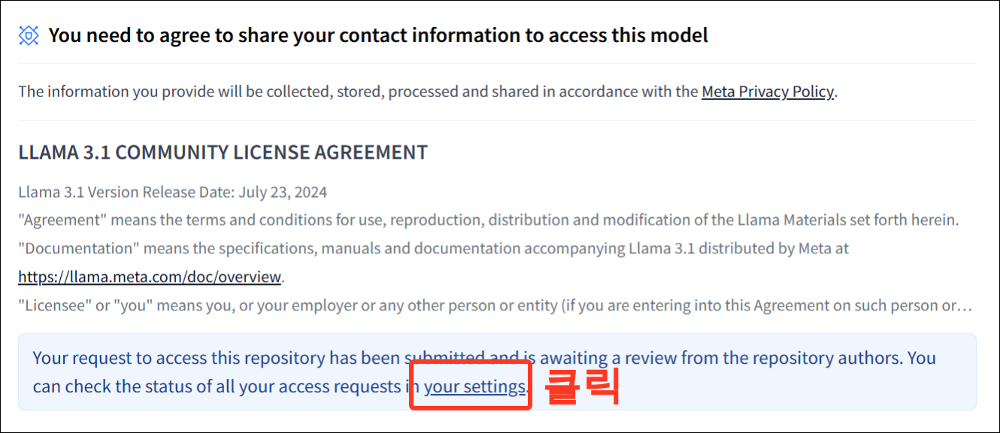
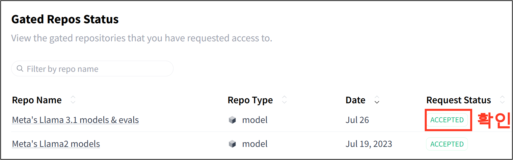

<center>
{width=40%}
</center>

최근 2024년 7월 23일에 llama3.1 이 공개 되었다. 오픈소스를 지향 하는 Meta에서 아주 높은 성능의 모델을 출시 했기 때문에 이에 대해 간략히 한번 알아보고 vllm을 통해 api로 서빙을 해보자. 각각 8B, 70B, 405B으로 최대 40B까지 공개 되었으며, 각 파라미터에 대한 설명은 다음과 같다.

- Llama 3.1 405B: 일반 지식, 롱폼 텍스트 생성, 다국어 번역, 기계 번역, 코딩, 수학, 도구 사용, 향상된 컨텍스트 이해, 고급 추론 및 의사 결정에서 뛰어난 성능을 보임. 
- Llama 3.1 70B: 콘텐츠 제작, 대화형 AI, 언어 이해, R&D, 엔터프라이즈 애플리케이션에 적합. 텍스트 요약, 텍스트 분류, 감정 분석, 뉘앙스 추론, 대화 시스템, 코드 생성, 명령 준수에서 우수한 성능 제공
- Llama 3.1 8B: 제한된 컴퓨팅 파워 및 리소스에 최적화된 모델. 텍스트 요약, 텍스트 분류, 감정 분석, 지연 시간이 짧은 추론이 필요한 언어 번역에서 뛰어난 성능

본 블로그에서는 서버의 성능 문제로 이번에는 8B 모델을 실행 해보려고 한다. 서버는 AWS의 G5, GPU Memory 24GB를 사용하려고 한다. 우선 LLama 3.1을 알아보자.


## 1. LLama 3.1 사용해보기

그럼 우선 llama 3.1을 사용해보자. 이번에 공개된 Llama 3.1의 모델 리스트는 다음을 참고 한다.

- [HuggingFace-META llama 3.1](https://huggingface.co/collections/meta-llama/llama-31-669fc079a0c406a149a5738)

### Step 1-1. 

이중에서 우리는 'meta-llama/Meta-Llama-3.1-8B-Instruct'를 클릭하고 넘어가 주자. 

<center>
{width=80%}
</center>


### Step 1-2. 

그리고 나면 'meta-llama/Meta-Llama-3.1-8B-Instruct' 화면을 볼 수가 있다. 여기서 'Model Card' 메뉴에서 'Expand to review and access' 버튼을 클릭해주자. **현재'Llama3.1을 사용하기 위해서는 등록을 해주어야 한다.**

<center>
{width=80%}
</center>

### Step 1-3. 

그리고 나서 다음과 같이 필요한 정보를 입력해주고 'Sumit' 버튼을 클릭

<center>
{width=80%}
</center>

### Step 1-4. 

이렇게 정보를 입력해주면 Meta에서 승인을 해주게 되는데, 이를 확인해보자. 'Your settings' 버튼 클릭

<center>
{width=80%}
</center>

### Step 1-5. 

약 20분도 안지나서 다음과 같이 승인이 된것을 확인할 수 있다.

<center>
{width=60%}
</center>

이렇게 Llama3.1을 사용하기 위한 준비는 마무리 되었다. 이제 이를 받아서 진행을 해보자. 


## 2. vLLM 을 사용한 API 서빙

### 2-1. Meta-Llama-3.1-8B-Instruct 모델 다운로드

그러면 이제 이 Meta-Llama-3.1-8B-Instruct모델을 받아 보자. AWS의 G5 서버에서 다음과 같이 커맨드 입력 해주자.

```bash
$ sudo apt install git-lfs
$ mkdir vllm_model/
$ cd vllm_model/
$ git clone https://huggingface.co/meta-llama/Meta-Llama-3.1-8B-Instruct
```

입력을 하게 되면 허깅페이스의 username과, 토큰을 입력하라고 나올 수 있는데, 하나씩 입력 해주면 된다. 허깅페이스 토큰이 무엇인지 모른다면 다음 블로그를 참고 하자. 

 - [Huggingface에 API 발급 받기](https://unfinishedgod.netlify.app/2024/05/18/huggingface-api/)


```
Cloning into 'Meta-Llama-3.1-8B-Instruct'...
Username for 'https://huggingface.co': (허깅페이스 username)
Password for 'https://s@huggingface.co': (허깅페이스 토큰)
```

여기 까지 완료 했으면 vllm_model 디렉토리에 Meta-Llama-3.1-8B-Instruct 가 들어온것을 확인할 수 있다.

### 2-2. API 서빙 스크립트

이번엔 FastAPI를 통해 모델을 서빙 해보자. vllm을 FastAPI를 통해 서빙하는 아주 좋은 블로그가 있는데 이는 이 블로그를 참고 했다. 

- [Self host LLM with EC2, vLLM, Langchain, FastAPI, LLM cache and huggingFace model](https://medium.com/@chinmayd49/self-host-llm-with-ec2-vllm-langchain-fastapi-llm-cache-and-huggingface-model-7a2efa2dcdab)

그리고 이 스크립트는 'fastAPIWithoutCache.py'로 만들어 주자.

```python
from typing import Union
from fastapi import BackgroundTasks, FastAPI, Request
from fastapi.responses import JSONResponse, Response, StreamingResponse
from fastapi import FastAPI
import langchain
from vllm import LLM, SamplingParams
import time
import uvicorn

app = FastAPI()

llm = LLM(model="/home/ubuntu/vllm_model/Meta-Llama-3.1-8B-Instruct",
           max_model_len=512,  # 최대 길이 조정
           gpu_memory_utilization=0.9,  # GPU 메모리 사용량 조절
           tensor_parallel_size=1,  # 텐서 병렬화 크기 조정
           dtype="half"
          )

sampling_params = SamplingParams(temperature=0.7, 
                                 top_p=0.8, 
                                 repetition_penalty=1.05, 
                                 max_tokens=256)


    
@app.get("/")
def read_root():
    return {"Hello": "World"}


@app.post("/v1/generateText")
async def generateText(request: Request) -> Response:
    request_dict = await request.json()
    prompt = request_dict.pop("prompt")
    print(prompt)
    outputs = llm.generate(prompt, sampling_params)
    generated_text  = outputs[0].outputs[0].text
    print("Generated text:", generated_text)
    ret = {"text": generated_text}
    return JSONResponse(ret)

if __name__ == "__main__":
    uvicorn.run(app, host="0.0.0.0", port=8000)
```

이렇게 모델을 서빙하는 파일을 생성했으면 다음의 커맨드를 통해 모델을 실행 해주면 된다. 주석은 백그라운드에서 실행하기 위한 용도이다.

```bash
$ python3 fastAPIWithoutCache.py # nohup python3 fastAPIWithoutCache.py >> fastAPIWithoutCache.log &
```

실행을 하게 되면, 다음과 같이 API 서버가 실행된것을 확인할 수 있다. 포트는 8000으로 했으며, 이제 AWS G5의 IP를 복사 해주자.

```
Capturing the model for CUDA graphs. This may lead to unexpected consequences if the model is not static. To run the model in eager mode, set 'enforce_eager=True' or use '--enforce-eager' in the CLI.
INFO 07-26 15:49:42 model_runner.py:984] CUDA graphs can take additional 1~3 GiB memory per GPU. If you are running out of memory, consider decreasing `gpu_memory_utilization` or enforcing eager mode. You can also reduce the `max_num_seqs` as needed to decrease memory usage.
INFO 07-26 15:49:53 model_runner.py:1181] Graph capturing finished in 11 secs.
INFO:     Started server process [24394]
INFO:     Waiting for application startup.
INFO:     Application startup complete.
INFO:     Uvicorn running on http://0.0.0.0:8000 (Press CTRL+C to quit)
```


### 2-3. Call API 스크립트

AWS G5 서버의 IP를 복사 해두었으니 이제 이를 사용해보자. API서버를 만들어 두었으니 이제 어디서는 이 서버를 통해 모델을 서빙할 수가 있다. AWS G5가 아닌 다른 서버를 준비 하고 다음과 같이 callapi.py라는 스크립트를 생성해주자.


```python
import requests
import json
import time

# Define the API endpoint
url = "http://{API 서버 IP}:8000/v1/generateText"

headers = {"Content-Type": "application/json"}
data = {"prompt": "Who is president of US?"}

start_time = time.time()
# Make the POST request
response = requests.post(url, headers=headers, data=json.dumps(data))
end_time = time.time()
latency = end_time - start_time
print(f"Latency: {latency} seconds")

print("LLM response: " + response.text)
```

이제 callapi.py 파일을 다음과 같이 실행하고 결과를 보자.

```bash
$ python3 callapi.py "안녕? 이름이 뭐니?"
```
```
Latency: 8.880962371826172 seconds
LLM response: {"text":" 어쩌구 저쩌꾸 (영문)"}
```

성공적으로 결과가 나왔으면 드디어 성공이다.

## 총평

이번에는 Llama3.1을 사용해보고 vllm과 FastAPI를 사용하여 모델을 서빙하는 방법에 대해 알아 보았다. 계속 서버의 성능이슈가 생기는데 AWS서버가 아니더라도 조만건 runpod에 대해 한번 알아보는 시간을 가져보자.

---

### Reference
 
- [AWS T4 GPU 서버에서 vllm 사용하기](https://unfinishedgod.netlify.app/2024/07/08/llm-aws-t4-gpu-vllm/)
- [Self host LLM with EC2, vLLM, Langchain, FastAPI, LLM cache and huggingFace model](https://medium.com/@chinmayd49/self-host-llm-with-ec2-vllm-langchain-fastapi-llm-cache-and-huggingface-model-7a2efa2dcdab)