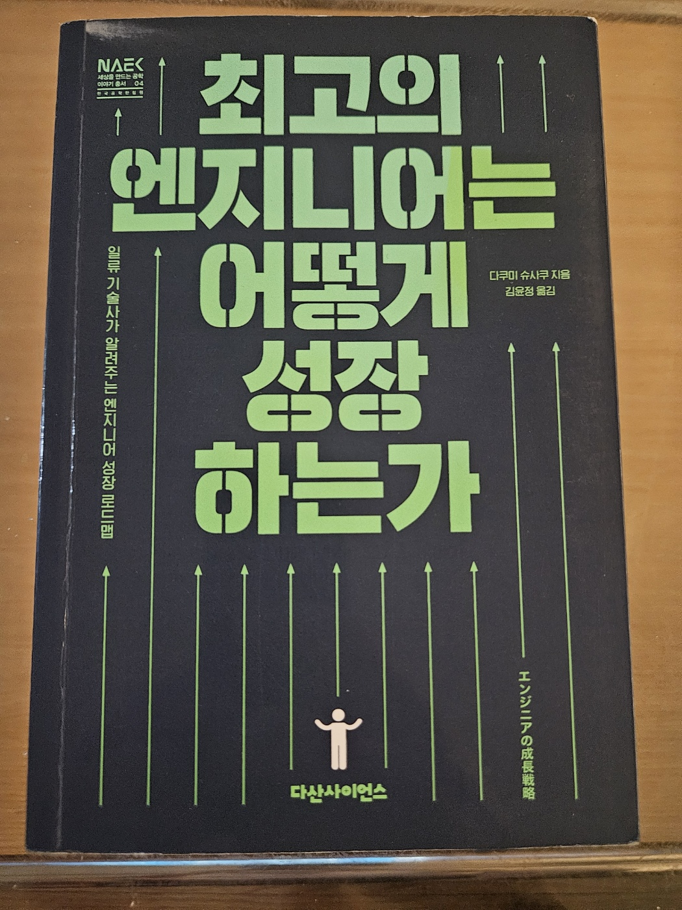

{width=60%}

이번에는 '최고의 엔지니어는 어떻게 성장 하는가'라는 책을 읽었다. 회사이 다른팀의 부장님의 소개로 읽게 된 책. 그동안 데이터 관련해서 7년동안 일을 했었다. 그리고 올해 들어서 특히 나의 정체성에 대해 고민을 하곤 했다. 

나는 개발자의 정체성을 갖고 있나? 기획자의 정체성을 갖고 있나?  
그리고 나는 앞으로 방향을 어떻게 잡고 나아가야 하는가

이런 고민을 부장님과 이야기 하던 도중 나에게 아주 큰 도움이 될거라고 추천하면서 책을 빌려 주셨는데. 결론적으로 아주 큰 도움이 되었다. 책의 구성은 다음과 같다. 

- Chapter 1: '성장'하는 엔지니어에게 있는것
- Chapter 2: 엔지니어의 생존에 필요한 능력
- Chapter 3: 필요한 능력에 포인트 더하기
- Chapter 4: 커리어를 높이기 위한 '이직'
- Chapter 5: 일류 엔지니어의 시선으로 도약하라

### 파이형 엔지니어

인상 깊었던 것중 하나는 '파이형 엔지니어'. 파이형 엔지니어는 다음과 같은 특징을 가진다.

- 두 개의 깊은 전문성
  - 하나 이상의 기술과 도메인에서 깊이 있는 지식을 갖고 있는 엔지니어이다. 
- 넓은 범위의 지식
  - 또한 두가지 주요 기술 외에도 다양한 관련분야에 기초지식을 갖추고 있는 경
- 융합 능력
  - 따라서 이 두 가지 이상의 전문성을 활용해 문제를 다각도로 분석하고 해결첵을 제시 할수 있는 엔지니어
인재로 평가됩니다.

### 기술자 vs 기획자, vs 경영자

기술자, 기획자, 그리고 경영자에 대한 인식 차이 역시 인상 깊었다.
나는 기본적으로 데이터를 다루는 사람은 '엔지니어'에 가깝다고 생각하고 있었다. 그것도 아주 '엔지니어'에 가깝다고 생각 하곤 했었다. 기술에 중요성을 깨닫고, 그동안 꾸준히 기술개발에 시간을 투자 했었다. 

그러나 시간이 지랄수록 기술 자체보다 더 중요한 것이 있다는 사실을 알게 되었다. 바로 기획 능력과, 시장을 바라보는 경영자의 관점에서 기술을 활용하는 능력이다. 기술을 뛰어넘어, 시장의 흐름을 읽고 그에 맞는 전략을 새우는 것이 결국 더 큰 성과를 이어질 수 있다는 깨달음은 나의 사고를 크게 변화 시켰다.

## 결론

나는 앞으로 어떻게 나아가야 할까. 책을 읽고 나서 이제 조금 더 명확하게 나의 방향성을 잡을 수 있었다. '파이형 엔지니어' 만을 추구 하고, 전문성을 갖추려는 것이 전부가 아님을 알았다. 7년동안 데이터 관련 일을 해오면서 쌓아온 기술은 분명히 나의 강점이다. 이제 나에게 추가로 능력을 키워야할 점이 있다면 기획자의 시각, 나아가 경영자의 시각으로 문제를 바라보고 해결하는 능력이 필요하다고 생각한다.
 그동안 고민해 왔었던 "나는 개발자 인가, 기획자인가? 나는 앞으로 어떻게 나아가야 할까" 라는 질문은 더 이상 의미가 없어졌다. 앞으로는 기획이나 다양한 시각을 배제하지 않고 기술 뿐만 아니라 기획 능력과 시장을 읽는 경영자의 안목을 함께 기르며 나아갈 것이다. 이 책은 나에게 그 방향성을 제시해 준 중요한 계기가 되었고, 앞으로도 나는 계속해서 성장하는 엔지니어로 나아갈 준비가 되어 있다.

