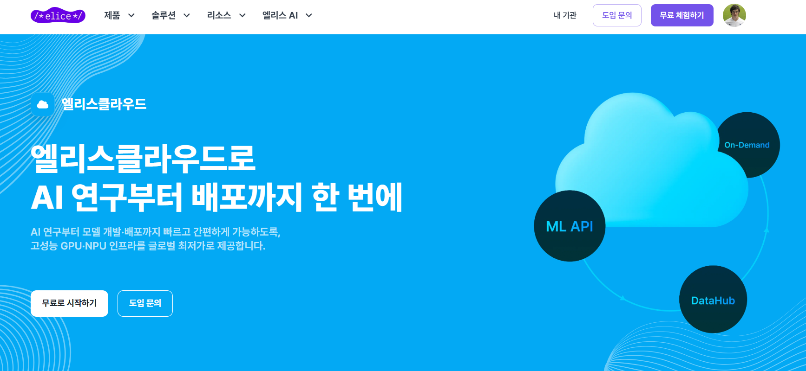

{width=90%}

엘리스클라우드의 GPU 서버에 대해 알아보자. 

**마작에서 가장 어려운 것이 같이 마작을 칠 사람을 구하는 것이라고 한다.**

LLM이 대세인 지금 LLM으로 이것저것 해보고 싶은데 충분한 GPU서버가 확보 되지 않아서 많은 어려움이 존재하고 있다. 

AWS, GCP는 꽤 비싸고, 대안으로 RunPod을 사람들이 많이 사용하고 있지만, RunPod의 경우 국내에 서버가 없어서 **상당히 느리다**. 

이에 대한 대안으로 엘리스클라우드를 소개한다. 제공하는 GPU와 가격을 보면 다음과 같은데, 

{width=90%}

A100기준으로 VRAM 80GB가 1시간마다 2,000원, VRAM 40GB가 1시간마다 1,380원 인걸 보면 상당히 저렴한것을 알 수 있다. 그럼 이제 엘리스클라우드에 대해 하나씩 알아보자.

## 서버 생성

### Step 1.

우선 다음의 링크에 들어가주자. 엘리스에서 제공하는 클라우드로 넘어가게 된다.

- [https://elice.io/ko/products/cloud](https://elice.io/ko/products/cloud)

이 링크를 클릭하게 되면 다음의 화면을 볼 수 있는데, 여기서 

- ‘무료로 시작하기’ 버튼 클릭
- 기관 정보 입력 및 기관 생성 버튼 클릭

{width=90%}

### Step 2.

기관을 생성 했으면 내기관 > 바로가기 버튼을 클릭해주자.

{width=90%}

### Step 3.

이후에 우측상단을 보면 무료 크레딧 받기 > 결제 수단 등록을 해주자. 

**처음에 결제 수단 등록 시 최대 20시간 상당의 크레딧이 제공 되니 꼭 사용해보자.**  

{width=90%}

### Step 4.

결제수단을 등록하고 다시 ‘내 기관-바로가기’ 페이지로 넘어가면 다음과 같은 인스턴스 대시보드를 볼 수 있다. 여기서 ‘인스턴스 생성’ 버튼을 클릭해주자. 

{width=90%}

그러면 다음의 GPU서버를 보게 될텐데 이중에서 **G-NAHPM-40**을 선택 해주자. A100 의 VRAM 80GB 를 분할하여 VRAM 40GB로 제공한다. 이 서버에 대한 설명은 다음과 같다. 

1. **G-NAHPM-40**
    - **GPU**: A100 80GB PCIe MIG 3g-40GB
    - **VRAM**: 40GB
    - **CPU**: 8 vCore
    - **메모리**: 96 GiB
    - **가격**: 1,380원/시간
    - A100의 MIG(Multi-Instance GPU) 기능을 활용하여 일부 자원을 **분할한 인스턴스**

{width=90%}

### Step 5.

서버를 클릭했으면 아래로 내려와서 실행환경을 선택 해주자. 가장 익숙한게 VSCode와 Jupyter가 있는데, Jupyter로 선택 해주자. VSCode를 선택 하지 않는 이유는 VS code-server 기반이라 각각이 원하는 IDE extension을 맞출수 없을뿐더러, 요즘엔 cursor ai, windsurf 등등 여러 AI기반 IDE가 있기 때문이다. IDE는 간편하게 Jupyter로 선택 해주고 ssh로 접근 하는게 오히려 편리하다. 

 

{width=90%}

### Step 6.

또 아래로 내려가면 스토리지 옵션이 나오는데, 가장 기본인 128GiB를 선택 해주자. 그리고 온디맨드 서버의 경우에는 서버를 종료하면 요금이 나오지 않지만, 이 **스토리지는 서버를 종료해도 요금이 나오니 이점은 유의하자**.

{width=90%}

### Step 7.

그리고 맨 마지막에 ‘인스턴스 생성’ 버튼을 클릭 해주면 끝.

{width=90%}

### Step 8.

그러면 이렇게 jupyter notebook이 생성된 것을 확인할 수 있다. 

{width=90%}

이제 터미널에서 서버의 상태를 확인해보면 다음과 같이 서버의 정보를 알 수 있다.

{width=90%}

## Port 개방

이번엔 port를 개방해보자. 

- 인스턴스 이름을 클릭
- 인스턴스에 대한 정보가 나오는데 하단의 ‘외부 연결 설정’ 탭 메뉴 클릭
- 연결 생성 버튼 클릭
- Port 번호 입력 후 생성

{width=90%}

## 서버 종료

서버를 종료 하려면 대시보드의 우측 하단에 종료 버튼을 클릭해준다. **다시 말하지만 서버를 종료 해도 스토리지 요금은 계속 부과 된다.**

{width=60%}

{width=60%}

## 서버 삭제

마지막으로 서버를 삭제 해보자. 서버를 종료한 후에 우측 메뉴버튼을 클릭 하게 되면 인스턴스 삭제가 나오는데 인스턴스 삭제를 해주어야 완전히 요금이 나오지 않게 된다.

{width=90%}

## 프로모션

마지막으로 엘리스에서 제공하고 있는 프로모션을 소개하고 마무리 하려고 한다. (**광고 X**) 현재 엘리스에서 다양한 프로모션을 진행하고 있는데, 대학(원)생 뿐만 아니라 회사의 경우 100만원이상의 GPU를 충전했을 경우 추가의 크레딧 또한 받을 수 있다.

- [https://elice.io/ko/newsroom?category=event](https://elice.io/ko/newsroom?category=event)

{width=90%}

## 총평

이번엔 엘리스클라우드에 대해 알아보았다. 

마작에서 가장 어려운 것이 같이 마작을 칠 사람을 구하는 것이라고 한다.

LLM을 공부 하게 되면서 가장 어려운것이 GPU서버를 구하는 것이다. 그동안 AWS, Runpod등등 여러 GPU 클라우드를 돌아 다니다가 괜찮은 GPU 를 알게 되어 이렇게 소개 하게 되었다.